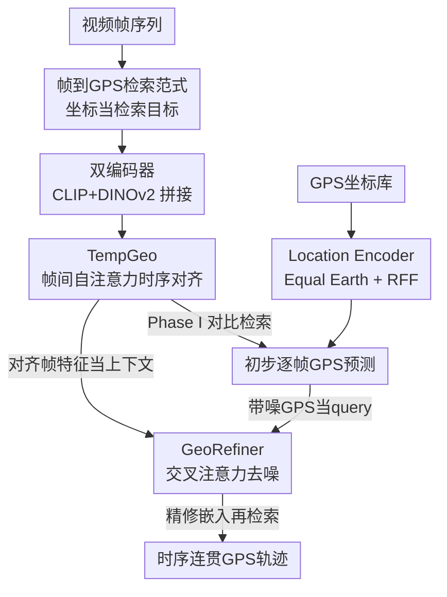

# VidTAG: Temporally Aligned Video to GPS Geolocalization with Denoising Sequence Prediction at a Global Scale

**会议**: CVPR 2026  
**论文**: [CVF Open Access](https://openaccess.thecvf.com/content/CVPR2026/html/Kulkarni_VidTAG_Temporally_Aligned_Video_to_GPS_Geolocalization_with_Denoising_Sequence_CVPR_2026_paper.html)  
**关键词**: 视频地理定位, 帧到GPS检索, 时序一致性, 轨迹去噪, 跨模态对比学习

## 一句话总结
VidTAG 把"视频地理定位"重新表述成**逐帧到 GPS 坐标的检索**问题，用 CLIP+DINOv2 双编码器抽帧特征、TempGeo 做帧间时序对齐、GeoRefiner 做轨迹去噪，在全球尺度上生成时序连贯的 GPS 轨迹，1km 阈值上比 GeoCLIP 提升约 20%。

## 研究背景与动机
**领域现状**：给一张图/一段视频判断它拍摄于地球上哪个位置，在取证、社交媒体打标、探索等场景都很有用。现有图像地理定位分两条路：一是**检索式**（fine-grained），把查询图和一个带地理标注的图库逐一匹配，继承最相似图的坐标——精度高但需要海量参考图库、算力大、对域偏移敏感；二是**分类式**（worldwide），把地球切成若干区域、预测区域标签——单次推理就能出全球结果，但只能给出粗略位置，想加细就要更多类别、算力和类间混淆都飙升。GeoCLIP 是个折中：把图像和 GPS 坐标嵌到同一空间，直接拿坐标当检索目标，因为"建一个 GPS 坐标库"比"建一个图像库"便宜得多。

**现有痛点**：视频地理定位几乎是空白。把图像方法逐帧套用会产生**抖动的轨迹**（jitter）——相邻帧预测乱跳，最坏情况一帧跳到另一个大洲。唯一做到全球尺度视频定位的 CityGuessr 只在"整段视频"层面推理预测一个城市，根本不去管帧级一致性，因此无法给出精确且连贯的逐帧轨迹。

**核心矛盾**：逐帧独立预测既不利用视频的时序结构，又会把个别"难帧/歧义帧"的离群预测直接暴露成轨迹上的跳变；而整段视频聚合又丢掉了帧级粒度。需要的是**既保留帧级粒度、又强制帧间时序连贯**的方案。

**本文目标**：在全球尺度上为视频里每一帧预测 GPS 坐标，并保证这些坐标串起来是一条连贯轨迹。

**核心 idea**：沿用 GeoCLIP 的"坐标可检索"思路，把视频定位表述为**帧到 GPS 检索**；再专门加两个模块——TempGeo 在检索前把帧特征做时序对齐，GeoRefiner 把检索出的 GPS 序列当带噪信号去噪——从而把"逐帧抖动"压成"连贯轨迹"。

## 方法详解

### 整体框架
给定一段视频，目标是为每帧预测 GPS 坐标进而画出轨迹。VidTAG 把它当作帧到 GPS 的检索：每帧同时过 CLIP 和 DINOv2 得到拼接的帧特征，经 TempGeo 做帧间时序对齐；GPS 坐标侧用 Location Encoder（沿用 GeoCLIP）编成 GPS 嵌入；对齐后的帧特征与 GPS 嵌入对比训练，构成 Phase I 的初步逐帧预测。随后 GeoRefiner（一个 encoder-decoder Transformer）以"对齐帧特征"为上下文、把带噪 GPS 嵌入当 query 做交叉注意力去噪，输出精修后的 GPS 嵌入；最后用精修嵌入在 GPS 坐标库里做一次同域 GPS-to-GPS 检索，得到每帧最终坐标。

训练分两阶段：**Phase I** 对比训练 双编码器+TempGeo 与 Location Encoder；**Phase II** 冻结前者，单独训练 GeoRefiner 当去噪器（用人造噪声破坏真值坐标来模拟 Phase I 的失败模式）。

### 关键设计

**1. 帧到 GPS 检索范式：用"可检索的坐标库"绕开图像库与分类的两难**

检索式定位要建海量图库、全球尺度不现实；分类式只能粗到城市级、加细就类别爆炸。VidTAG 把这两难拆掉：沿用 GeoCLIP 的洞察——把图像和 GPS 坐标对齐到共享空间后，检索目标可以是**坐标本身**而非图像。建一个均匀网格的 GPS 坐标库（gallery）成本极低，于是"逐帧预测坐标"变成"逐帧在坐标库里检索最近邻"。为保证公平、避免泄漏，坐标库完全用训练集坐标构建均匀网格，模型对验证集做**完全盲检索**。这一步是后面所有模块的地基：正因为定位被表述成"帧嵌入 ↔ GPS 嵌入"的检索匹配，时序对齐和去噪才能直接作用在嵌入空间上。

**2. 双帧编码器：CLIP 补语义、DINOv2 补外观，互相兜底**

单一视觉编码器要么缺语义要么缺鲁棒外观。CLIP 来自大规模图文预训练，带语言对齐的语义，擅长辨认地标、招牌、场景上下文；DINOv2 是自监督特征，捕捉全局外观且对域偏移更不敏感。VidTAG 对每帧分别取两个 ViT 的 class token 描述子 $f_{clip}$、$f_{dino}$，直接拼接得到融合帧表示 $z_t=[f_{clip}\,\Vert\,f_{dino}]\in\mathbb{R}^{d_{clip}+d_{dino}}$，再单位归一化。消融里把 DINOv2 换成"CLIP 升级版"SigLIP，性能明显下降（1km 从 40.1% 掉到 27.8%），说明真正起作用的是 CLIP 与 DINOv2 的**互补性**而非单纯堆更强的 CLIP-like 编码器。

**3. TempGeo：在检索前用全局自注意力把离群帧拉回共识**

逐帧独立预测会漂移、会冒离群点，把轨迹搞乱。TempGeo 是一个轻量 Transformer 编码器，给单位归一化帧嵌入加上时序位置编码 $\hat z_t=z_t+p_t$，再用多头自注意力让**每帧都能注意到序列里所有其他帧**（不止相邻帧）。这样歧义帧能借用远近帧的上下文线索（如复现的地标、跨多帧的光照变化），孤立离群点在特征空间里被拉向共识。关键在于它把对齐放在**检索之前**：Phase I 直接用对齐后的 $z^{\omega}_t$ 去算相似度矩阵参与对比损失，让跨帧上下文塑造学习信号，而不是事后做平滑或时序池化。Phase II 时 TempGeo 被冻结，其输出作为 GeoRefiner 编码器的视觉输入。

**4. GeoRefiner：把 GPS 序列当带噪信号、用视觉上下文交叉注意力去噪**

即便帧特征对齐了，"视觉嵌入↔对应 GPS 嵌入"的关联仍可能有噪。GeoRefiner 借鉴机器翻译的 encoder-decoder：decoder 把 GPS 嵌入当 query，encoder 处理 TempGeo 对齐后的帧特征当上下文，decoder 里的**交叉注意力**把 GPS 序列对齐到视觉 token；不加因果掩码，每个 GPS token 能注意整条序列和所有视觉帧。训练它当去噪器的巧妙之处在于**不喂 Phase I 的原始预测**，而是人为破坏真值坐标来模拟 Phase I 观察到的三类典型失败模式——整段偏移（shift）、坍缩到一点（collapse）、随机抖动（jitter）——再用 Location Encoder 编成"带噪 GPS 嵌入"当 decoder query，对应 $z^{\omega}_t$ 当 encoder 输入，让 decoder 学会借视觉上下文把这些噪声"撤销"。推理时 query 换成 Phase I 的真实预测，一次前向得到精修嵌入 $g^{\rightarrow}_t$，再在坐标库里做同域 GPS-to-GPS 检索出最终坐标。用浅层 encoder-decoder 让额外延迟很低却带来轨迹质量提升。

### 损失函数 / 训练策略
**Phase I（对比）**：把 TempGeo 输出帧嵌入堆成 $V$、对应 GPS 嵌入堆成 $G$，相似度矩阵 $VG^{\top}$ 与单位矩阵做交叉熵：

$$\mathcal{L}_{contr}(V,G)=\mathrm{CE}(VG^{\top},I)$$

因帧嵌入单位归一化且 TempGeo 保维，内积对应余弦相似度。**Phase II（对齐去噪）**：用加权 Hinge 损失。设 $G^{\rightarrow}$ 为 GeoRefiner 精修嵌入、$G$ 为真值 GPS 嵌入，分别在帧级和视频级用相似度矩阵与单位矩阵的 MSE 构造损失矩阵 $M_f=\mathrm{MSE}(G^{\rightarrow}G^{\top},I)$、$M_v=\mathrm{MSE}(G^{\rightarrow}_{seq}G^{\top}_{seq},I)$，再对上/下三角（负对）加权 $\omega$、对角（正对）加权 $\varepsilon$ 求和：

$$\mathcal{L}_f=\omega\big(\mathrm{trU}(M_f)+\mathrm{trL}(M_f)\big)+\varepsilon\cdot\mathrm{dia}(M_f)$$

视频级 $\mathcal{L}_v$ 同构，最终 $\mathcal{L}_{wtHinge}=\mathcal{L}_f+\mathcal{L}_v$，在帧与视频两个粒度同时促进对齐。$\omega,\varepsilon$ 经消融经验选取（⚠️ 公式符号以原文为准）。

## 实验关键数据

### 主实验
评测用 Mapillary(MSLS，最大的带帧级 GPS 标注图像序列集)、GAMa(源自 BDD100k 行车视频)、CityGuessr68k(166 城市全球视频)。距离阈值取 0.5/1/5/25km 四档，外加中位距离误差、轨迹质量指标 DFD（离散 Fréchet 距离）和 MRD（平均范围差），均越低越好；准确率越高越好。

| 数据集 | 指标 | 本文 VidTAG | 之前最好 | 提升 |
|--------|------|------|----------|------|
| MSLS | 帧级 1km 准确率 | 41.0% | GeoCLIP-FT 22.5% | +18.5pt（约20%↑） |
| MSLS | 中位误差(km) | 1.35 | GeoCLIP-FT 2.97 | 误差减半 |
| MSLS | DFD / MRD | 3.87 / 1.07 | DINOv2-cls 4.28 / 1.60 | 轨迹更平滑 |
| GAMa | 帧级 1km 准确率 | 53.1% | GeoCLIP-FT 28.3% | 约25%↑ |
| GAMa | DFD / MRD | 0.39 / 0.17 | GeoCLIP-FT 6.50 / 0.50 | 大幅领先 |
| CityGuessr68k | 城市级准确率 | 94.9% | CityGuessr 69.6% | 约25pt↑ |

CityGuessr68k 上 VidTAG 在城市/州/国家/洲四级都最好（94.9/95.5/96.8/98.5%），大幅超过 MLLM（Qwen2.5-VL 55.1%）、CLIP 系（GeoCLIP 57.8%）和视频分类（VideoMAE 64.5%）。在 0.5/1km 这种细粒度区间优势最明显，而 DINOv2-cls、GeoCLIP-FT 只在 5/25km 粗档表现尚可。

### 消融实验
| 配置（Backbone / TempGeo / GeoRefiner） | MSLS 帧级 1km | DFD | 说明 |
|------|---------|------|------|
| CLIP only（=Finetuned GeoCLIP 基线） | 22.5 | 22.52 | 起点 |
| DINOv2 only | 26.4 | 9.15 | 换 DINOv2，轨迹立刻更平滑 |
| DINOv2 + TempGeo | 30.2 | 3.01 | TempGeo 进一步压 DFD/MRD |
| CLIP+DINOv2 + TempGeo | 40.1 | 7.63 | 加回 CLIP 互补，1km +10pt 但 DFD 回升 |
| Full（+GeoRefiner） | 41.0 | 3.87 | GeoRefiner 把平滑度找回来 |

| 双编码器选择 | 1km | 中位误差(km) | 说明 |
|------|------|------|------|
| CLIP + SigLIP | 27.8 | 2.15 | 两个 CLIP-like，互补不足 |
| CLIP + DINOv2 | 40.1 | 1.38 | 自监督+语义互补，明显更好 |

### 关键发现
- **精度与平滑分工明确**：CLIP+DINOv2 互补主要拉**精度**（1km +10pt），但会牺牲一点平滑（DFD/MRD 升）；TempGeo 和 GeoRefiner 主要修**时序一致性**，把 DFD 从 7.63 压回 3.87——两类模块目标不同、各管一摊。
- **互补性 > 更强的单一编码器**：用 SigLIP（升级版 CLIP）替 DINOv2 反而掉到 27.8%，证明收益来自"自监督 vs 语义"的异构互补，而非堆参数。
- **吞吐几乎不掉**：相比 GeoCLIP，VidTAG 精度大涨而 FPS 仅小幅下降，说明 TempGeo/GeoRefiner 是轻量浅层模块。
- **坐标库分辨率有收益递减**：MSLS 上 0.1km 网格（0.5km/1km 准确率 21.5/41.0）优于 0.5km、1km 网格，但库大小随分辨率平方增长，更细收益递减；GAMa 因数据更密用 0.5km。

## 亮点与洞察
- **把"视频定位"翻译成"帧到 GPS 检索"是最关键的一招**：坐标库比图像库便宜得多，既绕开检索式的算力/图库瓶颈，又比分类式细到亚街道级，还把时序处理统一搬进嵌入空间——一个范式重述顺手解决三件事。
- **GeoRefiner 用"合成噪声"而非"真实 Phase I 预测"来训去噪器**很巧：直接对真值坐标注入 shift/collapse/jitter 三类已观测失败模式，相当于把"轨迹病症"显式参数化喂给模型，比拿带噪预测当输入更可控、监督信号更干净，可迁移到任何"序列预测后处理纠偏"的任务。
- **TempGeo 把对齐放在对比损失之前**，让跨帧上下文参与塑造学习信号，而非事后平滑——这个"早对齐"思路对所有逐帧/逐时刻独立预测又需要时序连贯的任务（轨迹、姿态序列、时序定位）都有借鉴价值。

## 局限与展望
- **依赖坐标库分辨率**：精度被网格分辨率上限卡住，0.1km 已是平方级开销的折中，想更精会让库爆炸——本质仍是离散检索而非连续回归坐标。
- **强依赖训练集地理覆盖**：均匀网格库由训练数据构建，对训练集没覆盖到的偏远区域，盲检索很可能无近邻可选，泛化到稀疏覆盖区存疑（论文主要在 MSLS/GAMa 这类有一定覆盖的数据上验证）。
- **两阶段+合成噪声分布假设**：GeoRefiner 的去噪能力建立在"Phase I 失败只有 shift/collapse/jitter 三类"的假设上，若真实失败模式更复杂，合成噪声与真实噪声的分布差可能限制去噪效果。
- 大量训练细节、超参（$\omega,\varepsilon$、RFF 的 $\sigma$、序列长度）、计算成本都放在补充材料，正文较难独立复现。

## 相关工作与启发
- **vs GeoCLIP**：GeoCLIP 在图像层做图像↔GPS 对比检索，是本文的"图像版对应物"，但逐帧套用会抖。VidTAG 继承其"坐标可检索"地基，额外加 TempGeo（帧间对齐）和 GeoRefiner（轨迹去噪），把单图方法升级为时序连贯的视频方法，1km 提升约 20%。
- **vs CityGuessr**：唯一的全球尺度视频定位前作，但只在整段视频层面预测城市、不做帧级、不管时序一致性。VidTAG 做到帧级 GPS + 连贯轨迹，且在 CityGuessr68k 城市级反超约 25pt。
- **vs 分类式全球定位（PlaNet/ISNs/GeoDecoder）**：它们把地球切格子做分类，粒度粗、加细则类别爆炸；VidTAG 用检索摆脱类别数限制，细粒度区间（0.5/1km）大幅领先。
- **vs MLLM 定位（Qwen2.5-VL/GeoReasoner）**：MLLM 逐图推理、不处理视频时序，CityGuessr68k 上明显落后于 VidTAG。

## 评分
- 新颖性: ⭐⭐⭐⭐⭐ 首个把全球尺度视频定位表述成帧到 GPS 检索、并系统解决帧间时序一致性的工作。
- 实验充分度: ⭐⭐⭐⭐ 三个数据集、四档阈值+轨迹指标、组件/双编码器消融齐全；但大量关键超参与计算成本压在补充材料。
- 写作质量: ⭐⭐⭐⭐ 动机清晰、模块职责分明、图示完整；公式符号在 OCR 缓存里略乱需对照原文。
- 价值: ⭐⭐⭐⭐ 取证/社媒/探索等场景实用，且"早对齐+合成噪声去噪"两个思路可迁移到广义时序序列后处理。

<!-- RELATED:START -->

## 相关论文

- [\[CVPR 2026\] VidTAG: Temporally Aligned Video to GPS Geolocalization](vidtag_video_gps_geolocalization.md)
- [\[CVPR 2026\] Video-CoE: Reinforcing Video Event Prediction via Chain of Events](video-coe_reinforcing_video_event_prediction_via_chain_of_events.md)
- [\[CVPR 2026\] GIFT: Global Irreplaceability Frame Targeting for Efficient Video Understanding](gift_global_irreplaceability_frame_targeting_for_efficient_video_understanding.md)
- [\[CVPR 2026\] Scene-Centric Unsupervised Video Panoptic Segmentation](scene-centric_unsupervised_video_panoptic_segmentation.md)
- [\[CVPR 2026\] Bootstrapping Video Semantic Segmentation Model via Distillation-assisted Test-Time Adaptation](bootstrapping_video_semantic_segmentation_model_via_distillation-assisted_test-t.md)

<!-- RELATED:END -->
