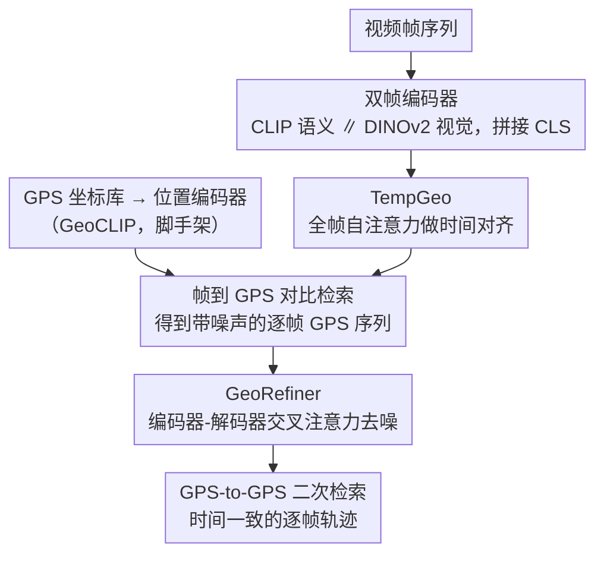

# VidTAG: Temporally Aligned Video to GPS Geolocalization

**会议**: CVPR 2026  
**arXiv**: [2604.12159](https://arxiv.org/abs/2604.12159)  
**代码**: [https://parthpk.github.io/vidtag_webpage](https://parthpk.github.io/vidtag_webpage)  
**领域**: 视频理解 / 地理定位  
**关键词**: 视频地理定位, 帧到GPS检索, 时间一致性, 轨迹预测, 去噪

## 一句话总结

提出 VidTAG，一个双编码器（CLIP+DINOv2）帧到GPS检索框架，通过 TempGeo 模块实现帧间时间对齐，GeoRefiner 编码器-解码器模块精炼GPS预测，在全球尺度下实现时间一致的逐帧视频地理定位。

## 研究背景与动机

**领域现状**：图像地理定位主要有分类（划分地球区域预测标签）和检索（匹配地理参考图库）两种范式，GeoCLIP 将图像和GPS嵌入共享空间实现直接GPS检索。

**现有痛点**：现有分类方法只能提供粗粒度的城市级定位；图像检索方法需要庞大的图片库，在全球尺度不可行。对于视频，逐帧应用图像方法会产生"抖动"轨迹，最坏情况下预测路径会跨越大洲。唯一的全球视频方法 CityGuessr 在整个视频级别推理，不支持逐帧定位。

**核心矛盾**：如何在全球尺度下获得精确且时间一致的逐帧轨迹。

**本文目标**：(1) 提出帧到GPS检索的新范式；(2) 解决视频预测的时间不一致性问题。

**切入角度**：构建GPS坐标库（而非图像库）是简单且廉价的，帧到GPS检索在全球尺度下可行。

**核心 idea**：用 TempGeo 进行帧间时间对齐 + GeoRefiner 去噪式精炼，实现时间一致的逐帧GPS预测。

## 方法详解

### 整体框架

VidTAG 把视频地理定位重构成「逐帧到 GPS 坐标的检索」：不再维护一个全球图片库去匹配，而是把每一帧编码后直接在一个 GPS 坐标嵌入空间里检索最近邻，输出该帧的经纬度。整个流程分两阶段训练。Phase I 训练前端的特征通路——双帧编码器（CLIP+DINOv2）把每帧编成嵌入，TempGeo 在帧之间做时间对齐，再与位置编码器（沿用 GeoCLIP，把 GPS 坐标编成嵌入，属脚手架）输出的 GPS 嵌入在共享空间里对比对齐，得到一个能逐帧检索 GPS 的基础模型。Phase II 冻结 Phase I，单独训练 GeoRefiner，把第一阶段还带噪声的逐帧 GPS 序列当作"脏输入"做一次去噪精炼。推理时一段视频走完「双帧编码器 → TempGeo → 初始检索 → GeoRefiner → 二次检索」就得到一条时间一致的逐帧轨迹。

### 关键设计

**1. 双帧编码器：用语义和视觉两套特征互补描述每一帧**

单一编码器难以同时抓住"这是什么地方"和"这里长什么样"。CLIP 强在语言对齐的语义，能消歧地标、识别标牌和场景类型，告诉你画面里是埃菲尔铁塔还是某条商业街；DINOv2 强在自监督的视觉特征，描述全局外观纹理且对域偏移更鲁棒。VidTAG 把两者的 CLS token 直接拼接成帧表示 $\mathbf{z}_t = [\mathbf{f}_{clip} \| \mathbf{f}_{dino}]$，让语义线索和视觉线索同时进入后续的检索通路。消融里单 CLIP 和单 DINOv2 各有短板，拼接后 @1km 才追上来，印证了两套特征是互补而非冗余。

**2. TempGeo：在检索之前就让相邻帧互相纠偏，而不是事后平滑**

逐帧独立定位会产生"抖动"轨迹——某一帧画面模糊或场景普通，单独看可能被检索到错误大洲，使整条路径乱跳。TempGeo 用一个轻量 Transformer 编码器对一段视频的所有帧做全自注意力，并加上时间位置编码，让每一帧都能借用相邻帧乃至远处帧的上下文：一个不确定的帧会被周围确定的帧拉回共识，孤立的异常预测被压下去。关键区别在于它作用在检索之前——跨帧上下文直接塑造用于对比学习的帧嵌入，而不是等检索出一串坐标后再做后处理平滑，因此时间一致性是"学进表示里"的，而非外部硬贴的。

**3. GeoRefiner：把第一阶段的噪声预测当脏数据，在 GPS 域做同域去噪**

即便有了 TempGeo，Phase I 输出的逐帧 GPS 序列仍残留典型失败模式：整段序列偏移、坍塌到一点、或随机抖动。GeoRefiner 用编码器-解码器结构补这一刀：编码器吃 TempGeo 输出的帧嵌入，解码器把 GPS 嵌入当查询，通过交叉注意力让 GPS 序列对齐到对应的视觉 token。训练上的巧思是不直接拿 Phase I 的预测当输入，而是对真值 GPS 坐标人工注入仿真噪声（专门模拟上面那几种失败模式），让解码器学会借视觉上下文把脏坐标拉回正确位置。这样做避开了"训练用预测、推理也用预测"导致的分布漂移，让精炼在 GPS 域内同域完成。

### 损失函数 / 训练策略

Phase I 用对比损失：把帧嵌入与 GPS 嵌入的相似度矩阵对齐到单位矩阵，本质是逐帧的交叉熵检索目标。Phase II 用加权 Hinge 损失，同时约束帧级和视频级的对齐质量。

## 实验关键数据

### 主实验

| 模型 | 帧@1km↑ | 帧@5km↑ | 帧中位误差↓ | 视频@1km↑ | DFD↓ | MRD↓ |
|------|---------|---------|-----------|----------|------|------|
| GeoCLIP-ZS | 2.7% | 22.9% | 11.54km | 3.8% | 24.94 | 2.83 |
| GeoCLIP-FT | 22.5% | 63.0% | 2.97km | 18.6% | 22.52 | 2.82 |
| DINOv2-Cls | 18.1% | 58.2% | 3.86km | 18.4% | 4.28 | 1.60 |
| **VidTAG** | **41.0%** | **76.7%** | **1.35km** | **39.8%** | **3.87** | **1.07** |

### 消融实验

| 配置 | @1km | 中位误差 | DFD |
|------|------|---------|-----|
| 仅 CLIP | 32.5% | 1.85km | 8.42 |
| 仅 DINOv2 | 28.3% | 2.15km | 5.12 |
| 双编码器 | 35.2% | 1.62km | 6.78 |
| + TempGeo | 38.1% | 1.48km | 4.25 |
| + GeoRefiner (完整) | **41.0%** | **1.35km** | **3.87** |

### 关键发现

- VidTAG 在 MSLS 上 @1km 超过 GeoCLIP 20 个百分点，在 CityGuessr68k 上超过 SOTA 25%
- TempGeo 和 GeoRefiner 对轨迹质量（DFD、MRD）的改善最为显著
- 双编码器的互补性通过消融得到验证

## 亮点与洞察

- 帧到GPS检索是一个优雅的问题重构：GPS库构建简单廉价，使全球尺度逐帧定位成为可能
- GeoRefiner 的去噪训练策略很巧妙：注入仿真噪声而非直接用 Phase I 预测，避免了训练-推理分布不匹配

## 局限与展望

- 依赖均匀网格GPS库，库分辨率直接影响精度上限
- 在地理覆盖稀疏的区域效果可能下降
- 未利用 OCR 等额外信息（路牌、文字）
- 可结合多模态大语言模型进一步推理地理线索

## 相关工作与启发

- **vs GeoCLIP**: GeoCLIP 仅做图像级，VidTAG 扩展到视频帧级并解决时间一致性
- **vs CityGuessr**: CityGuessr 只做视频级城市预测，VidTAG 实现逐帧定位和轨迹映射

## 评分

- 新颖性: ⭐⭐⭐⭐ 首个全球尺度帧级视频地理定位方法
- 实验充分度: ⭐⭐⭐⭐⭐ 多数据集、多指标、多基线对比
- 写作质量: ⭐⭐⭐⭐ 问题定义和方法描述清晰
- 价值: ⭐⭐⭐⭐ 在取证、社交媒体等领域有实际应用

<!-- RELATED:START -->

## 相关论文

- [\[CVPR 2026\] VidTAG: Temporally Aligned Video to GPS Geolocalization with Denoising Sequence Prediction at a Global Scale](vidtag_temporally_aligned_video_to_gps_geolocalization_with_denoising_sequence_p.md)
- [\[CVPR 2026\] VideoChat-M1: Collaborative Policy Planning for Video Understanding via Multi-Agent Reinforcement Learning](videochatm1_collaborative_policy_planning_for_vide.md)
- [\[CVPR 2026\] Video Panels for Long Video Understanding](video_panels_for_long_video_understanding.md)
- [\[CVPR 2026\] An Empirical Study on How Video-LLMs Answer Video Questions](an_empirical_study_on_how_video-llms_answer_video_questions.md)
- [\[CVPR 2026\] Video-CoE: Reinforcing Video Event Prediction via Chain of Events](video-coe_reinforcing_video_event_prediction_via_chain_of_events.md)

<!-- RELATED:END -->
