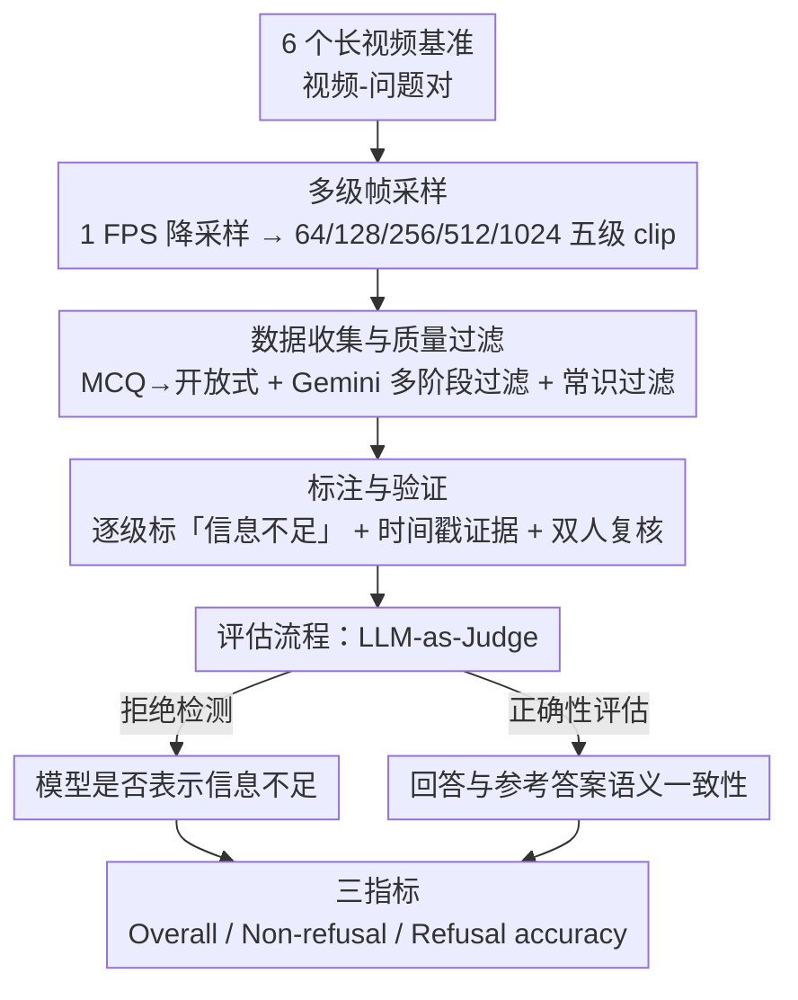

# VirtueBench: Evaluating Trustworthiness under Uncertainty in Long Video Understanding

**会议**: CVPR 2026  
**arXiv**: [2603.07071](https://arxiv.org/abs/2603.07071)  
**代码**: 无  
**领域**: 视频理解  
**关键词**: 视频理解Benchmark, 不确定性下的可信度, 长视频理解, 拒绝行为评估, VLM评测

## 一句话总结
提出 VirtueBench，首个评估 VLM 在不确定性下可信度的长视频理解基准，通过为每个视频构建多级帧采样并标注可回答/不可回答的 ground truth，揭示了现有模型普遍倾向于猜测而非诚实拒绝的问题。

## 研究背景与动机
视觉语言模型（VLM）在多模态理解任务上取得了显著进展，但长视频理解的评测仍不可靠。

**核心矛盾**：由于输入帧数限制（通常 256-512 帧），长视频的关键帧可能未被包含在模型输入中。在现有评测协议下：
- 诚实拒绝回答（"视频信息不足"）的模型被判为错误
- 碰巧猜对答案的模型获得虚高的准确率
- 这**激励模型猜测而非诚实回答**，产生误导性评测结果

**具体例子**：在 VideoEval-Pro 上测试 64 帧子集时，Qwen2.5-VL-72B 诚实表示信息不足（被判错），LLaVA-Video-72B 猜对了答案（被判对）——但后者并未真正看到回答问题所需的关键帧。

**现有 Benchmark 的不足**：
1. 标准长视频基准（Video-MME、MLVU 等）将完整视频的答案作为所有帧设置的 ground truth——不考虑模型实际可见的帧范围
2. 视频幻觉基准（VideoHallucer、VIDHALLUC）诊断特定幻觉类型，但不评估模型在信息不足时的诚实拒绝能力
3. 多选题格式进一步加剧了猜测问题

**核心 idea**：构建一个为每个帧采样级别提供不同 ground truth 的基准——当帧不包含关键信息时，正确答案就是"信息不足"，模型只有诚实拒绝才算正确。

## 方法详解

### 整体框架
VirtueBench 想解决的是长视频评测里一个被长期忽略的偏差：模型实际只看到有限帧，但评测却拿"看完整视频"的答案当标准答案，于是诚实说"看不够"被判错、瞎猜蒙对反而被奖励。它的破题方式是把"看了多少帧"显式纳入评测——从现有长视频基准收集视频-问题对，给每个视频切出 64/128/256/512/1024 帧的 5 级 clip，**每一级单独标注 ground truth**：关键信息在这一级帧里就给确定答案，不在就把"信息不足"本身定为正确答案。整条流水线分四步串起来：先做多级帧采样，再把原始数据清洗成不可猜的开放题，然后逐级人工标注并双人复核，最后用 LLM-as-Judge 把"拒绝"和"答对"分开计分。

### 关键设计

**1. 多级帧采样：让"可不可答"随帧数变化，而不是固定**

传统基准对一个问题只有一个标准答案，无论模型看 64 帧还是 1024 帧都用它评分，这正是"关键帧没采到却被判错"的根源。VirtueBench 先把每个视频统一降采样到 1 FPS，再均匀采成 64/128/256/512/1024 帧五个级别的 clip。同一个问题在不同级别下视觉内容不同——稀疏采样可能漏掉关键帧、于是变成"信息不足"，密集采样才包含答案所需画面。给每一级都配独立 GT，评测就能区分"模型在这一级到底该不该答得出来"，而不是用一个全局答案一刀切。

**2. 数据收集与质量过滤：把题目清洗到"只靠瞎猜答不对"**

题目从 MLVU、LVBench、LongVideoBench、MovieChat、Video-MME、ALLVB 六个基准汇集，初始有 3,042 个视频、33,400 个问题，但原始题里混着大量"不看视频也能蒙对"的噪声。第一刀是把所有多选题转成开放式问答，用正确选项当参考答案——多选格式本身给了四选一的猜测捷径，转开放后模型必须自己生成答案，猜测空间被压掉。接着用 Gemini-2.5-Flash 做多阶段过滤：删掉答案超过 6 词的题、删掉依赖选项上下文或引用时间戳/字幕、涉及主观判断的题。最关键的是**常识过滤**——随机抽一帧丢给 Gemini-2.5-Flash，凡是单帧就能答对的，说明这题根本不需要视频理解，直接丢弃。过滤后剩约 2,500 个真正依赖视频内容的开放式 QA 对。

**3. 标注与验证：逐级标"信息不足"，并要求给出时间戳证据**

有了 clip 和题目，还要为每个问题在每个帧级别标出正确答案，难点在于判断"这一级帧到底够不够答"。流程是先让 Gemini-2.5-Pro 在各帧级别生成参考答案打底，再由人工标注员逐个 clip 审查，结合原始全视频答案和 AI 参考答案给最终标注；一旦回答所需的关键帧不在当前 clip 里，就标成 "The video does not provide enough information"。为了让标注可追溯，标注员还要指出支撑答案的时间戳证据——这避免了"凭印象"标注。质量上走双人复核：每条至少两位标注员（首标 + 复核纠正），有争议的直接丢弃，再加随机抽检、不合格退回重标，最终沉淀出 1,328 条高质量实例。

**4. 评估流程：用 LLM-as-Judge 把"拒绝"和"答对"拆成两步算**

开放式答案没法用字符串匹配评分，而且这里要评的不只是对错，还有"该拒绝时有没有拒绝"，所以评测用 GPT-4o 做两阶段判断：先做**拒绝检测**——判断模型这次是不是表示了信息不足；再做**正确性评估**——对有确定答案的题验证模型回答与参考答案的语义一致性，对 GT 为"信息不足"的题则只有模型确实拒绝才算正确。基于这两步，VirtueBench 给出三个互补指标：**Overall accuracy** 是把拒绝判断也算进去的总准确率；**Non-refusal accuracy** 只在有确定答案的子集上看模型答得准不准；**Refusal accuracy** 专看 GT 为"信息不足"的子集里模型正确拒绝的比例。三者再按 Perception/Reasoning 细分，就能分别看出模型"答得准"和"知道自己不知道"两种能力。

## 实验关键数据

### 数据集统计
- 1,328 实例，901 原始视频
- 767 感知 + 561 推理问题（平衡覆盖）
- 帧级别不可回答比例：64帧 ~50% → 1024帧 ~25%（随帧数增加递减）
- 实例级别分布均匀：从全不可答到全可答

### 主实验 — 总体准确率（64帧）

| 模型 | Overall | P/R |
|------|---------|-----|
| Gemini-2.5-Flash | **58.96** | 63.60/54.70 |
| GPT-4o | 55.43 | 59.81/49.74 |
| Qwen3VL-32B | 50.83 | 53.00/48.01 |
| Qwen2.5VL-72B | 49.32 | 52.86/44.71 |
| GPT-5 | 50.30 | 51.40/48.87 |
| Mimo-VL-7B-RL | 39.98 | 42.74/36.40 |
| LLaVA-Video-72B | 25.53 | 29.83/19.93 |

### 关键发现 — 拒绝行为分析

| 模型类型 | 拒绝准确率表现 |
|---------|--------------|
| Qwen-VL 系列 | 最强开源拒绝能力（>50%） |
| Gemini-2.5-Flash | 商业模型中最优 |
| LLaVA-Video | 几乎零拒绝行为 |
| GPT-5 | 随帧数增加表现提升 |

### 消融 — Prompt 中是否包含诚实指令

| 模型 | 有诚实指令 | 无诚实指令 | 拒绝准确率变化 |
|------|----------|----------|--------------|
| 大多数模型 | 有拒绝能力 | 拒绝几乎消失 | 下降约 50% |

### 关键发现
- **准确率随帧数增多反而下降**：这与传统基准"帧越多越好"的认知相反——因为 VirtueBench 为每个帧级别提供独立 GT，更密集的采样意味着更少的不可回答问题，但模型在可回答问题上的推理也更难
- **拒绝行为高度依赖 prompt**：移除诚实指令后，大多数模型的拒绝准确率暴跌约一半——说明拒绝能力主要是被 prompt 唤起的，而非模型内在品质
- **Perception 优于 Reasoning**：推理任务需要跨帧整合信息和高阶推理，显著更难
- Gemini-2.5-Flash 在所有帧级别上均最优，且保持稳定
- 开源 Qwen3-VL-32B 大幅缩小了与闭源模型的差距
- **LLaVA-Video 系列几乎 0 拒绝率**——该模型被训练为总是给出答案

## 亮点与洞察
- **问题定义本身就是重要贡献**：首次明确指出长视频基准的评测偏差——猜对被奖励，诚实被惩罚
- 多级帧采样 + 逐级 GT 标注的方案简洁但有效
- 常识过滤（单帧能答对的问题丢弃）确保了评估的公正性
- MCQ→开放式的转换进一步减少了猜测空间
- 揭示了一个深层问题：**现有 VLM 的训练范式（RLHF、SFT）鼓励模型"总给出答案"而非"知道自己不知道"**

## 局限与展望
- 1,328 实例规模相对有限，领域覆盖可能不够全面
- LLM-as-Judge（GPT-4o）本身的评估可靠性未充分验证
- "诚实拒绝"的定义可能过于严格——模型可能以模糊/不确定的方式表达而非明确拒绝
- 帧采样使用均匀策略，智能采样（如关键帧检测）可能改变结论
- 只评估了拒绝/不拒绝的二元行为，未评估置信度校准等更细粒度的不确定性表达
- 未探索如何通过训练提升模型的拒绝能力

## 相关工作与启发
- VideoEval-Pro：指出 MCQ 的猜测问题，本文进一步解决信息不足时的评估偏差
- 视频幻觉基准（VideoHallucer 等）：诊断幻觉类型 vs 本文评估不确定性下的诚实度
- 对 VLM 评测的启示：所有需要从有限输入推断的基准都应考虑"信息不足"场景的评估
- 对模型训练的启示：需要将"诚实拒绝"纳入 RLHF 奖励函数，而非仅优化正确率

## 评分
- 新颖性: ⭐⭐⭐⭐⭐ 首次系统定义并评估 VLM 在不确定性下的可信度，问题定义极具洞察
- 实验充分度: ⭐⭐⭐⭐⭐ 25 个模型（含商业模型）+ 5 级帧采样 + 拒绝行为分析 + prompt 消融
- 写作质量: ⭐⭐⭐⭐⭐ 问题动机清晰、图示优秀、实验分析深入
- 价值: ⭐⭐⭐⭐⭐ 对长视频理解评测有重要纠偏意义，推动可信 VLM 发展

<!-- RELATED:START -->

## 相关论文

- [\[CVPR 2026\] Video Panels for Long Video Understanding](video_panels_for_long_video_understanding.md)
- [\[CVPR 2026\] Efficient Frame Selection for Long Video Understanding via Reinforcement Learning](efficient_frame_selection_for_long_video_understanding_via_reinforcement_learnin.md)
- [\[CVPR 2026\] META: Meta Evolution of Tool Trajectory Adaptation for Long-Video Understanding](meta_meta_evolution_of_tool_trajectory_adaptation_for_long-video_understanding.md)
- [\[CVPR 2026\] Thinking with Drafts: Speculative Temporal Reasoning for Efficient Long Video Understanding](thinking_with_drafts_speculative_temporal_reasoning_for_efficient_long_video_und.md)
- [\[CVPR 2026\] VideoARM: Agentic Reasoning over Hierarchical Memory for Long-Form Video Understanding](videoarm_agentic_reasoning_over_hierarchical_memory_for_long-form_video_understa.md)

<!-- RELATED:END -->
