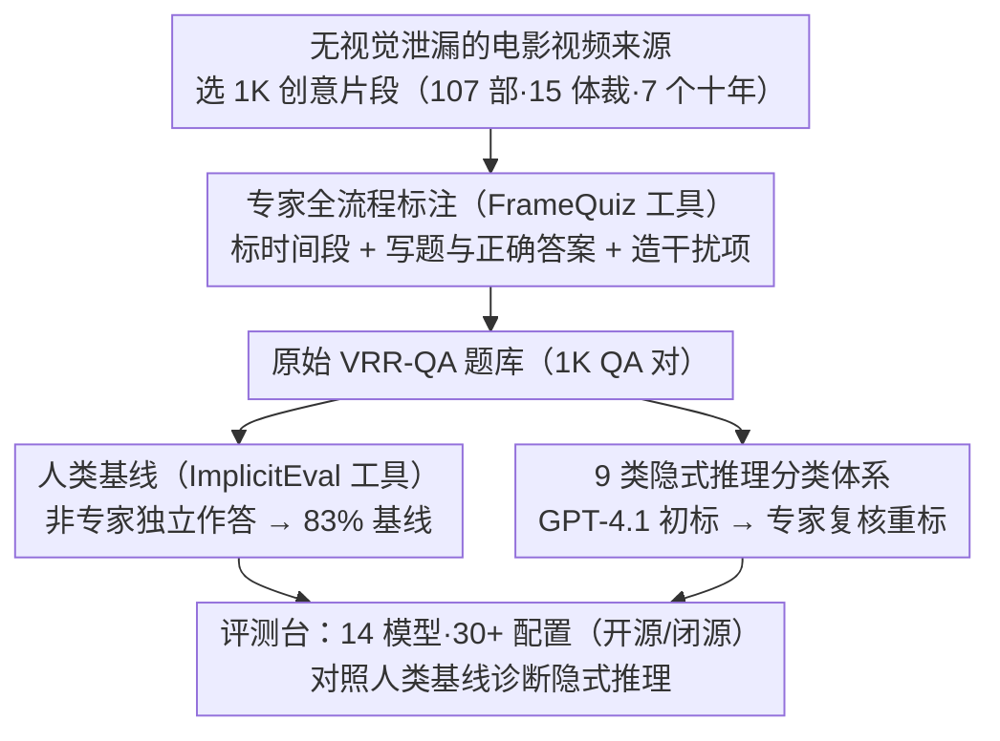

# VRR-QA: Visual Relational Reasoning in Videos Beyond Explicit Cues

**会议**: CVPR 2026  
**arXiv**: [2506.21742](https://arxiv.org/abs/2506.21742)  
**代码**: 有（数据集和数据收集框架已开源）  
**领域**: 视频理解  
**关键词**: 视频问答, 隐式推理, 视觉关系推理, 基准测试, 多模态理解

## 一句话总结
本文提出 VRR-QA 基准，包含 1K 精心标注的视频问答对，专门测试模型对视频中隐式视觉关系的推理能力（如屏幕外事件、跨帧因果、空间关系推断），揭示当前最强 VideoQA 模型（包括 GPT-O3）在隐式推理上的显著不足——最优模型仅达 64% 准确率，远低于人类的 83%。

## 研究背景与动机

1. **领域现状**：视频问答（VideoQA）近年取得显著进展，通过多模态学习对齐视觉和文本模态。现有基准（如 MVBench、TempCompass、VideoMME）主要针对"显式可见"的问题——识别动作、物体、事件等直接可观察的视觉内容。

2. **现有痛点**：人类理解视频时不仅看"画面上出现了什么"，还会推断画面中暗示但未直接呈现的关系——例如从角色的跑动方向推断子弹的运动轨迹，即使子弹和目标人物从未同框出现。然而现有基准几乎不涵盖这类"隐式推理"任务。

3. **核心矛盾**：现有模型严重依赖表面级视觉线索，在需要跨帧推断未显式展示的空间关系、因果链条、社交动态时表现极差。但缺少一个系统化的基准来量化评估这一能力缺口。

4. **本文目标** 构建第一个专注于"隐式视觉关系推理"的 VideoQA 基准，系统评估现有模型在此任务上的能力，并定义 9 类推理维度的分类体系。

5. **切入角度**：选择电影和动画作品作为视频来源——这类创意视频天然采用叙事技巧（如暗示因果、屏幕外动作、视角切换），使"隐式推理"内含在内容理解中，同时避免显式线索泄漏。

6. **核心 idea**：通过电影片段中需要推断而非直接观察的问题，构建一个真正测试视频隐式推理能力的基准。

## 方法详解

### 整体框架
VRR-QA 本质上是一个"出考题"的工程：它要造出一批用眼睛直接看画面答不出、必须靠推理才能答对的视频问题，再用它们去量当前模型离人类有多远。整套构建流程分四步推进——先从多样化电影里挑出 1K 个带叙事张力的创意片段，再由 CV 专家用自研的 FrameQuiz 工具逐帧检查、标注时间段并撰写问题和选项，然后请未参与出题的非专家标注员通过 ImplicitEval 工具独立作答以建立人类基线，最后用 GPT-4.1 对问题做初步归类、再由专家逐条复核推理类别。最终落地的 1K QA 对覆盖 107 部电影、15 种体裁、横跨 7 个十年。基于这套题库，论文又把 30+ 种模型配置拉进同一张评测台对照：从开源的 LLaVA 系列、Qwen2-VL、InternVL3、Gemma 3，到闭源的 GPT-O3、GPT-5.2、Gemini 3 Flash、Claude 4.5 Sonnet，并系统改变参数规模和输入帧数来看哪个因素真正影响隐式推理。

> ⚠️ 部分模型名（如 GPT-5.2、Gemini 3 Flash、Claude 4.5 Sonnet、GPT-O3）以原文为准，具体型号请回查论文。

### 关键设计

**1. "无视觉泄漏"的电影视频来源：让叙事张力把答案藏到画面之外**

要让推理成为答题的必要条件，素材本身就得故意省略直接描绘。电影的叙事手法天然满足这一点，所以 1K 片段全部取自 107 部电影（15 种体裁，涵盖 3D 动画、真人电影等），优先挑那些把关键信息省略、留白或散布到多帧的场景。一个典型例子是：子弹飞向公主，但子弹和马里奥从未同框出现——模型无法直接看到两者的相对位置，只能顺着公主的跑动方向和子弹方向去推断子弹相对马里奥的位移方向。正是这种"关键信息从不直接呈现"的设计，把隐式推理从可选的加分项变成理解内容的硬门槛，同时避开了 ego-centric/教学类视频常见的显式线索泄漏。

**2. 专家全流程标注（FrameQuiz 工具）：用 CV 专家的手工出题守住问题的"隐式性"**

隐式推理基准最大的风险是题目"漏题"——一旦问题能靠画面里的显式线索答出，就退化成普通感知测试。多数基准用模板批量生成或 LLM 辅助标注（如 Cinepile、TempCompass），恰恰容易踩这个坑。VRR-QA 反其道而行：全部 1K 个问题都由论文作者（CV 专家）亲手编写并交叉验证。专家通过自研的 FrameQuiz 标注工具完成三件事——标出问题对应的时间段、撰写题目与正确答案、再编造看似合理的干扰项；工具支持逐帧步进、暂停回放、保存后重看复核，确保每道题都精确绑定到具体片段。让懂视觉的人亲自把关，才能保证每道题问的确实是"需要推断的关系"，而不是"画面上摆着的事实"。

**3. 9 类隐式推理分类体系：把"看不见的关系"拆成可逐项诊断的维度**

光说"模型不会隐式推理"太笼统，无法定位它到底弱在哪。题库出好后，VRR-QA 先用 GPT-4.1 给每道题打初步类别标签、再由专家逐条复核重标，把隐式视觉推理切成 9 个互补的维度：横向空间推理（推断物体的相对左右位置）、纵向空间推理（上下关系）、相对深度与距离、视角与可见性（推断谁能看到什么）、运动与轨迹动态、因果与动机推理、隐式计数（需要跨帧聚合散布在不同画面里的视觉证据再计数）、物理与环境上下文、社交互动与关系。这套体系的价值在于让评测结果从一个总分变成一张能力图谱——后续实验正是靠它才能精确指出隐式计数和横向空间推理是模型最薄弱、与人类差距最大的环节，而非笼统地说"差"。

## 实验关键数据

### 主实验

| 模型 | 总体准确率 | 宏平均 | 横向空间 | 运动轨迹 | 推理动机 | 隐式计数 |
|------|-----------|--------|---------|---------|---------|---------|
| 人类基线 | 83.0% | 85.6% | 85.4% | 91.9% | 94.4% | 65.9% |
| GPT-O3 | 64.1% | 68.6% | 50.3% | 71.4% | 85.4% | 39.5% |
| Gemini 3 Flash | 61.8% | 67.6% | 52.8% | 73.6% | 86.6% | 48.3% |
| GPT-4.1 | 54.3% | 58.6% | 42.9% | 59.3% | 82.9% | 41.9% |
| InternVL 3 (7B) | 43.3% | 50.2% | 34.8% | 51.7% | 64.6% | 34.9% |
| LLaVA-Video (7B) | 42.1% | 46.3% | 36.0% | 60.4% | 62.2% | 14.0% |

### 关键分析

| 分析维度 | 发现 |
|---------|------|
| 推理 vs 非推理模型 | 推理模型 GPT-O3 比 GPT-4.1 高 9.8%，说明深层推理对隐式理解至关重要 |
| 模型规模效应 | GPT-4.1 的大规模版本显著优于小规模变体；开源模型中 Qwen2.5-VL-32B 仅小幅优于 7B |
| 帧数影响 | 更多帧未必带来改善，说明问题在于推理能力而非视觉信息不足 |
| 最难类别 | 隐式计数和横向空间推理是模型最弱的环节，与人类差距最大 |
| 文本多样性 | VRR-QA 的问题 MPS（均值余弦相似度）为 0.161，低于所有对比基准，多样性最高 |

### 关键发现
- 没有任何开源模型在 VRR-QA 上超过 50% 的总体准确率
- 推理型模型（GPT-O3）在所有类别上表现最好，但在横向空间推理和隐式计数上仍远不如人类
- 即使最强闭源模型也比人类基线低约 19 个百分点
- 各模型在不同类别上表现差异显著——社交互动和动机推理相对容易（GPT-O3 达 85-86%），而隐式计数极难（GPT-O3 仅 39.5%）

## 亮点与洞察
- **填补关键空白的基准设计**：VRR-QA 是首个专注于隐式推理的 VideoQA 基准，其设计理念（选择电影内容、专家标注、隐式问题构建）值得其他基准构建工作借鉴
- **分类体系的细粒度**：9 类推理维度的定义为后续研究提供了清晰的能力图谱，可以精确诊断模型在哪类推理上最弱
- **推理型模型的优势验证**：实验清楚证明"思考"能力（如 O3 的推理能力）对隐式理解的关键作用，这为未来 VideoQA 模型的架构设计指明方向

## 局限与展望
- 数据规模较小（仅 1K QA 对），可能不足以支撑大规模训练或精细的统计分析
- 仅选择电影视频，未涵盖教学视频、监控视频等实际应用场景中的隐式推理
- 多选题格式可能无法完全反映模型的开放式推理能力
- 未提供训练集或微调方案，仅作为评测基准使用
- 可扩展方向：构建更大规模的隐式推理训练数据，或设计基于隐式推理的预训练策略

## 相关工作与启发
- **vs MVBench**: MVBench 聚合已有数据集的显式问题，VRR-QA 专注原创的隐式推理问题
- **vs VideoMME**: VideoMME 测试多模态（含字幕/音频），VRR-QA 纯视觉、专注隐式推理
- **vs TempCompass**: TempCompass 通过算法编辑测试时序理解，VRR-QA 使用自然电影内容测试深层推理

## 评分
- 新颖性: ⭐⭐⭐⭐ 填补了 VideoQA 领域隐式推理评测的空白，分类体系设计合理
- 实验充分度: ⭐⭐⭐⭐⭐ 30+ 模型配置的全面评估，多维度分析透彻
- 写作质量: ⭐⭐⭐⭐ 结构清晰，示例生动，动机阐述有说服力
- 价值: ⭐⭐⭐⭐ 揭示了当前 VideoQA 模型的根本缺陷，为社区指明改进方向

<!-- RELATED:START -->

## 相关论文

- [\[CVPR 2026\] Beyond Explicit Language: Plug-and-Play Visual-to-Linguistic Modeling Toward General Object Tracking](beyond_explicit_language_plug-and-play_visual-to-linguistic_modeling_toward_gene.md)
- [\[CVPR 2026\] CineSRD: Leveraging Visual, Acoustic, and Linguistic Cues for Open-World Visual Media Speaker Diarization](cinesrd_leveraging_visual_acoustic_and_linguistic_cues_for_open-world_visual_med.md)
- [\[CVPR 2026\] Learning Transferable Temporal Primitives for Video Reasoning via Synthetic Videos](learning_transferable_temporal_primitives_for_video_reasoning_via_synthetic_vide.md)
- [\[CVPR 2026\] Towards Sparse Video Understanding and Reasoning](towards_sparse_video_understanding_and_reasoning.md)
- [\[CVPR 2026\] Beyond Caption-Based Queries in Video Moment Retrieval](beyond_caption-based_queries_in_video_moment_retrieval.md)

<!-- RELATED:END -->
