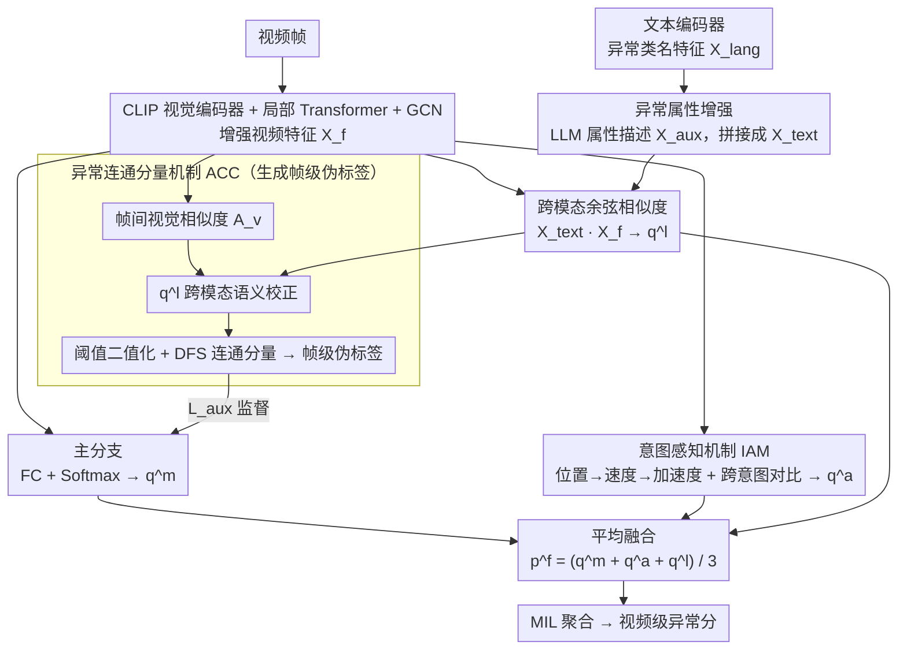

# Weakly Supervised Video Anomaly Detection with Anomaly-Connected Components and Intention Reasoning

**会议**: CVPR 2026  
**arXiv**: [2603.00550](https://arxiv.org/abs/2603.00550)  
**代码**: 无  
**领域**: 视频理解  
**关键词**: 弱监督视频异常检测, 连通分量, 意图推理, CLIP, 多实例学习

## 一句话总结

提出 LAS-VAD 框架，通过异常连通分量机制（ACC）将视频帧划分为语义一致的组来生成伪标签弥补帧级标注缺失，并通过意图感知机制（IAM）利用位置-速度-加速度特征区分外观相似但意图不同的正常/异常行为，在 XD-Violence 上达 89.96% AP (I3D)。

## 研究背景与动机

**领域现状**：弱监督视频异常检测（WS-VAD）仅使用视频级标注，通过多实例学习（MIL）识别异常时间区间。主流方法使用预训练特征提取+分类器管道。

**现有痛点**：
   - **语义信息不足**：缺乏帧级标注导致模型难以学到异常的语义表示，只能通过 MIL 的 top-K 策略间接学习
   - **行为区分模糊**：正常和异常行为外观高度相似（如"拿东西" vs "偷东西"），仅靠外观特征无法区分

**核心矛盾**：帧级标注缺失 ↔ 需要帧级语义理解；外观相似 ↔ 意图不同

**切入角度**：
   - 语义问题：利用帧间相似性构建连通分量图，同组帧共享语义 → 伪标签
   - 意图问题：异常行为往往速度/加速度异常（偷东西比拿东西更快），用运动学特征推理意图

**核心 idea**：学习异常语义 = 空间语义分组（ACC）+ 运动意图推理（IAM）+ 异常属性增强

## 方法详解

### 整体框架

LAS-VAD 想解决的是弱监督异常检测里最尴尬的一对矛盾：只有视频级标签可用，却要做出帧级判断，而且很多异常和正常动作长得几乎一样。它的做法是先抽一份共享的增强视觉特征，再在其上分出三条预测分支、并额外配一个伪标签生成模块。具体地：先用 CLIP 编码器拿到帧级特征 $X_\text{video} \in \mathbb{R}^{T \times D}$，过局部 Transformer 加 GCN 建模时序依赖得到增强特征 $X_f$。在 $X_f$ 之上有三条预测分支——主分支用全连接+Softmax 直接出类别预测 $q^m$；IAM 分支从运动学角度推断"这个动作到底想干什么"得到 $q^a$；文本分支让文本编码器拿异常类名特征 $X_\text{lang}$、再让 LLM 给每类异常补属性描述编码成 $X_\text{aux}$，拼成 $X_\text{text}$ 后与 $X_f$ 算跨模态相似度得到 $q^l$。与此同时，ACC 模块把帧聚成语义连通分量、造出帧级伪标签去监督主分支 $q^m$（它的语义校正还要借用文本分支的 $q^l$），补上缺失的细粒度监督。最后三条分支平均融合 $p^f = \frac{1}{3}(q^m + q^a + q^l)$，再经 MIL 聚合成视频级异常分。

### 关键设计

**1. 异常连通分量机制 (ACC)：在没有帧级标签的情况下造出帧级监督**

弱监督的根本困境是模型拿不到逐帧标签，只能靠 MIL 的 top-K 间接学习，语义信号稀薄。ACC 换了个思路：与其去标每一帧，不如判断哪些帧"属于同一回事"。它先算帧间视觉相似度 $\mathcal{A}_v = \frac{X_f \cdot X_f^T}{\|X_f\| \cdot \|X_f\|}$，但纯视觉相似度容易把光照、背景接近却语义无关的帧错连在一起，所以再用跨模态语义相似度做一次校正——$\hat{\mathcal{A}}_w[i,j] = \mathcal{A}_v[i,j] \cdot (1 + \eta \cdot \max_c \min(q^l[i,c], q^l[j,c]))$，让两帧在文本语义上越一致、连边权重越被放大。校正后的相似度按阈值 $\tau$ 二值化成邻接矩阵 $\mathcal{A} = (\hat{\mathcal{A}} > \tau)$，再用 DFS 在这张图上找连通分量 $B_1, B_2, \dots, B_r$，每个分量内的帧共享同一语义标签。举个直观的例子：一段含打斗的视频里，相邻几十帧因为画面和"fighting"这个语义都接近被连成一个分量，于是它们被一并打上同组伪标签，原本只有视频级"含异常"的信号就被下放成了一片连续帧的细粒度监督。这样模型不需要知道每一帧的精确类别，只需知道帧之间的归属关系，就绕开了帧级标注缺失这道坎。

**2. 意图感知机制 (IAM)：用运动学特征把"拿东西"和"偷东西"分开**

很多异常和正常动作外观高度重合——"拿起一件商品"和"偷走一件商品"在单帧里几乎无法区分，差别藏在动作的快慢和发力上。IAM 因此不在外观上较劲，而是从 $X_f$ 提取位置特征 $X_p$，再逐次差分得到速度 $X_v$ 和加速度 $X_a$，把动作的运动学画像显式编码出来。差分会放大噪声，所以速度分支加了一道门控 $X_v = \text{Sigmoid}(\text{Conv}(X_v^\text{diff})) \times X_v^\text{diff}$，让网络自己学会压住抖动、留下真正有信息的运动。位置、速度、加速度拼成意图特征 $X_\text{int} \in \mathbb{R}^{T \times D}$ 后，模型为每个类别（含正常）维护一个动量更新的意图原型 $Z \in \mathbb{R}^{(C+1) \times D}$ 作为参照锚点。为了把相似外观、不同意图的样本真正推开，IAM 还做跨意图对比学习：专挑同类中最不像的样本当正例、异类中最像的样本当负例（即最难的正负对），用 infoNCE 拉近正例、推远负例

$$\mathcal{L}_\text{cst} = -\frac{1}{T}\sum_{t=1}^T \log \frac{\exp(X_\text{int}^t \cdot S_\text{pos}^t)}{\sum_{i=1}^M \exp(X_\text{int}^t \cdot S_\text{neg}^t)}$$

正因为约束的是最难分的边界样本，意图空间被压得更紧，外观骗不过去的偷窃动作就能凭"抓取速度更快"被识别出来。

**3. 异常属性增强：让 LLM 把异常的"长相"写成文本先验**

异常类别特征 $X_\text{lang}$ 只有一个干巴巴的类名（如"爆炸"），语义太薄。这个设计借 LLM 给每类异常补一段属性描述——"爆炸"展开成"火焰、浓烟"之类的可见特征，编码成 $X_\text{aux}$，与类名特征拼成更丰富的文本表示 $X_\text{text} = [X_\text{lang}; X_\text{aux}]$，再和视频特征算跨模态余弦相似度得到文本分支预测 $q^l$。这一步等于免费给检测器灌入一份"异常通常伴随哪些可见属性"的先验，且全自动、无需人工设计提示。值得一提的是，前面 ACC 里用来校正视觉相似度的 $q^l$ 正是这一分支的产物——属性增强不只独立贡献一路预测，还反哺了 ACC 的语义分组。

### 损失函数 / 训练策略

$$\mathcal{L}_\text{all} = \mathcal{L}_\text{ags} + \mathcal{L}_\text{fg} + \mathcal{L}_\text{aux} + \lambda \mathcal{L}_\text{reg}$$

- $\mathcal{L}_\text{ags}$：二元交叉熵（粗粒度异常/正常）
- $\mathcal{L}_\text{fg}$：多分类交叉熵（细粒度异常类别）
- $\mathcal{L}_\text{aux}$：ACC 伪标签 L1 损失
- $\mathcal{L}_\text{reg}$：粗/细粒度预测一致性正则

## 实验关键数据

### 主实验

| 数据集 | 特征 | 指标 | LAS-VAD | 之前SOTA | 提升 |
|--------|------|------|---------|---------|------|
| XD-Violence | I3D | AP(%) | **89.96** | LEC-VAD 88.47 | +1.49 |
| XD-Violence | CLIP | AP(%) | **87.92** | LEC-VAD 86.56 | +1.36 |
| UCF-Crime | I3D | AUC(%) | **91.05** | π-VAD 90.33 | +0.72 |
| UCF-Crime | CLIP | AUC(%) | **90.86** | LEC-VAD 89.97 | +0.89 |

细粒度 mAP (XD-Violence, avg IoU 0.1-0.5):

| 方法 | 0.1 | 0.2 | 0.3 | 0.4 | 0.5 | AVG |
|------|-----|-----|-----|-----|-----|-----|
| LEC-VAD | 19.65 | 17.17 | 14.37 | 9.45 | 7.18 | 13.56 |
| **LAS-VAD** | **22.07** | **19.96** | **16.18** | **11.24** | **8.64** | **15.62** |

### 消融实验

| ATT | ACC | IAM | mAP AVG | 说明 |
|-----|-----|-----|---------|------|
| ✗ | ✗ | ✗ | 24.24 | 基线 |
| ✓ | ✗ | ✗ | 26.50 | 属性增强有效 |
| ✓ | ✓ | ✗ | 29.78 | ACC 贡献最大（+3.28） |
| ✓ | ✓ | ✓ | **29.98** | IAM 进一步提升 |

### 关键发现
- ACC（连通分量）是贡献最大的模块，伪标签为帧级学习提供了关键监督
- IAM 的意图推理在外观相似场景中效果显著，但整体增益相对较小（+0.20）
- 异常属性描述（LLM 生成）提供了有意义的语义补充（+2.26）
- 在两个数据集、三种特征提取器（C3D/I3D/CLIP）上均取得 SOTA

## 亮点与洞察
- **连通分量做帧分组**：把图论中的连通分量概念巧妙应用于视频帧语义分组，思路简洁有效。关键在文本语义校正步骤——纯视觉相似度存在偏差，跨模态校正使分组更准确。
- **位置-速度-加速度的意图编码**：从物理学的运动学概念出发设计特征，直觉上很合理——偷窃动作确实比正常拿取更快。门控机制过滤噪声也是好设计。
- **LLM 属性描述作为文本先验**：用 GPT-4 生成异常属性描述的做法简单有效，无需手动设计提示。

## 局限与展望
- ACC 的阈值 $\tau$ 需要手动设定（0.9），对不同视频类型敏感
- IAM 的位置/速度/加速度特征提取比较简单（全连接+差分），可能对复杂运动模式建模不足
- 依赖 GPT-4 生成属性描述，引入外部模型依赖
- 意图原型的动量更新机制在训练初期可能不稳定
- 未在更大规模数据集上验证（如 Kinetics-700 的异常子集）

## 评分
- 新颖性: ⭐⭐⭐⭐ ACC 和 IAM 的组合思路有新意，连通分量做帧分组是亮点
- 实验充分度: ⭐⭐⭐⭐ 两数据集多特征全面对比，消融完整
- 写作质量: ⭐⭐⭐ 动机描述偏冗长，公式符号较多
- 价值: ⭐⭐⭐⭐ 弱监督 VAD 领域的稳定进步

<!-- RELATED:START -->

## 相关论文

- [\[CVPR 2026\] Joint Learning of General and Diverse Patterns with Mixture of Memory Experts for Weakly-Supervised Video Anomaly Detection](joint_learning_of_general_and_diverse_patterns_with_mixture_of_memory_experts_fo.md)
- [\[CVPR 2026\] The Road Less Seen: Segment Exploration for Weakly Supervised Video Anomaly Detection](the_road_less_seen_segment_exploration_for_weakly_supervised_video_anomaly_detec.md)
- [\[CVPR 2026\] Learning from Noisy Supervision: A Denoising-Debiasing Framework for Weakly Supervised Video Anomaly Detection](learning_from_noisy_supervision_a_denoising-debiasing_framework_for_weakly_super.md)
- [\[AAAI 2026\] RefineVAD: Semantic-Guided Feature Recalibration for Weakly Supervised Video Anomaly Detection](../../AAAI2026/video_understanding/refinevad_semantic-guided_feature_recalibration_for_weakly_supervised_video_anom.md)
- [\[CVPR 2026\] TLMA: Mitigating the Impact of Weakly Labeled Information for Video Anomaly Detection](tlma_mitigating_the_impact_of_weakly_labeled_information_for_video_anomaly_detec.md)

<!-- RELATED:END -->
