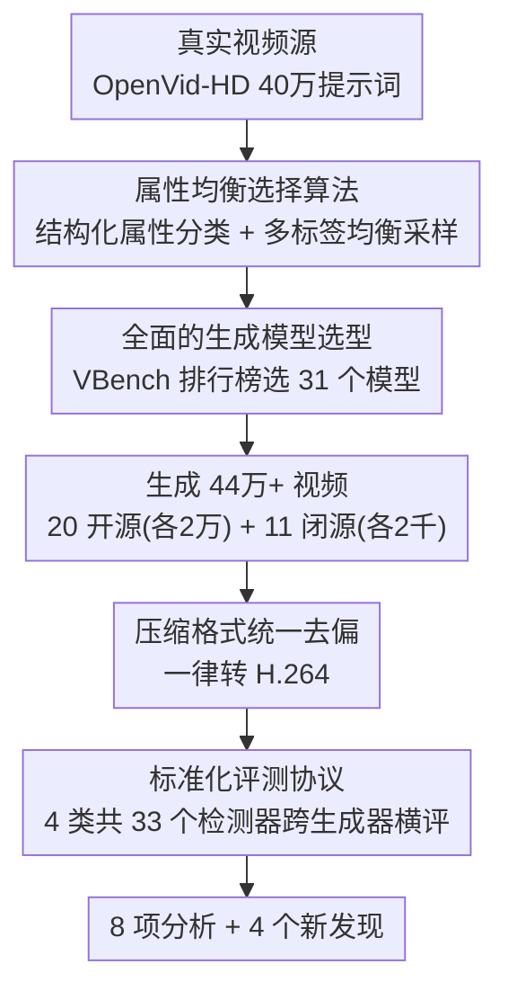

# Your One-Stop Solution for AI-Generated Video Detection

**会议**: CVPR 2026  
**论文**: [CVF Open Access](https://openaccess.thecvf.com/content/CVPR2026/html/Ma_Your_One-Stop_Solution_for_AI-Generated_Video_Detection_CVPR_2026_paper.html)  
**代码**: https://github.com/LongMa-2025/AIGVDBench  
**领域**: 视频理解 / AI生成视频检测 / 多媒体取证  
**关键词**: AIGC 检测, 视频取证, Benchmark, 属性均衡, 跨生成器泛化  

## 一句话总结
作者构建了 AIGVDBench——一个覆盖 31 个最新视频生成模型、44 万+ 视频的 AI 生成视频检测大规模基准，配套一条"属性均衡 + 全面选型 + 去偏预处理"的标准化数据构建流水线，并在 33 个检测器上跑了 1500+ 次评测，提炼出 8 项分析和 4 个新发现（最关键的是"生成质量更高 ≠ 更难被检测"）。

## 研究背景与动机
**领域现状**：2024–2025 年 Sora、Veo、Kling 等文生视频模型让 AI 视频以假乱真，社会出现普遍的"合成怀疑症"（synthetic skepticism）。检测研究从早期的 deepfake 换脸、AI 生成图像识别，正在向"整段视频是否 AI 生成"迁移，但 AI 生成视频检测（AIGVD）这个子方向在规模和深度上都严重滞后。

**现有痛点**：作者指出两类硬伤。**数据集侧**——已有数据集（GVD、GVF、GenVideo、GenBuster 等）普遍依赖过时或覆盖面窄的生成模型，视频量小（多在 4k–110k 量级），且构建时只顾堆数量，忽视语义多样性、场景覆盖、生成技术代表性；从源视频里直接随机采样还会把原数据集的内容分布偏置原样继承下来。**基准侧**——大多数工作停在"造了个数据集"这一步，许多根本性问题从没被系统研究过：到底该整段判别还是逐帧识别？为什么某些模型产的视频更容易被抓？用更高质量的生成样本训练能否提升鲁棒性和泛化？生成技术不断进步是否注定让现有检测器失效？

**核心矛盾**：检测研究的进展被"没有一个既全面又有代表性、又能支撑深入分析"的基准卡住了——数据规模/多样性不足导致结论不可靠，而缺乏系统分析又让大家不知道往哪个方向努力。

**本文目标**：① 给出一条可复现、能保证代表性的数据构建流水线；② 造一个数量级更大、覆盖最新模型的高质量基准；③ 基于它把上面那些悬而未决的问题系统地评测一遍，给后来者指方向。

**切入角度**：与其再造一个"更大的随机采样数据集"，不如先解决采样偏置——用结构化属性体系给提示词分类，再用一个均衡选择算法挑出分布平衡的子集；同时借 VBench 排行榜系统化选模型，并把压缩格式这类低级混淆线索统一掉。

**核心 idea**：把"高质量基准"拆成三件可操作的事——**提示词属性均衡、生成模型全面选型、低级偏置去除**——用标准化流水线串起来，造出 AIGVDBench，然后让 33 个检测器在上面跑大规模横评得出可信结论。

## 方法详解

### 整体框架
这篇论文的"方法"本质是一条**数据集构建 + 评测分析流水线**，目标是产出一个既大又均衡、又能屏蔽伪相关线索的 AI 生成视频检测基准。整条管线可以拆成四步：先从内容分布相对均衡的真实视频数据集 OpenVid-HD 里，用结构化属性体系对 40 万条提示词分类，再用**属性均衡选择算法**挑出 2 万条分布平衡的提示词；然后借 VBench 排行榜**全面选型** 31 个生成模型（20 开源 + 11 闭源），用这些模型+均衡提示词生成 44 万+ 视频；接着对所有视频做**压缩格式统一**（一律转 H.264），消除真实/合成视频在编码格式上的系统差异；最后在统一的**评测协议**下，让四类共 33 个检测器做跨生成器训练-测试，跑出 1500+ 次评测并提炼发现。

### 关键设计

**1. 属性均衡选择算法：从有偏的真实视频里挑出分布平衡的提示词**

直接从 OpenVid-HD 这类大规模真实视频集随机采样，会把它本身的内容分布偏置（某些主题/动作远多于另一些）原封不动继承进基准，使检测器评测结果失真。难点在于提示词是**多标签**的——一条提示词可能同时带"人物""动物"等多个属性，属性之间存在复杂相关性，简单按单属性配额选会顾此失彼。作者先用结构化分类体系把提示词沿"主体内容 / 属性控制"两大维度、再按时空特性细分成 9 类空间内容、3 类空间属性、4 类时间内容、3 类时间属性，给 40 万条提示词打标签。

随后用一个四阶段的均衡选择算法（Algorithm 1）：先按属性组合复杂度把提示词集 $P$ 切成四个互斥子集 $P_1,\dots,P_4$（从"只有时空内容"到"时空内容+时空属性都有"）；每个子集 $P_i$ 再按它含的属性进一步划成 $N_i=\prod_{j=1}^{k}\mathrm{Num}(\mathrm{CLS}(j))$ 个类别（$k$ 为该子集属性数）；每条提示词按属性组合落入一个或多个类别，落多类的标"Multi"、落单类的标"Single"。选择时以**最小类别的提示词数 $m$ 为基准**，把类别按当前数量升序排，从最少的类别开始挑：优先用"Single"提示词，不够再补"Multi"，再不够就把该类别剩余全收；某条"Multi"提示词一旦在某类被选走，就从其它类别里剔除、并相应减少那些类别的待选额度，然后重排剩余类别继续。这样迭代到所有类别处理完，得到属性分布均衡的子集 $P_B$。这种"先填稀缺类、Single 优先、Multi 跨类去重"的贪心策略，正是针对多标签相关性设计的——它避免了某个高频属性因为搭车出现在大量 Multi 提示词里而被过度采样，最终结合人工筛查得到 2 万条均衡真实视频。

**2. 全面的生成模型选型：让基准覆盖最新、最具代表性的生成技术**

旧基准的代表性差，很大程度是因为选的生成模型过时、任务类型单一。作者借助 VBench 排行榜系统化选型，最终纳入 **31 个模型：20 个开源 + 11 个闭源**，覆盖文生视频（T2V，23 个）、图生视频（I2V，6 个）、视频生视频（V2V，2 个）三类生成范式，外加闭源模型贴近真实用户场景的不受限内容。开源侧不只看排名，还综合考虑模型代表性、显存占用、有限资源下的推理速度，并优先选支持多任务类型的模型（如 LTX、EasyAnimate）以便做更深入的研究问题分析；每个开源模型生成 2 万视频（按 14k/3k/3k 划分训练/验证/测试，并配 2 万条同提示词的真实视频）。闭源侧因预算限制每个模型收 2000 视频，来源含 VBench 评测集、官方 demo、社区样例和自生成样本，且不限制内容/分辨率/任务类型，刻意造一个更难、更贴近现实的测试集。正是这种"开源管训练+系统泛化、闭源管现实难度压力测试"的组合，让 AIGVDBench 在模型数、任务覆盖、视频数（44 万+）上全面超越此前所有数据集。

**3. 压缩格式统一去偏：堵住"靠编码格式作弊"的捷径**

deepfake 检测领域早有教训：真实内容常存为 PNG、合成内容常存为 JPEG，检测器很容易学到这种与真伪无关的**低级压缩线索**而非真正的生成伪影，导致评测虚高、模型不公平。作者把所有视频统一转码到 **H.264** 编码，抹平真实/合成视频之间的压缩差异，从源头上去掉这条伪相关捷径。这一步看似工程细节，却直接关系到后续 1500+ 次评测结论是否可信——否则检测器的"高性能"可能只是抓住了格式指纹。配合评测时统一的预处理（每视频从前 128 帧均匀采 32 帧、短边中心裁剪并 resize 到 256×256、统一存 PNG、训练/推理只用前 8 帧），整套协议尽量把无关变量都钉死。

**4. 标准化评测协议与四类检测器横评：把"该怎么检测"的开放问题量化**

光有数据集不够，作者把检测方法归成**四个范式**系统横评：视频分类模型（I3D、TimeSformer、VideoMAE 等）、生成图像检测模型（CNNSpot、UnivFD、Effort、ForgeLens 等，做帧级检测）、生成视频检测模型（DeMamba、DeCoF）、多模态大模型（Qwen2.5-VL、InternVL、DeepSeek-VL 等）。评测沿用"在一个生成器的视频上训练、在其它所有生成器上测试"的跨生成器协议（默认用 Open-Sora 作训练源），衡量域外泛化；VLM 因只输出二元标签、无法算 AUC，单独用 ACC 评。在这套协议下跑出 33 个检测器、1500+ 次评测，正是这种"四范式 × 跨生成器"的横评矩阵，才让"整段还是逐帧""生成质量与可检测性的关系"这些此前没人系统回答的问题第一次有了量化证据，并支撑起后面的 8 项分析与 4 个发现。

## 实验关键数据

### 主实验
基准规模与覆盖面对此前数据集形成代际碾压：

| 数据集 | 最新模型年份 | 模型数 | 开源/闭源 | 生成视频数 | 内容均衡 |
|--------|------|------|------|------|------|
| GVD | 2024.2 | 11 | 3/8 | 11.6k | 否 |
| GVF | 2024.6 | 9 | 4/5 | 4.2k | 半自动 |
| GenVideo | 2024.3 | 20 | 14/6 | 100k | 否 |
| GenWorld | 2025.1 | 10 | 10/0 | 89.4k | 否 |
| **AIGVDBench（本文）** | 2025.3 | **31** | **20/11** | **422k+** | **自动** |

跨生成器检测 AUC（开源生成模型上的平均，节选代表性检测器）：

| 检测器类别 | 代表方法 | 开源 AVG AUC | 闭源 AVG AUC |
|--------|------|------|------|
| 生成图像检测 | ForgeLens1 | 91.82 | 85.03 |
| 生成图像检测 | Effort | 87.49 | **94.05** |
| 视频分类 | I3D | 82.99 | 61.18 |
| 视频分类 | TimeSformer | 81.50 | 86.50 |
| 生成视频检测 | DeCoF | 82.56 | 72.90 |
| 生成视频检测 | DeMamba | 80.99 | 69.43 |

VLM 准确率（ACC，越接近 50 越像瞎猜）：开源生成模型上最高的 InternVL-8B 仅 55.48，多数模型（LLaVA-1.5、DeepSeek-VL-7B、Kimi-VL 等）几乎贴着 50；闭源上 DeepSeekVL2 异常地冲到 75.35，作者在附录单独分析这是否是"真能辨真伪"。

### 关键发现
- **Finding-1：四类范式都仍有大量提升空间，没有现成赢家。** 生成图像检测器（Effort、ForgeLens）凭"丢弃无关特征、降低数据依赖"的策略在开源/闭源上都最强，间接支持了 DeCoF 的时空伪影假说；视频分类网络在闭源上掉得厉害但仍有潜力；专门的视频检测器（DeCoF/DeMamba）虽未夺冠，但"抑制空间伪影、利用时间伪影"的核心思路被看好，作者认为其受限于此前数据规模/质量；VLM 整体落后但在可解释性上最有前景。
- **Finding-2（最反直觉）：生成模型质量更高，并不保证更难被检测、也不保证训练出的检测器泛化更好。** 作者用 I3D、DeCoF、UnivFD 三个检测器做"在一个模型上训、在所有其它模型上测"的交叉矩阵，定义了"最优/最差训练生成模型"和"最佳/最差被测生成模型"。结果显示：同一检测器换不同生成模型训练性能差异大，但**与生成质量并非正相关**；每个检测器的"最优训练模型"还各不相同（RepVideo 对 I3D 是最优、对 DeCoF/UnivFD 却不是）；"什么算高质量训练数据"必须结合具体检测器特性判断，不能简单等同于生成模型的客观性能。
- **Finding-1.1 / 1.2：** 生成任务类型（T2V/I2V/V2V）对检测器性能影响显著，且不同类型检测器受影响程度差异很大；当前 VLM 缺乏可靠的 AI 生成视频检测能力（多数贴近随机）。
- **压缩格式与采样协议的去偏很关键**：统一 H.264、统一帧采样/分辨率，是保证这 1500+ 次评测结论不被低级线索污染的前提。

## 亮点与洞察
- **把"高质量基准"工程化拆解**：不空谈"更大更好"，而是落到提示词均衡、模型选型、格式去偏三件可执行的事，并各给出算法/协议——这套方法论可迁移到 AI 生成图像/音频检测的基准构建。
- **属性均衡选择算法直面多标签难题**：用"Single 优先 + Multi 跨类去重 + 先填稀缺类"的贪心，巧妙处理了提示词多标签相关性，比单纯按属性配额更不容易过采样高频属性。
- **Finding-2 打破直觉**：业界默认"生成越逼真越难检测"，本文用交叉矩阵证伪——"高质量训练数据"是相对检测器而言的，这对怎么选训练生成器有直接指导意义。
- **闭源模型当压力测试集**：用不受限内容、不限分辨率的闭源样本逼近真实世界，暴露出检测器在闭源上的大幅掉点，比纯开源评测更有现实意义。

## 局限与展望
- **作者承认**：因区域访问限制和构建成本，Veo3、Sora2 等最新闭源模型未纳入；闭源模型每个仅 2000 视频，规模远小于开源（各 2 万），统计代表性偏弱。
- **本文是基准+分析而非新检测器**：没有提出超越现有 SOTA 的检测算法，结论多为"指方向"，离落地强检测器仍有距离。
- **VLM 评测受限于二元输出**：只能用 ACC、无法算 AUC，且 DeepSeekVL2 在闭源上的异常高分是否为真实判别能力仍需附录进一步澄清，存在被数据集构成"蒙对"的风险。
- **可改进方向**：把均衡算法的"属性体系"做成可学习/自适应；引入时序级别的去偏（不止压缩格式）；以该基准为训练源，专门设计"抑制空间伪影、强化时间伪影"的检测器去验证 Finding-1 的猜想。

## 相关工作与启发
- **vs GenVideo / GenBuster / GenVidBench**: 它们要么模型过时、要么直接随机采样继承分布偏置、规模多在 ~100k；本文模型更新（覆盖到 2025.3）、用属性均衡算法主动去偏、规模 44 万+，并附带系统性分析而非止步于建库。
- **vs DeCoF / DeMamba（专用视频检测器）**: 它们提出"抑制空间伪影、利用时间伪影"的检测思路；本文不与之竞争，而是为其提供一个更大更干净的训练/评测基准，并通过实验佐证其思路的潜力（猜测此前受限于数据质量）。
- **vs 生成图像检测（CNNSpot/UnivFD/Effort/ForgeLens）**: 这些原本做帧级图像检测，本文把它们适配到逐帧视频检测并发现"丢弃无关特征、降低数据依赖"的策略最稳，提示视频检测可借鉴图像取证的特征解耦经验。

## 评分
- 新颖性: ⭐⭐⭐⭐ 基准+流水线本身是工程贡献，但"属性均衡算法"和 Finding-2 的反直觉结论有真正的洞察价值。
- 实验充分度: ⭐⭐⭐⭐⭐ 31 模型、44 万视频、33 检测器、1500+ 次评测、8 项分析，规模和系统性在该方向罕见。
- 写作质量: ⭐⭐⭐⭐ 问题驱动、findings 组织清晰；但部分关键算法/异常结论的细节下放到附录，正文略显意犹未尽。
- 价值: ⭐⭐⭐⭐⭐ 大概率成为 AI 生成视频检测的标准基准，对后续检测器设计和评测有奠基意义。

<!-- RELATED:START -->

## 相关论文

- [\[CVPR 2026\] CoCoVideo: The High-Quality Commercial-Model-Based Contrastive Benchmark for AI-Generated Video Detection](cocovideo_the_high-quality_commercial-model-based_contrastive_benchmark_for_ai-g.md)
- [\[CVPR 2026\] MoVie: Broaden Your Views with Human Motion for Action Detection](movie_broaden_your_views_with_human_motion_for_action_detection.md)
- [\[CVPR 2026\] Envisioning the Future, One Step at a Time](envisioning_the_future_one_step_at_a_time.md)
- [\[CVPR 2026\] Stay in your Lane: Role Specific Queries with Overlap Suppression Loss for Dense Video Captioning](stay_in_your_lane_role_specific_queries_with_overlap_suppression_loss_for_dense_.md)
- [\[CVPR 2026\] Building a Precise Video Language with Human-AI Oversight](building_a_precise_video_language_with_human-ai_oversight.md)

<!-- RELATED:END -->
