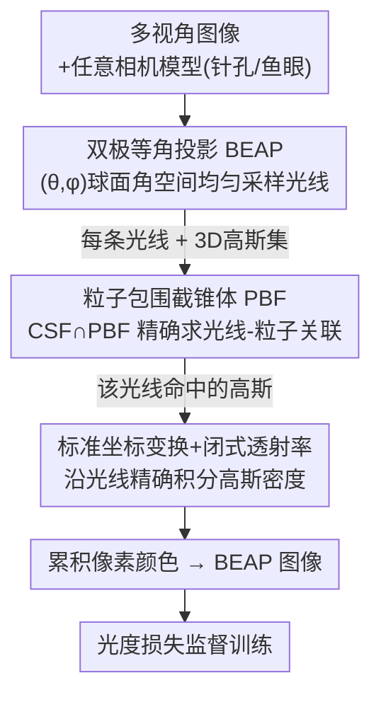

# 3DGEER: 3D Gaussian Rendering Made Exact and Efficient for Generic Cameras

**会议**: ICLR 2026  
**arXiv**: [2505.24053](https://arxiv.org/abs/2505.24053)  
**代码**: [https://zixunh.github.io/3d-geer](https://zixunh.github.io/3d-geer)  
**领域**: 3D视觉  
**关键词**: 3D Gaussian Splatting, 光线追踪, 鱼眼相机, 宽视场渲染, 实时渲染  

## 一句话总结
提出 3DGEER 框架，通过推导沿光线积分高斯密度的闭式解、设计粒子包围截锥体 (PBF) 进行精确高效的光线-粒子关联、以及引入双极等角投影 (BEAP) 统一宽视场相机表示，在任意相机模型下实现了几何精确且实时高效的 3D 高斯渲染，在鱼眼和针孔数据集上全面超越现有方法。

## 研究背景与动机

**领域现状**：3D Gaussian Splatting (3DGS) 通过 EWA splatting 将 3D 高斯投影为 2D 高斯实现高效渲染，在窄视场场景中取得了质量与效率的良好平衡。

**现有痛点**：EWA splatting 基于一阶 Taylor 展开的线性近似，在宽视场 (如鱼眼相机 180° FoV) 下非线性畸变严重，投影误差导致重建质量显著下降。现有鱼眼扩展方法 (FisheyeGS, GS++) 仍受限于投影近似。光线追踪方法 (EVER, 3DGRT) 虽无投影误差，但依赖 BVH 遍历导致帧率低；混合方法 (3DGUT) 在关联阶段使用 Unscented Transform 近似仍会引入误差和网格线伪影。

**核心矛盾**：3D 高斯在非线性相机模型下的真实投影不是对称 2D 高斯，任何依赖线性投影几何的方法都不可避免地引入近似误差。同时，精确的光线追踪方法因 BVH 的算法复杂度和并行化困难无法达到实时效率。

**本文目标** (a) 如何得到沿光线积分高斯密度的精确闭式解？(b) 如何在不使用 BVH 的情况下高效且精确地进行光线-粒子关联？(c) 如何统一表示任意视场相机并提升重建质量？

**切入角度**：从第一性原理出发，将每个各向异性高斯映射到标准坐标系变为各向同性，推导闭式积分；在截锥体层面解决关联问题而非屏幕空间；设计等角采样替代传统投影。

**核心 idea**：通过标准坐标变换得到精确闭式透射率、截锥体层面的 PBF 关联和 BEAP 统一投影，首次在任意相机下同时实现几何精确和实时高效的高斯渲染。

## 方法详解

### 整体框架
输入是一组带任意相机模型（针孔/鱼眼等）的多视角图像，输出是新视角的渲染图。3DGEER 的核心思路是把整条渲染链路从"先投影成 2D 再做近似"改写成"沿光线对真实 3D 高斯做精确积分"，并用一套统一的图像表示把任意视场相机都纳进来。具体地：先用双极等角投影 (BEAP) 把图像组织成 $(\theta, \phi)$ 球面角空间里的均匀光线采样；对每条光线，用粒子包围截锥体 (PBF) 在三维截锥体空间里精确求出它命中了哪些高斯；再通过标准坐标变换得到闭式透射率，沿光线把这些高斯的密度精确积分、累积出像素颜色；最后在 BEAP 图像空间用光度损失监督训练。三个组件的顺序对应"用什么空间组织光线 → 每条光线命中谁 → 命中后怎么算颜色"。

### 关键设计

**1. 双极等角投影 (BEAP)：用统一图像表示容纳任意视场，并让光线采样更均匀**

渲染的第一步要先决定用什么图像空间来组织光线。针孔的平面投影在宽视场下会爆炸——180° 鱼眼根本无法用一张平面投影无损表示，这是宽 FoV 重建的第一道坎。BEAP 改在 $(\theta, \phi)$ 球面角空间中均匀采样光线，再经线性变换映射到离散图像。这样做有三重好处：一是能无损表示任意 FoV 相机（含 180° 鱼眼），不像针孔投影那样在宽视场下失控；二是图像 tile 与后面 PBF 用的相机子截锥体 (CSF) 共享同一套参数化，关联结果可直接复用、利于 GPU 并行；三是采样分布更均匀——针孔投影边缘采样过疏、等距投影中心过采样，而 BEAP 在 3D 空间实现接近均匀的光线分布。消融证明这一点比单纯"更大的 FoV"更关键。

**2. 粒子包围截锥体 (PBF)：在三维截锥体空间精确求关联，不再依赖 BVH 或屏幕空间近似**

有了均匀采样的光线，下一步要回答每条光线命中哪些高斯——而且不能再用投影近似来加速。本文把关联从屏幕空间搬到截锥体空间：在相机空间用两个球面角 $\theta = \arctan(d_{c,x}/d_{c,z})$ 和 $\phi = \arctan(d_{c,y}/d_{c,z})$ 描述方向，每个高斯由四个切平面界定一个粒子包围截锥体 (PBF)，光线-粒子关联就退化成相机子截锥体 (CSF) 与 PBF 的交集检测——与 3DGS 里 tile-AABB 映射异曲同工。把约束变换到标准空间后，角度边界可由二次方程 $\mathcal{T}_{22}c^2 - 2\mathcal{T}_{02}c + \mathcal{T}_{00} = 0$ 闭式求解。相比 EVER/3DGRT 的 BVH 遍历和 EWA/UT 的屏幕空间近似，PBF 既精确又紧凑——边界直接绑定真实 3D 协方差，每个 tile 平均只关联约 475 个高斯，比 EWA/UT 少 3-5 倍，关联阶段也更利于 GPU 并行。

**3. 标准坐标变换 + 闭式透射率：让透射率只依赖光线到高斯的距离，彻底甩掉投影近似**

确定命中的高斯后，最后一步是算出颜色——这也是"Exact"的核心。宽视场误差的根源是 EWA 把 3D 高斯近似投影成对称 2D 高斯，本文从源头绕开这一步：对每个各向异性高斯定义变换 $\mathbf{x} = RS\mathbf{u} + \boldsymbol{\mu}$，把它在标准坐标系里还原成各向同性形式 $\mathcal{G}_{\mathbf{I},\mathbf{0}}(\mathbf{u}) = \frac{1}{\rho}\exp(-\frac{1}{2}\|\mathbf{u}\|^2)$，使透射率积分变成一个保测度的换元、有简单闭式解。透射率为 $T = \sigma \exp(-\frac{1}{2}D^2_{\mu,\Sigma})$，其中 $D^2 = \frac{\|\mathbf{o}_u \times \mathbf{d}_u\|^2}{\|\mathbf{d}_u\|^2}$ 是光线到高斯中心的垂直 Mahalanobis 距离平方。关键在于：透射率只取决于光线到高斯在标准空间中的距离，与相机模型无关，因此不引入任何投影近似。这个表达式数值上等价于此前的"最大响应"启发式，但本文从第一性原理给出了它为何投影精确的数学解释。

### 损失函数 / 训练策略
采用标准的光度损失在 BEAP 空间中监督。训练 30k 迭代后，将结果投影回原始图像空间进行 full-FoV 评估。整个前向和反向过程通过闭式推导确保数值稳定性，无需过滤退化高斯等后处理。

## 实验关键数据

### 主实验

**ScanNet++ 数据集 (180° 鱼眼):**

| 方法 | 训练FoV | Full PSNR↑ | Full SSIM↑ | Full LPIPS↓ | 中心PSNR | 边缘PSNR |
|------|---------|-----------|-----------|------------|---------|---------|
| FisheyeGS | Full | 27.81 | 0.946 | 0.139 | 32.44 | 23.28 |
| EVER | Full | 29.47 | 0.924 | 0.167 | 29.93 | 28.72 |
| 3DGUT | Full | 30.64 | 0.944 | 0.150 | 31.87 | 28.84 |
| **3DGEER** | Full | **31.50** | **0.953** | **0.126** | **32.64** | **28.94** |

**MipNeRF360 数据集 (窄FoV针孔):**

| 方法 | PSNR↑ | SSIM↑ | LPIPS↓ | FPS↑ |
|------|-------|-------|--------|------|
| 3DGS | 27.21 | 0.815 | 0.214 | 343 |
| EVER | 27.51 | 0.825 | 0.233 | 36 |
| 3DGRT | 27.20 | 0.818 | 0.248 | 52 |
| 3DGUT | 27.26 | 0.810 | 0.218 | 265 |
| **3DGEER** | **27.76** | **0.821** | **0.210** | **327** |

### 消融实验

**BEAP 对比实验 (ScanNet++):**

| 训练空间 | Full PSNR↑ | Full SSIM↑ | Full LPIPS↓ | 中心PSNR | 边缘PSNR |
|---------|-----------|-----------|------------|---------|---------|
| Perspective (Central) | 29.84 | 0.943 | 0.131 | 32.21 | 26.23 |
| Perspective (Full) | 21.11 | 0.853 | 0.300 | 21.32 | 20.46 |
| Equidistant (Full) | 31.05 | 0.948 | 0.135 | 32.21 | 28.56 |
| **BEAP (Full)** | **31.50** | **0.953** | **0.126** | **32.64** | **28.94** |

**透射率函数消融 (ScanNet++):**

| 透射率方法 | Full PSNR↑ | LPIPS↓ | 高斯数量(k) |
|-----------|-----------|--------|------------|
| 3DGS Splats | 22.86 | 0.177 | 1396.4 |
| FisheyeGS Splats | 27.90 | 0.141 | 920.6 |
| **精确积分 (Ours)** | **31.50** | **0.126** | **591.8** |

### 关键发现
- PBF 产生的包围极其紧凑，每个 tile 平均仅关联约 475 个高斯，比 EWA/UT 方案少 3-5 倍，关联阶段速度提升 2.5-5 倍
- 暴力增加高斯数量 (FisheyeGS 扩展到 3.6-5M) 无法弥补投影近似误差：PSNR 饱和在 29.3，而 3DGEER 仅用 550-700K 高斯达到 32.1
- 渲染时替换透射率函数实验清楚展示了精确关联与近似透射率之间的不一致会导致剪裁错误和伪影
- 从针孔训练到鱼眼测试的跨相机泛化实验中，3DGEER 表现最佳，说明几何精确性带来更强的泛化能力

## 亮点与洞察
- **标准空间闭式解**：将"最大响应"启发式方法的数学本质揭示为投影精确性，是理论与实践的优美结合。从第一性原理推导确保数值稳定性，不需要退化高斯过滤等技巧
- **截锥体层面的关联**：跳出屏幕空间思维，在 3D 截锥体空间直接求解关联问题是方法论上的突破。通过将二次方程与真实 3D 协方差绑定，既保证了精确性又保持了效率
- **BEAP 的设计哲学**：在固定分辨率下，信息分布的均匀性比更大的 FoV 更重要——全 FoV 透视投影甚至可能不如仅中心区域的效果好。这个发现对所有需要处理宽视场的渲染任务都有启发

## 局限与展望
- 仅在静态场景上验证，动态场景和时序数据的扩展尚未探索
- BEAP 的均匀采样策略是否在内容感知的加权采样下还能进一步提升有待验证
- 实验主要在室内场景 (ScanNet++) 和中等规模场景上进行，大规模户外场景的表现未验证
- 标准坐标变换对极端形态的高斯 (如极细长的) 的数值精度可能需要进一步分析

## 相关工作与启发
- **vs 3DGS**: 3DGS 用 EWA splatting 做 2D 投影近似，速度快但宽 FoV 误差大；3DGEER 用光线积分精确计算，速度相当但精度全面领先
- **vs EVER/3DGRT**: 这些光线追踪方法几何精确但依赖 BVH 速度慢 (36-68 FPS)；3DGEER 用 PBF 替代 BVH 达到 327 FPS，速度提升 5 倍以上
- **vs 3DGUT**: 3DGUT 用 UT 近似做关联，虽快但会引入网格线伪影；3DGEER 在截锥体空间精确关联避免了这个问题

## 评分
- 新颖性: ⭐⭐⭐⭐⭐ 首次在任意相机模型下同时实现几何精确和实时高效，三个组件的设计都有很强的理论基础
- 实验充分度: ⭐⭐⭐⭐⭐ 覆盖 4 个数据集、多种相机模型、跨相机泛化实验、详尽的消融和运行时分析
- 写作质量: ⭐⭐⭐⭐⭐ 数学推导严谨，叙述逻辑清晰，图表信息量大
- 价值: ⭐⭐⭐⭐⭐ 为 3DGS 在自动驾驶/机器人等宽 FoV 场景的应用扫清了关键障碍

<!-- RELATED:START -->

## 相关论文

- [\[CVPR 2025\] ActiveGAMER: Active GAussian Mapping through Efficient Rendering](../../CVPR2025/3d_vision/activegamer_active_gaussian_mapping_through_efficient_rendering.md)
- [\[ICLR 2026\] RadioGS: Radiometrically Consistent Gaussian Surfels for Inverse Rendering](radiogs_radiometric_gaussian_surfels.md)
- [\[ICLR 2026\] MEGS2: Memory-Efficient Gaussian Splatting via Spherical Gaussians and Unified Pruning](megs2_memory-efficient_gaussian_splatting_via_spherical_gaussians_and_unified_pr.md)
- [\[CVPR 2026\] RAP: Fast Feedforward Rendering-Free Attribute-Guided Primitive Importance Score Prediction for Efficient 3D Gaussian Splatting Processing](../../CVPR2026/3d_vision/rap_fast_feedforward_rendering-free_attribute-guided_primitive_importance_score_.md)
- [\[NeurIPS 2025\] LODGE: Level-of-Detail Large-Scale Gaussian Splatting with Efficient Rendering](../../NeurIPS2025/3d_vision/lodge_level-of-detail_large-scale_gaussian_splatting_with_efficient_rendering.md)

<!-- RELATED:END -->
