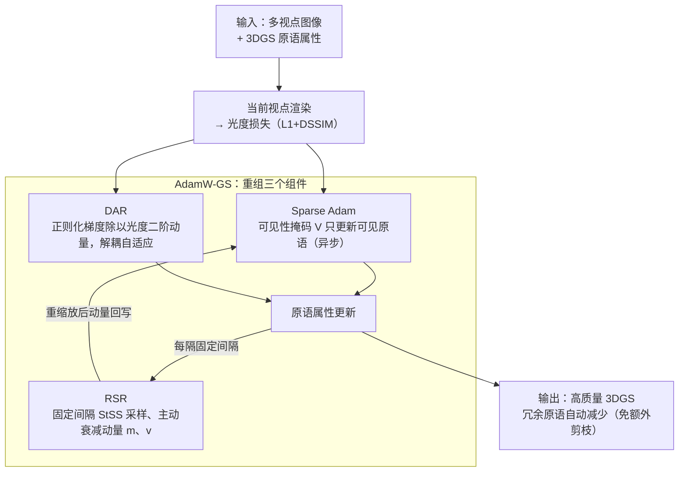

# A Step to Decouple Optimization in 3DGS

**会议**: ICLR 2026  
**arXiv**: [2601.16736](https://arxiv.org/abs/2601.16736)  
**代码**: [https://eliottdjay.github.io/adamwgs/](https://eliottdjay.github.io/adamwgs/)  
**领域**: 3D视觉  
**关键词**: 3DGS, 优化器, Adam, 权重衰减, 稀疏优化  

## 一句话总结
深入分析 3DGS 优化中被忽视的更新步耦合（不可见视点下的隐式更新和动量重缩放）和梯度耦合（正则化与光度损失在 Adam 动量中的耦合），通过解耦和重组提出 AdamW-GS 优化器，在不引入额外剪枝操作的情况下同时提升重建质量和减少冗余原语。

## 研究背景与动机

**领域现状**：3DGS 直接继承深度学习中的 Adam 优化器和同步更新策略，对所有原语（包括当前视点不可见的）同时更新。

**现有痛点**：(a) 更新步耦合：不可见视点下原语的零梯度仍会导致动量重缩放和隐式更新，影响效率和效果；(b) 梯度耦合：正则化损失与光度损失在 Adam 的自适应梯度中耦合，使正则化效果不可控——可能过强或过弱。Sparse Adam 虽提升效率但性能下降。

**核心矛盾**：3DGS 的原语优化不同于 DNN 的权重优化——每个属性有物理意义，每个原语有不同重要性，但现有优化器未考虑这些差异。

**本文目标** 理解并解耦 3DGS 中的优化耦合，设计更好的优化策略。

**切入角度**：将 Adam 在 3DGS 中的行为分解为三个组件（Sparse Adam、Re-State 正则化、解耦属性正则化），分别研究其作用后重新组合。

**核心 idea**：将 AdamW 的解耦思想引入 3DGS，用 $\nabla\mathcal{R}/\sqrt{\hat{v}}$ 形式的自适应正则化替代耦合正则化，使正则化强度根据原语的优化状态自动调整。

## 方法详解

### 整体框架
这篇论文想弄清楚一件事：3DGS 直接照搬 DNN 那套 Adam + 同步更新，到底有什么隐藏代价。作者的做法是先把 Adam 在 3DGS 里的行为拆成三块分别观察，再把有益的部分重新拼回去。第一步，用 Sparse Adam 把更新限制在当前视点可见的原语上，看看「不可见原语也被偷偷更新」这件事到底有没有用；第二步，发现 Sparse Adam 丢掉的「隐式更新」其实靠的是动量重缩放，于是用 Re-State Regularization (RSR) 主动衰减动量、把这份好处显式地补回来；第三步，用 Decoupled Attribute Regularization (DAR) 把正则化梯度从 Adam 的自适应动量里摘出来，改用光度损失自己的二阶动量来调节强度。三块都验证清楚后，重新组合成最终的 AdamW-GS：每一步渲染当前视点算光度损失，用 Sparse Adam 只更新可见原语、并由 DAR 解耦地施加正则化，每隔固定间隔再用 RSR 重缩放一次动量。

### 关键设计

**1. Sparse Adam + Re-State Regularization：把「隐式更新」从副作用里救出来**

vanilla 3DGS 对所有原语同步更新，连当前视点看不见的原语也会动——它们梯度为零，本该不变，但 Adam 的动量项 $v$ 仍在不断衰减，于是参数照样被推着走，这就是被忽视的「隐式更新」。Sparse Adam 用可见性掩码 $\mathcal{V}$ 把更新关掉，令 $\beta' = \beta \cdot \mathcal{V} + (1-\mathcal{V})$，只更新可见原语。但作者观察到，关掉之后训练虽然更稳定，探索性却不足——隐式更新虽然嘈杂，反而有利于激活正则化、移除冗余原语。RSR 的思路是：既然真正有用的是动量被重缩放（$v$ 减小）这件事，那就别靠隐式更新这个副作用，而是在固定间隔主动采样原语、直接衰减动量 $m^{new} = \alpha_1 m^{old}$、$v^{new} = \alpha_2 v^{old}$。这样既保留了动量衰减放大正则化强度的好处，又不再背负隐式更新带来的不可控扰动。

**2. Decoupled Attribute Regularization：让正则化强度随原语优化状态自适应**

3DGS 里正则化损失（opacity、scale 的 L1）和光度损失被一起塞进 Adam 的自适应梯度，导致正则化效果完全不可控——想加强时直接把 $\lambda$ 放大 10 倍，优化就直接崩溃。DAR 借鉴 AdamW 解耦权重衰减的思想，把正则化项单独拎出来，更新写成

$$\theta_{t+1} = \theta_t - \eta\left[\frac{\hat{m}'_t}{\sqrt{\hat{v}'_t}+\epsilon} + \min\left(\lambda_\theta \frac{\nabla\mathcal{R}/N_I}{\sqrt{\hat{v}'_t}+\epsilon}, \mathcal{C}_t\right)\right]$$

关键在于 $\hat{v}'_t$ 只由光度损失梯度计算，于是正则化强度被这个二阶动量自动调节：欠优化区域里光度梯度 $\nabla\ell$ 大、$\hat{v}$ 大，正则化被压小，不去干扰重建；鞍点附近 $\nabla\ell$ 小、$\hat{v}$ 小，正则化被放大，帮原语逃离。外层的 $\min(\cdot, \mathcal{C}_t)$ 再用一个 clipping 常数兜底防止过冲。这正是 AdamW-GS 比常数惩罚更适合 3DGS 的地方——不同原语重要性不同，需要的是自适应而非一刀切。

**3. AdamW-GS：把验证过的三块重新组合**

把上面三件事拼起来，就得到完整的 AdamW-GS：视点感知的异步更新（Sparse Adam）+ 周期性主动动量衰减（RSR）+ 自适应解耦正则化（DAR）。组合不是简单叠加，而是先分别确认每个组件确实带来收益、再只保留有益部分，所以最终优化器在提升重建质量的同时还顺带去掉了冗余原语，不需要额外的剪枝步骤。

### 损失函数 / 训练策略
光度损失（L1 + DSSIM）不变，正则化损失（opacity L1 + scale L1）通过 DAR 方式解耦。在 vanilla 3DGS 中还加入噪声正则化促进探索。

## 实验关键数据

### 主实验

**MipNeRF360 数据集 (vanilla 3DGS vs AdamW-GS):**

| 方法 | PSNR↑ | SSIM↑ | LPIPS↓ | 原语数(M)↓ | 冗余原语↓ |
|------|-------|-------|--------|-----------|---------|
| 3DGS (Adam) | 27.507 | 0.815 | 0.216 | 3.33 | 0.23M dead |
| 3DGS (Sparse Adam) | 27.285 | 0.809 | 0.228 | 2.53 | 0.04M dead |
| **AdamW-GS** | **27.75+** | **0.82+** | **0.20-** | **~2.5** | **极少** |

### 消融实验

| 组件 | PSNR | $\Delta N_a$ | 说明 |
|------|------|------------|------|
| MCMC 基线 | 27.948 | -3.75% | 标准 Adam |
| + Sparse Adam | 27.998 | +4.28% | 效率提升但探索减少 |
| + AIU | 28.050 | +3.62% | 人工隐式更新恢复探索 |
| + RSR | 28.017 | +0.51% | 动量衰减激活正则化 |
| + DAR (opacity+scale) | **28.27+** | - | 解耦正则化显著提升 |

### 关键发现
- Sparse Adam 更稳定但探索性不足，Adam 的隐式更新虽有副作用但有利于正则化激活
- 动量重缩放（$v$ 减小）放大了正则化的有效强度，解释了 Adam vs Sparse Adam 的行为差异
- 解耦后的正则化在不引入额外剪枝的情况下自动去除冗余原语——AdamW-GS 使 vanilla 3DGS 的 dead primitives 大幅减少
- 在 3DGS-MCMC 框架下，DAR 通过更强的正则化促进更多原语的重新分配，改善重建质量

## 亮点与洞察
- **从 DNN 优化到 3DGS 优化的深度迁移**：AdamW 在 DNN 中的思想（解耦权重衰减）被创造性地应用到 3DGS，但不是简单移植——考虑了原语的物理意义，用 $1/\sqrt{\hat{v}}$ 实现自适应而非常数惩罚
- **"隐式更新"的发现和分析**：之前被忽视的零梯度下的动量重缩放和属性更新首次被系统分析，揭示了 3DGS 中 Adam 行为的独特面
- **无需剪枝的冗余消除**：通过优化器设计而非后处理来解决冗余，是方法论层面的提升

## 局限与展望
- RSR 的采样调度 (StSS) 需要手动设定，不同场景的最优调度可能不同
- 解耦正则化的 clipping 常数 $\mathcal{C}_t$ 虽然经验上鲁棒但缺乏理论指导
- 仅在 MipNeRF360、Tanks&Temples 等标准场景验证，更大规模场景有待测试
- 对 3DGS 的各种下游扩展的适用性未全面验证

## 相关工作与启发
- **vs AdamW (Loshchilov & Hutter)**: AdamW 解耦 L2 正则化为常数衰减；AdamW-GS 进一步用 $1/\sqrt{\hat{v}}$ 实现自适应解耦，更适合 3DGS 中不同原语有不同重要性的场景
- **vs Rota Bulò et al. 2025**: 他们用常数 opacity decay 替代 reset，是 AdamW-style 的一种形式；本文指出常数惩罚不够——需要根据原语状态自适应
- **vs Sparse Adam (Mallick et al.)**: Sparse Adam 仅解决效率问题但性能下降；本文通过 RSR 和 DAR 恢复了性能的同时保持效率

## 评分
- 新颖性: ⭐⭐⭐⭐ 将优化器设计视角引入 3DGS 分析中，发现并解释了之前被忽视的耦合现象
- 实验充分度: ⭐⭐⭐⭐⭐ 双框架 (3DGS + 3DGS-MCMC) 验证，大量消融，组件逐步添加实验详尽
- 写作质量: ⭐⭐⭐⭐ 分析深入，但符号和实验变体较多，有一定阅读门槛
- 价值: ⭐⭐⭐⭐ 为 3DGS 优化提供了新的理解角度和实用的优化器改进

<!-- RELATED:START -->

## 相关论文

- [\[ICCV 2025\] 3DGS-LM: Faster Gaussian-Splatting Optimization with Levenberg-Marquardt](../../ICCV2025/3d_vision/3dgslm_faster_gaussiansplatting_optimization_with_levenbergm.md)
- [\[ICML 2026\] TideGS: Scalable Training of Over One Billion 3D Gaussian Splatting Primitives via Out-of-Core Optimization](../../ICML2026/3d_vision/tidegs_scalable_training_of_over_one_billion_3d_gaussian_splatting_primitives_vi.md)
- [\[CVPR 2026\] Ada3Drift: Adaptive Training-Time Drifting for One-Step 3D Visuomotor Robotic Manipulation](../../CVPR2026/3d_vision/ada3drift_adaptive_trainingtime_drifting_for_onest.md)
- [\[ICCV 2025\] BokehDiff: Neural Lens Blur with One-Step Diffusion](../../ICCV2025/3d_vision/bokehdiff_neural_lens_blur_with_one-step_diffusion.md)
- [\[ICLR 2026\] EgoNight: Towards Egocentric Vision Understanding at Night with a Challenging Benchmark](egonight_towards_egocentric_vision_understanding_at_night_with_a_challenging_ben.md)

<!-- RELATED:END -->
