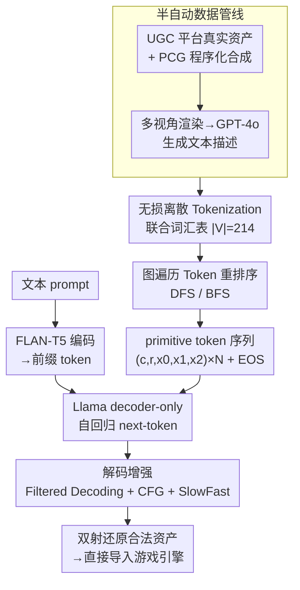

# AssetFormer: Modular 3D Assets Generation with Autoregressive Transformer

**会议**: ICLR 2026  
**arXiv**: [2602.12100](https://arxiv.org/abs/2602.12100)  
**代码**: [https://github.com/Advocate99/AssetFormer](https://github.com/Advocate99/AssetFormer)  
**领域**: LLM/NLP  
**关键词**: 3D generation, autoregressive transformer, modular assets, UGC, Llama, text-to-3D  

## 一句话总结

提出 AssetFormer，基于 Llama 架构的自回归 Transformer，将模块化 3D 资产（由 primitive 序列组成）建模为离散 token 序列，通过 DFS/BFS 图遍历重排序和联合词汇表解码实现从文本描述生成可直接用于游戏引擎的模块化 3D 资产。

## 研究动机

3D 资产生成是 UGC（用户生成内容）和游戏行业的核心需求之一。当前主流的 3D 生成方法（如基于 NeRF、3D Gaussian Splatting 或网格直接生成的方法）虽然在视觉质量上取得了长足进步，但存在几个关键问题：

1. **与现有工作流程不兼容**：生成出的 3D 内容往往是整体性的网格或隐式表示，难以直接导入游戏引擎进行编辑、拆分或重组，用户需要大量后处理工作。
2. **缺乏模块化结构**：真实游戏开发中，3D 场景和物体通常由标准化的模块化组件（如积木块）组合而成，现有方法难以生成这种结构化的资产。
3. **离散属性建模困难**：模块化资产中的每个 primitive 具有类别（class）、旋转（rotation）、位置（position）等混合属性，这些属性是离散且有结构约束的，传统的连续生成方法不擅长处理。

AssetFormer 的出发点是：**既然模块化 3D 资产本质上是一组带有离散属性的 primitive 序列，那为什么不用自然语言领域成熟的自回归 Transformer 来直接建模呢？**

## 核心问题

如何将模块化 3D 资产的生成问题转化为一个序列到序列的建模问题，使得自回归 Transformer 能够有效地从文本描述生成由离散 primitive 组成的合法 3D 资产？

## 方法详解

### 整体框架

AssetFormer 把模块化 3D 资产看作一串带离散属性的 primitive（积木块），用一个基于 Llama 的 decoder-only Transformer 自回归地把它逐 token 生成出来。一个资产由 $N$ 个 primitive 组成，第 $j$ 个记作 $P_j=(c_j, r_j, \bm{x}_j)$：类别 $c_j$（从 25 种预定义积木块里选）、绕竖直轴的旋转 $r_j$（4 个离散角度）、位置 $\bm{x}_j=(x_0,x_1,x_2)$（3D 网格上的整数坐标）。每个 primitive 因此固定占 5 个 token，整个资产摊平成长度 $5N$（外加一个 `<EOS>`）的离散序列。

整条 pipeline 分三段：先用一条半自动数据管线把"模块化资产→文本"的配对数据攒出来（模块化资产几乎没有现成标注）；再把每个资产做无损 tokenization、按空间邻接图重排序成一条规整序列；最后把文本 prompt 经 FLAN-T5 编码成前缀条件喂给 Llama backbone（1D RoPE、标准 next-token 交叉熵）逐 token 生成，生成时靠 filtered decoding 兜住合法性、CFG 提一致性、SlowFast 提速度，吐完的序列因为 tokenization 是双射可被无歧义还原成能直接导入游戏引擎的资产。

### 关键设计

**1. 半自动数据管线：补齐模块化资产缺文本标注的短板**

模块化 3D 资产的库大多被游戏工作室私有，几乎没有公开的"资产→文本"配对，这一步是整个方法能跑起来的前提。作者从一个在线 UGC 游戏平台收集真实玩家手工搭建的家园资产（高复杂度、高多样性），清洗后映射到 25 种基础 primitive；再用程序化内容生成（PCG）合成一批更规整紧凑的资产做补充，最终得到 16,000 条真实 + 4,000 条合成、平均 token 长度 >4,000 的数据集。文本标注则把每个资产从固定视角渲染成 2D 图像、交给 GPT-4o 产出短语包（如"公寓、多层、平顶、少窗"）。消融显示两种数据互补——只用合成数据 FID 高达 113.560、只用真实数据 63.381，混合反而降到 55.186：PCG 的结构性给了模型一个"脚手架"、真实数据补上多样性。

**2. 无损离散 Tokenization 与联合词汇表 Filtered Decoding：直接把属性变 token 并兜住合法性**

很多 3D 自回归方法要先训一个 VQ-VAE codebook 或图编码器（如 MeshGPT），既引入压缩损失又增加训练不稳定。AssetFormer 利用模块化资产本就离散的特性反其道而行：每种属性各维护一份有限离散词表，class / rotation / 三个坐标轴 $\mathcal{X}_0,\mathcal{X}_1,\mathcal{X}_2$ 直接由属性值映射成 token，这个映射是双射，解码出来能精确还原资产、全程无损。所有属性词表加上 `<EOS>` 拼成一个联合词汇表 $\mathcal{V}=\mathcal{C}\vee\mathcal{R}\vee\mathcal{X}_0\vee\mathcal{X}_1\vee\mathcal{X}_2\vee\{\texttt{<EOS>}\}$，本文里 $|\mathcal{V}|=25+4+59+44+81+1=214$。训练时把这串周期性 token 当普通序列做 next-token 预测即可；但推理时自由采样可能采到"不属于当前位置该出的属性"的 token——比如刚生成完一个 class，下一步本该出 rotation。于是解码时做 filtered decoding：按当前步该生成的属性类型动态屏蔽其余 token、对剩下的 logits 重归一化再采样，确保每一步只采到合法值，输出永远是可双射还原的合法序列。

**3. 图遍历 Token 重排序：用空间邻接关系决定序列顺序**

文本天然从左到右、图像逐像素，3D 资产却没有现成的序列顺序，而 primitive 排哪个在前直接影响自回归能否学好局部结构。作者按 primitive 之间的连接关系建邻接图，从资产底部一角出发用 DFS 或 BFS 遍历，得到一个排列 $\mathcal{A}=\{\tau_0,\dots,\tau_{n-1}\}$，再据此把原始 token 序列重排成 $T'=\mathrm{ReOrder}(T)$。两种遍历都能让相邻 primitive 在序列里也靠近、保证模块连通性；实验里 DFS 略优于 BFS（FID 55.186 vs 61.620），而完全不重排的 raw order 只有 65.215，专为图像 AR 设计的 token 随机化方法 RAR 反而退到 83.561——说明 3D 局部结构受不了图像那套 token 扰动，规整的空间局部顺序才利于模型抓住模块连接。重排序只改训练输入顺序、对最终渲染部署没有影响。

**4. CFG 与 SlowFast 解码增强：分别提文本一致性与生成速度**

生成阶段叠了两项从语言/扩散模型借来的技巧。其一是自回归版 Classifier-Free Guidance：训练时以 0.1 的概率随机丢弃文本条件，推理时同时算有条件 logits $l$ 和无条件 logits $l'$，再线性外推

$$l_{cfg}=l'+s\cdot(l-l')$$

引导强度 $s$（本文取 2.0）越大文本越贴合、过大压多样性。其二是 SlowFast 解码——把推测解码（speculative decoding）适配到 3D 资产生成：用一个小容量草稿模型（AssetFormer-S, 87M）快速预测简单、规律性强的 token，再让大模型（AssetFormer-B, 312M）校验并接管需要复杂空间推理的难 token，校验时同样用 filtered decoding 屏蔽非法类型；这样在几乎不掉质量、几乎不额外训练的前提下加速逐 token 解码。采样上 top-k（k=10、温度 0.7）比 greedy / beam 更平衡质量与多样性。

### 一个完整示例

给定 prompt"一栋多层平顶公寓"，模型先用 FLAN-T5 把文本编码成前缀 token 填进序列头部，然后逐 token 自回归生成第一个 primitive：第一步该出"类别"，filtered decoding 把词表里 rotation/position 的 token 全屏蔽，模型只能从 25 种 primitive 里采出比如"地板块"；下一步轮到"旋转"，词表只放行 4 个合法角度；再之后连出三个坐标 $x_0,x_1,x_2$。5 个 token 凑齐一个 primitive 后，按邻接图的 DFS 顺序走到下一个空间相邻的 primitive（如紧挨着的"墙块"），重复 class→rotation→position 的采样；其间简单规律的 token 由草稿模型快批量预测、复杂处交回大模型。直到采到 `<EOS>` 结束，整条序列因无损 tokenization 被双射还原成一栋摆好的、可在引擎里继续编辑的公寓。

## 实验关键数据

### 生成质量（与 PCG baseline 对比）

- 评测用 FID（500 张固定视角渲染图与训练集比，clean-FID）和 CLIP score（渲染图与固定 prompt"A high-quality 3D model of a building"的特征相似度）。因渲染图与自然图域差大、FID 绝对值偏高，看相对值
- top-k 采样（FID **55.186**）优于 greedy（63.351）和 beam（63.333）；PCG baseline 只有 108.476——AssetFormer 能数据驱动地覆盖从简单到复杂的资产分布，PCG 难做到且无法文本控制
- 与 SF3D / Tripo 2.0 / Trellis / Hunyuan3D 2.0 等通用 3D 生成方法相比，它们输出稠密网格、贴图常有瑕疵且难直接进引擎；AssetFormer 用 primitive 表示天然可编辑、可借 primitive-texture 映射拿到干净贴图

### 消融：Token 顺序（验证设计 3）

- DFS（FID **55.186**）> BFS（61.620）> raw order 不重排（65.215）；为图像 AR 设计的 token 随机化 RAR 反而最差（83.561）
- raw order 会生成孤立悬空的部件，印证重排序对"抓住局部结构、保证模块连通"是关键

### 消融：数据来源（验证设计 1）

- 只用真实数据 FID 63.381、只用 PCG 合成数据 113.560，两者混合骤降到 **55.186**——合成数据提供结构"脚手架"、真实数据补多样性，互补

### CFG 效果

- CFG 显著提升文本-3D 一致性；引导强度 $s$ 存在最优区间（本文取 2.0），过大压低多样性

## 亮点

1. **问题形式化巧妙**：将模块化 3D 资产生成转化为离散 token 序列建模，充分利用了大语言模型技术栈的成熟度
2. **无损 tokenization**：避免了 VQ-VAE 等方法的信息压缩损失，token 与原始属性一一对应
3. **图遍历重排序**：利用 primitive 之间的空间拓扑关系构建邻接图，通过 DFS/BFS 遍历找到更适合自回归建模的序列顺序，是一个简洁有效的设计
4. **Token Set Modeling + Filtered Decoding**：联合词汇表 + 动态过滤解码，优雅地解决了多属性类型的合法性约束问题
5. **实用导向**：生成结果可直接导入游戏引擎，对 UGC 平台和游戏开发有真实应用价值
6. **数据构建流程可复制**：GPT-4o 标注 + PCG 扩充的数据管线具有推广价值

## 局限与展望

1. **Primitive 库固定**：当前方法依赖预定义的 primitive 集合，无法生成全新类型的基本组件，限制了生成多样性
2. **纹理和材质**：论文主要关注几何结构的生成，未涉及纹理、材质、光照等视觉属性
3. **规模限制**：由于 token 序列长度与 primitive 数量成正比，超大规模的 3D 场景可能导致序列过长
4. **评估指标有限**：3D 模块化资产的评估标准尚不成熟，论文中的定量评估可能不能完全反映实际使用体验
5. **数据来源单一**：训练数据主要来自特定的 UGC 平台，可能存在风格偏差
6. **DFS vs BFS 差异较小**：虽然 DFS 略优，但两者差距不大，说明序列顺序可能不是最关键的瓶颈

## 思考与启发

- **"万物皆序列"的又一例证**：继代码生成、分子生成之后，3D 模块化资产也被成功地序列化并用自回归模型处理，表明自回归 Transformer 的范式在结构化离散数据上具有广泛的适用性
- **领域知识的融入方式**：通过图遍历排序和 filtered decoding，将 3D 资产的结构先验（空间邻接、属性类型约束）优雅地融入到通用的 Transformer 框架中，而非设计专用架构
- **与 CAD 生成的联系**：本文的方法思路与 CAD 模型生成（如 DeepCAD）有相通之处，都是用序列模型建模离散的几何操作序列；不同之处在于本文的 primitive 更加标准化
- **Classifier-Free Guidance 的通用性**：CFG 从图像扩散模型到 3D 自回归生成的成功迁移，说明这项技术在条件生成任务中具有范式级的通用价值
- **游戏行业的实际需求**：来自 LIGHTSPEED 工作室的合作背景使得这篇论文更具工程落地潜力，也表明工业界对 AI 辅助内容创建的真实需求

<!-- RELATED:START -->

## 相关论文

- [\[ICLR 2026\] QuadGPT: Native Quadrilateral Mesh Generation with Autoregressive Models](quadgpt_native_quadrilateral_mesh_generation_with_autoregressive_models.md)
- [\[CVPR 2026\] Repurposing 3D Generative Model for Autoregressive Layout Generation](../../CVPR2026/3d_vision/repurposing_3d_generative_model_for_autoregressive_layout_generation.md)
- [\[CVPR 2025\] TreeMeshGPT: Artistic Mesh Generation with Autoregressive Tree Sequencing](../../CVPR2025/3d_vision/treemeshgpt_artistic_mesh_generation_with_autoregressive_tree_sequencing.md)
- [\[CVPR 2026\] MajutsuCity: Language-driven Aesthetic-adaptive City Generation with Controllable 3D Assets and Layouts](../../CVPR2026/3d_vision/majutsucity_language-driven_aesthetic-adaptive_city_generation_with_controllable.md)
- [\[ICCV 2025\] REPARO: Compositional 3D Assets Generation with Differentiable 3D Layout Alignment](../../ICCV2025/3d_vision/reparo_compositional_3d_assets_generation_with_differentiable_3d_layout_alignmen.md)

<!-- RELATED:END -->
