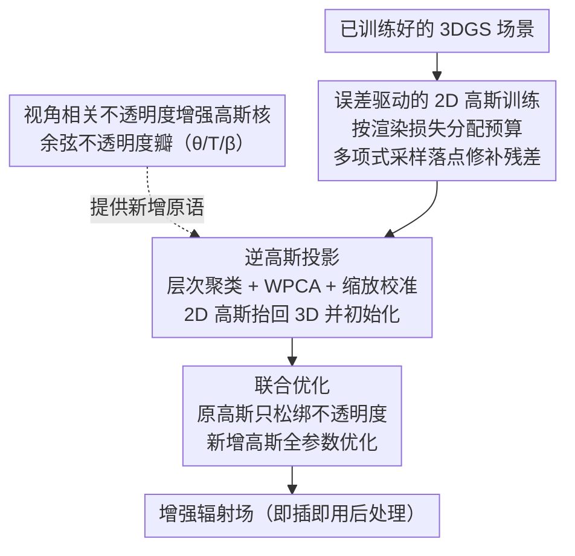

# Augmented Radiance Field: A General Framework for Enhanced Gaussian Splatting

**会议**: ICLR 2026  
**arXiv**: [2602.19916](https://arxiv.org/abs/2602.19916)  
**代码**: [https://xiaoxinyyx.github.io/augs](https://xiaoxinyyx.github.io/augs)  
**领域**: 3D视觉  
**关键词**: 3D Gaussian Splatting, 辐射场增强, 视角相关不透明度, 高光建模, 逆高斯投影  

## 一句话总结
提出增强辐射场 (Augmented Radiance Field) 框架，通过设计具有视角相关不透明度的增强高斯核来显式建模高光分量，并引入误差驱动的补偿策略（2D 高斯初始化 → 逆投影至 3D → 联合优化），作为后处理即插即用地增强现有 3DGS 场景，在多个数据集上超越 SOTA NeRF 方法，同时仅需二阶球谐即可捕获复杂光照。

## 研究背景与动机

**领域现状**：3D Gaussian Splatting (3DGS) 凭借实时渲染性能成为辐射场重建的主流方法，但其使用三阶球谐函数 (SH) 编码颜色，本质上无法分离漫反射与高光分量。

**现有痛点**：低阶 SH 只能捕获平滑颜色变化，无法再现光滑表面的尖锐高光；提高 SH 阶数导致内存指数增长、训练不稳定且收益有限（四阶 SH 仅比三阶 PSNR 提高 0.08dB）。SH 在整个球面上全局定义，而表面高斯仅在外朝向半球可见，存在严重的定义域浪费。

**核心矛盾**：高光在场景中分布稀疏且高度视角相关，给所有高斯原语都分配额外参数来建模高光会造成巨大冗余；而现有方法无法在不破坏已优化场景的前提下定向补充高光建模能力。

**本文切入角度**：借鉴 Phong 着色模型，设计视角相关不透明度的新型高斯核专门建模高光分量，通过误差驱动的补偿策略仅在重建误差大的区域自适应插入增强高斯，实现漫反射/高光的显式解耦。

**核心 idea**：用具有余弦加权不透明度瓣 (opacity lobe) 的增强高斯核叠加重建复杂高光，配合 2D→3D 逆投影初始化策略精确定位需补充的区域。

## 方法详解

### 整体框架
这篇要解决的是 3DGS 用球谐函数编码颜色、无法分离漫反射与高光的老问题，但它不去推倒原有场景，而是在一个已经训练好的 3DGS 上做后处理增强。整条流水线分三步走：先在每张渲染图的二维图像空间里、专挑误差大的地方撒一批 2D 高斯把渲染残差补回来；再把这些优化好的 2D 高斯通过逆高斯投影反投到世界坐标，作为新增 3D 高斯的初始化；最后让这批带「视角相关不透明度」的新高斯和原场景高斯一起联合优化，得到增强辐射场。这里新增的并非普通高斯，而是带「视角相关不透明度」瓣的增强高斯核——它是整个框架要插入的新原语，专门负责高光分量。因为只是在原场景上叠加增强高斯，这套流程能即插即用地挂在任何基于 splatting 的框架后面。

### 关键设计

**1. 视角相关不透明度：让一个高斯核只在特定视角下「亮」起来**

高光的麻烦在于它分布稀疏又高度视角相关——给所有高斯都加参数去建模高光是巨大的冗余。本文借鉴 Phong 着色，给增强高斯设计了一个会随视角衰减的不透明度瓣 (opacity lobe)：$\hat{\alpha}(\theta,\beta,T,\alpha)=\alpha\cdot\left(\frac{\cos(\max(0,\min(\theta/T,\pi)))+1}{2}\right)^{\exp(\beta)}$，其中 $\theta$ 是当前视角方向与瓣中心方向的夹角，$T$ 控制瓣的角跨度，$\beta$ 控制锐度。这里用半周期余弦函数而非原始 Phong 的尖瓣，是因为它尾部更长、衰减更平滑，训练时梯度更稳定。关键性质是：当视角偏离瓣方向时不透明度会衰减到零，于是一个增强高斯只在它该负责的那个高光视角下起作用，补这个方向的高光不会污染其他视角——而代价仅是每个核多 5 个可学习参数（3D 瓣方向 + $T$ + $\beta$）。

**2. 误差驱动的 2D 高斯训练：把有限的增强预算只花在重建得最差的地方**

要做到「定向补高光」，先得知道哪里没建好。标准 3DGS 训练完成后，本文在每张渲染图上叠加额外的 2D 高斯，把当前渲染结果当作固定背景去优化这些 2D 高斯，让它们专门修补残差。预算分配是误差驱动的：每个视角分到的新高斯数量正比于该视角的渲染损失，而在单张图内，新高斯的落点由多项式采样决定，某像素被选中的概率正比于其像素级复合损失（L1 + SSIM）的平方——误差越大的像素越容易吸引增强高斯。为了后续反投影时拿到准确的几何，深度图用光线追踪渲染，取透射率首次低于 0.5 时的中位深度，比常用的期望深度在几何上更精确。

**3. 逆高斯投影：把二维的修补结果精确地「抬」回三维**

2D 高斯只活在图像平面上，要变成能参与场景的 3D 高斯，需要一个可靠的反投影。本文用三步完成：先通过层次聚类把前景/背景的点分组，避免在物体边界处把两侧深度混在一起；再用加权 PCA (WPCA) 从局部点云估出每个 3D 高斯的旋转和尺度；最后通过最小化 Frobenius 范数校准一个缩放系数 $k$，让反投出来的 3D 协方差与原 2D 高斯在图像上的投影尽量一致。新高斯的语义参数也在这一步给出合理初值：不透明度瓣方向初始化为从高斯质心指向相机的单位向量（即先假设它负责当前这个观测视角的高光），$T$ 按周围训练视角的密度自适应初始化，$\beta$ 零初始化交给优化去学。

**4. 联合优化：补高光的同时不破坏已经调好的场景**

新高斯插进来后要和原场景协同，但又不能让原场景被带偏。本文的做法是对原始高斯只「松绑」不透明度这一个参数、冻结其余所有属性，而新增高斯则全参数优化；实现上用 SparseAdam 只更新可见原始高斯的不透明度，用 Adam 优化新增高斯。迭代次数设为训练集大小的 30 倍，保证每个新增高斯被采样到的次数大致相同，避免少数视角的增强高斯训练不足。

### 一个完整示例
以 Mip-NeRF 360 里一个带光滑反光表面的场景为例：标准 3DGS 训练完后，某些视角下金属/玻璃表面的尖锐高光仍渲染不出来，这些视角的渲染损失偏高，于是分到更多 2D 高斯预算；在这些视角图内，高光像素因复合损失大、被多项式采样高概率选中，2D 高斯就落在高光斑上并以渲染图为背景优化到位。随后这些 2D 高斯被逆投影回 3D——层次聚类把反光表面点和背景分开，WPCA 给出它们的朝向与尺度，瓣方向初始化为指向当前相机，于是新增的 3D 增强高斯天然就「面朝」产生高光的那个视角。进入联合优化后，原场景高斯只微调不透明度，新增高斯学到合适的 $T$、$\beta$，最终在该高光视角下被点亮、在其他视角下衰减为零，把这块高光补上而不影响别处。最终全场约 10% 的增强高斯就足以覆盖稀疏分布的高光。

## 实验关键数据

### 主实验（四大数据集）

| 方法 | Mip-NeRF360 PSNR↑ | SSIM↑ | Tanks&Temples PSNR↑ | Deep Blending PSNR↑ | NeRF Synthetic PSNR↑ |
|------|-------------------|-------|---------------------|--------------------|--------------------|
| 3DGS | 27.21 | 0.815 | 23.14 | 29.41 | 33.31 |
| Zip-NeRF | 28.54 | 0.828 | - | - | 33.10 |
| 3DGS-MCMC | 28.29 | 0.840 | 24.29 | 29.67 | 33.80 |
| DBS (30k) | 28.60 | 0.844 | 24.79 | 30.10 | 34.64 |
| **Ours (MCMC, sh=2)** | **28.89** | **0.848** | **25.04** | **30.33** | 34.03 |
| **Ours (MCMC, sh=3)** | **28.96** | **0.849** | **25.06** | **30.22** | 34.35 |

- 在 MCMC 框架下，仅用二阶 SH（每原语减少 21 个参数）即可达到与三阶 SH 相当的渲染质量
- 在真实世界数据集上全面超越 SOTA 隐式方法 Zip-NeRF 和显式方法 DBS
- 在 NeRF Synthetic 上略逊于 DBS，因合成场景材质简单、光照变化有限

### 消融实验（Mip-NeRF 360）

| 配置 | PSNR↑ | SSIM↑ |
|------|-------|-------|
| 3DGS-MCMC 基线 | 28.33 | 0.845 |
| + 补充高斯但无 opacity lobe | 28.45 | 0.847 |
| + 固定 T=0.5 的视角相关不透明度 | 28.60 | 0.848 |
| + 固定 β=0 | 28.93 | 0.849 |
| **完整模型** | **28.96** | **0.849** |

- 无 opacity lobe 仅提升 0.12dB，说明单纯增加高斯数量收益有限
- 优化 $T$ 和 $\beta$ 参数带来显著增益，完整模型比基线提升 0.63dB

### 增强高斯比例实验

| 比例 | 增强后 PSNR (Mip-NeRF 360) | 增强后 PSNR (Tanks&Temples) |
|------|---------------------------|---------------------------|
| 5% | 28.88 | 24.95 |
| **10%** | **28.96** | **25.06** |
| 15% | 28.94 | 24.99 |

- 10% 比例为最优，过多增强高斯反而引入冗余

### 高频光照场景对比

| 方法 | Glossy 表面 PSNR↑ | Mirror-like 表面 PSNR↑ |
|------|------------------|----------------------|
| DBS (sb=2) | 41.70 | 29.48 |
| **Ours (MCMC, sh=3)** | **42.33** | **29.73** |

- 在高频光照和镜面条件下，opacity lobe 叠加的灵活性优于 Spherical Beta 函数

## 亮点与洞察
- **漫反射/高光解耦的新范式**：不修改渲染方程、不引入环境贴图，仅通过不同类型的高斯原语分别建模漫反射和高光，思路简洁且可扩展。分离协议为 $I_d = \min(I_{sh_0}, I_{aug})$，$I_s = I_{aug} - I_d$
- **后处理增强的即插即用设计**：作为已优化 3DGS 场景的后处理步骤，无需重新训练整个场景，可与 3DGS、3DGS-MCMC 等多种框架兼容
- **逆投影的工程细节**：层次聚类处理前景/背景分离、WPCA 确定旋转、Frobenius 范数校准缩放的三步流程，为 2D→3D 反投影提供了完整的技术方案
- **参数效率**：仅用二阶 SH 即可超越 SOTA，每原语节省 21 个参数，有利于低端硬件部署

## 局限与展望
- 在 NeRF Synthetic 等简单合成场景上表现略逊于 DBS，因材质和光照变化有限难以发挥 opacity lobe 叠加优势
- 训练数据使用 sRGB 色彩空间（非线性），过曝像素会导致漫反射/高光分离出现伪影
- 增强高斯的比例固定为 10%，缺乏对场景复杂度的自适应调整机制
- 逆投影的层次聚类和 WPCA 在 CPU 上执行，对于大规模场景可能成为瓶颈
- 仅在静态场景验证，动态场景扩展尚未探索

## 相关工作与启发
- **vs 3DGS**: 原始 3DGS 用 SH 编码颜色无法分离漫反射/高光；本文用增强高斯核显式建模高光，PSNR 提升 1.75dB (Mip-NeRF 360)
- **vs Zip-NeRF**: 作为 SOTA 隐式方法 Zip-NeRF 在 Mip-NeRF 360 上 28.54 PSNR；本文 28.96 PSNR 同时保持实时渲染
- **vs DBS (Spherical Beta)**: DBS 用球面 Beta 函数替代 SH 实现解耦建模，但在复杂高光场景灵活性不足；本文 opacity lobe 可叠加形成任意复杂的高光分布
- **vs Spec-Gaussian**: Spec-Gaussian 用各向异性球面高斯建模外观（Mip-NeRF 360 PSNR 28.18）；本文通过误差驱动定向补充而非全局替换，在保持效率的同时取得更好效果 (28.96)
- **vs VoD-3DGS**: VoD-3DGS 增强每个高斯的不透明度表示（symmetric matrix），本文仅在需要的区域插入少量增强高斯，更参数高效

## 评分
- 新颖性: ⭐⭐⭐⭐ 视角相关不透明度的设计简洁有效，逆投影初始化策略新颖；但核心思想本质上是 Phong 模型的变体
- 实验充分度: ⭐⭐⭐⭐ 四大标准数据集 + 高光合成数据集 + 详尽消融，但缺少与更多最新方法的对比
- 写作质量: ⭐⭐⭐⭐ 数学推导清晰，流程图信息量大，但部分公式推导需看附录
- 价值: ⭐⭐⭐⭐ 后处理即插即用的设计有很强的实用价值，为 3DGS 高光建模提供了简洁的解决方案

<!-- RELATED:START -->

## 相关论文

- [\[ICLR 2026\] Station2Radar: Query-Conditioned Gaussian Splatting for Precipitation Field](station2radar_query_conditioned_gaussian_splatting_for_precipitation_field.md)
- [\[CVPR 2025\] 3D Convex Splatting: Radiance Field Rendering with 3D Smooth Convexes](../../CVPR2025/3d_vision/3d_convex_splatting_radiance_field_rendering_with_3d_smooth_convexes.md)
- [\[ICLR 2026\] Einstein Fields: A Neural Perspective To Computational General Relativity](einstein_fields_a_neural_perspective_to_computational_general_relativity.md)
- [\[ICLR 2026\] MoE-GS: Mixture of Experts for Dynamic Gaussian Splatting](moe-gs_mixture_of_experts_for_dynamic_gaussian_splatting.md)
- [\[CVPR 2026\] Neural Gabor Splatting: Enhanced Gaussian Splatting with Neural Gabor for High-frequency Surface Reconstruction](../../CVPR2026/3d_vision/neural_gabor_splatting.md)

<!-- RELATED:END -->
