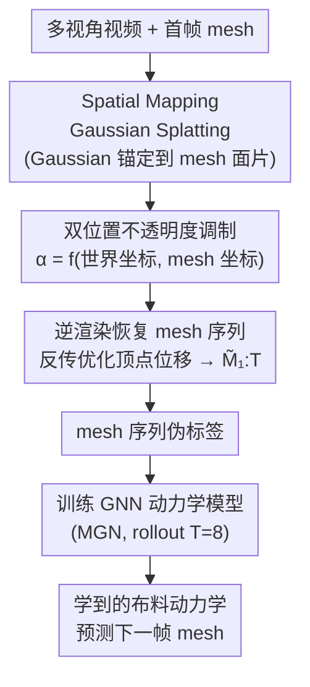

# CloDS: Visual-Only Unsupervised Cloth Dynamics Learning in Unknown Conditions

**会议**: ICLR 2026  
**arXiv**: [2602.01844](https://arxiv.org/abs/2602.01844)  
**代码**: [https://github.com/whynot-zyl/CloDS](https://github.com/whynot-zyl/CloDS)  
**领域**: 3D视觉  
**关键词**: 布料动力学, 无监督学习, 高斯溅射, 可微渲染, 直觉物理

## 一句话总结
CloDS 提出首个从多视角视频中无监督学习布料动力学的框架，通过 Spatial Mapping Gaussian Splatting 建立 2D 图像到 3D 网格的可微映射，结合双位置不透明度调制解决自遮挡问题，使 GNN 在无物理参数监督下就能学到接近全监督水平的布料动力学。

## 研究背景与动机

**领域现状**：深度学习在模拟动态系统（流体、布料、多体动力学）方面取得了显著进展，但现有方法严重依赖已知物理属性作为监督信号（如粒子位置、网格节点坐标等）。

**现有痛点**：
   - 真实场景中物理属性（材料参数、环境条件）往往未知，限制了方法的实用性
   - 直觉物理方法（从视觉学动力学）主要针对刚体交互，对连续介质力学（尤其是布料）效果差
   - 动态场景新视角合成方法无法泛化到未见帧；视频预测方法在频繁自遮挡下难以维护时序一致性

**核心矛盾**：布料具有无穷维状态空间、复杂自遮挡和大非线性变形，现有的粒子表示（如 NeuroFluid）不适合布料的薄片结构，而直接用 mesh-based Gaussian Splatting 又会因为自遮挡产生透视失真

**本文目标**
   - 定义并解决 Cloth Dynamics Grounding（CDG）问题：从多视角视频无监督学习布料动力学
   - 设计可微的 2D↔3D 映射，使得 GNN 动力学模型可以用像素级损失训练
   - 解决大变形 + 强自遮挡下的渲染失真问题

**切入角度**：将问题分解为三个概率模型的联合学习——渲染 $p(Y_t|M_t)$、逆渲染 $p(M_t|Y_{1:t})$ 和动力学转移 $p(M_{t+1}|M_t)$，通过 Differentiable Visual Computing（DVC）框架将三者串联。

**核心 idea**：用 mesh-based Gaussian Splatting + 双位置不透明度调制建立可微的时序一致 2D-3D 映射，从视频中反演出 3D mesh 序列作为动力学学习的伪标签。

## 方法详解

### 整体框架
CloDS 要解决的问题是：**只给多视角视频、没有任何物理参数监督，怎么学到布料的动力学**。它的思路是先想办法从视频里把每一帧的 3D mesh 反演出来当伪标签，再用这串 mesh 序列去训练动力学模型——这样整条链路就绕开了对真实物理标注的依赖。具体分三段走：第一段以首帧 mesh + 多视角图像为起点，把一组 Gaussian 组件锚定到 mesh 表面，建立一座 2D 图像与 3D mesh 之间可微的桥（SMGS + 双位置不透明度调制）；第二段反过来用这座桥做逆渲染，靠反向传播逐帧优化顶点位移，恢复出整段 mesh 序列 $\tilde{M}_{1:T}$；第三段把恢复出的 mesh 序列当伪标签，训练一个 GNN 动力学模型去预测 $M_{t+1}\mid M_t$。

### 关键设计

**1. Spatial Mapping Gaussian Splatting（SMGS）：把 Gaussian 锚到 mesh 上，建立时序一致的 2D↔3D 可微映射**

要让 GNN 用像素损失训练，前提是有一座能反向传播的桥，把 3D mesh 的形变和它在图像里的样子连起来。SMGS 的做法是把每个 Gaussian 组件锚定在 mesh 的某个三角面片上：Gaussian 中心由该面片三个顶点的重心坐标插值确定，$\mu_t = \beta_1 X_{t,1}^W + \beta_2 X_{t,2}^W + \beta_3 X_{t,3}^W$；旋转矩阵由面法向量经 Gram-Schmidt 正交化得到，缩放则由边长决定。这样一来，mesh 一旦变形，所有 Gaussian 只要沿用同一组 $\beta$ 系数、代入新的顶点位置就能自动跟着动，整套映射对顶点位置可微。SMGS 沿用了 GaMeS 的 mesh-Gaussian 绑定思路，但 GaMeS 在大变形、强自遮挡下会塌掉，于是 SMGS 补上了下面的不透明度调制。

**2. 双位置不透明度调制（Dual-Position Opacity Modulation）：用世界坐标和 mesh 坐标一起算不透明度，治自遮挡**

布料反复折叠时会大面积自遮挡，而 GaMeS 在运动中根本不调整不透明度，遮挡区域的权重分配就错了，渲出来透视失真。这里改成让每个 Gaussian 的不透明度由一个 MLP $f_\theta$ 动态给出，同时吃进两套坐标：

$$\alpha_{i,t} = f_\theta\bigl(\mu_{i,t}^W,\ \mu_{i,t}^M\bigr)$$

世界坐标 $\mu^W$ 是相对位置，负责在多层布料重叠时把权重正确分给前后片，从而消掉透视失真；mesh 坐标 $\mu^M$ 是布料自身的绝对位置，负责在布料移动到此前没见过的区域时仍保住不透明度，不至于凭空变透明。单看一套都不够——只用世界坐标，布料一进新区域就透了；不用世界坐标，重叠处就糊了——两套合起来才能同时压住这两类错误。

**3. 逆渲染恢复 3D 标签：用反向传播从视频里反演出 mesh 序列当伪标签**

有了可微的 SMGS 映射，就能反过来从图像里把 3D mesh 抠出来，这一步是整个无监督方案的关键：它替代了物理模拟器，免去任何 3D mesh 标注。给定当前帧的 mesh $M_t$，优化每个顶点的世界坐标位移 $\Delta x_t^W$，让 SMGS 渲出的下一帧 $\tilde{I}_{t+1}$ 去对齐真实图像 $Y_{t+1}$；从首帧 mesh 出发递归地做下去，就能恢复整段序列 $\tilde{M}_{1:T}$。这串恢复出来的 mesh 序列就是阶段三训练 GNN 动力学模型所需的伪标签，全程只用到多视角视频。

### 损失函数 / 训练策略
- **阶段1**（Gaussian构建）：标准 3DGS 损失 $\mathcal{L}_{render} = (1-\lambda)\mathcal{L}_1 + \lambda\mathcal{L}_{D-SSIM}$，$\lambda=0.2$
- **阶段2**（mesh恢复）：$\mathcal{L}_{geometry} = \mathcal{L}_1(\text{SMGS}(\tilde{x}_{t+1}^W), Y_{t+1}) + \gamma\mathcal{L}_{edge}$，其中边损失保持节点间距离不变防止过度变形
- **阶段3**（动力学训练）：$\mathcal{L}_{node} = \sum_{t=1}^T \text{MSE}(\hat{x}_t^W, x_t^W)$，rollout 长度 $T=8$

## 实验关键数据

### 主实验（布料动力学学习 - RMSE）

| 方法 | 监督 | Viewed 插值 | Viewed 外推 | Unviewed 插值 | Unviewed 外推 |
|------|------|------------|-----------|-------------|-------------|
| MGN | 全部 mesh | 0.1286 | 0.1291 | 0.1358 | 0.1314 |
| MGN* | 50条 mesh | 0.1380 | 0.1388 | 0.1460 | 0.1362 |
| CloDS | 50mesh+50video | 0.1321 | 0.1344 | 0.1399 | 0.1339 |
| CloDS** | 全部 video | 0.1294 | 0.1307 | 0.1388 | 0.1325 |

### 动态场景新视角合成

| 模型 | PSNR↑ | SSIM×10↑ | LPIPS×1000↓ |
|------|-------|---------|------------|
| 4DGS | 23.21 | 9.718 | 15.82 |
| GaMeS | 33.02 | 9.937 | 5.21 |
| **SMGS (ours)** | **36.24** | **9.959** | **3.53** |
| 3DGS (上界) | 39.63 | 9.986 | 2.53 |

### 关键发现
- **CloDS 从视频学到的动力学接近全监督水平**：CloDS** 用全部视频训练后 RMSE 与用全部 mesh 训练的 MGN 非常接近（差距<5%），证明无监督方案可行
- **SMGS 大幅优于基线渲染方法**：PSNR 比 GaMeS 高 3.2dB，比 4DGS 高 13dB
- **双位置不透明度调制缺一不可**：去掉世界坐标→透视失真；去掉 mesh 坐标→移动区域变透明
- **泛化能力强**：在未见初始状态的布料上，CloDS 的外推 RMSE 仅比 viewed 高 ~1%

## 亮点与洞察
- **将DVC框架引入布料动力学是很有远见的工作**：建立了 渲染→逆渲染→动力学 的完整闭环，使得只需首帧 mesh + 多视角视频就能学到物理动力学。这个范式可以迁移到任何需要从视觉观测学习物理模型的场景。
- **双位置不透明度调制简单但关键**：仅通过一个 MLP 同时接收世界坐标和 mesh 坐标来调制不透明度，就解决了自遮挡下的渲染失真。设计非常精巧，计算开销小。
- **三阶段训练的解耦设计很实用**：阶段1和2不需要时序损失（单步训练），只有阶段3用 rollout。这使得前两阶段可以并行，大幅降低训练复杂度。

## 局限与展望
- 仅在 Blender 合成数据集上验证，真实场景中的噪声、光照变化、多物体交互未被充分测试
- mesh 的初始估计需要首帧的 mesh 作为先验，这在真实场景中可能不可用
- GNN 动力学模型（MGN）固定选择，未探索更强的动力学模型（如 Transformer-based）
- 仅处理单块布料，未考虑布料与其他物体的交互（如穿衣）
- 数据集中布料轨迹相对简单（flag），更复杂的场景（如衣服折叠）可能需要更多训练数据

## 相关工作与启发
- **vs NeuroFluid**: NeuroFluid 用粒子表示+可微渲染学流体动力学，但粒子不适合布料的薄片结构；CloDS 采用 mesh 表示更适合布料
- **vs GaMeS**: 同为 mesh-based Gaussian Splatting，但 GaMeS 不处理运动中的不透明度变化，导致遮挡区域渲染错误
- **vs 4DGS/M5D-GS**: 4D 动态场景方法在大变形场景下表现差，且不学习可泛化的动力学模型

## 评分
- 新颖性: ⭐⭐⭐⭐⭐ 首创CDG问题和相应的解决框架，双位置不透明度调制是创新点
- 实验充分度: ⭐⭐⭐⭐ 多个任务评测全面，但仅在合成数据上验证
- 写作质量: ⭐⭐⭐⭐ 数学建模清晰，但符号略多
- 价值: ⭐⭐⭐⭐ 开辟了从视觉学布料动力学的新方向，可迁移到机器人抓取等场景

<!-- RELATED:START -->

## 相关论文

- [\[CVPR 2026\] Zero-Shot Reconstruction of Animatable 3D Avatars with Cloth Dynamics from a Single Image](../../CVPR2026/3d_vision/zero-shot_reconstruction_of_animatable_3d_avatars_with_cloth_dynamics_from_a_sin.md)
- [\[ICLR 2026\] Learning Physics-Grounded 4D Dynamics with Neural Gaussian Force Fields](learning_physics-grounded_4d_dynamics_with_neural_gaussian_force_fields.md)
- [\[ICLR 2026\] Peering into the Unknown: Active View Selection with Neural Uncertainty Maps for 3D Reconstruction](peering_into_the_unknown_active_view_selection_with_neural_uncertainty_maps_for_.md)
- [\[CVPR 2026\] UZ3DVG: Unaided Zero-Shot 3D Visual Grounding with Generated Language Conditions](../../CVPR2026/3d_vision/uz3dvg_unaided_zero-shot_3d_visual_grounding_with_generated_language_conditions.md)
- [\[CVPR 2026\] OpenVO: Open-World Visual Odometry with Temporal Dynamics Awareness](../../CVPR2026/3d_vision/openvo_open-world_visual_odometry_with_temporal_dynamics_awareness.md)

<!-- RELATED:END -->
