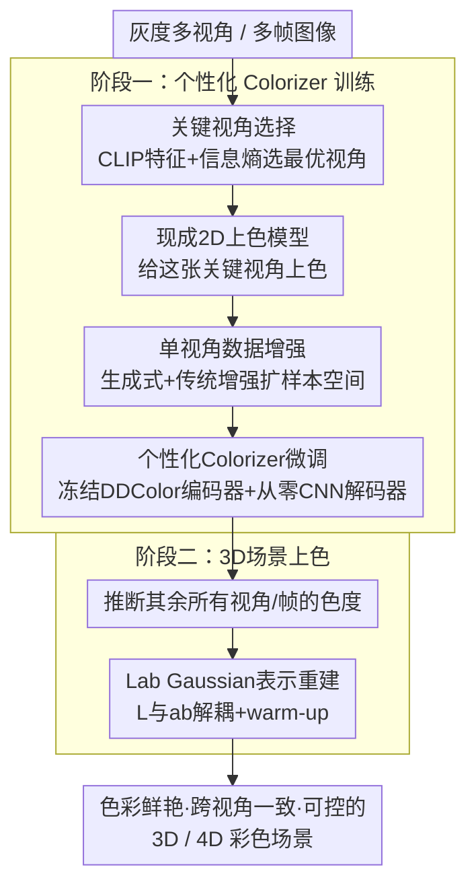

# Color3D: Controllable and Consistent 3D Colorization with Personalized Colorizer

**会议**: ICLR 2026  
**arXiv**: [2510.10152](https://arxiv.org/abs/2510.10152)  
**代码**: [https://yecongwan.github.io/Color3D/](https://yecongwan.github.io/Color3D/) (Project Page)  
**领域**: 3D视觉 / 图像生成  
**关键词**: 3D上色, 高斯溅射, 个性化微调, Lab颜色空间, 视觉一致性

## 一句话总结
Color3D 提出"只上色一张关键视角→微调个性化 colorizer→传播颜色到所有视角和时间步"的范式，将复杂的 3D 上色问题转化为单图上色+颜色传播问题，在静态和动态 3D 场景上都实现了丰富色彩、跨视角一致性和用户可控性的统一。

## 研究背景与动机

**领域现状**：3DGS/NeRF 实现了高质量新视角合成，但从灰度输入重建彩色 3D 场景仍是挑战。2D 图像上色已很成熟（支持语言引导、参考图引导、自动上色），但直接多视角上色会导致严重的跨视角颜色不一致。

**现有痛点**：
   - 现有 3D 上色方法（ChromaDistill、ColorNeRF）通过平均多视角颜色变化来强制一致性，但这会稀释调色板丰富度，产生去饱和、色调平坦的结果
   - 平滑颜色变化使结果不可预测，牺牲了用户可控性
   - 现有方法仅处理静态场景，动态场景的可控上色完全未探索

**核心矛盾**：多视角一致性 vs 颜色丰富度 vs 可控性 三者之间的trade-off——平均策略保证一致性但牺牲后两者

**本文目标**
   - 统一静态和动态 3D 场景的可控上色
   - 在保证跨视角/跨时间一致性的同时保持颜色丰富度
   - 支持任意 2D 上色模型的即插即用集成

**切入角度**：核心洞察——只需上色一张关键视角，然后微调一个场景特定的 colorizer 学习该视角下的确定性颜色映射。通过 colorizer 内在的归纳偏差，相同内容在不同视角下会被映射到相同颜色。

**核心 idea**：将 3D 上色简化为"单图上色 + 个性化 colorizer 颜色传播"，通过学习场景特定的一对一颜色映射来天然保证跨视角和跨时间一致性。

## 方法详解

### 整体框架
Color3D 要解决的是：一组灰度的多视角（或多帧）图像，如何重建出一个色彩鲜艳、跨视角又一致、还能让用户控制的彩色 3D 场景。它的做法是把这个 3D 难题拆成两个阶段。第一阶段（个性化 Colorizer 训练）先只挑一张信息量最大的关键视角，用任意现成的 2D 上色模型把它上好色，再围绕这一张彩色图做单视角数据增强、微调出一个"场景专属"的个性化 colorizer，让它学会这个场景下一对一的确定性颜色映射。第二阶段（3D 场景上色）就用这个 colorizer 把颜色推断到其余所有视角和时间帧上，再用 Lab Gaussian 表示把这些彩色视图重建成完整的彩色 3D 场景。一致性之所以天然成立，是因为同样的内容经过同一个确定性 colorizer 总会被映射到同样的颜色。

### 关键设计

**1. 关键视角选择：让唯一被上色的那张图覆盖尽量多的场景内容**

整个范式只手工上色一张图，所以这张图选得好不好直接决定 colorizer 能否泛化——如果它只覆盖了场景的一小角，colorizer 遇到没见过的内容就无能为力。Color3D 用 CLIP 提取每个视角的特征，算出视角两两之间的余弦相似度矩阵，再对每个视角算一个信息熵 $H(I_i) = -\sum_j P_{ij} \log P_{ij}$，最后选熵最大的那一张 $I^* = \arg\max H(I_i)$。熵大意味着这张图和其余所有视角的关联都比较均匀，也就意味着它包含的视觉信息最广、最多样，最适合当那张"种子"彩色图。

**2. 单视角数据增强：用一张彩色图撑起一个能训练的样本空间**

只有一张图去微调 colorizer 会严重过拟合，所以需要把这张关键视角扩成一批多样的训练样本。Color3D 把生成式增强和传统增强结合起来：生成式部分包括 Outpainting（把图按 2×2 网格切开，再用 SD 向外扩展各区域）、Image-to-Video（用 SVD 生成连续视频帧，模拟运动和新物体出现）、以及 Novel View（用 Stable Virtual Camera 生成绕场景的轨道视角）；传统部分则是旋转、翻转、网格打乱、弹性变换。这里有个关键的宽松假设：增强生成出来的内容并不要求和真实场景完全一致，只要它们保持一致的色彩风格就行——colorizer 要学的是"这个场景该用什么颜色"，而不是几何上的逐像素重建。

**3. 个性化 Colorizer 架构与训练：保留语义能力，但去掉会引入不一致的颜色先验**

这是范式能成立的核心。Color3D 冻结 DDColor 的编码器，保留它强大的高层语义颜色特征提取能力，在上面加一个可训练的 adapter 来适配当前场景，但解码器是从零初始化的轻量 CNN。之所以不用预训练解码器，是因为预训练解码器自带一套通用的颜色先验，正是它让同样内容在不同视角下被上成不同颜色——它是多视角不一致的主要来源。从零训练的解码器则像一块"干净的白板"，只学当前这个场景的颜色映射。训练目标也很简单，只用一个 L1 损失对齐预测和关键视角的真值色度：$\mathcal{L} = \|P^{ab} - G^{ab}\|_1$。

**4. Lab Gaussian 表示：把亮度和色度解耦，用已知的亮度稳住几何**

最后一步是把推断好颜色的多视角图重建成 3D 场景。Color3D 没有在 RGB 空间做，而是把 3DGS 的三组 SH 系数从 RGB 换成 CIE Lab 的 $\{SH_L, SH_a, SH_b\}$，L 通道和 ab 通道分开优化。这样做的好处是亮度 L 在输入里本来就是已知的（灰度图就是亮度），能提供一个稳定的结构约束信号，降低色度预测噪声对优化的干扰。具体上，L 通道额外加一项边缘损失 $\mathcal{L}_{edge}$ 来保住结构细节，ab 通道只用 L1+D-SSIM；训练还分两段走：前半段三组 SH 系数全部用来表示 L 通道做 warm-up，先把几何学扎实，后半段才腾出两组给 ab 通道学颜色。

### 损失函数 / 训练策略
- **Colorizer**: $\mathcal{L}_{colorizer} = \|P^{ab} - G^{ab}\|_1$
- **L 通道**: $\mathcal{L}_l = (1-\beta)\mathcal{L}_1 + \beta\mathcal{L}_{D-SSIM} + \mathcal{L}_{edge}$
- **ab 通道**: $\mathcal{L}_{ab} = (1-\beta)\mathcal{L}_1 + \beta\mathcal{L}_{D-SSIM}$, $\beta=0.2$
- **Warm-up**: 前 50% 迭代只优化 L 通道学结构，后 50% 加入 ab 通道学颜色

## 实验关键数据

### 主实验（DL3DV-140 静态场景，自动上色）

| 方法 | FID↓ | Colorful↑ | ME↓ | TC↓ |
|------|------|----------|-----|-----|
| 3DGS+ImageColorizer | 63.56 | 28.15 | 0.146 | 0.038 |
| 3DGS+VideoColorizer | 77.89 | 22.38 | 0.128 | 0.031 |
| **Color3D (Ours)** | **37.48** | **32.65** | **0.084** | **0.017** |

### 消融实验（关键组件贡献）

| 配置 | FID↓ | Colorful↑ | ME↓ | TC↓ |
|------|------|----------|-----|-----|
| Full Color3D | 37.48 | 32.65 | 0.084 | 0.017 |
| w/o 个性化微调 | ~63 | ~28 | ~0.15 | ~0.04 |
| w/o 数据增强 | ~45 | ~30 | ~0.10 | ~0.02 |
| w/o Lab Gaussian | ~42 | ~31 | ~0.09 | ~0.02 |

### 关键发现
- **FID 大幅下降**：Color3D 在 DL3DV-140 上 FID 仅 37.48，比直接用图像上色器（63.56）低 40%+
- **色彩丰富度更高**：Colorful 分数 32.65 vs 28.15/22.38，证明个性化 colorizer 没有稀释颜色
- **一致性大幅提升**：ME（多视角误差）和 TC（时间一致性）显著优于所有基线
- **支持多种控制模式**：语言引导、自动推断、参考图引导均可工作

## 亮点与洞察
- **将 3D 上色简化为单图问题的范式转换极为巧妙**：避免了在 3D 空间中直接处理颜色一致性的复杂性。只要一张图的颜色是对的，个性化 colorizer 就能自然传播到所有视角。这让任何 2D 上色方法都能即插即用地用于 3D 上色。
- **"冻结编码器+从零解码器"的设计哲学值得借鉴**：预训练编码器提供语义理解，从零解码器避免引入不一致的颜色先验。这种"保留能力但移除偏见"的策略在很多迁移学习场景中适用。
- **Lab 空间解耦 + Warm-up 策略很实用**：先学结构再学颜色，避免颜色噪声干扰几何优化。

## 局限与展望
- 每个场景都需要微调一个 colorizer（~30min），无法零样本泛化到新场景
- 关键视角选择依赖 CLIP 特征的信息熵启发式，可能不是最优的
- 生成式增强（outpainting、SVD）引入的颜色可能与场景不完全一致
- 极端视角变化（如 360° 全景场景）下，一张关键视角可能覆盖不够
- 动态场景中快速运动导致的运动模糊可能影响上色质量

## 相关工作与启发
- **vs ColorNeRF**: ColorNeRF 在 NeRF 中注入颜色但通过平均来保证一致性 → 颜色变淡；Color3D 通过学习确定性映射保持鲜艳
- **vs ChromaDistill**: 蒸馏策略同样会稀释颜色多样性；Color3D 只依赖单视角的颜色信息
- **vs 3DGS+ImageColorizer（naive baseline）**: 直接逐帧上色→严重不一致；Color3D 的个性化传播方案将 FID 降低 40%+

## 评分
- 新颖性: ⭐⭐⭐⭐⭐ 范式转换——将 3D 上色简化为单图上色+颜色传播，思路极其优雅
- 实验充分度: ⭐⭐⭐⭐⭐ 140个静态场景+动态场景，三种控制模式，大量消融
- 写作质量: ⭐⭐⭐⭐⭐ 动机清晰，方法图设计精美，逻辑链完整
- 价值: ⭐⭐⭐⭐ 实用性强，统一了静态/动态场景的可控上色，文化遗产保护等应用场景广阔

<!-- RELATED:START -->

## 相关论文

- [\[CVPR 2025\] Ctrl-D: Controllable Dynamic 3D Scene Editing with Personalized 2D Diffusion](../../CVPR2025/3d_vision/ctrl-d_controllable_dynamic_3d_scene_editing_with_personalized_2d_diffusion.md)
- [\[ICLR 2026\] One2Scene: Geometric Consistent Explorable 3D Scene Generation from a Single Image](one2scene_geometric_consistent_explorable_3d_scene_generation_from_a_single_imag.md)
- [\[ICLR 2026\] RadioGS: Radiometrically Consistent Gaussian Surfels for Inverse Rendering](radiogs_radiometric_gaussian_surfels.md)
- [\[AAAI 2026\] FantasyStyle: Controllable Stylized Distillation for 3D Gaussian Splatting](../../AAAI2026/3d_vision/fantasystyle_controllable_stylized_distillation_for_3d_gaussian_splatting.md)
- [\[CVPR 2026\] S2AM3D: Scale-controllable Part Segmentation of 3D Point Clouds](../../CVPR2026/3d_vision/s2am3d_scale-controllable_part_segmentation_of_3d_point_cloud.md)

<!-- RELATED:END -->
