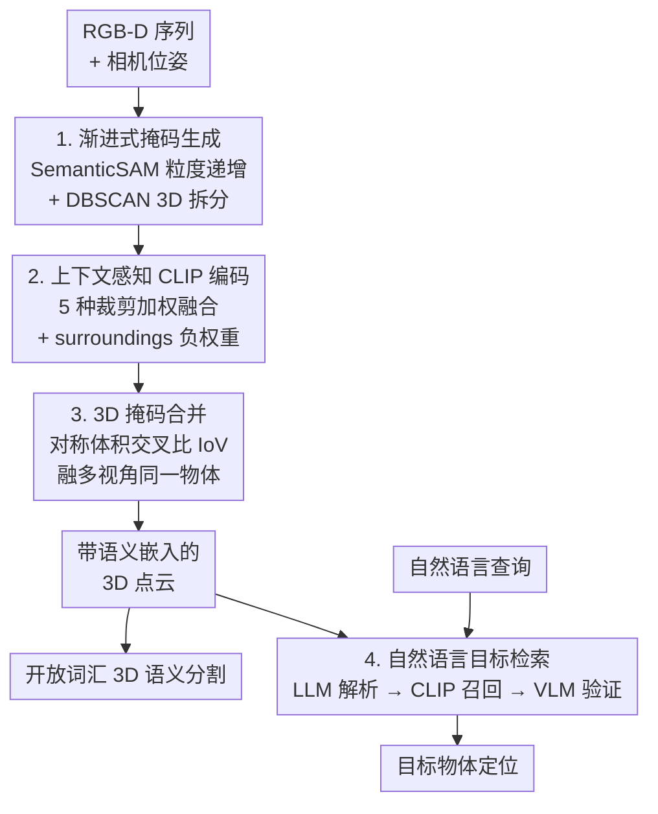

# CORE-3D: Context-aware Open-vocabulary Retrieval by Embeddings in 3D

**会议**: ICLR 2026  
**arXiv**: [2509.24528](https://arxiv.org/abs/2509.24528)  
**代码**: 待确认  
**领域**: 3D视觉  
**关键词**: 开放词汇3D语义分割, 场景图, CLIP嵌入, 语言检索, SemanticSAM

## 一句话总结
提出CORE-3D，一个无需训练的开放词汇3D语义分割与自然语言目标检索流水线，通过渐进式粒度掩码生成、上下文感知CLIP编码和多视角3D融合，在Replica和ScanNet上超越现有方法。

## 研究背景与动机

**领域现状**：3D场景理解是机器人和具身AI的基础需求。近年来，将视觉语言模型(VLM)与2D分割模型结合，通过反投影到3D空间实现零样本开放词汇的3D语义建图成为主流方案。

**现有痛点**：
   - SAM等2D分割骨干在杂乱室内场景中产生碎片化/不完整的掩码，导致严重过分割
   - 直接对单个掩码裁剪区域使用CLIP编码，语义上下文极为有限，嵌入质量差
   - 多帧聚合时同一物体因视角变化获得不同的上下文嵌入，造成不一致

**核心矛盾**：现有foundation model流水线虽然免训练，但分割质量和语义嵌入质量都不够好，无法构建连贯可靠的3D语义图

**本文目标**：如何在不训练的前提下，同时改善2D分割质量、语义嵌入丰富度和多视角一致性

**切入角度**：利用SemanticSAM的粒度可调特性做渐进式细化，结合多种上下文裁剪视角增强CLIP编码

**核心 idea**：用渐进粒度分割 + 多裁剪上下文感知CLIP编码 + 3D体素合并来构建高质量零样本开放词汇3D语义图

## 方法详解

### 整体框架
CORE-3D 要解决的是「用现成 foundation model 拼一条免训练流水线，却同时被分割碎片化、CLIP 嵌入语义贫乏、多视角不一致三件事拖累」的困境。它的输入是带相机位姿的 RGB-D 序列，输出是带语义嵌入的 3D 点云，既能做开放词汇分割，又能用自然语言检索目标。整条流水线顺着「先把每帧切准、再把每块编码丰富、然后跨帧融成统一物体、最后挂上语言检索」四步走：每帧先用渐进粒度分割得到干净的 2D 掩码，每个掩码用多裁剪上下文增强的 CLIP 嵌入来描述语义，反投影到 3D 后按体积重叠把同一物体的多视角掩码合并成一个实例，最终在这张语义图上跑 LLM+VLM 的多阶段检索。

### 关键设计

**1. 渐进式掩码生成：让分割从粗到细自我补全，治 SAM 的碎片化**

vanilla SAM 在杂乱室内场景里要么把一个大物体切成几块、要么漏掉小物体，反投影到 3D 后污染整张语义图。CORE-3D 改用 SemanticSAM 的可调粒度参数 $g$，沿一个递增的粒度序列 $\{g_1, g_2, \ldots, g_K\}$ 逐级出掩码：粗粒度先锁定大件家具，细粒度再补小物体和局部细节。每一级只接受置信度超过阈值 $\tau_{cer}$ 的掩码，并且只有当新掩码与已有掩码的重叠率 $\frac{|m \cap m'|}{|m|} < \tau_k$ 时才加入集合，从而既补全了细节又不会堆出大量冗余的重复掩码。

光靠 2D 还不够——有些物体（如花瓶贴着沙发）在图像上粘连成一片，但在 3D 里前后分离。于是把候选掩码的像素反投影到 3D 后再跑 DBSCAN 聚类，把 2D 粘连、3D 分开的物体拆成独立实例。这一步等于借几何信息纠正 2D 分割的错误，比单纯调分割阈值更可靠。

**2. 上下文感知 CLIP 编码：用多裁剪 + 负权重对比，把语义嵌入做厚**

直接拿掩码抠出来的小区域喂 CLIP，上下文几乎为零，编码出来的向量经常对不上正确的开放词汇。CORE-3D 对每个掩码同时取 5 种互补裁剪：mask 裁剪（背景置零，只留物体）、bbox 裁剪、large 裁剪（外扩 2.5 倍）、huge 裁剪（外扩 4 倍）、以及 surroundings 裁剪（外扩 3 倍但把物体本身遮住，只留周边环境）。前四种从「贴身」到「带场景」逐层提供不同尺度的上下文，让 CLIP 既看清物体又知道它处在什么环境里。

五个裁剪各自过一遍 CLIP 图像编码器后加权融合：

$$\mathbf{e}(m) = w_{mask}\mathbf{e}^{mask} + w_{bbox}\mathbf{e}^{bbox} + w_{large}\mathbf{e}^{large} + w_{huge}\mathbf{e}^{huge} - w_{sur}\mathbf{e}^{sur}$$

关键在最后一项：surroundings 嵌入以**负权重**被减掉。它编码的是「不含物体、只有周边」的特征，减去它相当于做对比——如果某个嵌入主要被环境而非物体本身主导，这一项会把这种「被背景带跑」的成分压下去，逼最终向量聚焦到物体自身的语义上。这正是它比单一掩码裁剪准确的原因。

**3. 3D 掩码合并：用对称体积交叉比融多视角，防止小物体被吞并**

同一个物体在不同帧被切成多个 2D 掩码，反投影到 3D 后需要合并成一个实例，否则同一把椅子会出现好几份、嵌入还各不相同。CORE-3D 用体积交叉比（IoV，Intersection over Volume）来判断两个候选掩码是否属于同一物体，但不只看单向重叠——合并条件是双向 IoV 都超过阈值 $\gamma$、且两个方向的 IoV 差异小于 $\delta$：

$$\text{IoV}(m_a, m_b) > \gamma \quad \text{且} \quad |\text{IoV}(m_a, m_b) - \text{IoV}(m_b, m_a)| < \delta$$

加上对称性约束是为了防退化合并：若只看单向，小靠垫几乎完全落在大沙发体积内，会被误判成同一物体而吞并；而要求两个方向都高、且差距小，就排除了「一大一小高度不对称」的情况。满足条件的掩码合并后，嵌入取平均，得到跨视角一致的物体表示。

**4. 自然语言目标检索：LLM 解析 + CLIP 召回 + VLM 验证的多阶段推理**

有了 3D 语义图，最后要支持「拿一句话定位场景里的目标物体」。CORE-3D 把检索拆成串联的几步：先用 LLM 把查询解析成结构化形式 $\Pi(q) = (m, \mathcal{R}, \Omega)$，分别表示目标物体、参考物体集合、以及朝向约束；再用 CLIP 相似度在语义图上挖出 Top-K 候选；接着进入 VLM 视觉验证——为每个候选挑一个最佳观察视角，用 bbox 框出物体向 VLM 提问确认；若查询带朝向约束（如「面朝窗户的椅子」），则把偏航角离散成网格、让 VLM 在各朝向假设里选最契合的；最后由 LLM 综合参考物体关系和朝向推理给出答案。把粗召回交给 CLIP、把需要常识和空间关系的精筛交给 LLM/VLM，是这条检索链路能同时快又准的原因。

### 训练策略
整条流水线完全无需训练，属于零样本推理：渐进分割依赖预训练 SemanticSAM，语义嵌入依赖 CLIP（Eva02-L），检索阶段依赖现成的 VLM/LLM，所有可调项都是推理期阈值与权重，不涉及任何梯度更新。

## 实验关键数据

### 主实验

| 数据集 | 指标 | CORE-3D | BBQ-CLIP (前SOTA) | 提升 |
|--------|------|---------|-------------------|------|
| Replica | mIoU | 0.29 | 0.27 | +0.02 |
| Replica | fmIoU | 0.56 | 0.48 | +0.08 |
| ScanNet | mIoU | 0.36 | 0.34 | +0.02 |
| ScanNet | fmIoU | 0.46 | 0.36 | +0.10 |
| ScanNet | mAcc | 0.61 | 0.56 | +0.05 |

在Sr3D+目标检索任务中表现更优越：

| 指标 | CORE-3D | BBQ (前SOTA) | 提升 |
|------|---------|-------------|------|
| Overall A@0.1 | 41.8 | 34.2 | +7.6 |
| Overall A@0.25 | 35.6 | 22.7 | +12.9 |

### 消融实验
- 渐进式多粒度分割显著优于vanilla SAM和单一粒度SemanticSAM
- 上下文感知CLIP编码（特别是surroundings负权重减法）对分割质量提升明显
- DBSCAN 3D聚类有效解决2D重叠但3D分离的物体问题
- VLM验证步骤提升了检索精度

## 亮点
- 完全免训练的零样本流水线，实用性强
- 渐进式粒度细化是一个简单但有效的掩码生成策略
- 上下文感知CLIP编码中surroundings负权重减法的设计直觉很好
- 检索任务中LLM+VLM的多阶段推理流程设计合理

## 局限与展望
- 依赖SemanticSAM的粒度参数和多个阈值($\tau_{cer}$, $\tau_k$, $\gamma$, $\delta$)，调参工作量不小
- CLIP嵌入的5种裁剪权重需经验调优，不同场景可能需要不同权重
- 检索流水线依赖外部LLM和VLM API调用，延迟和成本较高
- 只在室内场景(Replica/ScanNet)上验证，室外大场景泛化性未知
- fmIoU虽有不错提升但绝对值仍不高，距离实用还有差距

## 与相关工作的对比
- vs ConceptFusion/ConceptGraphs：本文通过更好的分割和嵌入质量超越，证明foundation model流水线中分割和编码环节的改进空间大
- vs BBQ：BBQ使用3D场景图+LLM推理做检索表现不错，本文在分割上明显更好，在检索上提升更大（A@0.25从22.7到35.6）
- vs HOV-SG：层次化场景图方法，本文在Replica上IoU优于HOV-SG
- vs 训练类方法(LERF/LangSplat/OpenGaussian)：本文零样本方法在多个指标上超越需要per-scene训练的方法

## 启发与关联
- 上下文感知编码的思路可推广到其他需要CLIP编码的场景（如图像检索、开放词汇检测）
- surroundings负权重减法的对比编码设计值得借鉴
- 渐进粒度分割的思路可扩展到视频分割场景

## 评分
- 新颖性: ⭐⭐⭐ (各组件单独看不新，但组合设计合理有效)
- 实验充分度: ⭐⭐⭐⭐ (多数据集+消融+定性结果)
- 写作质量: ⭐⭐⭐⭐
- 价值: ⭐⭐⭐⭐ (无训练流水线的实用价值高)

<!-- RELATED:START -->

## 相关论文

- [\[ICLR 2026\] GeoPurify: A Data-Efficient Geometric Distillation Framework for Open-Vocabulary 3D Segmentation](geopurify_a_data-efficient_geometric_distillation_framework_for_open-vocabulary_.md)
- [\[AAAI 2026\] Open-World 3D Scene Graph Generation for Retrieval-Augmented Reasoning](../../AAAI2026/3d_vision/open-world_3d_scene_graph_generation_for_retrieval-augmented_reasoning.md)
- [\[ICCV 2025\] Open-Vocabulary Octree-Graph for 3D Scene Understanding](../../ICCV2025/3d_vision/open-vocabulary_octree-graph_for_3d_scene_understanding.md)
- [\[CVPR 2026\] Context-Nav: Context-Driven Exploration and Viewpoint-Aware 3D Spatial Reasoning for Instance Navigation](../../CVPR2026/3d_vision/context-nav_context-driven_exploration_and_viewpoint-aware_3d_spatial_reasoning_.md)
- [\[AAAI 2026\] OpenScan: A Benchmark for Generalized Open-Vocabulary 3D Scene Understanding](../../AAAI2026/3d_vision/openscan_a_benchmark_for_generalized_open-vocabulary_3d_scene_understanding.md)

<!-- RELATED:END -->
