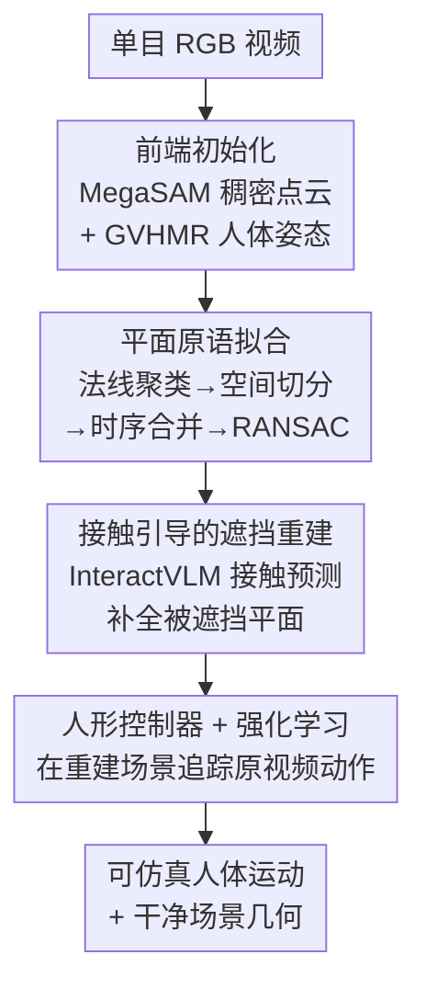

# CRISP: Contact-Guided Real2Sim from Monocular Video with Planar Scene Primitives

**会议**: ICLR 2026  
**arXiv**: [2512.14696](https://arxiv.org/abs/2512.14696)  
**代码**: 有（项目页面）  
**领域**: 3D 视觉 / Real2Sim  
**关键词**: Real2Sim, 单目视频, 平面场景原语, 人体-场景交互, 强化学习人形控制

## 一句话总结
提出 CRISP，一种从单目视频中恢复可仿真人体运动和场景几何的方法，通过拟合平面原语获取干净的仿真就绪几何体，结合人体-场景接触建模重建被遮挡区域，将人形控制器的运动追踪失败率从 55.2% 降至 6.9%。

## 研究背景与动机

Real2Sim（从真实环境到仿真环境的转换）是机器人学和 AR/VR 领域的核心问题。从单目视频中恢复可以用于物理仿真的人体运动和场景几何，对于机器人策略训练、运动重定向和虚拟现实内容创作具有重要价值。

**现有痛点**：

**基于数据驱动先验的联合优化方法**：依赖学习到的先验对人体和场景进行联合重建，但没有物理引擎参与（no physics in the loop），导致重建结果可能在物理上不合理（如人体穿透物体）。

**直接几何重建方法**：虽然可以恢复场景几何，但结果通常包含噪声和伪影（artifacts），这些不干净的几何体在喂入运动追踪策略时会导致场景交互失败。例如，椅子表面的凹凸不平会使人形控制器坐下时发生物理碰撞异常。

**核心矛盾**：现有方法要么缺乏物理合理性，要么生成的几何体不够"干净"——无法直接用于物理仿真中的交互。

**核心 idea**：通过拟合平面原语（planar primitives）到场景点云来获取凸面、干净、仿真就绪的几何体，并利用人体-场景接触建模来恢复交互过程中被遮挡的几何部分。

## 方法详解

### 整体框架

CRISP 要解决的是一个很具体的落差：从单目视频直接重建出的场景几何虽然"看着对"，但喂进物理引擎就垮——TSDF + Marching Cubes 出来的 mesh 三角面动辄几十万、表面凹凸且布满伪影，人形控制器一坐下去就撞上这些伪影、接触力失稳、动作追踪失败。CRISP 的思路是不追求逐点的精细 mesh，而是把场景抽象成一小撮（≈50 个）凸的、干净的平面原语，再用人体姿态本身去补全交互时被遮挡的那部分几何，最后把整套"运动+几何"丢进强化学习人形控制器里跑一遍，用物理仿真能不能成功追踪来反过来检验重建是否真的可用。

整条流水线从单目 RGB 视频出发：先做前端初始化（MegaSAM 联合估计相机位姿、内参与稠密点云，GVHMR 估计 SMPL 人体姿态，再借已知人体尺度把点云缩放到真实米制），随后把全局点云聚成平面原语得到仿真就绪的场景表示，再用人体-场景接触建模恢复被身体挡住的交互平面，最后由 RL 人形控制器在重建场景里追踪原视频动作，输出可仿真的人体运动序列与干净的场景几何。

### 关键设计

**1. 平面原语拟合：把噪声 mesh 换成凸的、干净的仿真就绪几何**

直接几何重建的最大问题是噪声——椅面、桌面这些本该平整的区域布满了凹凸伪影，物理引擎在上面做碰撞检测时会频繁出错。CRISP 基于"平面世界假设"（坐、躺、爬楼、跑酷这类交互大多发生在平面上），用一个三步无优化的聚类 pipeline 把全局点云切成平面区域：先在法线图上做 K-means 产生候选平面段，再用 DBSCAN 在每段的 3D 点上做空间切分把不连通的部分分开，最后跨帧用相似平面拟合 + 光流对应关系把同一物理平面的多个分段时序合并成一个一致区域；每个合并区域用 RANSAC 拟出平面，并赋予默认 $0.05\text{m}$ 厚度做成平面长方体。最终整个场景被压成约 50 个凸平面原语，而不是一张几十万面、布满噪声的网格。这么做的好处是双重的：凸原语天生干净、无伪影，又对底层噪声有正则化作用，因此即便牺牲一点细节精度，也比精细但噪声大的 mesh 更适合塞进仿真引擎；同时凸几何体的碰撞检测远快于复杂 mesh，直接带来约 43% 的仿真吞吐量提升。整套流程不需要任何逐场景神经场优化。

**2. 接触引导的遮挡重建：用人体姿态当"模具"补出看不见的平面**

人和场景交互时，恰恰是交互发生处的几何被挡住了——坐下时椅子座面整块被身体遮住，单纯靠视觉重建根本拿不到这块平面，而它又是控制器最需要的接触面。CRISP 的关键观察是人体姿态本身就编码了场景几何：一个坐姿就隐含了座面的高度和朝向。具体做法是用视觉-语言模型 InteractVLM 在每帧 SMPL 网格上预测哪些顶点与场景接触（per-vertex 二值接触掩码 $c_t(v)\in\{0,1\}$），再用这些接触点去约束、补全被遮挡的交互平面。InteractVLM 在"将接触未接触"的临界帧容易误报，于是 CRISP 加了一道时序-运动学过滤：跨时间做非极大值抑制，只保留连续 $L$ 帧高置信的预测，并取人体运动 $v_t$ 最小的那一帧 $t^*=\arg\min_{t} v_t$ 作为可靠接触帧，把假阳性压下去。这套推断完全不依赖 CAD 模型库或场景类别模板，因此能直接用在任意没有先验的真实视频上。

**3. 人形控制器 + 强化学习：让物理仿真既当验证器又当产品**

前两步重建得再像，也得回答一个问题——这套几何到底能不能在物理世界里真的用。CRISP 把恢复出的人体运动和场景几何交给人形控制器（基于 SMPL 人体模型构建的仿真角色），沿用 Masked Mimic 的设计训练一个全约束的动作追踪策略，让角色在重建场景里逐帧模仿原视频提取出的全身动作。策略以当前角色状态 $s_t$ 和未来 $K$ 个目标姿态 $g_t=[f_t,\dots,f_{t+K}]$ 为输入、输出 PD 控制器的关节目标 $a_t$；奖励 $r_t$ 鼓励角色在每个时刻匹配参考动作的关节位置、旋转、线/角速度与根高度，并加一项能量惩罚抑制抖动。物理合理性不是靠显式的穿透/平衡惩罚项，而是"内生"于仿真本身——几何不干净或接触面缺失时角色会撞上伪影、接触力失稳，从而追踪失败。这一步因此身兼两职：失败率本身就成了重建质量的体检指标；而训练出的策略又直接产出物理可行、接触合理的可仿真人体运动，是最终交付的产品。

### 损失函数 / 训练策略

平面拟合阶段无需训练：法线图上 K-means 出候选段、DBSCAN 做空间切分、跨帧时序合并后用 RANSAC 解平面参数。动作追踪策略沿用 Masked Mimic 框架——策略网络用 transformer 编码器、critic 用 MLP，并采用参考状态初始化（RSI）提升训练稳定性；奖励为各关节位置 $p$、旋转 $q$、线速度 $\dot p$、角速度 $\dot q$、根高度 $h$ 的加权模仿误差再加能量惩罚项。

## 实验关键数据

### 主实验
在人体中心视频基准 EMDB 和 PROX 上评估：

| 方法 | 运动追踪失败率↓ | RL 仿真吞吐量 | 说明 |
|------|----------------|---------------|------|
| 先前方法（噪声几何） | 55.2% | 基线 | 几何伪影导致频繁失败 |
| **CRISP（本文）** | **6.9%** | **+43% 更快** | 干净几何大幅降低失败 |

### 在野视频验证

| 视频类型 | 验证结果 | 说明 |
|----------|---------|------|
| 随意拍摄的日常视频 | 成功 | 泛化到非受控环境 |
| 互联网视频 | 成功 | 泛化到多样场景 |
| Sora 生成的视频 | 成功 | 甚至适用于 AI 生成内容 |

### 消融实验

| 配置 | 关键指标 | 说明 |
|------|---------|------|
| 无平面原语（原始 mesh） | 失败率大幅上升 | 验证平面原语的关键作用 |
| 无接触引导重建 | 交互场景效果差 | 遮挡区域恢复对交互必要 |
| 无 RL 验证（直接输出） | 物理不合理穿透 | RL 确保物理真实性 |
| 不同聚类特征组合 | 深度+法线+光流最优 | 三特征互补 |

### 关键发现
- 平面原语是 Real2Sim 场景表示的理想选择：干净、凸面、高效
- 人体姿态是推断被遮挡场景几何的强大信号
- 运动追踪失败率从 55.2% 降至 6.9%，降幅巨大（约 88% 的相对改善）
- 仿真吞吐量提升 43% 来自凸几何体更高效的碰撞检测
- 方法在 in-the-wild 视频上泛化良好，包括 Sora 这样的生成视频
- 整个 pipeline 不依赖 CAD 模型库或场景类别先验

## 亮点与洞察
- "用平面原语代替复杂 mesh"的 insight 简洁而有力——在合理损失细节精度的前提下，大幅提升仿真兼容性
- 接触引导的遮挡重建是关键创新——利用人体姿态作为场景的"模具"来推断被遮挡几何
- 将 RL 人形控制器作为物理合理性的验证器，形成有意义的闭环
- 在 Sora 生成视频上的成功验证展示了方法的泛化潜力和前瞻性
- 深度+法线+光流的聚类特征组合设计简洁但有效
- 方法能大规模生成物理有效的人体运动和交互环境，对机器人和 AR/VR 有直接应用价值

## 局限与展望
- 平面原语假设限制了对曲面物体（如球体、圆柱）的表示能力
- 依赖前端点云重建的质量，如果深度估计不准则后续都会受影响
- 接触建模基于人体姿态推断，对非接触的远距离遮挡无法处理
- 聚类 pipeline 中的超参数（如聚类数、距离阈值）可能需要针对不同场景调整
- 暂未处理动态场景（如移动物体）
- RL 控制器的训练本身需要较多计算资源
- 未来可扩展到多人交互场景和更复杂的物体操作

## 相关工作与启发
- 与 PROX、LEMO 等人体-场景交互重建工作相关，但引入物理仿真验证
- 与 PhysDiff 等物理约束运动生成工作互补
- 平面原语拟合的思想与传统计算几何中的平面检测相关，但应用于 Real2Sim 是新颖的
- 启发：1）简洁的几何表示在仿真应用中往往比精细但噪声大的表示更有用；2）人体姿态作为场景的隐式编码器是值得深入探索的方向；3）RL 作为验证工具的思路可迁移到其他重建任务

## 评分
- 新颖性: ⭐⭐⭐⭐
- 实验充分度: ⭐⭐⭐⭐⭐
- 写作质量: ⭐⭐⭐⭐
- 价值: ⭐⭐⭐⭐⭐

<!-- RELATED:START -->

## 相关论文

- [\[ICCV 2025\] Vivid4D: Improving 4D Reconstruction from Monocular Video by Video Inpainting](../../ICCV2025/3d_vision/vivid4d_improving_4d_reconstruction_from_monocular_video_by_video_inpainting.md)
- [\[ICCV 2025\] SuperDec: 3D Scene Decomposition with Superquadric Primitives](../../ICCV2025/3d_vision/superdec_3d_scene_decomposition_with_superquadrics_primitives.md)
- [\[ICLR 2026\] SceneTransporter: Optimal Transport-Guided Compositional Latent Diffusion for Single-Image Structured 3D Scene Generation](scenetransporter_optimal_transport-guided_compositional_latent_diffusion_for_sin.md)
- [\[NeurIPS 2025\] PlanarGS: High-Fidelity Indoor 3D Gaussian Splatting Guided by Vision-Language Planar Priors](../../NeurIPS2025/3d_vision/planargs_high-fidelity_indoor_3d_gaussian_splatting_guided_by_vision-language_pl.md)
- [\[NeurIPS 2025\] Plana3R: Zero-shot Metric Planar 3D Reconstruction via Feed-Forward Planar Splatting](../../NeurIPS2025/3d_vision/plana3r_zero-shot_metric_planar_3d_reconstruction_via_feed-forward_planar_splatt.md)

<!-- RELATED:END -->
