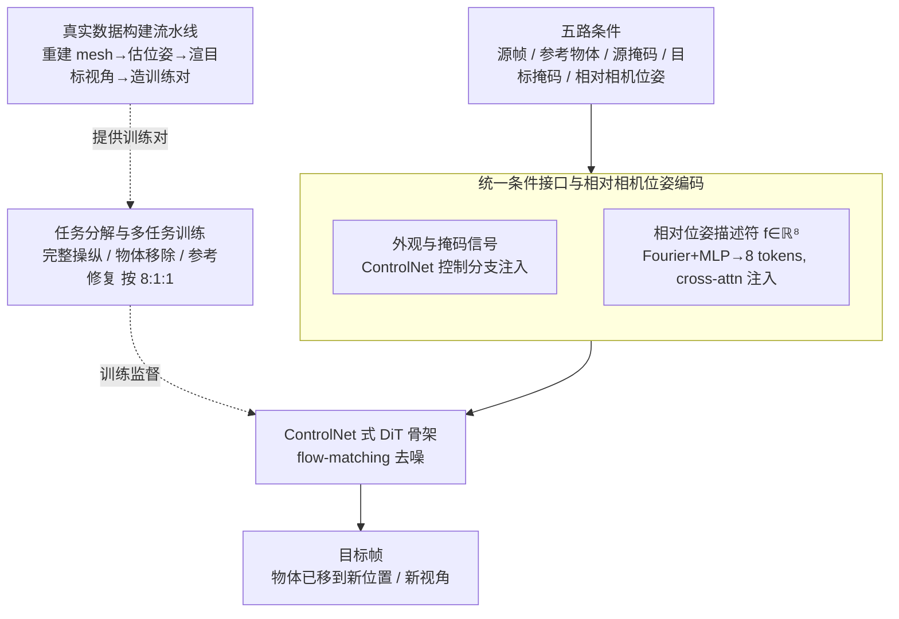

# Ctrl&Shift: High-Quality Geometry-Aware Object Manipulation in Visual Generation

**会议**: ICLR 2026  
**arXiv**: [2602.11440](https://arxiv.org/abs/2602.11440)  
**代码**: 待确认  
**领域**: 3D视觉 / 视觉生成  
**关键词**: 物体操纵, 扩散模型, 几何一致性, 相机位姿控制, 图像编辑

## 一句话总结
提出Ctrl&Shift，一个端到端扩散框架，通过将物体操纵分解为物体移除+参考引导修复，并注入相对相机位姿控制，首次在不依赖显式3D重建的情况下实现几何一致的细粒度物体操纵。

## 研究背景与动机

**领域现状**：物体级操纵（重定位、旋转物体并保持场景真实感）是影视后期、AR和创意编辑的基础操作。主流方法分为两大派：几何方法（NeRF/3DGS重建后操作）和扩散方法（文本/轨迹条件编辑）。

**现有痛点**：
   - 几何方法（NeRF/3DGS）提供精确控制但需要显式3D重建，per-scene优化成本高，泛化性差
   - 扩散方法（DragAnything/VACE等）泛化性好但缺乏细粒度几何控制，无法精确指定物体的位姿变换
   - 没有方法能同时实现：背景保持、几何一致的视角变换、用户可控变换这三个目标

**核心矛盾**：几何精度与泛化能力之间存在根本性的trade-off

**本文目标**：在不做显式3D重建的情况下，实现几何一致、细粒度可控的物体操纵

**切入角度**：不把内容提升到3D再编辑，而是把精确视角控制直接注入2D扩散过程

**核心 idea**：将物体操纵分解为"移除+参考修复+相机位姿控制"三个子任务，通过多任务多阶段训练在统一扩散框架内学习

## 方法详解

### 整体框架

Ctrl&Shift 要解决的是「把图里某个物体搬到新位置、换个视角看，而背景和物体本身都不能穿帮」，并且不想付出 per-scene 三维重建的代价。它的核心思路是一个观念转换：不把内容提升到 3D 再编辑，而是把精确的视角控制**直接注入 2D 扩散过程**——把物体操纵拆成「先把物体从原处干净抹掉、再按指定相机位姿把参考物体画回目标位置」，整件事在一个统一扩散框架里端到端完成，不显式重建任何三维结构。

落到实现上有三层：模型一次性吃进**五路条件**（源图/视频帧、参考物体图像、源掩码、目标掩码、相对相机位姿描述符），其中外观与位置类信号走 ControlNet 控制分支注入、相机位姿单独编码后经 cross-attention 注入，让几何信号和外观信号各走各的通道（**统一条件接口与相对相机位姿编码**）；训练时把「完整操纵」这一目标拆成主任务加两个辅助任务联合优化，逼模型把五路纠缠的条件解开来用（**任务分解与多任务训练**）；而支撑这一切的训练数据，则由一条全自动流水线从真实图像/视频里造出带位姿标注的配对（**真实数据构建流水线**）。

### 关键设计

**1. 统一条件接口与相对相机位姿编码：把视角变换直接注入 2D 扩散**

要在不重建 3D 的前提下做几何一致的操纵，难点是把「背景、物体身份、空间位置、视角变换」这几类信号都塞进同一个扩散网络，又不让它们互相干扰。本文给五路条件设计了一个统一接口：源帧、参考图经 VAE 编码，掩码则用 space-to-depth（pixel unshuffle）按通道重排对齐到 VAE 的 stride——直接丢进 VAE 会被当成外观纹理处理而扭曲掉「1=待编辑、0=保留」的二值语义，重排则既进了潜空间又保住了语义；这些信号在控制分支里按通道拼接、经 zero-init 卷积注入 DiT。相机位姿走的是另一条通道：采用 look-at 相机模型，每个视角参数化为 $(yaw, pitch, d, r_x, r_y)$，只编码两视角之间的**相对**关系——相对旋转的 axis-angle 表示、相对平移 $\mathbf{t}_{rel}$、以及 NDC 平面上的偏移 $(\Delta r_x, \Delta r_y)$，拼成 8 维描述符 $\mathbf{f}\in\mathbb{R}^8$，再经 Fourier 位置编码加 MLP 映射成 8 个 token（维度 $d=4096$），通过 cross-attention 注入。

用相对位姿而非绝对位姿是关键取舍：绝对位姿需要先定义一套场景无关的标准坐标系，这在野外图像上几乎无法统一，推理时让用户指定一个无基准的目标位姿也极不直观；相对位姿天然以输入帧为基准，用户的操作就像在原图上「拖一下、转一下」。推理阶段没有现成的目标掩码，则用源掩码的 bbox 做缩放加平移来近似，省去用户手绘目标区域的负担。

**2. 任务分解与多任务训练：把五路纠缠的条件拆开学**

五路条件在「完整操纵」这一个目标里高度纠缠，模型很难分清是哪一路在起作用，容易学成捷径。本文把训练目标显式拆成一个主任务加两个辅助任务联合优化，每个辅助任务都借同一个统一条件接口、只是把某几路条件「关掉」来单独锻炼一路信号：**主任务**做完整操纵，即抹掉源位置物体、再在目标位置以目标视角重绘；**辅助任务 1（物体移除）**把参考图设成白图、目标掩码置全零、并把位姿的 NDC 偏移推到 $[-1,1]$ 之外让物体落到画面外，逼模型专心学「怎么干净地去掉物体并补全背景」；**辅助任务 2（参考修复 + 相机控制）**把源掩码置全零、输入换成纯背景帧，逼模型学「在给定位姿下把参考物体合成出来」。

三个任务按 $8\!:\!1\!:\!1$ 的权重混合采样，等于给每一路条件都安排了一个能单独锻炼它的子场景，外观、位置、位姿的贡献因此被解纠缠。消融也印证了分工：去掉辅助任务 2 时 Obj IoU 从 0.83 掉到 0.65、Pose MAPE 升到 28.60%，正是物体级精度最受影响。

**3. 真实数据构建流水线：自动造出带位姿标注的训练对**

上面的训练全靠「同一物体两个视角 + 干净背景 + 精确位姿标注」的配对数据，而真实世界几乎没有现成的，必须自动合成。流水线先用 Hunyuan3D-2 把前景物体重建成带纹理 mesh，再用可微渲染估计源相机位姿——通过 $\mathbf{s}^{src}=\arg\max_{\mathbf{s}}\mathrm{IoU}(\mathcal{R}(\mathcal{M},\mathbf{s}),\mathbf{M}^{src})$ 优化，只保留渲染轮廓与真值掩码 $\mathrm{IoU}\geq 0.90$ 的样本以保证位姿可靠；接着采样一个目标位姿渲染出目标视角，背景一侧用 MiniMax-Remover 抹掉原物体得到干净底图，最后用一个物体粘贴（参考图修复）模型把渲染物体和谐化地贴回去，凑成带精确位姿标注的训练对。整条流水线全自动，且因为粘贴模型本身能编辑图像与视频，可规模化地覆盖图像和视频数据（视频则在首帧上做重建/估位姿/渲染）。

### 损失函数 / 训练策略

训练采用 flow-matching：沿线性路径 $\mathbf{z}_t = (1-t)\mathbf{z}_0 + t\boldsymbol{\varepsilon}$ 加噪，优化速度匹配损失 $\|\mathbf{v}_\theta(\mathbf{z}_t, \mathbf{c}, t) - \mathbf{v}^*(\mathbf{z}_t, t)\|_2^2$，其中 $\mathbf{c}$ 即上述五路条件。骨架基于 Wan-1.3B，控制分支含 8 个 control block，DiT 隐藏维 1536。

训练分两阶段，把「几何先验」和「真实感」错开学（合成数据位姿标注精确但缺真实感，真实数据真实但位姿难标，单靠任一种都不够）：**Stage I** 在约 2M 张合成图像对（白背景 + 随机相机位姿）上预训练 50k 步，**主干与控制分支联合更新**，先把物体先验和相对位姿表示学扎实；**Stage II** 转到 10 万对高质量真实图像/视频对上微调 5k 步，这时**冻结主干、只更新控制分支**，集中改善背景保持与真实感，避免真实数据的噪声破坏已学好的几何能力。消融显示去掉 Stage I 会让 Pose MAPE 从 17.70% 飙到 32.50%，去掉 Stage II 则 PSNR 从 28.71 掉到 24.83——两阶段恰好各管几何与真实感一头。

## 实验关键数据

### 主实验

ObjectMover-A零样本评测：

| 方法 | PSNR↑ | DINO↑ | CLIP↑ | DreamSim↓ |
|------|-------|-------|-------|-----------|
| ObjectMover | 25.27 | 85.07 | 93.16 | 0.142 |
| **Ctrl&Shift** | **28.69** | **88.07** | **93.58** | **0.075** |

GeoEditBench（自建基准，几何感知编辑评测）：

| 方法 | PSNR↑ | DINO↑ | Pose MAPE↓ | Obj IoU↑ |
|------|-------|-------|-----------|----------|
| VACE | 24.32 | 75.38 | 30.56% | 0.72 |
| Nano-Banana | 26.38 | 78.05 | 24.36% | 0.78 |
| **Ctrl&Shift** | **28.71** | **85.23** | **17.70%** | **0.83** |

### 消融实验
- 去掉Stage 1：Pose MAPE从17.70%升至32.50%，几何理解严重受损
- 去掉Stage 2：PSNR从28.71降至24.83，背景保持和视觉质量下降
- 去掉辅助任务1：CLIP-Score降至86.32，语义一致性受损
- 去掉辅助任务2：Obj IoU降至0.65，Pose MAPE升至28.60%，物体级精度最受影响

## 亮点
- 概念上的关键突破：不需要3D重建即可实现几何一致物体操纵
- 多任务分解思路巧妙，让模型从各任务中学习到解纠缠的信号
- 数据构建流水线可规模化，支持真实世界图像和视频
- GeoEditBench提供了几何感知编辑的系统性评测

## 局限与展望
- 推理时目标掩码的近似（bbox缩放+平移）可能在极端变换下不准确
- 基于Wan-1.3B backbone，模型规模不大，复杂场景可能表现受限
- 目前只支持单物体操纵，多物体协同编辑未探索
- 数据构建依赖Hunyuan3D-2和物体粘贴模型，引入这些模型的误差
- 视频操纵能力虽展示但定量评测偏少

## 与相关工作的对比
- vs DragAnything：基于轨迹控制的扩散方法，泛化性差且缺乏位姿控制
- vs VACE：背景保持好但实际是平移整个画面而非真正操纵物体
- vs Nano-Banana/Qwen-Image-Edit：生成质量好但文本指令驱动的相机位姿控制不精确
- vs 3DiT/GeoDiffuser：依赖3D重建或几何条件，泛化性受限
- vs ObjectMover：视频先验方法，本文在PSNR上+3.42，DreamSim减半

## 启发与关联
- "不做3D重建但注入3D几何控制"的思路可推广到其他编辑任务
- 多任务解纠缠训练策略值得在多条件生成任务中借鉴
- 相对位姿编码比绝对位姿更适合交互式编辑场景

## 评分
- 新颖性: ⭐⭐⭐⭐ (任务分解+位姿注入的概念创新)
- 实验充分度: ⭐⭐⭐⭐ (多基准+消融+自建benchmark)
- 写作质量: ⭐⭐⭐⭐
- 价值: ⭐⭐⭐⭐⭐ (首次统一几何精度和扩散泛化)

<!-- RELATED:START -->

## 相关论文

- [\[ICLR 2026\] Learning Part-Aware Dense 3D Feature Field for Generalizable Articulated Object Manipulation](learning_part-aware_dense_3d_feature_field_for_generalizable_articulated_object_.md)
- [\[ICLR 2026\] Quantized Visual Geometry Grounded Transformer](quantized_visual_geometry_grounded_transformer.md)
- [\[CVPR 2025\] HOI3DGen: Generating High-Quality Human-Object-Interactions in 3D](../../CVPR2025/3d_vision/hoi3dgen_generating_high-quality_human-object-interactions_in_3d.md)
- [\[CVPR 2026\] QD-PCQA: Quality-Aware Domain Adaptation for Point Cloud Quality Assessment](../../CVPR2026/3d_vision/qd-pcqa_quality-aware_domain_adaptation_for_point_cloud_quality_assessment.md)
- [\[CVPR 2025\] MAtCha Gaussians: Atlas of Charts for High-Quality Geometry and Photorealism From Sparse Views](../../CVPR2025/3d_vision/matcha_gaussians_atlas_of_charts_for_high-quality_geometry_and_photorealism_from.md)

<!-- RELATED:END -->
