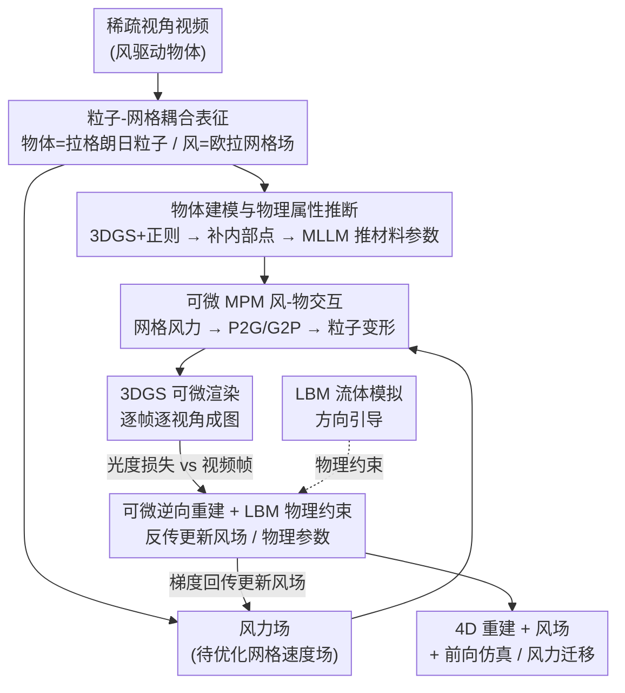

# DiffWind: Physics-Informed Differentiable Modeling of Wind-Driven Object Dynamics

**会议**: ICLR 2026  
**arXiv**: [2603.09668](https://arxiv.org/abs/2603.09668)  
**代码**: 无（论文提及项目页面）  
**领域**: 3D 视觉 / 物理仿真  
**关键词**: physics-informed, differentiable simulation, wind modeling, 3D Gaussian Splatting, Material Point Method

## 一句话总结
提出 DiffWind，一个物理约束的可微分框架，通过将风建模为网格物理场、物体表示为 3D Gaussian Splatting 粒子系统、用 Material Point Method（MPM）建模风-物交互，并引入 Lattice Boltzmann Method（LBM）作为物理约束，实现了从视频中联合重建风力场和物体运动，并支持新风条件下的前向仿真和风力迁移等应用，在自建的 WD-Objects 数据集上显著超越已有动态场景建模方法。

## 研究背景与动机

**领域现状**：从视频观测中建模物体动力学已有大量工作，如基于 NeRF 和 3D Gaussian Splatting（3DGS）的动态场景重建。然而，这些方法主要关注物体自身运动或简单交互，对于由外部不可见力（如风力）驱动的复杂变形建模，研究仍然非常有限。

**现有痛点**：
   - **风不可见**：风力不像碰撞力那样有明确的接触点，它在空间中连续分布且随时间变化，无法直接从视频中观测
   - **时空变异性**：风力场在空间和时间上都是变化的——同一场景中不同位置的风速/风向可能不同，且随时间演化
   - **复杂变形**：风驱动的物体（如旗帜、树叶、布料）会产生复杂的非刚体变形，难以用简单的运动模型描述
   - **现有动态场景重建方法**（如 Dynamic 3DGS）只拟合外观变化，不建模底层物理力，因此无法泛化到新的风条件或进行前向仿真

**核心矛盾**：要从视频中恢复风驱动的物体动力学，必须同时估计不可见的风力场和物体的物理响应——这是一个高度欠约束的逆问题。仅靠数据拟合（如 3DGS）虽能重建外观，但无法捕获底层物理规律，因此无法进行仿真和泛化。

**本文目标**：提出一个统一的框架，从视频中恢复风力场和物体运动，同时保证物理有效性，并支持前向仿真、风力迁移等下游应用。

**切入角度**：将物理仿真基元（粒子系统 + MPM）与神经渲染（3DGS + 可微渲染）结合，用可微分管线从视频反向优化风力场；同时用 LBM 流体动力学约束确保恢复的风场满足物理定律。

**核心 idea**：可微渲染提供外观监督 + MPM 提供物理动力学建模 + LBM 提供流体物理约束 = 从视频中物理一致地重建风-物交互。

## 方法详解

### 整体框架

DiffWind 要解决一个高度欠约束的逆问题：从一段拍到风吹物体的稀疏视角视频里，同时反推看不见、测不到的时空风力场和物体的物理响应。它的核心思路是按"各取所长"的方式分别表征两种介质——物体是发生局部变形的固体/半固体，用 3D Gaussian Splatting（3DGS）导出的拉格朗日粒子来表示；风是连续流动的流体，用欧拉网格上的速度/力场来表示——再用 Material Point Method（MPM）把网格上的风力施加到粒子上，算出每一帧的形变。整条前向链路（风场 → MPM 仿真 → 粒子变形 → 3DGS 渲染）全程可微，于是像素级的光度损失能一路反传到风场和物体材质参数上；与此同时再挂一个 Lattice Boltzmann Method（LBM）流体模拟，在每个时间步给风场方向引导，把优化往满足流体动力学的方向逼。最终输出物体的 4D 重建与运动、时空风力场，以及一个能换风条件继续做前向仿真、甚至把风迁移到新物体上的物理模型。

### 关键设计

**1. 粒子-网格耦合表征：物体走拉格朗日粒子、风走欧拉网格**

从视频里联合恢复"风"和"物"，难点之一是这两种介质性质完全相反，强行塞进同一种表征会处处别扭。DiffWind 顺着物理直觉把它们拆开：物体只发生局部变形，用 3DGS 导出的拉格朗日粒子表示，每个粒子携带外观、材料与运动属性；风是连续流动、速度/压力随时空演化的流体，天然定义在欧拉网格上，于是建成一个格点存密度、速度、力的网格场。两者靠 MPM 耦合——风场格点正好和 MPM 求解动量方程的背景网格对齐，风力可以直接施加上去。这种"粒子-网格耦合"既让固体形变和流体演化各自用最合适的离散方式，又因为渲染和仿真共用同一套粒子，使外观监督的梯度能无缝流到物理状态，省掉了"先重建 NeRF 再网格化"那种异构表征间的来回转换。

**2. 物体建模与物理属性推断：把 3DGS 变成带材料参数的可仿真粒子**

要把"只能画图"的高斯当成能仿真的物理粒子，光重建外观还不够。一方面 vanilla 3DGS 在大变形下会冒出针状伪影、漂浮物，弱纹理处还会留空洞；另一方面质量、弹性这些 MPM 必需的物理量根本无法从静态图像直接读出。DiffWind 在静态帧上优化 3DGS 时加两个正则：各向异性损失 $L_{aniso}$ 约束高斯核的长宽比、压住针状伪影，不透明度损失 $L_o$ 逼每个高斯的不透明度趋近 0 或 1、让点贴到物体表面，并剪掉低不透明度点；再用 Kaolin 的八叉树体素填充补出物体内部看不见的点，给变形足够的几何支撑。物理参数则交给一个"物理 agent"：先用对比学习训一个 3D 一致的特征场做 3D 区域分割，再让多模态大模型（MLLM）针对每个区域推断材料名、密度、泊松比 $\nu_p$ 和杨氏模量 $E$。这样每个粒子才同时拥有可微渲染要的外观和 MPM 要的材料属性。

> 物理 agent 与 3D 区域分割的具体实现见原文附录。⚠️ 以原文为准

**3. 可微 MPM 风-物交互：把网格风力翻译成粒子变形**

有了粒子和风场，还缺一个能把"风吹"算成"物动"、并且可微的物理引擎。DiffWind 选 MPM 这种混合 Lagrangian-Eulerian 方法：把每个高斯核及填充出的内部点都绑定到一个 MPM 粒子上，逐时间步做四件事——先把粒子的质量、速度投影到网格（P2G），在网格上叠加材料内力与来自风场的外力、更新网格速度，再把速度插值回粒子（G2P）推进其位置；同时按 PhysGaussian 的方式更新高斯协方差 $\Sigma_p(t)=F_p(t)\,\Sigma_p\,F_p(t)^{T}$（$F_p$ 为该粒子的变形梯度），让渲染外观随形变同步走样。MPM 天生擅长处理大变形，且整条求解链路可微，因此"风场如何影响最终形变"的梯度能被精确回传，这是后面能仅凭视频反推风场的前提。

**4. 可微逆向重建 + LBM 物理约束：仅凭视频反推风场并锁定物理合理解**

风场是一组自由变量，如果只用光度损失去拟合，优化器完全可能找到一个"画面对上了、物理却不合理"的风场（违反质量/动量守恒、风速突变）。DiffWind 把单步仿真写成可微算子 $S(\cdot)$、渲染写成可微的 $R_{render}(\cdot)$，前向得到每帧每视角的图像，再最小化渲染图与视频帧之间的光度损失 $L_{render}$；梯度经可微渲染、再经可微 MPM 一路回传到风场和物理参数，从而把看不见的风场学出来。在这条回路之上，再用 LBM（具体用 HOME-LBM）模拟流体：LBM 求解离散化的 Boltzmann 方程、宏观上恢复 Navier-Stokes，DiffWind 让它在每个时间步给风场提供方向引导（directional guidance），约束风场符合流体动力学规律。相比直接硬解 Navier-Stokes，LBM 这种软引导不钉死风场每一处取值，而是缩小解空间、把优化推向物理可行的方向，于是学到的风场既匹配视频又站得住物理。

### 损失函数 / 训练策略

训练分两阶段。**静态阶段**先在静态帧上优化 3DGS，损失为 $L_{static}=L_{color}+\lambda_a L_{aniso}+\lambda_o L_o$，其中 $L_{color}$ 是 3DGS 标准颜色损失，$L_{aniso}$、$L_o$ 分别压制针状伪影、把点贴到表面，得到干净几何与外观，并据此补内部点、推物理参数。**动态阶段**在序列上联合优化风场与物体变形：以光度损失 $L_{render}$（L1 + SSIM 风格）作外观侧主监督，LBM 在每个时间步给的方向引导作物理侧约束；风场参数与物体物理参数（如弹性系数）在同一回路里同步更新。

## 实验关键数据

### 数据集：WD-Objects
论文引入 WD-Objects 数据集，包含：
- **合成场景**：在物理仿真器中生成的风驱动物体运动（旗帜、布料、树叶等），有精确的风场 ground truth
- **真实场景**：从现实世界录制的风驱动物体视频
- 合成数据用于定量评估（有 ground truth），真实数据用于定性评估

### 主实验

| 任务 | 指标 | DiffWind | 之前 SOTA | 提升 |
|------|------|----------|----------|------|
| 动态重建（合成） | PSNR↑ | 显著领先 | Dynamic 3DGS 等 | 大幅度 |
| 动态重建（合成） | SSIM↑ | 显著领先 | Dynamic 3DGS 等 | 大幅度 |
| 动态重建（合成） | LPIPS↓ | 显著领先 | Dynamic 3DGS 等 | 大幅度 |
| 风场估计（合成） | 风速误差 | 物理合理 | 无可比基线 | — |
| 前向仿真 | 视觉质量 | 高保真 | 不支持 | — |

对比方法包括 Dynamic 3DGS、PhysGaussian 等动态场景建模方法。DiffWind 在重建精度和仿真保真度上均显著超越。

### 消融实验

| 配置 | 关键指标 | 说明 |
|------|---------|------|
| 去除 LBM 约束 | 风场物理合理性下降 | 无物理约束时风场可能不满足流体动力学 |
| 去除 MPM（纯外观拟合） | 无法仿真 | 退化为纯 3DGS 重建，丢失物理语义 |
| 不同物体材质 | 均有效 | 验证了框架对布料、薄板、树叶等不同材质的通用性 |
| 不同风速/风向 | 均可恢复 | 验证了风场优化对不同风条件的适应性 |

### 关键发现
- **DiffWind 显著优于纯数据驱动的动态场景重建方法**：物理约束不仅提升了重建质量，还赋予了模型仿真和泛化能力
- **LBM 约束至关重要**：去除 LBM 后，优化出的风场虽然能匹配视频，但在物理上不合理（如突变的风速分布）
- **前向仿真是独特优势**：重建完成后，可以改变风条件（方向、强度）进行前向仿真，生成新的物体运动序列——这是纯数据方法完全无法实现的
- **风力迁移（Wind Retargeting）**：可以将从一个场景中恢复的风场应用到另一个物体上，生成物理合理的新动画

## 亮点与洞察

- **从不可见力中恢复物理**：风力是典型的"不可见力"——无法直接观测，只能通过其对物体的效果间接推断。DiffWind 巧妙地通过可微分链条（视频 → 渲染 → 仿真 → 风场）实现了这一推断
- **物理仿真与神经渲染的优雅统一**：3DGS粒子同时作为渲染原语和仿真原语，MPM 网格同时承载风场和物理计算，避免了异构表示间的转换开销
- **LBM 作为"物理正则化器"**：不是直接求解 Navier-Stokes，而是用 LBM 的离散形式作为软约束引导优化，这比硬约束更灵活，同时保证了物理趋势的合理性
- **超越重建的应用潜力**：前向仿真和风力迁移使其不仅是"分析工具"，更是"创作工具"——可以用于影视特效、虚拟现实中的风效果模拟
- **开创性的问题定义**：在 3D 视觉社区中首次系统性地研究"从视频中恢复风-物交互"这一问题，并提供了完整的数据集和 benchmark

## 局限与展望

- **计算开销**：MPM 仿真 + 可微渲染的联合优化计算量大，优化单个场景可能需要较长时间
- **单一流体类型**：当前只建模风力（空气流体），未考虑水流、沙流等其他流体驱动的物体动力学
- **物体拓扑限制**：MPM 虽然能处理大变形，但对撕裂、断裂等拓扑变化的支持有限
- **真实场景的评估困难**：真实视频没有风场 ground truth，只能做定性评估。未来可结合风速传感器数据进行验证
- **多物体交互**：当前框架主要处理单个物体与风的交互，多物体间的遮挡和碰撞未充分考虑
- **风场初始化**：优化过程对风场初始化可能敏感，需要合理的初始猜测以避免局部最优

## 相关工作与启发

- **可微物理仿真**：DiffTaichi、Warp 等可微仿真框架为本工作提供了基础。DiffWind 将可微仿真与神经渲染结合用于逆问题求解
- **3D Gaussian Splatting**：原始 3DGS 用于静态场景，Dynamic 3DGS 扩展到动态场景但缺乏物理建模。PhysGaussian 引入了物理但未涉及风力
- **流固耦合（FSI）**：工程领域的经典问题，但传统 FSI 需要已知的边界条件。DiffWind 从视频中推断边界条件（风场），是逆 FSI 问题
- **启发**：可微物理 + 可微渲染的组合范式可以推广到其他不可见力的恢复，如磁场驱动、声波驱动等

## 评分
- 新颖性: ⭐⭐⭐⭐⭐
- 实验充分度: ⭐⭐⭐⭐
- 写作质量: ⭐⭐⭐⭐
- 价值: ⭐⭐⭐⭐⭐

<!-- RELATED:START -->

## 相关论文

- [\[ICLR 2026\] Learning Physics-Grounded 4D Dynamics with Neural Gaussian Force Fields](learning_physics-grounded_4d_dynamics_with_neural_gaussian_force_fields.md)
- [\[CVPR 2026\] D-Prism: Differentiable Primitives for Structured Dynamic Modeling](../../CVPR2026/3d_vision/d-prism_differentiable_primitives_for_structured_dynamic_modeling.md)
- [\[AAAI 2026\] Physics-Informed Deformable Gaussian Splatting: Towards Unified Constitutive Laws for Time-Evolving Material Field](../../AAAI2026/3d_vision/physics-informed_deformable_gaussian_splatting_towards_unified_constitutive_laws.md)
- [\[CVPR 2026\] Dynamic Black-hole Emission Tomography with Physics-informed Neural Fields](../../CVPR2026/3d_vision/dynamic_black-hole_emission_tomography_with_physics-informed_neural_fields.md)
- [\[CVPR 2026\] Modeling Spatiotemporal Neural Frames for High Resolution Brain Dynamics](../../CVPR2026/3d_vision/modeling_spatiotemporal_neural_frames_for_high_resolution_brain_dynamic.md)

<!-- RELATED:END -->
