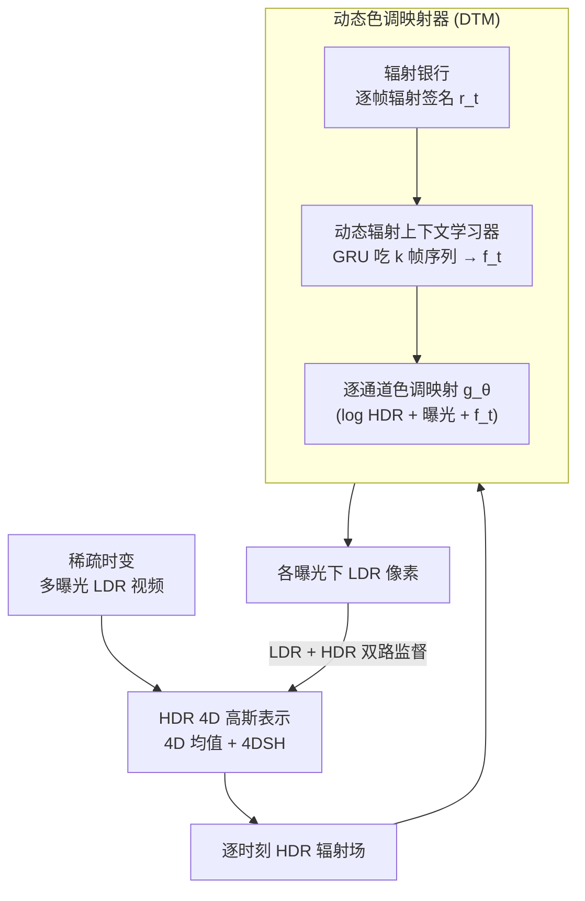

# Dynamic Novel View Synthesis in High Dynamic Range

**会议**: ICLR2026  
**arXiv**: [2509.21853](https://arxiv.org/abs/2509.21853)  
**代码**: [prinasi/HDR-4DGS](https://github.com/prinasi/HDR-4DGS)  
**领域**: 3D视觉  
**关键词**: HDR, Dynamic Novel View Synthesis, 4D Gaussian Splatting, Tone Mapping, Radiance Field  

## 一句话总结

首次提出 HDR 动态新视角合成 (HDR DNVS) 问题，并设计 HDR-4DGS 框架，通过动态色调映射模块在时变场景中实现时序一致的 HDR 辐射场重建，在合成和真实数据集上均超越现有方法。

## 背景与动机

**领域现状**：现有新视角合成方法受限于两个假设：**静态场景** 和 **低动态范围 (LDR) 输入**。

**核心矛盾**：动态新视角合成 (DNVS) 虽然能处理时变场景（如运动物体、变化光照），但仅限于 LDR 图像，在强对比度条件下（直射日光、暗光环境）会丢失过曝/欠曝区域的信息。

**现有痛点**：HDR 新视角合成 (HDR NVS) 能从多曝光 LDR 图像重建 HDR 场景，但现有方法（如 HDR-NeRF、HDR-GS、GaussHDR）均假设场景完全静态。

**现实需求**：真实世界的 HDR 场景天然是动态的——包含运动物体、变化光照、瞬态现象。已有方法无法同时处理动态几何和 HDR 辐射重建。尽管 HDR-HexPlane 初步探索了动态 HDR 重建，但它从未仔细评估 HDR 输出质量，也未在真实场景上验证，留下了大量空白。

**本文目标**：**HDR Dynamic Novel View Synthesis (HDR DNVS)**：从稀疏、时变的多曝光 LDR 输入中，学习一个 HDR 4D 辐射场模型 $\mathcal{F}_h$，使其能在任意时间戳 $t'$ 和任意视角 $V'$ 下渲染时序一致的 HDR 图像。核心挑战在于：

1. 需要联合建模不断演变的场景结构和 HDR 辐射
2. 非刚性运动与时域变化导致复杂的时空不一致性
3. 稀疏 LDR 观测缺乏可靠的亮度先验，导致严重的光度歧义

## 方法详解

### 整体框架

HDR-4DGS 要解决的是「动态场景 + HDR 辐射」的联合重建：输入是稀疏、时变的多曝光 LDR 视频，输出是能在任意时间戳和视角下渲染出时序一致 HDR 图像的 4D 辐射场。它的做法是把场景表示和颜色转换拆成两段串起来——先用一个把颜色空间扩展到 HDR 的 4D Gaussian Splatting 重建出随时间演变的 HDR 辐射，再用一个随场景亮度自适应的动态色调映射器把 HDR 辐射转回每个曝光下的 LDR 像素，从而能用纯 LDR 观测来监督整个 HDR 场。两段都在同一目标下端到端联合优化，而不是分阶段拼接。

### 关键设计

**1. HDR 4D 高斯表示：把动态几何和 HDR 辐射装进同一套高斯里**

要处理时变场景，单靠静态 3DGS 不够，因为像素观测 $\mathbf{I}(u,v,t)$ 不只依赖空间坐标，还依赖时间戳。HDR-4DGS 以 4D Gaussian Splatting 为底座，把每个高斯的均值从三维扩展到四维 $\mu = (\mu_x, \mu_y, \mu_z, \mu_t)$，并用 4D 球谐函数 (4DSH) 建模外观随时间的演变，让同一组高斯能在不同时刻给出不同辐射。相比原始 4DGS，关键改动是把颜色表示空间从 LDR 直接扩到 HDR——高斯存的是高动态范围辐射，并在此基础上构建支持 HDR→LDR 转换的辐射银行 (radiance bank)，为后续的色调映射提供逐时刻的辐射统计。

**2. 动态色调映射器 (DTM)：让 HDR→LDR 的转换随场景亮度自适应**

静态场景里一条固定的色调映射曲线就够用，但动态 HDR 场景的光照在不断变化，固定曲线会在强对比条件下丢掉过曝/欠曝区域的信息。DTM 受人类视觉适应机制启发，让色调映射「看着场景近期的亮度变化」来调整。具体分三步：辐射银行先为每个时间戳汇总平均 HDR 颜色统计 $\mathbf{r}_t^h = \frac{1}{N}\sum_{i=1}^N \mathbf{c}_{i,t}^h$ 作为该帧的「辐射签名」；动态辐射上下文学习器 (DRCL) 再用 GRU 吃进滑动窗口 $k$ 帧的辐射签名序列 $\{\mathbf{r}_{t-k:t}^h\}$，输出一个携带时序亮度趋势的辐射上下文嵌入 $\mathbf{f}_t \in \mathbb{R}^d$；最后把对数域 HDR 颜色叠加曝光时间后与这个上下文拼接，送进逐通道的色调映射函数 $g_\theta$ 得到 LDR 颜色：

$$\mathbf{c}_t^l = g_\theta([\log \mathbf{c}_t^h + \log e_t, \mathbf{f}_t])$$

因为 $\mathbf{f}_t$ 编码了近 $k$ 帧的亮度演变，映射曲线会随场景明暗动态平移，这正是它在时变光照下保持时序一致、又不丢极端区域细节的原因，也是相比 HDR-NeRF/HDR-HexPlane 那种与时间无关的静态映射的本质区别。

### 损失函数 / 训练策略

整体目标是 LDR 与 HDR 两路监督的加权和 $\mathcal{L}_{total} = \mathcal{L}_{ldr} + \alpha \mathcal{L}_{hdr}$。其中 LDR 损失采用双重监督：既约束 2D 色调映射后的像素级 LDR，也约束 3D 光栅化得到的光线级 LDR——两路一起用来抑制 3D 色调映射的过拟合。HDR 损失则先用 $\mu$-law 压缩把 HDR 和 LDR 域对齐再比较。两类重建项都用同一形式的图像损失 $(1-\lambda)\mathcal{L}_1 + \lambda \mathcal{L}_{\text{D-SSIM}}$，取 $\lambda=0.2$。值得注意的是，即便只开 LDR 监督（不喂 HDR 真值），框架也能学出可用的 HDR 场；加上 HDR 联合监督后质量进一步提升。

## 实验关键数据

### 数据集（本文构建）

| 数据集 | 场景数 | 类型 | 特点 |
|--------|--------|------|------|
| HDR-4D-Syn | 8 | 合成 | 多曝光视频 + 同步多视角 LDR 流 + HDR 真值 |
| HDR-4D-Real | 4 | 真实 | 6 台 iPhone 14 Pro 同步拍摄，三种曝光 |

### HDR-4D-Syn 上的核心结果（仅 LDR 监督）

| 方法 | HDR PSNR↑ | HDR SSIM↑ | HDR LPIPS↓ | 推理速度 (fps) |
|------|-----------|-----------|------------|---------------|
| HDR-NeRF | 8.54 | 0.062 | 0.552 | 0.061 |
| HDR-GS | 4.64 | 0.158 | 0.645 | 380.38 |
| HDR-HexPlane | 14.70 | 0.649 | 0.287 | 1.61 |
| **HDR-4DGS** | **25.88** | **0.865** | **0.076** | **40.80** |

- HDR PSNR 比次优方法 (HDR-HexPlane) 高 **11.18 dB**
- 推理速度比 HDR-HexPlane 快约 **25×**，比 HDR-NeRF 快约 **669×**
- 使用 LDR+HDR 联合监督时，HDR PSNR 进一步提升至 **30.40 dB**

### 消融实验要点

- 用独立 HDR 重建方法（4DGS + KPNet 等两阶段流水线）最优仅达 PSNR 20.92，远低于联合优化的 25.88
- DTM vs MLP 静态色调映射器：PSNR 25.88 vs 23.92，LPIPS 0.076 vs 0.142
- 像素级监督贡献：去掉后 PSNR 降低 1.03 dB
- 时序上下文长度 $k=20$ 最优，过小（5/10）或过大（30）均有性能下降

## 亮点与洞察

1. **问题定义价值高**：首次形式化 HDR DNVS 问题，填补了动态场景 HDR 合成的空白
2. **动态色调映射器设计精巧**：受人类视觉适应机制启发，使用 GRU 建模时序辐射上下文，实现自适应 HDR-LDR 转换，且学到的色调映射曲线可解释（单调递增、随场景亮度变化而动态调整）
3. **完整的基准建设**：构建了合成 + 真实两个新数据集，为后续研究提供了标准化评估平台
4. **双重监督策略**：像素级 + 光线级联合约束有效缓解了 3D 色调映射的过拟合问题
5. **效率优势显著**：在大幅提升质量的同时保持了实时级推理速度

## 局限与展望

1. **运动区域结构退化**：在可移动区域仍存在结构退化，作者归因于底层 4DGS 表示能力的固有限制，未来可探索更强的动态表示
2. **真实场景 HDR 指标不够突出**：HDR-4D-Real 上 HDR PSNR（LDR-only 监督时 14.50）低于 HDR-HexPlane（9.306），但作者指出是 HDR 真值噪声和 PSNR 偏好模糊重建所致，视觉质量实际更优
3. **时序窗口固定**：$k=20$ 是固定超参，未做自适应窗口长度探索
4. **实际部署场景有限**：真实数据集仅 4 个室内场景，未覆盖户外大场景、极端天气等更复杂情况
5. **训练时间相对较长**：HDR-4DGS 训练约 69-99 分钟，比 HDR-GS（14-38 分钟）更慢

## 相关工作与启发

| 维度 | HDR-NeRF / HDR-GS | HDR-HexPlane | HDR-4DGS (本文) |
|------|-------------------|--------------|----------------|
| 静/动态 | 静态 | 动态 | 动态 |
| 色调映射 | MLP 静态 | Sigmoid 静态 | GRU 动态自适应 |
| 时序一致性 | 不适用 | 弱 | 强（辐射上下文学习） |
| HDR 评估 | 有 | 无 | 有（完整基准） |
| 实时性 | NeRF 慢 / GS 快 | 慢（~1.6 fps） | 快（~41 fps） |

## 相关工作与启发

- **动态色调映射思路可迁移**：DTM 的"辐射银行 + 序列模型"范式可推广到其他需要时序自适应颜色/辐射转换的任务，如视频 HDR 重建、动态光照下的 relighting
- **双重监督策略通用性强**：像素级 + 光线级联合监督的思路可应用于其他基于 3DGS 的颜色空间转换任务
- **基准数据集价值**：HDR-4D-Syn 和 HDR-4D-Real 可直接用于后续动态 HDR 相关研究的评估

## 评分

- 新颖性: ⭐⭐⭐⭐ — 问题定义新颖，动态色调映射模块设计有创意
- 实验充分度: ⭐⭐⭐⭐ — 合成 + 真实数据集，丰富的消融实验和可视化
- 写作质量: ⭐⭐⭐⭐ — 结构清晰，动机阐述充分，公式表述规范
- 价值: ⭐⭐⭐⭐ — 开辟了 HDR DNVS 新方向，提供完整基准，代码开源

<!-- RELATED:START -->

## 相关论文

- [\[ICLR 2026\] Mono4DGS-HDR: High Dynamic Range 4D Gaussian Splatting from Alternating-exposure Monocular Videos](mono4dgs-hdr_high_dynamic_range_4d_gaussian_splatting_from_alternating-exposure_.md)
- [\[ICML 2025\] High Dynamic Range Novel View Synthesis with Single Exposure](../../ICML2025/3d_vision/high_dynamic_range_novel_view_synthesis_with_single_exposure.md)
- [\[ICLR 2026\] HDR-NSFF: High Dynamic Range Neural Scene Flow Fields](hdr-nsff_high_dynamic_range_neural_scene_flow_fields.md)
- [\[CVPR 2026\] Dynamic-Static Decomposition for Novel View Synthesis of Dynamic Scenes with Spiking Neurons](../../CVPR2026/3d_vision/dynamic-static_decomposition_for_novel_view_synthesis_of_dynamic_scenes_with_spi.md)
- [\[CVPR 2026\] RF4D: Neural Radar Fields for Novel View Synthesis in Outdoor Dynamic Scenes](../../CVPR2026/3d_vision/rf4dneural_radar_fields_for_novel_view_synthesis_in_outdoor_dynamic_scenes.md)

<!-- RELATED:END -->
