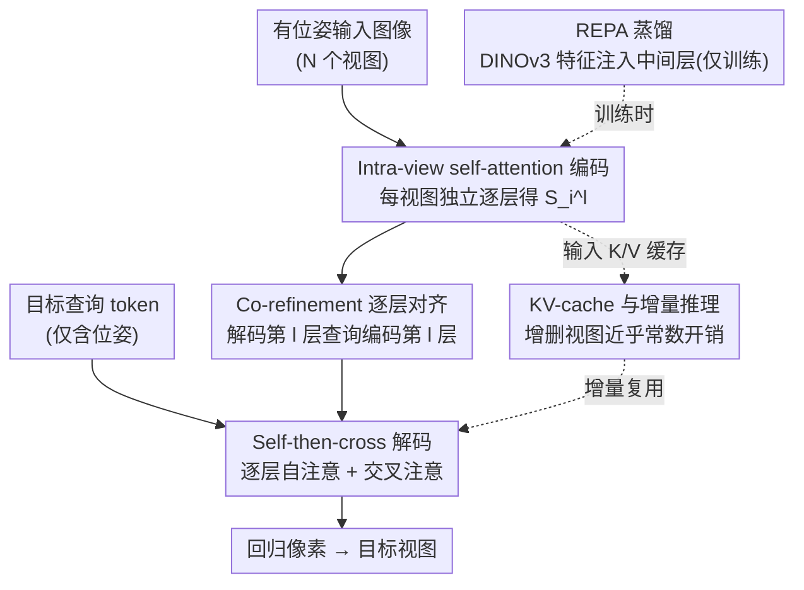

# Efficient-LVSM: Faster, Cheaper, and Better Large View Synthesis Model via Decoupled Co-Refinement Attention

**会议**: ICLR2026  
**arXiv**: [2602.06478](https://arxiv.org/abs/2602.06478)  
**代码**: [efficient-lvsm.github.io](https://efficient-lvsm.github.io/)  
**领域**: 3D视觉  
**关键词**: novel view synthesis, Transformer, Dual-Stream Architecture, KV-Cache, Attention Decoupling

## 一句话总结

提出 Efficient-LVSM，通过解耦输入视图编码与目标视图生成的双流架构，将新视图合成的复杂度从 $O(N_{in}^2)$ 降至 $O(N_{in})$，在 RealEstate10K 上以 50% 训练时间达到 SOTA（29.86 dB PSNR），推理速度提升 4.4 倍。

## 背景与动机

新视图合成（Novel View Synthesis, NVS）从 2D 图像重建 3D 场景是计算机视觉的核心问题。近年从 NeRF/3DGS 的逐场景优化，发展到 LVSM 这类前馈式 Transformer 方法，直接从有位姿的图像合成新视图，消除了手工 3D 先验的依赖。

然而 LVSM 的 decoder-only 设计将所有输入和目标 token 拼接后做全 self-attention，存在两大瓶颈：

1. **效率低**：对输入视图数量 $N$ 呈二次复杂度 $O(N^2)$；生成多个目标视图时输入表示被重复计算
2. **性能受限**：异构 token（含内容的输入视图 vs 仅含位姿的目标查询）共享同一组 attention 参数，阻碍了各自学习专门化表示

## 核心问题

如何在保持端到端前馈 NVS 框架的前提下，解耦输入编码与目标生成，同时提升效率和质量？

LVSM encoder-decoder 变体虽避免了重复计算，但将所有输入压缩为单一隐向量会丢失信息，重建质量显著下降。需要一种既保留多层级细粒度特征、又支持高效推理的新架构。

## 方法详解

### 整体框架

Efficient-LVSM 要解决的是 LVSM 把所有输入与目标 token 拼在一起做全 self-attention 带来的「又慢又互相干扰」问题。它的做法是把整条管线拆成两条互不纠缠的流：输入的有位姿图像先各自走 **Input Encoder** 编成特征，仅含位姿信息的目标查询 token 再走 **Target Decoder**，反复去查询编码器特征、逐步把要渲染的新视图「补全」出来，最后回归像素得到目标视图。关键在于输入编码不再受目标 token 牵连，目标生成也只通过 cross-attention 单向取用输入特征，于是输入侧的复杂度从 $O(N^2 M)$ 降到 $O(NM + N)$，且输入表示算一次就能给所有目标视图复用。

### 关键设计

**1. Intra-view self-attention 编码：让每个输入视图独立成特征，复杂度随视图数线性增长**

针对全 self-attention 把 $N$ 个输入视图全部两两纠缠、复杂度二次膨胀的痛点，编码器只在同一输入视图内部的 patch 之间做 self-attention，按 $\mathbf{S_i}^l = \mathbf{S_i}^{l-1} + \text{Self-Attn}_{\text{input}}^l(\mathbf{S_i}^{l-1})$ 逐层更新，不同视图之间彼此隔离。这样总开销随输入视图数线性增长而非平方，更重要的是每个视图被独立编码、不依赖训练时见过多少个输入，因此测试时可以零样本泛化到任意数量的输入视图。

**2. Self-then-cross 解码：用交替的自注意力与交叉注意力分工完成「场景对齐」和「内容取用」**

目标视图之间需要保持几何一致，同时又要从输入里抓取该渲染的内容，这两件事单靠 cross-attention 做不好。解码器因此在每层交替执行两步：先 $\mathbf{T_j}^l = \mathbf{T_j}^{l-1} + \text{Self-Attn}_{\text{target}}^l(\mathbf{T_j}^{l-1})$ 让目标 token 之间交换场景级信息、对齐空间关系，再 $\mathbf{T_j}^l = \mathbf{T_j}^l + \text{Cross-Attn}_{\text{target}}^l(\mathbf{T_j}^l, \mathbf{S_1}^l, ..., \mathbf{S_N}^l)$ 从输入特征中提取所需内容。消融实验显示，这种 6+6 层 self/cross 交替结构明显优于 12 层纯 cross-attention，说明给目标 token 之间留出沟通通道是必要的。

**3. Co-refinement 逐层对齐：让解码器每一层都能取用编码器同层特征，而不是只吃最后一层**

传统 encoder-decoder 把输入压成编码器最后一层的单一表示，细粒度信息在压缩中流失，这也是 LVSM Enc-Dec 变体重建质量掉到 28.55 dB 的原因。Co-refinement 改成让解码器第 $l$ 层的 cross-attention 直接查询编码器第 $l$ 层的特征 $\mathbf{S_i}^l$，于是早期层的细粒度纹理与后期层的高层语义都能被对应解码层取用。可视化结果表明，co-refinement 生成的特征图比 vanilla encoder-decoder 捕获到更多目标视图的细节。

**4. REPA 蒸馏：把预训练视觉特征注入编码器中间层，且不增加推理成本**

为进一步提升编码质量，作者用 REPA 从预训练 DINOv3 把视觉特征蒸馏进编码器中间层，损失为最大化 patch 级相似度 $\mathcal{L}_{REPA} = \frac{1}{N}\sum_{i=1}^{N}\text{sim}(f(\mathbf{I}), h_\phi(\mathbf{X_k}))$，其中 $h_\phi$ 是只在训练时使用的投影头。推理阶段直接丢弃预训练编码器与投影层，因此不带来额外开销。一个有意思的发现是：REPA 对 Efficient-LVSM 提升显著，但对原始 LVSM 几乎无效——因为后者的全 self-attention 把不同视图的特征图纠缠在一起，蒸馏信号无处对齐，这也反过来佐证了解耦编码的价值。

**5. KV-cache 与增量推理：把解耦换来的「输入算一次」红利兑现成近乎常数的增量开销**

由于输入编码与目标无关、且 cross-attention 是单向取用，输入视图的 key/value 算一次即可缓存复用。基于此，新增一个目标视图时只需让新的目标 token 去查询已缓存的输入特征即可直接渲染；新增一个输入视图时也只需单独编码这一个视图、把它的 key/value 追加进缓存，而无需重算已有部分。两种增量操作的延迟与显存都近乎常数，使模型天然适配交互式 3D 浏览这类不断增删视图的场景。

## 实验关键数据

### 场景级（RealEstate10K，2 输入视图）

| 方法 | PSNR ↑ | SSIM ↑ | LPIPS ↓ |
|------|--------|--------|---------|
| GS-LRM | 28.10 | 0.892 | 0.114 |
| LVSM Dec-Only (512) | 29.53 | 0.904 | 0.141 |
| **Efficient-LVSM (512)** | **29.86** | **0.905** | 0.147 |

### 物体级（ABO / GSO，512 分辨率）

| 方法 | ABO PSNR | GSO PSNR |
|------|----------|----------|
| GS-LRM | 29.09 | 30.52 |
| LVSM Dec-Only | 32.10 | 32.36 |
| **Efficient-LVSM** | **32.65** | **32.92** |

### 效率对比

- 训练收敛速度：约 **2×** 快于 LVSM
- 推理速度：**4.4×** 快于 LVSM Dec-Only（最高可达 14.9×）
- 训练资源：64 张 A100 训练 3 天，仅为 LVSM 的 **50%** 训练时间
- 增量推理：新增视图时延迟和显存近乎恒定

### 零样本泛化

用 4 个输入视图训练，测试时可泛化到不同数量的输入视图，得益于各视图独立处理的设计。

## 亮点

1. **问题分析深刻**：从信息异构性和计算复杂度两个角度系统分析 LVSM 全 self-attention 的不足，推导出双流解耦方案
2. **Co-Refinement 设计精巧**：逐层对齐编码器-解码器特征，充分利用多尺度信息
3. **实用价值高**：KV-cache + 增量推理使模型可部署于交互式 3D 场景浏览
4. **效率与质量双赢**：在所有 benchmark 上超越 LVSM 的同时大幅降低训练和推理成本
5. **REPA 蒸馏的条件性发现**：揭示了蒸馏效果与注意力架构的耦合关系

## 局限与展望

1. 输入编码器的 intra-view attention 不包含跨视图交互，场景理解能力完全依赖解码器的 cross-attention，对遮挡严重的场景可能不足
2. 未探索更大规模模型或更高分辨率下的 scaling 行为
3. 仅在静态场景上验证，动态场景的适用性未知
4. LPIPS 指标在 512 分辨率下略逊于 LVSM Dec-Only（0.147 vs 0.141），感知质量仍有提升空间

## 与相关工作的对比

| 维度 | LVSM Dec-Only | LVSM Enc-Dec | Efficient-LVSM |
|------|--------------|--------------|----------------|
| 输入复杂度 | $O(N^2)$ | $O(N^2)$ | $O(N)$ |
| 参数共享 | 异构 token 共享 | 分离但仅用最后层 | 分离 + 逐层 co-refinement |
| KV-Cache | 不支持 | 不支持 | 支持 |
| 增量推理 | 不支持 | 不支持 | 支持 |
| 变视图泛化 | 差 | 差 | 强（零样本） |
| RealEstate10K PSNR | 29.53 | 28.55 | **29.86** |

与 pixelSplat / MVSplat 等基于高斯溅射的方法相比，Efficient-LVSM 不依赖显式 3D 表示，更端到端，质量更高但需要更多计算资源。

## 启发与关联

1. **双流解耦思想可迁移**：异构输入的 Transformer 任务（如多模态理解、机器人感知）都可借鉴将 provider 和 query 解耦的设计
2. **Co-Refinement 的通用性**：逐层交叉查询的思想可应用于其他 encoder-decoder 架构，不限于 NVS
3. **KV-Cache 的 3D 应用**：将 LLM 中成熟的 KV-cache 技术引入 3D 视觉，为实时交互式渲染提供了新思路
4. **蒸馏与架构的耦合**：REPA 在不同架构上效果差异显著，提示蒸馏策略应与模型架构协同设计

## 评分
- 新颖性: ⭐⭐⭐⭐ — 双流 co-refinement 设计在 NVS 领域有明确创新，但单个组件并非全新
- 实验充分度: ⭐⭐⭐⭐⭐ — 场景级+物体级多 benchmark，效率/质量/泛化三维度全面消融
- 写作质量: ⭐⭐⭐⭐ — 从问题分析到方案推导逻辑清晰，图表丰富
- 价值: ⭐⭐⭐⭐⭐ — 效率与质量双赢，KV-cache 实用性强，对后续工作有明确指导意义

<!-- RELATED:START -->

## 相关论文

- [\[CVPR 2026\] FlashMesh: Faster and Better Autoregressive Mesh Synthesis via Structured Speculation](../../CVPR2026/3d_vision/flashmesh_faster_and_better_autoregressive_mesh_synthesis_via_structured_specula.md)
- [\[ICCV 2025\] RayZer: A Self-supervised Large View Synthesis Model](../../ICCV2025/3d_vision/rayzer_a_self-supervised_large_view_synthesis_model.md)
- [\[CVPR 2026\] From Rays to Projections: Better Inputs for Feed-Forward View Synthesis](../../CVPR2026/3d_vision/from_rays_to_projections_better_inputs_for_feed-forward_view_synthesis.md)
- [\[ICCV 2025\] Faster and Better 3D Splatting via Group Training](../../ICCV2025/3d_vision/faster_and_better_3d_splatting_via_group_training.md)
- [\[ICLR 2026\] UrbanGS: A Scalable and Efficient Architecture for Geometrically Accurate Large-Scene Reconstruction](urbangs_a_scalable_and_efficient_architecture_for_geometrically_accurate_large-s.md)

<!-- RELATED:END -->
