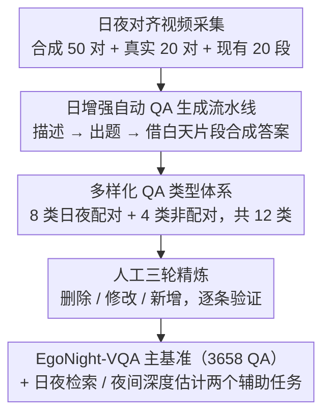

# EgoNight: Towards Egocentric Vision Understanding at Night with a Challenging Benchmark

**会议**: ICLR 2026  
**arXiv**: [2510.06218](https://arxiv.org/abs/2510.06218)  
**代码**: [https://github.com/dehezhang2/EgoNight](https://github.com/dehezhang2/EgoNight)  
**领域**: 3D视觉 / 第一人称视觉  

## 一句话总结

提出首个夜间第一人称视觉基准 EgoNight，包含日夜对齐视频和 3658 个人工验证 QA 对，揭示 MLLM 在低光照下存在高达 32.8% 的性能下降。

## 研究背景与动机

### 领域现状

第一人称视觉理解近年来取得了显著进展，大规模数据集如 EPIC-KITCHENS、Ego4D、Ego-Exo4D 推动了动作识别、物体检测、视频问答等任务的发展。MLLM（如 GPT-4V、Gemini、Qwen-VL）已在视频理解中展现出强大能力，专用的第一人称 MLLM（如 EgoGPT、Exo2Ego）也相继出现。

### 现有痛点

几乎所有现有的第一人称视觉数据集和基准都局限于白天或光线良好的场景，忽视了夜间低光照这一在现实应用中不可避免的场景。这导致当前模型在夜间环境下的鲁棒性完全未知，严重限制了智能助手、导航系统等在夜间场景中的实际部署。

### 核心矛盾

现实中，第一人称视觉系统（如智能导航助手）必须在夜间运行，面临低光照、不均匀照明和严重受限的可见度等挑战。然而，缺乏适当的夜间基准使得研究者既无法评估模型的夜间性能，也无法有针对性地改进。此外，夜间标注本身因低可见度而极其困难，难以保证标注质量。

### 本文方案

提出 EgoNight，首个系统性的夜间第一人称视觉基准。核心创新在于引入日夜对齐视频：利用 Blender 合成精确对齐的日夜视频对（EgoNight-Synthetic），设计视频引导录制策略采集真实世界的日夜对齐视频（EgoNight-Sofia），并整合现有的夜间数据（EgoNight-Oxford）。基于此构建了 EgoNight-VQA 基准及两个辅助任务。

---

## 方法详解

### 整体框架

EgoNight 要解决的是「没有夜间第一人称基准、夜间标注又极难保证质量」这对矛盾，它的破题思路是让每段夜间视频都有一段对齐的白天视频做参照。整条流水线可以这样串起来：先采集三类日夜对齐视频源（Blender 合成 50 对、真实录制 20 对、整合现有夜间数据 20 段），再用一条「日增强」的三阶段自动流水线把白天信息引入夜间标注、按一套覆盖 12 种类型的 QA 体系生成共 3658 个 QA 对，最后在 VQA 主基准之外再派生出日夜对应检索和夜间深度估计两个辅助任务。日夜对齐既是数据采集的主线，也是后续一切自动标注和定量分析得以成立的地基。

### 关键设计

**1. 日夜对齐视频采集：让每段夜间画面都有一段同轨迹的白天画面可比**

夜间低可见度直接导致标注困难、模型性能无法定量归因，作者用两条互补的路径把日夜帧严格对上。合成侧（EgoNight-Synthetic）先用 Infinigen 生成多样化室内 3D 场景，标注员清理场景并模拟一条行走轨迹，再让 Blender 在完全相同的轨迹下分别渲染白天与夜间两个版本，从而拿到像素级精确对齐的 50 对视频，覆盖 100+ 环境素材和 50+ 物体类别。真实侧（EgoNight-Sofia）无法重渲染，于是设计了视频引导录制策略：先录白天视频，夜间录制时在手机上回放这段白天视频作为视觉引导，帮助穿戴者复现步速、视点和动作，事后再做时空修剪进一步对齐，最终得到 20 对覆盖公寓、办公室、超市、街道等场景的真实对齐视频。两条路径分别解决了「对齐精度」和「真实性」，合在一起让日夜性能差距可以被干净地测量。

**2. 日增强自动 QA 生成流水线：用白天的清晰信息反哺夜间的模糊标注**

直接在夜间片段上让模型出题作答，会因可见度差而错误百出，作者把生成拆成三步并在关键步骤引入白天信息。第一步针对目标 QA 类型提示 GPT-4.1 为夜间片段生成详细描述；第二步把描述连同夜间片段一起喂给 MLLM，产出多样化的问题候选；第三步合成伪答案——对有日夜配对的类型，改用对齐的白天片段来生成更准确的答案，对无配对的类型（如光照变化）才直接从夜间片段推断。这样答案的可靠性来自白天、问题的语境忠于夜间。生成结果再经标注员三轮删除／修改／新增精炼，每个 QA 对至少人工验证一次，累计投入 300+ 小时，兼顾了自动化的规模和人工的质量底线。

**3. 多样化 QA 类型体系：覆盖夜间特有、此前未被探索的理解维度**

为了不让基准退化成普通日间 VQA 的换皮，作者定义了 12 种 QA 类型，并按是否存在日夜配对一分为二。配对类型 8 种——物体识别、文本识别、空间推理、场景序列、导航、静态计数、动作识别、非常识推理，这些可以借白天片段做日增强标注；非配对类型 4 种——光照识别、光照变化、动态检测、动态计数，专门考察只在夜间才凸显的现象。其中导航、场景序列、光照识别/变化和非常识推理是本文新提出的任务维度，正是这些类型在实验中对现有 MLLM 构成了最大挑战。

---

## 实验关键数据

### 主实验

评估 10 个 SOTA MLLM 在 EgoNight-VQA 上的表现：

| 模型 | Synthetic (夜) | Sofia (夜) | Oxford (夜) | 平均准确率 |
|------|--------------|-----------|------------|----------|
| GPT-4.1 | 30.73% | 26.33% | 35.72% | **30.93%** |
| Gemini 2.5 Pro | 27.18% | 25.00% | 33.21% | 28.46% |
| InternVL3-8B | 19.28% | 17.10% | 23.80% | **20.06%** |
| Qwen2.5-VL-72B | 18.56% | 16.73% | 22.41% | 19.23% |
| Qwen2.5-VL-7B | 14.58% | 13.28% | 16.71% | 14.86% |
| EgoGPT | 12.88% | 14.03% | 15.95% | **14.29%** |

日夜性能差距：EgoNight-Synthetic 上平均下降 **32.8%**，EgoNight-Sofia 上平均下降 **25.0%**。

### 消融实验 / 深入分析

| 微调策略 | Synthetic 准确率 | Real 准确率 | 提升幅度 |
|---------|----------------|------------|---------|
| Zero-shot（基线） | 14.83% | - | - |
| 全模型微调 | **24.67%** | **21.88%** | +9.84% |
| 仅视觉编码器 | 19.23% | 18.56% | +4.40% |
| 仅 LLM | 21.15% | 19.02% | +6.32% |
| 合成数据训练→真实测试 | - | 20.57% | +5.74% |

**关键发现**：

1. 合成数据与真实数据高度相关（Pearson $r = 0.9359$，$p = 6.847 \times 10^{-5}$），合成数据微调可有效提升真实场景性能
2. 感知类任务在日间表现更好但夜间下降更大，推理类任务整体更难但受光照影响相对较小
3. 新提出的 QA 类型（光照识别、导航、非常识推理）对现有 MLLM 构成极大挑战
4. 辅助任务中，GPT-4.1 在空间检索上达到 80%+ 准确率，但在时间定位上表现不佳；鱼眼深度估计模型优于通用模型

---

## 亮点与洞察

- 填补了夜间第一人称视觉理解的空白，日夜对齐设计精巧，使性能差距可定量分析
- QA 类型设计全面，新增导航、光照识别等多种此前未探索的任务维度
- 日增强标注流水线巧妙利用白天信息辅助夜间标注，兼顾效率与质量
- 合成数据与真实数据高度相关（$r = 0.9359$），验证了合成数据的研究价值

## 局限与展望

- 数据规模较小（90 个视频，3658 QA 对），与大规模基准相比存在差距
- 合成数据占比较高（约 55%），可能不完全反映真实世界复杂性
- 仅评估了 VQA 及两个辅助任务，未涵盖更多夜间第一人称任务
- 日增强标注策略依赖 GPT-4.1，生成质量受限于该模型能力

## 相关工作与启发

- **vs Ego4D/EPIC-KITCHENS**: 这些大规模第一人称数据集均聚焦白天场景，EgoNight 是首个专注夜间的基准
- **vs NightBench**: NightBench 关注一般夜间图像理解，EgoNight 专注第一人称视角且提供日夜对齐
- **vs 低光照增强方法**: 传统方法聚焦像素级增强，本文关注语义级理解差距

## 评分

- 新颖性: ⭐⭐⭐⭐ 首个系统性夜间第一人称视觉基准
- 实验充分度: ⭐⭐⭐⭐ 覆盖 10 个 MLLM，含微调分析和辅助任务
- 写作质量: ⭐⭐⭐⭐ 结构清晰，数据呈现规范
- 价值: ⭐⭐⭐⭐ 填补重要研究空白，实用价值高

<!-- RELATED:START -->

## 相关论文

- [\[ICCV 2025\] Egocentric Action-aware Inertial Localization in Point Clouds with Vision-Language Guidance](../../ICCV2025/3d_vision/egocentric_action-aware_inertial_localization_in_point_clouds_with_vision-langua.md)
- [\[AAAI 2026\] OpenScan: A Benchmark for Generalized Open-Vocabulary 3D Scene Understanding](../../AAAI2026/3d_vision/openscan_a_benchmark_for_generalized_open-vocabulary_3d_scene_understanding.md)
- [\[CVPR 2026\] Ego-1K: A Large-Scale Multiview Video Dataset for Egocentric Vision](../../CVPR2026/3d_vision/ego-1k_--_a_large-scale_multiview_video_dataset_for_egocentric_vision.md)
- [\[ICLR 2026\] EgoWorld: Translating Exocentric View to Egocentric View using Rich Exocentric Observations](egoworld_translating_exocentric_view_to_egocentric_view_using_rich_exocentric_ob.md)
- [\[ICCV 2025\] Fish2Mesh Transformer: 3D Human Mesh Recovery from Egocentric Vision](../../ICCV2025/3d_vision/fish2mesh_transformer_3d_human_mesh_recovery_from_egocentric_vision.md)

<!-- RELATED:END -->
