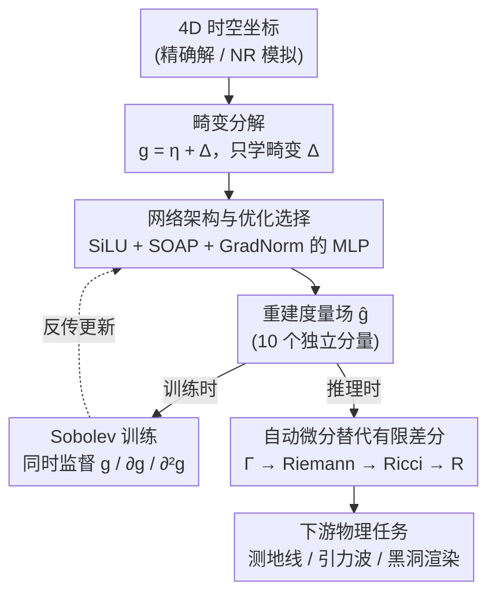

# Einstein Fields: A Neural Perspective To Computational General Relativity

**会议**: ICLR 2026  
**arXiv**: [2507.11589](https://arxiv.org/abs/2507.11589)  
**代码**: [github.com/AndreiB137/EinFields](https://github.com/AndreiB137/EinFields)  
**领域**: 3D视觉  
**关键词**: 神经场, 广义相对论, 张量场压缩, 数值相对论, 自动微分

## 一句话总结
提出EinFields，首个将神经隐式表示应用于四维广义相对论模拟压缩的框架，通过将度量张量场编码为紧凑神经网络权重，实现4000倍存储压缩、5-7位数值精度，且通过自动微分获得的张量导数比有限差分精度高5个数量级。

## 研究背景与动机

**领域现状**：广义相对论（GR）将引力描述为四维时空的曲率，由Einstein场方程（EFEs）控制。精确解仅适用于理想化情况，数值相对论（NR）成为模拟黑洞合并、引力波等天体事件的必要手段。NR是科学计算中计算量最大的领域之一，需要PB级存储和超算级并行计算。

**现有痛点**：
   - NR模拟产生**PB级数据**，难以存储和分发
   - 自适应网格上的有限差分（FD）方法在敏感区域容易产生数值误差
   - 高阶FD模板虽提高精度但增加通信成本
   - 离散表示无法在任意分辨率查询，且导数计算受截断误差限制

**核心矛盾**：GR的物理完全由度量张量及其前两阶导数编码，但传统方法将连续张量场离散化存储导致巨大存储开销和导数精度损失。

**本文目标**
   - 将NR模拟数据压缩到可管理的存储大小
   - 提供网格无关、分辨率无限的连续表示
   - 通过自动微分获得高精度张量导数（Christoffel符号、Riemann张量等）
   - 支持下游物理任务（测地线、曲率诊断、引力波提取）

**切入角度**：将计算机视觉中的神经场（NeRF/SDF等）推广到物理张量场，提出"神经张量场"概念——用MLP拟合度量张量的10个独立分量。

**核心 idea**：用紧凑的神经隐式网络（<2M参数~7MiB）表示四维时空度量张量场，结合Sobolev训练和自动微分，同时实现4000×压缩和10^5×导数精度提升。

## 方法详解

### 整体框架
这篇论文想解决的是数值相对论（NR）里"模拟数据太大、导数精度又不够"的双重困境。EinFields 的思路很直接：用一个紧凑的 MLP 把四维时空的度量张量场拟合下来，让网络权重本身成为这片时空几何的压缩存储，再用自动微分从这个连续表示里精确读出各阶导数。

整条流水线可以分成"拟合"和"读出"两半。拟合侧：网络接受 4D 时空坐标 $x = (x^0, x^1, x^2, x^3)$（来自精确解或 NR 模拟数据），但不直接学整个度量——而是先把度量减去平坦背景，只让网络学**畸变** $\Delta_{\alpha\beta}$，再由一个专为导数监督调过的 MLP 输出，重建出度量张量的 10 个独立分量 $\hat{g}_\theta: x \in \mathscr{M} \rightarrow g_{\alpha\beta}(x) \in \text{Sym}^2(T^*_x\mathscr{M})$；训练时用 Sobolev 损失同时约束度量及其一、二阶导数。读出侧：拿到这个连续可微的度量后，整条微分几何链路全部交给自动微分——度量 → Christoffel 符号 → Riemann 张量 → Ricci 张量 → 曲率标量——再喂给测地线追踪、引力波提取、黑洞渲染等下游任务。整个 <2M 参数（约 7 MiB）的网络替代了原本 PB 级的离散网格。

### 关键设计

**1. 畸变分解：让网络只学曲率，别去拟合平坦背景**

度量张量在数值上往往被平坦时空的主导项淹没——例如 $g_{tt} \sim 1/r$、$g_{\theta\theta} \sim r^2$ 这些随坐标剧烈变化的分量，会让网络把表示能力浪费在拟合一个本来已知的背景上。EinFields 因此把度量拆成平坦背景加畸变 $\Delta_{\alpha\beta} = g_{\alpha\beta} - \eta_{\alpha\beta}$，只让网络去学物理上真正非平凡的畸变部分 $\Delta_{\alpha\beta}$，推理时再加回平坦背景 $\eta_{\alpha\beta}$ 重建度量。这样网络的容量集中在有意义的曲率偏差上，收敛更快、数值缩放也更稳——消融实验里去掉畸变分解后精度直接劣化 15 倍。

**2. 网络架构与优化选择：为"被高阶导数监督"这件事专门调过**

光有畸变分解还不够，承载它的 MLP 本身也得能扛得住一、二阶导数监督——常规 INR 配置在这种目标下并不最优，论文于是按导数表现重新选了组件。激活函数用 SiLU——它在导数监督下表现最好，消融里换成经典的 WIRE 反而更差；优化器用准牛顿的 SOAP 而非 Adam，带来约 30 倍精度提升；多任务梯度用 GradNorm 平衡度量/Jacobian/Hessian 三路损失，避免某一项主导。网络规模从 64×3 到 512×8 不等，总参数控制在 190 万以内。这一步保证了下面的高阶监督能真正落到网络权重上，而不是被某项损失带偏或被不可微激活卡住。

**3. Sobolev 训练：不只监督度量，连它的一阶、二阶导数一起监督**

GR 的所有物理量都不是由度量本身决定的，而是由它的导数决定：Christoffel 符号来自一阶导，Riemann/Ricci 张量来自二阶导。所以只把度量拟合得很准还不够，导数可能仍然很糙。EinFields 的做法是把监督信号一路推到高阶，同时约束度量、Jacobian（40 个独立分量）和 Hessian（100 个独立分量）：

$$\mathcal{L}^g_{\text{Sob}}(\theta) = \mathbb{E}_x[\lambda_0\|g - \hat{g}\|^2 + \lambda_1\|\partial g - \partial\hat{g}\|^2 + \lambda_2\|\partial^2 g - \partial^2\hat{g}\|^2]$$

三项分别加权度量、一阶导、二阶导的误差。这种 Sobolev 损失把 Christoffel 符号的精度直接抬高了 2 个数量级，相当于在训练阶段就保证了下游所有几何量的可用性。

**4. 自动微分替代有限差分：把截断误差从源头上去掉**

训练好的网络是连续可微的，读出导数这一步就不必再回到离散网格。传统 NR 在网格上用有限差分（FD）算导数，精度被截断误差 $O(h^n)$ 死死卡住，越高阶导数误差越大，还得用高阶模板换通信成本。EinFields 直接用 JAX 的 forward-mode AD 沿微分几何链路精确求导：$g_{\alpha\beta} \xrightarrow{\texttt{jacfwd}} \Gamma^\gamma_{\alpha\beta} \xrightarrow{\nabla} R^\delta_{\alpha\beta\gamma} \xrightarrow{\text{Tr}_g} R_{\alpha\beta} \xrightarrow{\text{Tr}_g} R$。AD 没有截断误差，在 FLOAT32 单精度下相对 FD 的精度提升可达 5 个数量级（Riemann 张量上甚至到 14000×）。这是整个框架"导数比 FD 准"的根本来源。

### 损失函数 / 训练策略
训练目标即上面的 Sobolev 损失，由度量、Jacobian、Hessian 三项加权组成。学习率采用 Cosine 调度。训练时间随监督阶数变化：不带 Sobolev 约 100s，加到 Hessian 监督约 2000s（NVIDIA H200 GPU）。

## 实验关键数据

### 主实验（Schwarzschild黑洞解）

| 表示方法 | Rel. $\ell_2$ | MAE | 存储 | 压缩率 |
|----------|-------------|-----|------|--------|
| 显式网格 | - | - | 343 MiB | 1× |
| EinFields | 1.08e-6 | 2.11e-6 | **85 KiB** | **4035×** |
| EinFields (+Jac) | 3.37e-7 | 9.49e-7 | 1.1 MiB | 311× |
| EinFields (+Jac+Hess) | **1.88e-7** | **9.07e-7** | 202 KiB | 1698× |

### 导数精度对比（vs 高阶FD，FLOAT32）

| 几何量 | FD (h=0.01) MAE | EinFields AD MAE | 精度提升 |
|--------|-----------------|-----------------|---------|
| Christoffel符号 | 5.37e-6 | **9.98e-7** | 5× |
| Riemann张量 | 1.78e-2 | **1.25e-6** | **14000×** |
| Ricci张量 | 4.81e-2 | **9.66e-6** | **5000×** |
| Kretschmann标量 | 1.33e-2 | **1.07e-5** | **1200×** |

### 消融实验

| 配置 | Rel. $\ell_2$ | 训练时间 |
|------|-------------|---------|
| Baseline (畸变+Jac+Hess+SiLU+SOAP+Cosine) | **1.40e-7** | 1400s |
| 全量度量 → 畸变 | 2.13e-6 | 1407s |
| SOAP → Adam | 4.16e-6 | 1150s |
| SiLU → WIRE | 4.12e-6 | 3045s |
| 去掉Hessian监督 | 1.51e-7 | 509s |
| 去掉全部Sobolev | 2.37e-7 | 364s |

### 关键发现
- **中子星NR模拟验证**：在真实的BSSN演化中子星振荡模拟上，EinFields实现2121×压缩（2.9GiB→1.4MiB），Rel. $\ell_2$ = 3.60e-5
- **畸变分解至关重要**：去掉后精度劣化15倍（1.40e-7→2.13e-6）
- **SOAP优化器优于Adam**：30倍精度提升
- **测地线、引力波、黑洞渲染全面验证**：Schwarzschild/Kerr时空的测地线重建与解析解高度一致

## 亮点与洞察
- **"神经张量场"概念的开创性**：将NeF从计算机视觉（SDF/NeRF/辐射场）推广到物理张量场领域，EinFields的关键差异在于**动力学自然涌现**——因为度量编码了时空几何，其导数直接给出运动方程
- **AD vs FD的范式转变**：在FLOAT32下AD比6阶FD精度高5个数量级（Riemann张量），这对整个科学计算社区都有启发——凡是需要高阶导数的领域都可借鉴
- **神经黑洞渲染**：作为概念验证，用EinFields表示的度量直接追踪光线渲染黑洞图像，展示了框架与复杂下游任务的兼容性

## 局限与展望
- 压缩是有损的：即使FLOAT64训练，Rel. $\ell_2$ < 1e-9目前不可达
- 在FLOAT64精度下尚未超越FD
- 查询延迟非平凡（10^5点需数毫秒），在需要反复顺序评估的下游任务中可能成瓶颈
- 测地线求解器的长期rollout存在误差累积
- **可改进方向**：扩展到二元黑洞合并、二元中子星合并等真正的大规模NR模拟；与谱方法的系统性能对比

## 相关工作与启发
- **vs SIREN (Sitzmann et al., 2020)**：经典INR用正弦激活，但EinFields发现SiLU在导数监督下性能更好（ablation: WIRE也不如SiLU）
- **vs PINNs (Raissi et al., 2019)**：PINNs用物理损失从头求解PDE，EinFields是**压缩已有解**而非求解——更实用的应用场景
- **vs 传统NR (Einstein Toolkit)**：EinFields是传统NR管线的下游补充，不替代而是增强——提供压缩存储和高精度连续查询

## 评分
- 新颖性: ⭐⭐⭐⭐⭐ 首次将神经场引入数值相对论，"神经张量场"概念具有开创性
- 实验充分度: ⭐⭐⭐⭐ Schwarzschild/Kerr/引力波三个解析解+中子星NR模拟，覆盖面好，但缺少二元合并等最有挑战性的场景
- 写作质量: ⭐⭐⭐⭐⭐ 物理背景介绍清晰，方法与结果衔接流畅，附录极为详尽
- 价值: ⭐⭐⭐⭐ 对数值相对论和科学计算ML社区都有重要参考价值，但实际影响取决于后续能否扩展到动态二元系统

<!-- RELATED:START -->

## 相关论文

- [\[ECCV 2024\] Omni-Recon: Harnessing Image-Based Rendering for General-Purpose Neural Radiance Fields](../../ECCV2024/3d_vision/omni-recon_harnessing_image-based_rendering_for_general-purpose_neural_radiance_.md)
- [\[ICLR 2026\] Learning Physics-Grounded 4D Dynamics with Neural Gaussian Force Fields](learning_physics-grounded_4d_dynamics_with_neural_gaussian_force_fields.md)
- [\[ICLR 2026\] Augmented Radiance Field: A General Framework for Enhanced Gaussian Splatting](augmented_radiance_field_a_general_framework_for_enhanced_gaussian_splatting.md)
- [\[CVPR 2025\] Preconditioners for the Stochastic Training of Neural Fields](../../CVPR2025/3d_vision/preconditioners_for_the_stochastic_training_of_neural_fields.md)
- [\[ICLR 2026\] HDR-NSFF: High Dynamic Range Neural Scene Flow Fields](hdr-nsff_high_dynamic_range_neural_scene_flow_fields.md)

<!-- RELATED:END -->
