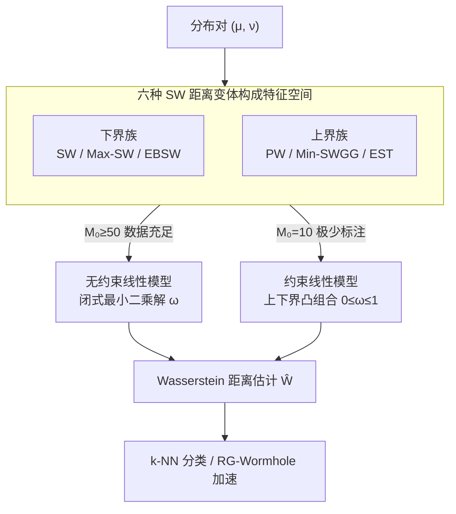

# Fast Estimation of Wasserstein Distances via Regression on Sliced Wasserstein Distances

**会议**: ICLR 2026  
**arXiv**: [2509.20508](https://arxiv.org/abs/2509.20508)  
**代码**: [有](https://github.com/hainn2803/Regression-Wasserstein)  
**领域**: 3D视觉  
**关键词**: Wasserstein距离, Sliced Wasserstein, 最优传输, 线性回归, 点云分类

## 一句话总结

利用 Sliced Wasserstein（SW）距离既能提供 Wasserstein 距离的下界、lifted SW 距离又能提供上界这一数学性质，构建极简的线性回归模型（RG 框架），仅用少量分布对的精确 Wasserstein 作为监督信号就能训练出高精度的 Wasserstein 代理估计器，在低数据场景下全面碾压 Transformer 方法 Wasserstein Wormhole。

## 研究背景与动机

**领域现状**：Wasserstein 距离是最优传输（OT）理论的核心度量，因其捕捉分布间几何结构的能力，在生成建模、计算生物学、3D 点云处理、数据集比较等领域被广泛使用。实际应用中通常需要对大量分布对反复计算 Wasserstein 距离，例如 k-NN 分类中每个测试样本与所有训练样本的距离计算，或 Wormhole 训练中 batch 内的 pairwise 距离。

**现有痛点**：精确 Wasserstein 距离的计算复杂度为 $O(n^3 \log n)$（线性规划求解），面对大规模数据集完全不可行。现有的加速方案各有短板：Sinkhorn 正则化通过熵正则化降至 $O(n^2)$ 但引入系统性近似偏差；深度学习方法如 Wasserstein Wormhole 用 Transformer 编码分布到欧几里得嵌入空间，但需要大量训练数据（数百到数千对精确 Wasserstein），低数据场景性能急剧退化；Sliced Wasserstein 将高维问题投影到一维后计算（$O(n \log n)$），但本质上只是真实 Wasserstein 的一个下界，精度不够。

**核心矛盾**：速度与精度之间存在根本性 trade-off——快的方法（SW）不够准，准的方法（精确 WD）太慢，介于两者之间的深度学习方法（Wormhole）又需要大量训练数据和计算资源。

**本文目标** (1) 如何在不用神经网络的前提下从 SW 距离精确恢复 Wasserstein 距离？(2) 如何仅用极少量（10-100 对）的精确 Wasserstein 标注就训练出好的 estimator？(3) 能否与现有深度方法（Wormhole）结合实现加速？

**切入角度**：作者注意到一个被忽视的关键数学结构——标准 SW 距离族(SW, Max-SW, EBSW)提供 Wasserstein 的下界，而 lifted SW 距离族(PW, Min-SWGG, EST)提供上界，且这些上下界之间存在严格的偏序关系。既然真实 Wasserstein 被夹在上下界之间，那么用这些上下界做线性组合来回归真实值就是一个自然且有理论保证的路子。

**核心 idea**：用 6 种 SW 距离变体（3 个下界 + 3 个上界）作为特征，通过最小二乘线性回归拟合真实 Wasserstein 距离，闭式解训练、无需迭代、无需神经网络。

## 方法详解

### 整体框架

RG（Regression）框架的 pipeline 极其简单：输入是任意一对概率分布 $(\mu, \nu)$，先把它们送进**六种 SW 距离变体构成的特征空间**——三个从下方逼近真值的下界（SW、Max-SW、EBSW）加三个从上方逼近的上界（PW、Min-SWGG、EST），这些计算都是 $O(n \log n)$ 量级的；然后用预先标定好的线性权重对这 $K$ 个特征做加权求和，输出即为 Wasserstein 距离的估计值。回归模型本身有两种形态：数据相对充足时用**无约束线性模型**（自由度高、精度更优），只有十来对标注的极端少样本场景则切到**约束线性模型**（把上下界凸组合、参数减半，抗过拟合）。训练阶段只需从全部 $N$ 对分布中随机抽样 $M_0 \ll N$ 对、计算它们的精确 Wasserstein（代价高但只做一次），再求最小二乘闭式解即完成标定。

### 关键设计

**1. 六种 SW 距离变体构成特征空间：从上下两侧逼近真实值**

单一 SW 变体只能从一侧逼近 Wasserstein，精度天花板很低，所以作者把能快速算的 SW 族整体当成回归特征。下界族有三个：SW（均匀采样投影方向后取一维 Wasserstein 的期望）、Max-SW（取最大化投影距离的那个方向，$\max_{\theta} W_p(P_\theta \sharp \mu, P_\theta \sharp \nu)$）、EBSW（用能量函数 $f$ 给投影方向加权）；上界族对称地有三个：PW（均匀采样方向的 lifted cost 期望）、Min-SWGG（取最小化 lifted cost 的方向）、EST（能量加权的 lifted cost）。关键之处在于它们之间存在严格偏序，把真值牢牢夹在中间：

$$\text{SW} \leq \text{EBSW} \leq \text{Max-SW} \leq W_p \leq \text{Min-SWGG} \leq \text{EST} \leq \text{PW}$$

正因为真值被"夹逼"在这条链里，把多个上下界一起喂进回归才能比单变体准得多——这也是后面 RG-seo（用全 6 种）能稳定压过 RG-s（只用 2 种）的根本原因。

**2. 无约束线性模型与闭式解：一行矩阵运算完成训练**

有了这组特征，恢复 Wasserstein 就被建模成最朴素的线性回归 $W_p(\mu,\nu) = \sum_{k=1}^K \omega_k S_p^{(k)}(\mu,\nu) + \varepsilon$。最小二乘估计直接给出闭式解 $\hat{\omega}_{LSE} = (\hat{S}^\top \hat{S})^{-1} \hat{S}^\top \hat{W}$，其中 $\hat{S} \in \mathbb{R}^{M \times K}$ 是 SW 距离矩阵、$\hat{W} \in \mathbb{R}^M$ 是精确 Wasserstein 向量；几何上它等价于把 $\hat{W}$ 沿 $L_2$ 投影到 SW 特征张成的线性子空间上。这样既不用迭代训练、也没有学习率/epoch 这类超参要调，一次矩阵求逆就出权重。当标注样本充足（$M_0 \geq 50$）、自由度足够发挥时，无约束模型的 $R^2$ 一致优于下面的约束版本。

**3. 约束线性模型（中点法）：把上下界先验当归纳偏置**

无约束模型在极低数据量下容易过拟合，于是作者给极端少样本场景准备了约束版本：把每对（下界 $SL$，上界 $SU$）组合成凸加权 $\omega_k \cdot SL^{(k)} + (1-\omega_k) \cdot SU^{(k)}$ 并约束 $0 \leq \omega_k \leq 1$，参数量直接减半。$K=1$ 时同样有闭式解 $\hat{\omega} = \frac{\mathbb{E}[(SU-SL)(SU-W)]}{\mathbb{E}[(SU-SL)^2]}$，$K>1$ 时退化为一个二次规划。凸组合的形式本身就强制估计值落在上下界之间，相当于把"真值夹在上下界中间"这条先验写死进模型，因此在 $M_0=10$ 这种只有十对标注的场景里比自由参数版更稳。

### 损失函数 / 训练策略

训练使用最小二乘损失（MSE），闭式解无需迭代优化。总计算开销分为两部分：(1) 训练阶段对 $M_0$ 个样本计算精确 Wasserstein（$O(M_0 n^3 \log n)$，一次性代价），(2) 推理阶段对任意分布对计算 $K$ 种 SW 距离（$O(KLn(\log n + d))$）再做线性组合（$O(K)$），远快于精确 Wasserstein。

此外，作者提出 **RG-Wormhole** 混合方案：先用小样本标定 RG 权重，然后将 Wormhole 训练中所有 Wasserstein 距离调用（batch 内 pairwise 距离、decoder 重建损失）替换为 RG 代理，其他架构/优化器/schedule 完全不变。这使得每个训练 step 的计算量从 Wasserstein 的 $O(n^3)$ 降至 SW 的 $O(n \log n)$，batch size 增大时 Wormhole 训练时间近指数增长而 RG-Wormhole 近乎线性。

## 实验关键数据

### 主实验：ShapeNetV2 点云 k-NN 分类

在 10 类 ShapeNetV2 点云上，使用 500 个训练样本，仅用 10 个样本估计 RG 权重（$M_0=10$）。

| 方法 | $R^2$ | k=1 | k=3 | k=5 | k=10 | k=15 |
|------|-------|------|------|------|------|------|
| WD（精确） | - | 83.6% | 83.5% | 84.2% | 82.9% | 79.2% |
| SW（仅下界） | - | 72.2% | - | - | - | - |
| RG-s（SW+PW） | 0.868 | 82.1% | 81.7% | 80.8% | 79.4% | 75.5% |
| RG-e（EBSW+EST） | 0.926 | 82.5% | 82.2% | 80.9% | 79.6% | 75.7% |
| RG-se（4种SW） | 0.935 | 82.5% | 82.2% | 82.6% | 81.9% | 76.5% |
| RG-seo（全部6种） | 0.937 | 82.8% | 83.3% | **83.5%** | 82.3% | 77.9% |

RG-seo 在 k=5 时达到 83.5%，几乎追平精确 WD 的 84.2%，而单纯 SW 下界只有 72.2%。

### 低数据场景对比 Wormhole（$M_0=100$）

跨 4 个数据集（维度从 2D 到 2500D），100 个训练样本下的 $R^2$ 对比：

| 方法 | MNIST (2D) | ShapeNetV2 (3D) | MERFISH (254D) | scRNA-seq (2500D) |
|------|-----------|----------------|-------------|---------------|
| Wormhole | 0.28 | 0.65 | -3.6 | 0.04 |
| RG-s 约束 | 0.84 | 0.88 | 0.91 | 1.00 |
| RG-e 约束 | 0.86 | 0.90 | 0.92 | 1.00 |
| RG-o 约束 | 0.77 | 0.66 | 0.75 | 0.99 |
| RG-s 无约束 | 0.93 | 0.94 | 0.96 | 0.99 |
| RG-se 无约束 | **0.93** | **0.95** | **0.98** | **1.00** |
| RG-seo 无约束 | 0.93 | 0.95 | 0.97 | 0.99 |

Wormhole 在 MERFISH 上 $R^2=-3.6$（完全失效），而 RG-se 无约束仍有 0.98。在所有数据集上 RG 框架全面领先。

### 消融实验

| 对比维度 | 结论 |
|---------|------|
| 约束 vs 无约束 | 无约束模型在 $M_0 \geq 50$ 时一致更强（自由度更高）；约束模型在 $M_0=10$ 极低数据时更稳定（参数少不容易过拟合） |
| 单变体 vs 多变体 | RG-seo（6维特征）> RG-se（4维）> RG-s/RG-e（2维）> RG-o（2维），更多 SW 变体提供更丰富的信息 |
| RG-o 表现差 | Max-SW 和 Min-SWGG 都依赖优化求解，经验估计的方差大，导致回归不稳定 |
| RG-Wormhole 加速 | 训练时间随 batch size 增大：Wormhole 近指数增长（WD 计算是 $O(B^2 n^3)$），RG-Wormhole 几乎持平；嵌入/重建/插值质量与原版一致 |

### 关键发现

- **10 对样本即可用**：RG-s 约束模型仅用 10 对分布训练就能达到 $R^2 > 0.8$，Wormhole 在同等数据量下基本不可用
- **跨维度一致有效**：从 2D（MNIST 点云）到 2500D（scRNA-seq 基因表达）均保持高 $R^2$，说明线性关系的假设跨维度成立
- **RG-Wormhole 完美替代**：保留 Wormhole 的所有能力（嵌入、插值、重建、重心计算），模型解码出的 3D 形状与原版无视觉差异，但训练速度大幅提升

## 亮点与洞察

- **极简到令人惊讶的有效性**：核心模型就是一个线性回归 + 闭式解，没有任何神经网络，却在 4 个数据集上全面碾压 Transformer 方法 Wormhole。这说明当问题具有良好的数学结构（上下界偏序关系）时，简单模型可以远胜过复杂模型
- **上下界夹逼的巧妙利用**：这是本文最核心的 insight——SW 的下界族和 lifted SW 的上界族构成一个"信息完备"的特征空间，真实 Wasserstein 距离就是这些特征的线性函数。这种理论驱动的特征工程比端到端学习更高效
- **RG-Wormhole 的即插即用设计**：只替换距离计算，不改架构不改训练流程，这种"模块化替换"思路可以推广到任何以 Wasserstein 作为子程序的深度学习方法
- **约束模型的归纳偏置**：用 $\omega + (1-\omega)$ 的凸组合形式自动保证估计值落在上下界之间，是一种优雅的正则化

## 局限与展望

- **线性假设的局限**：SW 与 Wasserstein 的真实关系可能是非线性的——作者也承认核方法（kernel regression）可能更优。但线性模型在所有实验中已经足够好（$R^2 > 0.9$），这反而说明非线性成分不大
- **元分布假设**：训练和测试的分布对必须来自同一个元分布（meta-distribution），跨域泛化能力未被验证。例如在 ShapeNetV2 上训练的 RG 权重能否用于 ModelNet40？
- **不生成嵌入空间**：纯 RG 只能估计距离，无法做插值/重建等需要嵌入空间的操作，需要与 Wormhole 结合。这限制了独立使用场景
- **投影方向数 $L$ 的选择**：SW 的 Monte Carlo 估计需要指定投影方向数 $L$，不同维度/数据集的最优 $L$ 不同，缺乏自适应选择策略

## 相关工作与启发

- **vs Wasserstein Wormhole**：Wormhole 用 Transformer 编码器将分布映射到欧几里得空间，训练需要大量精确 WD 对。RG 框架完全不需要神经网络，在 $M_0 \leq 200$ 的低数据场景全面领先。但 Wormhole 的嵌入空间支持插值和重建，RG 必须与之结合才能获得这些能力
- **vs Sinkhorn 距离**：Sinkhorn 通过熵正则化将 LP 问题转化为矩阵缩放，复杂度降至 $O(n^2 / \varepsilon^2)$，但每次调用仍是 $O(n^2)$。RG 框架训练后的推理只需 $O(Ln \log n)$，且不引入正则化偏差
- **vs 低秩 OT**：低秩近似方法利用最优传输计划的低秩结构加速，但仍需逐对求解。RG 的优势在于"一次训练，反复使用"——标定好权重后，新的分布对只需 SW 计算
- **启发**：上下界回归的思路可以推广到其他计算昂贵的距离度量——只要能找到目标度量的快速上下界近似，就可以用类似的线性回归框架做代理估计

## 评分

- 新颖性: ⭐⭐⭐⭐ 核心 idea（用 SW 上下界做线性回归）简单但新颖，数学动机清晰
- 实验充分度: ⭐⭐⭐⭐⭐ 4 个数据集跨越 2D-2500D，涵盖分类/可视化/嵌入/插值/重建，消融全面
- 写作质量: ⭐⭐⭐⭐ 符号系统清晰，理论推导严谨，但预备知识部分占比过大
- 价值: ⭐⭐⭐⭐⭐ 即插即用的 Wasserstein 加速方案，闭式解零调参，工程落地极其友好

<!-- RELATED:START -->

## 相关论文

- [\[ECCV 2024\] WaSt-3D: Wasserstein-2 Distance for Scene-to-Scene Stylization on 3D Gaussians](../../ECCV2024/3d_vision/wast-3d_wasserstein-2_distance_for_scene-to-scene_stylization_on_3d_gaussians.md)
- [\[ICML 2026\] Streaming Sliced Optimal Transport](../../ICML2026/3d_vision/streaming_sliced_optimal_transport.md)
- [\[CVPR 2026\] Sparse-View Localization via Online Neural 3D Regression](../../CVPR2026/3d_vision/sparse-view_localization_via_online_neural_3d_regression.md)
- [\[ICLR 2026\] EgoNight: Towards Egocentric Vision Understanding at Night with a Challenging Benchmark](egonight_towards_egocentric_vision_understanding_at_night_with_a_challenging_ben.md)
- [\[CVPR 2026\] CoLoR: The Devil is in Scene Coordinate Regression for Large-Scale Visual Localization](../../CVPR2026/3d_vision/color_the_devil_is_in_scene_coordinate_regression_for_large-scale_visual_localiz.md)

<!-- RELATED:END -->
