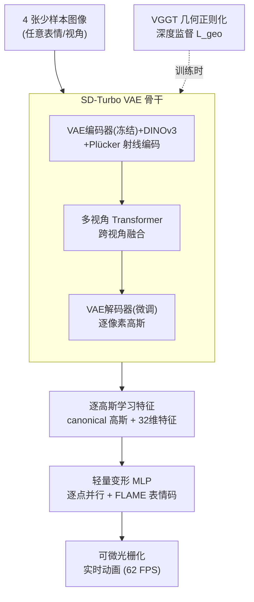

# FastGHA: Generalized Few-Shot 3D Gaussian Head Avatars with Real-Time Animation

**会议**: ICLR 2026  
**arXiv**: [2601.13837](https://arxiv.org/abs/2601.13837)  
**代码**: 待确认  
**领域**: 3D视觉 / 头部重建  
**关键词**: 3D Gaussian Splatting, head avatar, few-shot, real-time animation, feed-forward

## 一句话总结
提出 FastGHA，一个前馈式少样本 3D 高斯头部化身生成框架，从 4 张任意表情/视角的输入图像在 ~1 秒内重建可动画的 3D 高斯头部，支持 62 FPS 实时动画，在 Ava-256 上 PSNR 达到 22.5 dB（超越 Avat3r 的 20.7，且快 7.75 倍）。

## 研究背景与动机

**领域现状**：3D 头部化身生成方法分为优化式和前馈式。优化式（如 per-identity 拟合）需要大量多视角数据和长时间优化，不适合实时部署。前馈式方法（Avat3r, GPAvatar）可以从少量图像生成，但要么不支持可控动画，要么动画速度慢（Avat3r 仅 8 FPS），要么重建质量有限。

**现有痛点**：(a) Avat3r 使用几何先验的跳跃连接（skip-connection），导致几何误差直接传播到最终输出；(b) 现有方法在表情迁移精度（AKD）和身份保持（CSIM）上难以兼顾；(c) 动画速度与质量的权衡——高质量方法通常很慢。

**切入角度**：两阶段设计——先从少样本图像前馈重建 canonical 高斯头部（带学习的逐高斯特征），再用轻量 MLP 做表情驱动的变形，实现快速动画。

**核心 idea**：基于 SD-Turbo VAE + DINOv3 特征的多视角 Transformer 重建 canonical 高斯头部，配合逐高斯学习特征和轻量变形 MLP 实现实时动画。

## 方法详解

### 整体框架
FastGHA 要解决的核心矛盾是：少样本前馈重建要快，可动画化又要质量高，而以往方法总在两端顾此失彼。它把任务拆成两个解耦的阶段——先把人"建模"成一个静态的标准头，再把表情"驱动"到这个标准头上。第一阶段从 4 张任意表情/视角的图像前馈重建出一个 canonical（中性表情）高斯头部，这个头部除了常规高斯属性外还额外携带每个高斯点的学习特征；第二阶段只需把目标 FLAME 表情码喂给一个轻量 MLP，逐点算出位移和颜色偏移，就能把标准头变形成任意表情并实时渲染。这样昂贵的多视角重建只做一次，后续动画退化成廉价的逐点 MLP 前向，速度由此而来。

### 关键设计

**1. SD-Turbo VAE 骨干：用预训练生成先验补少样本的信息缺口**

仅凭 4 张图重建一个完整可渲染的头，输入信息天然不足，需要强先验来"脑补"未观测区域。FastGHA 没有从头训一个编码器，而是直接借用 SD-Turbo 的 VAE：冻结其编码器以保留预训练得到的高层语义特征，只微调解码器，让它从融合后的多视角特征中吐出逐像素高斯参数。具体地，输入图像先经 VAE 编码器提取颜色特征、DINOv3 提取语义特征，再用 Plücker 射线把相机姿态编码进去，交给多视角 Transformer 做跨视角融合，最后由这个微调过的 VAE 解码器还原成 canonical 高斯头部 $\mathcal{G}^c_f$。消融显示这套预训练权重是最关键的一环——换成从头训练，PSNR 直接掉 0.49 dB、CSIM 掉 0.023，是所有组件里影响最大的。

**2. 逐高斯学习特征 $\mathbf{f}\in\mathbb{R}^{32}$：给变形阶段留下表情线索**

如果第一阶段只输出标准高斯属性（位置、颜色、旋转、缩放、透明度），第二阶段的变形 MLP 就只能基于低级几何去猜表情该怎么动，信息太薄。FastGHA 让解码器在标准属性之外，额外为每个高斯学习一个 32 维特征向量，专门编码与表情相关的高层语义，并把它一并送进变形 MLP 作为输入。等于把"这个点在脸上扮演什么角色、表情变化时该如何响应"的信息提前存进了每个高斯里。这一笔特征开销很小，但去掉它 PSNR 降 0.22、CSIM 降 0.014，属于典型的小代价换大收益。

**3. VGGT 几何正则化：把几何先验从"输入"降级为"监督"**

Avat3r 的做法是把几何先验通过跳跃连接（skip-connection）直接灌进网络，问题在于先验本身带误差，这些误差会沿着跳跃连接一路传播到最终输出。FastGHA 改变了几何先验的"接入位置"：用预训练 VGGT 模型生成的点云作为深度监督信号 $\mathcal{L}_{geo}$ 加在损失里，而不是当成网络输入。这样几何先验只在训练时引导网络收敛，推理时不再参与前向计算，先验的误差也就无法直接污染输出——这是 FastGHA 相对 Avat3r 在几何利用方式上最本质的区别，也是作者强调的一条通用原则：几何先验该当正则化用，而非直接输入。

**4. 轻量变形 MLP：把动画做成可完全并行的逐点运算**

实时动画的瓶颈在于变形阶段的计算量。FastGHA 把变形设计成对每个高斯独立处理的 MLP：输入是该高斯的 canonical 属性加上 FLAME 表情码，输出是它的位置和颜色偏移 $\delta_z$，高斯点之间不发生任何交互。无交互意味着所有点可以高度并行计算，再配合每次重建只跑一次的设计，动画帧率得以拉到 62 FPS（相比 Avat3r 的 8 FPS 快 7.75 倍）。代价是缺少跨高斯的全局一致性约束，这一点作者也在局限里有提及。

### 一个完整示例
以一次从拍摄到动画的完整流程走一遍：给定同一人 4 张不同表情/视角的照片，先各自经 SD-Turbo VAE 编码器和 DINOv3 抽出颜色与语义特征，配上 Plücker 射线编码的相机姿态，送进多视角 Transformer 融合成统一的跨视角表示；微调的 VAE 解码器据此输出逐像素高斯，融合成带 32 维逐高斯特征的 canonical 头部 $\mathcal{G}^c_f$——这一步约 0.98 秒。之后想让它做任意表情，只需取目标帧的 FLAME 表情码，连同每个高斯的 canonical 属性和 32 维特征一起喂给变形 MLP，逐点算出 $\delta_z$ 偏移，变形后的高斯经可微光栅化渲染成图。由于变形是纯逐点并行运算，这一驱动-渲染环节能稳定跑在 62 FPS，实现交互式实时动画。

### 损失函数 / 训练策略
总损失把像素重建、结构相似、感知、轮廓与几何监督叠在一起：

$$\mathcal{L} = \mathcal{L}_{RGB} + \mathcal{L}_{SSIM} + 0.5\,\mathcal{L}_{perc} + \mathcal{L}_{sil} + 0.5\,\mathcal{L}_{geo}$$

其中 $\mathcal{L}_{geo}$ 即上面用 VGGT 点云提供的深度监督。训练数据为 Ava-256（256 人 / 40 相机）加 NeRSemble（425 人 / 16 相机），每次采样同一人的 4 张不同表情/视角图像作为输入、8 张同表情图像作为监督，在 4×H800 上训 400k 步、约 4 天。

## 实验关键数据

### 主实验

| 方法 | PSNR↑ | SSIM↑ | LPIPS↓ | CSIM↑ | AKD↓ | FPS |
|------|------|------|-------|------|-----|-----|
| InvertAvatar | 14.2 | 0.36 | 0.55 | 0.29 | 15.8 | - |
| GPAvatar | 19.1 | 0.70 | 0.32 | 0.26 | 6.9 | - |
| Avat3r | 20.7 | 0.71 | 0.33 | 0.59 | 4.8 | 8 |
| **FastGHA** | **22.5** | **0.77** | **0.23** | **0.73** | **4.8** | **62** |

FastGHA 全面超越 Avat3r：PSNR +1.8, LPIPS -0.10, CSIM +0.14, FPS 7.75×。

### 消融实验

| 配置 | PSNR | CSIM | AKD |
|------|------|------|-----|
| w/o VAE 预训练权重 | 20.789 | 0.681 | 5.487 |
| w/o 几何损失 | 21.132 | 0.687 | 5.049 |
| w/o 逐高斯特征 | 21.053 | 0.690 | 5.216 |
| **Full FastGHA** | **21.274** | **0.704** | **4.996** |

### 关键发现
- **预训练 VAE 权重是最关键因素**：去掉后 PSNR 降 0.49，CSIM 降 0.023
- **重建时间亚秒级**：4 张输入仅需 0.98 秒
- **输入图像数量的权衡**：2 张→128FPS 但质量下降；6 张→32FPS 但质量提升有限。4 张是最佳平衡点
- 在 NeRSemble 上同样强劲：PSNR 24.0, SSIM 0.81

## 亮点与洞察
- **几何先验的正确使用方式**：作为正则化损失而非跳跃连接输入——避免了 Avat3r 的误差传播问题。这是一个通用的设计原则
- **逐高斯语义特征**：32维学习特征使变形 MLP 可以利用超越低级几何属性的高层信息，小开销大收益
- **实时动画的关键**：变形 MLP 独立处理每个高斯（无需跨高斯交互），完全可并行化

## 局限与展望
- 需要预先获取相机参数和 FLAME 表情编码——实际应用中这一步可能成为瓶颈
- 仅在实验室多视角数据集上训练和评估，对 in-the-wild 自拍等低质量输入的鲁棒性未验证
- 不支持头发和配饰的精细建模（受限于高斯表示）
- 变形 MLP 独立处理每个高斯，缺乏全局一致性约束

## 相关工作与启发
- **vs Avat3r**: Avat3r 也是前馈式，但用跳跃连接几何先验导致误差传播，且仅 8FPS；FastGHA 用深度监督替代跳跃连接，62FPS
- **vs GPAvatar**: GPAvatar 身份保持差（CSIM 0.26 vs 0.73），因为缺乏强大的语义特征提取

## 评分
- 新颖性: ⭐⭐⭐⭐ 两阶段设计和逐高斯特征的思路清晰有效，但各组件单独来看非开创性
- 实验充分度: ⭐⭐⭐⭐ 两个数据集、多基线对比、消融全面、速度分析
- 写作质量: ⭐⭐⭐⭐ Pipeline 描述清晰，但部分设计选择的动机可以更深入
- 价值: ⭐⭐⭐⭐ 首次实现少样本+实时动画的 3D 高斯头部化身，实用价值高

<!-- RELATED:START -->

## 相关论文

- [\[CVPR 2026\] EmoTaG: Emotion-Aware Talking Head Synthesis on Gaussian Splatting with Few-Shot Personalization](../../CVPR2026/3d_vision/emotag_emotion-aware_talking_head_synthesis_on_gaussian_splatting_with_few-shot_.md)
- [\[ECCV 2024\] HeadGaS: Real-Time Animatable Head Avatars via 3D Gaussian Splatting](../../ECCV2024/3d_vision/headgas_real-time_animatable_head_avatars_via_3d_gaussian_splatting.md)
- [\[AAAI 2026\] Generalized Geometry Encoding Volume for Real-time Stereo Matching](../../AAAI2026/3d_vision/generalized_geometry_encoding_volume_for_real-time_stereo_matching.md)
- [\[CVPR 2026\] PhysHead: Simulation-Ready Gaussian Head Avatars](../../CVPR2026/3d_vision/physhead_simulation-ready_gaussian_head_avatars.md)
- [\[CVPR 2026\] STAvatar: Soft Binding and Temporal Density Control for Monocular 3D Head Avatars Reconstruction](../../CVPR2026/3d_vision/stavatar_soft_binding_and_temporal_density_control_for_monocular_3d_head_avatars.md)

<!-- RELATED:END -->
