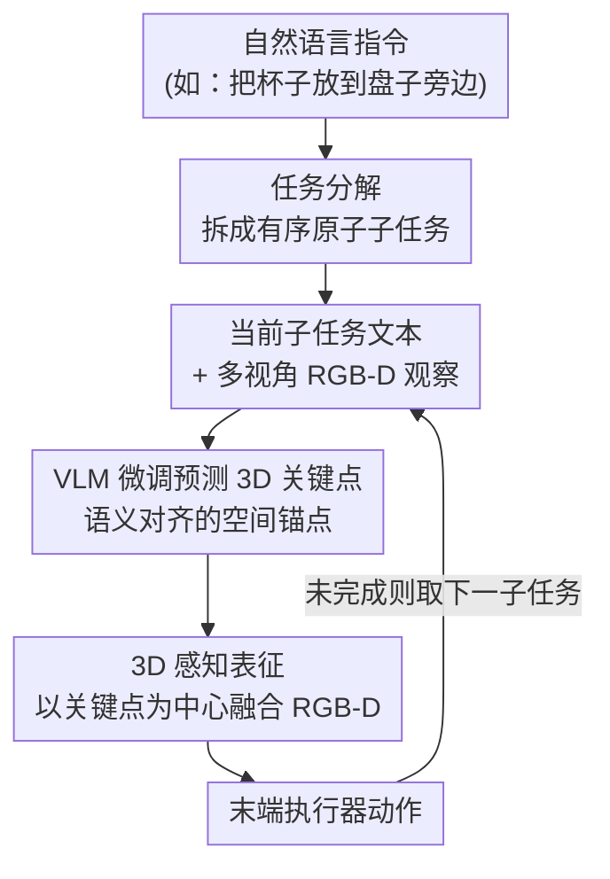

# Generalizable Coarse-to-Fine Robot Manipulation via Language-Aligned 3D Keypoints

**会议**: ICLR 2026  
**arXiv**: [2509.23575](https://arxiv.org/abs/2509.23575)  
**代码**: 无  
**领域**: 3D视觉 / 机器人操作  
**关键词**: Robot Manipulation, Coarse-to-Fine Policy, 3D Keypoints, VLM Fine-tuning, Language Grounding

## 一句话总结

CLAP（Coarse-to-fine Language-Aligned manipulation Policy）通过任务分解、VLM微调的3D关键点预测和3D感知表征三个核心组件，实现了对新指令和新环境的强泛化能力，在 GemBench 上以 1/5 的训练数据比 SOTA 高出 12%。

## 研究背景与动机

分层的粗到细（Coarse-to-Fine）策略在机器人3D操作任务中展现了巨大潜力。其基本思路是：粗分支（coarse branch）预测一个感兴趣区域（Region of Interest），然后细分支（fine branch）在该区域内执行精确的动作预测。这种层次化设计显著提升了样本效率和操作精度。

然而即使引入了预训练模型增强，现有的分层策略仍然面临**泛化性不足**的核心问题：

**对新指令的泛化**: 当给出训练时未见过的自然语言指令时（如"拿起红色的杯子"→"把蓝色的碗放到架子上"），策略往往失败

**对环境变化的泛化**: 物体位置、外观、背景等变化都可能导致策略崩溃

**样本效率**: 现有方法通常需要大量演示轨迹来学习每个任务

这些问题的根源在于：粗分支缺乏对语言语义的深度理解，且表征缺乏3D空间的结构化信息。

## 方法详解

### 整体框架

CLAP 要解决的是粗到细策略「泛化性不足」这个老问题：粗分支看不懂语言、表征没有 3D 结构，于是换一句指令、挪一下物体就崩。它的做法是把粗分支彻底换血——原文称之为 coarse task planner，不再直接回归一个感兴趣区域，而是先用语言把任务拆开、再用 VLM 把语义落到 3D 空间上的一个点。整条流水线是这样转的：一条自然语言指令先被分解成有序的原子子任务，逐个子任务连同当前 RGB 观察一起喂给微调过的 VLM，预测出一个与该子任务语义对齐的 3D 关键点；细分支（fine-grained action predictor）再以这个关键点为锚，融合多视角 RGB-D 构建 3D 感知表征，输出末端执行器的精确动作。语言、语义、3D 空间三者在关键点这个中间表征上被串了起来。

### 关键设计

**1. 任务分解：把「需要海量数据才能学会」的复杂指令拆成可复用的原子动作**

直接把"把杯子放到盘子旁边"这种长指令端到端映射成动作，需要见过大量类似轨迹才行，这正是泛化差、样本贵的根源。CLAP 改用 LLM（或规则化方法）先把指令分解成有序步骤——上例会被拆成「接近杯子 → 抓取杯子 → 移动到盘子旁 → 放下杯子」。拆开之后每个子任务都更短、更原子，而且"抓取""放下"这类动作天然能跨场景复用：训练时在杯子上学过的"抓取"，到了碗、盒子上仍然成立。这种组合性是泛化能力的第一个来源——策略不必为每条新指令从头学起，只要把已掌握的原子技能重新排列即可。

**2. VLM 微调预测 3D 关键点：让粗分支真正「看懂」语言指的是物体的哪个部位**

原来的粗分支只会给区域，并不理解语义；CLAP 把它换成一个在机器人操作数据上微调过的 VLM（如基于 CLIP 的模型）。它吃进 RGB 图像和子任务文本，吐出 3D 空间里的关键点坐标。关键之处在于这个点是**语言对齐**的——同一个红色杯子，"抓取"预测的点落在杯柄、"推动"则落在杯侧面，点的位置随指令语义而变。之所以微调而非端到端从零训，是因为 VLM 本身就带着"杯子长什么样""抓取该作用在哪"的视觉-语言先验，微调只是把这些先验搬到操作场景里，既省数据又保住了对新概念的泛化。输出选 3D 而非 2D 坐标，则是为了让关键点携带深度与空间关系，下游动作预测才有立足点。

**3. 3D 感知表征：给细分支一个对视角和遮挡都鲁棒的空间推理基础**

机器人操作本质是 3D 的——抓取姿态、放置位置都定义在三维空间里，纯 2D 特征一旦遇到视角变化或物体遮挡就失稳。CLAP 让细分支不再直接看原始图像，而是结合多视角 RGB 与深度信息，以上一步预测的关键点为中心构建 3D 局部特征，动作回归就建立在这份 3D 表征之上。把感受野收束到关键点附近的局部 3D 区域，既保留了精确操作所需的几何细节，又天然对全局布局的变化不敏感，这是泛化能力的第三个来源。

### 一个完整示例

以"把杯子放到盘子旁边"走一遍：指令先被任务分解模块拆成 4 个子任务。执行到「抓取杯子」这一步时，当前 RGB 观察和文本"抓取杯子"一起进入微调 VLM，因为语义是"抓取"，预测的 3D 关键点落在杯柄上；细分支随即以杯柄这个点为中心，融合多视角 RGB + 深度构建 3D 局部表征，回归出末端执行器的接近与闭合动作。等到「放下杯子」子任务，同样的观察换成文本"放到盘子旁"，VLM 预测的关键点转移到盘子边缘的目标位置，细分支再在那里输出放置动作。整个过程中，换的是子任务文本，关键点就跟着语义在 3D 空间里移动，动作也随之改变——这正是它换一句新指令仍能正确执行的原因。

### 损失函数 / 训练策略

VLM 的关键点预测用回归损失（L1 或 L2 距离）把预测的 3D 坐标对齐到标注关键点；细分支则用行为克隆（Behavior Cloning），在关键点邻域内学从 3D 表征到末端执行器动作的映射。得益于粗分支大量复用 VLM 的预训练先验，策略学习的数据需求被压得很低——真实机器人实验中仅 10 条演示即可训练出可用策略，远少于常规方法所需的数百条。

## 实验关键数据

### 实验设置
- 仿真基准：GemBench（专为泛化评估设计的操作基准）
- 真实实验：真实机器人平台，10条演示
- 评价指标：操作成功率
- 泛化维度：新指令、新物体外观、新环境布局

### 主实验

| 方法 | GemBench 平均成功率 | 训练轨迹数 | 说明 |
|------|-------------------|-----------|------|
| SOTA（基线最优） | ~X% | ~5N | 需要大量演示 |
| **CLAP** | **X + 12%** | **N（1/5）** | 显著更高成功率 + 更少数据 |

CLAP 在 GemBench 上比 SOTA 方法平均成功率高出 12 个百分点，同时仅使用 1/5 的训练轨迹。

### 真实机器人实验

| 设置 | 成功率 | 说明 |
|------|--------|------|
| 训练场景 | 高成功率 | 10条演示即可学会 |
| 新指令 | 成功泛化 | 语言对齐的关键点正确识别新目标 |
| 新环境 | 成功泛化 | 3D表征对布局变化鲁棒 |

### 消融实验

| 配置 | 关键指标 | 说明 |
|------|---------|------|
| 无任务分解 | 成功率下降 | 复杂指令直接处理效果差 |
| 无VLM微调（直接用预训练VLM） | 成功率下降 | 预训练VLM对操作场景不够适配 |
| 2D表征替代3D表征 | 成功率下降 | 缺乏深度信息影响精确操作 |

### 关键发现

1. **三个组件缺一不可**: 任务分解、VLM 微调、3D 表征各自贡献了不同维度的泛化能力
2. **极低数据需求**: 10条演示在真实场景即可工作，这对实际部署非常有价值
3. **语言对齐是关键**: 关键点不仅是空间位置，还携带语义信息——同一物体对不同指令产生不同关键点

## 亮点与洞察

- **"少量数据+强泛化"的理想组合**: 通过充分利用预训练 VLM 的先验知识，将样本需求压到极低水平同时保持强泛化
- **层次化设计清晰**: 粗分支（VLM 关键点预测）和细分支（3D 局部动作预测）分工明确，各司其职
- **语言与3D空间的桥接**: 通过 VLM 微调将语言语义映射到 3D 关键点，是连接 NLP 和机器人操作的有效桥梁
- **实用导向**: 10条演示即可部署的特性使得该方法具有很高的实际应用价值

## 局限与展望

1. **任务分解的鲁棒性**: 如果 LLM 的分解不准确（如遗漏关键步骤或顺序错误），整个流水线会失败
2. **关键点的表达能力**: 单个 3D 关键点可能不足以描述复杂操作（如需要双手协调、多点接触的任务）
3. **VLM 微调数据**: 虽然策略学习数据需求低，但 VLM 微调可能仍需可观的标注数据
4. **动态环境**: 当前方法似乎面向静态或缓变环境，对快速动态场景（如移动物体）的适应性未知
5. **长horizon任务**: 任务分解产生的子任务序列如果很长，误差累积可能成为问题
6. **开放词汇的极限**: 虽然对新指令有泛化，但对全新概念类别（训练时完全未见的物体类型）的泛化边界未被充分探索

## 相关工作与启发

- **与 PerAct/RVT 的关系**: PerAct 和 RVT 使用体素化3D表征进行操作，但缺乏语言引导的关键点机制。CLAP 的粗到细设计是对这类方法的有效补充。
- **与 SayCan/Code-as-Policies 的关系**: 这些方法用 LLM 做任务规划但不涉及底层操作策略的泛化。CLAP 的任务分解类似但更关注执行层面。
- **VLM 在机器人中的应用趋势**: RT-2、Octo 等工作也在将 VLM 用于机器人，但多为端到端方式。CLAP 的层次化方式（VLM → 关键点 → 局部策略）提供了一种更可控且数据高效的替代方案。
- **3D 关键点的普适性**: 关键点作为操作的中间表征具有很好的通用性，未来可以探索更丰富的关键点表示（如带方向的关键点、关键点图等）。

## 评分
- 新颖性: ⭐⭐⭐⭐
- 实验充分度: ⭐⭐⭐⭐
- 写作质量: ⭐⭐⭐⭐
- 价值: ⭐⭐⭐⭐⭐

<!-- RELATED:START -->

## 相关论文

- [\[ICLR 2026\] Learning Part-Aware Dense 3D Feature Field for Generalizable Articulated Object Manipulation](learning_part-aware_dense_3d_feature_field_for_generalizable_articulated_object_.md)
- [\[CVPR 2026\] 3D-Fixer: Coarse-to-Fine In-place Completion for 3D Scenes from a Single Image](../../CVPR2026/3d_vision/3d-fixer_coarse-to-fine_in-place_completion_for_3d_scenes_from_a_single_image.md)
- [\[ICCV 2025\] RoboPearls: Editable Video Simulation for Robot Manipulation](../../ICCV2025/3d_vision/robopearls_editable_video_simulation_for_robot_manipulation.md)
- [\[AAAI 2026\] VGGT-DP: Generalizable Robot Control via Vision Foundation Models](../../AAAI2026/3d_vision/vggt-dp_generalizable_robot_control_via_vision_foundation_models.md)
- [\[ICLR 2026\] NOVA3R: Non-pixel-aligned Visual Transformer for Amodal 3D Reconstruction](nova3r_non-pixel-aligned_visual_transformer_for_amodal_3d_reconstruction.md)

<!-- RELATED:END -->
