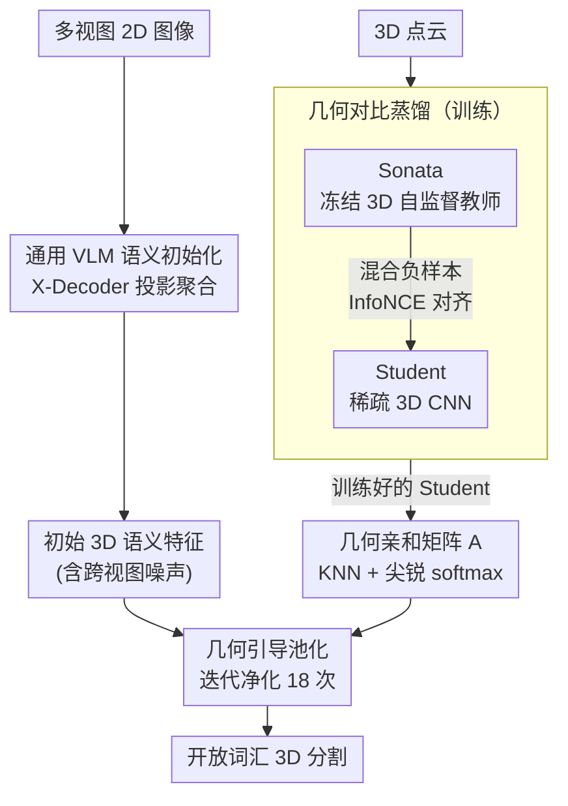

# GeoPurify: A Data-Efficient Geometric Distillation Framework for Open-Vocabulary 3D Segmentation

**会议**: ICLR 2026  
**arXiv**: [2510.02186](https://arxiv.org/abs/2510.02186)  
**代码**: [有](https://github.com/tj12323/GeoPurify)  
**领域**: 3D视觉  
**关键词**: 开放词汇3D分割, 知识蒸馏, 几何先验, VLM特征净化, 数据高效

## 一句话总结

提出 GeoPurify 框架，通过从 3D 自监督教师模型蒸馏几何先验来净化 2D VLM 投影到 3D 的噪声特征，仅用约 1.5% 的训练数据即可达到或超越全量训练的 SOTA 开放词汇 3D 分割性能。

## 研究背景与动机

开放词汇 3D 场景理解旨在让模型识别任意文本描述的物体，核心挑战在于将 2D VLM 语义迁移到 3D 时存在一个根本性权衡：

**Training-free 方法**：直接将多视图 2D 预测投影到 3D 点云并合并，导致严重的几何不一致

**Training-based 方法**：学习点级别的 3D-语义映射，但需要大规模标注数据

**关键假设**：VLM 特征从 2D 迁移到 3D 时，几何信息并未被破坏，而是变成了潜在的（latent），可以通过高效的恢复手段提取出来，而非从头学习 3D 几何。

## 方法详解

### 整体框架

GeoPurify 要解决的是 2D VLM 特征投影到 3D 后几何不一致、而 training-based 方法又依赖大规模标注这一对矛盾。它的做法是把语义和几何彻底解耦：训练阶段只让一个 Student Affinity Network 通过对比蒸馏去模仿冻结的 3D 自监督教师 Sonata，学习纯几何的点间关联，全程不碰任何 3D 语义标签；推理阶段则让冻结的 2D VLM（X-Decoder）先生成带噪的初始 3D 语义特征，再用预训练好的 Student 提供的几何亲和关系对这些特征做几何感知池化，从而把潜在但未被破坏的几何结构「恢复」出来，净化掉投影噪声。整体上有两条准备路径——一条在推理时由 VLM 产出强语义但噪声大的特征，一条在训练时蒸馏出纯几何的 Student——最终在「几何引导池化」处汇合，由几何关系修正语义噪声。

### 关键设计

**1. 通用 VLM 语义初始化：用更高的语义天花板替代「分割后匹配」管线**

GeoPurify 不走 LSeg、OpenSeg、SAM+CLIP 这类先分割再匹配文本的传统流程，而是采用遵循「分割即理解」范式的 X-Decoder。它的统一视觉-语言嵌入空间天然把分割和语义对齐放在同一空间里，提供了更高的语义上界。具体投影时，对每个 3D 点从所有可见视图采样对应的 2D 特征并做加权平均，得到该点的初始语义特征——这一步特征虽然语义强，但跨视图聚合带来的几何不一致正是后续要净化的对象。

**2. 几何对比蒸馏：让 Student 在无语义标签下学到类无关的几何关联**

几何先验来自一个冻结的 Sonata（3D 自监督基础模型），它提供鲁棒的几何目标空间；Student 则是一个可训练的稀疏 3D CNN，输出 128 维几何嵌入去对齐这个目标。关键在采样策略——为每个锚点构造混合负样本：48 个 Macro-negatives 取自全局特征最不相似的点，逼 Student 把握整体场景结构；16 个 Micro-negatives 取自空间近邻中特征最不相似的点，专门区分物体边界处的细粒度差异。蒸馏用 InfoNCE 对比损失，温度 $\tau = 0.07$，每场景采 4096 个锚点。由于整个过程只对齐几何而不涉及类别，学到的关联是类无关的，这也是它跨数据集迁移极强的根源。

**3. 几何引导池化：推理时用 Student 的亲和关系迭代净化 VLM 特征**

推理时先由 Student 网络为每个体素生成几何嵌入，再据此构建稀疏亲和矩阵 $A$——取 K 近邻并配合尖锐化的 softmax（$\alpha = 1/20$）压缩到几何上真正相邻的点。然后对初始 VLM 特征做迭代池化 $F^{(t+1)} = A \cdot F^{(t)}$，迭代 $T=18$ 次，让特征沿几何亲和关系反复平滑、把跨视图噪声抹平。精炼后的体素特征再映射回原始点云，得到最终的开放词汇分割结果。迭代次数不能无限增大，$T>18$ 后会出现 over-smoothing 反而退化。

### 损失函数 / 训练策略

训练只用 InfoNCE 对比损失（温度 0.07），优化器为 AdamW、学习率 $1\text{e-}3$、cosine 退火、共 50 epochs，单张 NVIDIA L40 即可完成。最关键的是训练规模：仅用 20 个场景（约 ScanNetV2 的 1.6%）且无任何 3D 语义标签。这 20 个场景并非随机选取，而是按 Shannon 熵（衡量语义复杂度）加类别数（衡量语义丰富度）的联合评分挑选，再用 K-Means 聚类保证所选场景在环境上足够多样。

## 实验关键数据

### 主实验：开放词汇 3D 语义分割

| 方法 | 训练数据 | ScanNetV2 mIoU | ScanNetV2 mAcc | Matterport3D mIoU | Matterport3D mAcc |
|------|----------|----------------|----------------|--------------------|--------------------|
| OpenScene-3D | 100% | 51.6 | 63.1 | 40.5 | 48.8 |
| CUA-O3D (3D) | 100% | 54.1 | 64.1 | 41.3 | 49.5 |
| OV3D | 100% | 57.3 | 72.9 | 45.8 | 62.4 |
| CUA-O3D（同数据） | 约1.5% | 18.1 | 26.4 | 14.0 | 20.5 |
| **GeoPurify** | **约1.5%** | **55.1** | **72.5** | **40.2** | **62.4** |

### 跨数据集迁移

| 方向 | OpenScene | CUA-O3D | **GeoPurify** |
|------|-----------|---------|---------------|
| ScanNetV2 -> Matterport3D mIoU | 36.0 | 37.4 | **40.5** |
| Matterport3D -> ScanNetV2 mIoU | 36.5 | 38.6 | **54.9** |

### 消融实验

| 组件 | 设置 | mIoU | mAcc |
|------|------|------|------|
| 无几何净化 | 直接聚合 2D 特征 | 50.2 | 68.1 |
| + GeoPurify | 完整框架 | **55.1** | **72.5** |
| 2D 骨干 | LSeg | 48.6 | 61.6 |
| 2D 骨干 | LSeg + GeoPurify | 51.2 | 63.0 |
| 采样策略 | 仅 Macro-negatives | 53.5 | 70.8 |
| 采样策略 | Hybrid（完整） | **55.1** | **72.5** |
| 池化迭代 | T=1 / T=18 / T=36 | 52.3 / **55.1** / 55.1 | 70.2 / **72.5** / 72.4 |
| 训练场景数 | 10 / 20 / 50 | 54.7 / **55.1** / 55.0 | 72.4 / **72.5** / 72.5 |

### 关键发现

1. **极致数据效率**：用 1.5% 数据达到全量训练竞品水平（55.1 vs 54.1），同等数据下竞品 CUA-O3D 崩至 18.1
2. **几何净化增益 +4.9 mIoU**：从 50.2 提升到 55.1
3. **Micro-negatives 关键**：提供 +1.6 mIoU 边界精度增益
4. **20 场景即饱和**：10 到 20 场景有明显提升，之后基本收敛
5. **跨数据集迁移优势巨大**：Matterport3D 到 ScanNetV2 达 54.9 mIoU，领先 CUA-O3D 16.3 分

## 亮点与洞察

- **恢复潜在结构 vs 从头学习**：核心假设极具洞察力，2D 到 3D 迁移不会破坏几何信息
- **解耦设计的鲁棒性**：语义由 VLM 负责、几何由 Student 负责，各自独立
- **类无关的几何先验**：学到的几何关联不依赖语义类别，跨数据集迁移极强
- **数据选择策略**：基于 Shannon 熵的场景选择比随机选择更高效

## 局限与展望

1. **mIoU vs mAcc 的权衡**：几何池化提升召回率但在边界处可能引起语义溢出
2. **性能上界受 VLM 限制**：20 场景后即收敛，瓶颈在 VLM 语义质量
3. **迭代池化的 over-smoothing**：T>18 后开始退化
4. **未探索室外场景**：仅在室内基准上验证

## 相关工作与启发

- **OpenScene**：大规模 3D 知识蒸馏，GeoPurify 用 1.5% 数据匹敌
- **CUA-O3D**：全量训练 SOTA，GeoPurify 在低数据下远超
- **Sonata**：3D 自监督教师模型，提供几何先验
- **启发**：解耦语义和几何学习可能是数据高效 3D 理解的关键范式

## 评分

- 新颖性：4/5 - 恢复潜在几何结构的假设和解耦框架设计新颖
- 技术深度：4/5 - 对比蒸馏 + 几何池化的组合设计精巧
- 实验完整度：5/5 - 三大基准、跨数据集、详尽消融
- 实用价值：5/5 - 1.5% 数据即达 SOTA，极具实际部署价值

<!-- RELATED:START -->

## 相关论文

- [\[ECCV 2024\] Open Vocabulary 3D Scene Understanding via Geometry Guided Self-Distillation](../../ECCV2024/3d_vision/open_vocabulary_3d_scene_understanding_via_geometry_guided_self-distillation.md)
- [\[ICLR 2026\] CORE-3D: Context-aware Open-vocabulary Retrieval by Embeddings in 3D](core-3d_context-aware_open-vocabulary_retrieval_by_embeddings_in_3d.md)
- [\[ICLR 2026\] PartSAM: A Scalable Promptable Part Segmentation Model Trained on Native 3D Data](partsam_a_scalable_promptable_part_segmentation_model_trained_on_native_3d_data.md)
- [\[AAAI 2026\] Retrieving Objects from 3D Scenes with Box-Guided Open-Vocabulary Instance Segmentation](../../AAAI2026/3d_vision/retrieving_objects_from_3d_scenes_with_box-guided_open-vocabulary_instance_segme.md)
- [\[CVPR 2026\] JOPP-3D: Joint Open Vocabulary Semantic Segmentation on Point Clouds and Panoramas](../../CVPR2026/3d_vision/jopp3d_joint_open_vocabulary_semantic_segmentation.md)

<!-- RELATED:END -->
