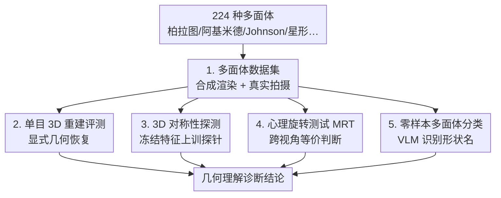

# GIQ: Benchmarking 3D Geometric Reasoning of Vision Foundation Models with Simulated and Real Polyhedra

**会议**: ICLR 2026  
**arXiv**: [2506.08194](https://arxiv.org/abs/2506.08194)  
**代码**: [有](https://toomanymatts.github.io/giq-benchmark/)  
**领域**: 3D视觉  
**关键词**: 几何推理, benchmark, 多面体, 视觉基础模型, VLM评估

## 一句话总结

提出 GIQ 基准数据集，包含 224 种合成和真实多面体，通过单目 3D 重建、对称性检测、心理旋转测试和零样本分类四项任务系统评估视觉基础模型的几何推理能力，揭示了当前模型在基本几何理解上的显著不足。

## 研究背景与动机

现代视觉模型在标准基准上表现出色，但越来越多的证据表明它们缺乏真正的 3D 几何理解：

**VLM 在深度排序等空间问题上表现不佳**

**单目重建算法难以重建训练分布外的形状**

**现有 3D 评估数据集**（如 Objaverse）**缺乏精确的几何属性标注**

多面体是理想的评估载体：明确的类别定义（柏拉图体、阿基米德体、Johnson 体等）、精确的对称群、从简单到复杂的层次化几何复杂度。

## 方法详解

### 整体框架

GIQ 想回答一个看似简单的问题：当前视觉基础模型究竟是真懂三维几何，还是只学到了纹理与统计模式。为此它把"数学上完美定义"的多面体当作几何石蕊试纸，围绕同一批 224 种形状搭起四条互补的评测线——单目 3D 重建、3D 对称性探测、心理旋转测试、零样本分类——分别从显式重建、隐式表示、跨视角判别和高层识别四个角度，逐层逼问模型在基本形状上的几何理解到底停在哪一步。整个基准是一个"先建一套精确形状库、再用它平行喂给四类任务"的结构：数据集是共享底座，四条评测线各自接一类模型、产出一个诊断切面，最后汇成对"几何理解到底停在哪"的整体判断。

### 关键设计

**1. 多面体数据集：用数学精确的形状库消除几何属性标注的模糊性**

现有 3D 数据集（如 Objaverse）的形状缺乏精确几何标注，难以严格诊断几何推理。GIQ 转而收集 224 种独特多面体，全部带有明确的类别定义与对称群标注：柏拉图立体 5 种、阿基米德体 13 种（正多边形面但非全等的凸体）、其对偶 Catalan 体 13 种、Johnson 体 92 种（面为正多边形但缺乏顶点均匀性），以及星形体 48 种、Kepler-Poinsot 体 4 种、复合体 10 种、非凸均匀体 53 种，几何复杂度从简单到困难层层递进。每种形状同时给出两套图像：合成图用 Mitsuba 物理渲染器在 20 个视点下渲染成 256×256，真实图则做成纸质模型、用 Nikon D3500 以 6000×4000 在室内外各拍约 20 张，从而把"合成训练→真实测试"的域差也纳入考查。

**2. 单目 3D 重建评测：检验显式几何恢复是否扛得住分布外形状**

这条线把单张图像喂给 Shap-E、Stable Fast 3D、OpenLRM 等方法，要求恢复完整 3D 几何。结果直指核心痛点：即便这些模型在数百万 3D 资产上训练过，面对连正方体这样最基本的形状，其属性都无法可靠重建，说明它们学到的是带噪声的表面先验而非数学精确的几何。

**3. 3D 对称性探测：用线性/非线性探针判断对称信息是否被编码器隐式捕获**

为绕开生成式重建的不确定性，这一步直接探查 12 种编码器（DINOv2、SigLIP、CLIP、DINO、MAE、VGGT、DUSt3R、MASt3R 等）的冻结特征里是否藏着几何对称信息，在其上训练探针去检测中心点反射、4 重和 5 重旋转对称。由于带某种对称的形状占比悬殊，这里用加权 BCE 损失抵消类别不平衡，类别 $c$ 的权重取 $w_c = (N - n_c) / n_c$（$N$ 为总样本数、$n_c$ 为该类样本数）；探针在合成图上训练、在真实图上测试，并用 5 折交叉验证保证泛化发生在形状层面而非记忆个例。

**4. 心理旋转测试 (MRT)：借认知科学经典范式考查跨视角的形状等价判断**

仿照 Shepard & Metzler 的心理旋转范式，这条线给出两张图片（一合成、一真实），要模型判断它们是不是同一个多面体。实现上取两张图编码器嵌入之差的绝对值，再接一个非线性探针做二分类；其中"困难分割"专门塞进几何上视觉高度相似的多面体对，逼出细粒度判别能力。为给模型表现一个可比的锚点，还组织了 42 人的用户研究建立人类基线。

**5. 零样本多面体分类：直接问前沿 VLM 能否叫出基本形状的名字**

最后一条线以零样本方式测试 Claude 3.7、Gemini 2.5 Pro、ChatGPT o3 / o4-mini-high 等前沿 VLM，并对照 LLaVA-3D、ShapeLLM、PointBind 等 3D 原生模型，考察它们能否正确识别各类多面体——这一任务的损失为标准分类损失，是整套基准里最贴近"高层语义识别"的一环。

## 实验关键数据

### 3D 对称性检测（合成训练 -> 真实测试）

| 编码器 | 中心点反射 | 4重旋转 | 5重旋转 |
|--------|-----------|---------|---------|
| DINOv2 | 约85% | **约93%** | 约80% |
| SigLIP | 约82% | 约88% | 约78% |
| MAE | 约65% | 约70% | 约60% |

### 心理旋转测试（困难分割，syn-wild）

| 模型 | 准确率 |
|------|--------|
| SigLIP（非线性 probe） | **约69%** |
| DINOv2 | 约67% |
| 人类平均 | 68.05% |
| 人类最佳 | 90% |
| 大多数模型 | <60% |

### 零样本分类

| 模型 | 柏拉图体 | 阿基米德体 | Catalan体 | Johnson体 | 非凸体 |
|------|---------|-----------|----------|----------|--------|
| ChatGPT o3 | **100%** | 约50% | <20% | <20% | <20% |
| Gemini 2.5 Pro | 约80% | 约60% | <20% | <20% | <20% |
| Claude 3.7 | 约80% | 约40% | <20% | <20% | <20% |
| 3D 原生模型 | - | - | - | - | 未超越 2D VLM |

### 消融实验

- **Chain-of-Thought 提示**：收效甚微，模型常在中间步骤产生幻觉
- **多视图输入**：仅对低对称性 Johnson 体有微弱提升
- 线性 vs 非线性 probe：对称性检测中两者性能相当

### 关键发现

1. **重建失败**：所有 SOTA 重建方法连正方体都无法可靠重建
2. **对称性可探测**：DINOv2 等编码器隐式捕获了 3D 对称信息（4重旋转高达 93%）
3. **细粒度判别不足**：困难心理旋转测试中大部分模型接近随机水平
4. **VLM 几何推理缺陷系统性**：混淆凸/非凸、错误识别面类型、将复合体与星形体混淆
5. **3D 原生模型不比 2D VLM 更好**：即使给定精确点云也未能超越通用 VLM
6. **人类优势明显**：68% 的人类参与者超过最佳模型

## 亮点与洞察

- **多面体作为几何石蕊试纸**：利用数学上完美定义的对象进行严格评估
- **隐式 vs 显式几何理解的分离**：编码器能通过探针检测对称性，但显式推理任务上失败
- **人类基线的纳入**：42 人用户研究提供有意义的比较锚点
- **揭示训练数据偏差**：重建模型学到的是带噪声的表面先验而非数学精确性

## 局限与展望

1. **仅评估多面体**：与任意有机形状的推广关系需进一步研究
2. **数据集规模有限**：224 种形状，某些类别样本少
3. **未提出改进方案**：纯诊断性工作，未设计增强几何推理的训练方法
4. **评估侧重零样本**：未探索 few-shot 或微调场景

## 相关工作与启发

- **Probing 3D Awareness**（El Banani et al., 2024）：GIQ 将 probe 扩展到对称性
- **Mental Rotation Test**（Shepard & Metzler, 1971）：从认知科学借鉴的经典范式
- **启发**：现有模型学到的是纹理和统计模式而非几何本质，未来需引入数学生成的几何数据

## 评分

- 新颖性：4/5 - 首个系统的多面体几何推理基准
- 技术深度：3/5 - 主要是评估工作，方法创新有限
- 实验完整度：5/5 - 四维度评估、多模型对比、人类基线
- 实用价值：4/5 - 为改进视觉模型的几何理解指明方向

<!-- RELATED:START -->

## 相关论文

- [\[CVPR 2026\] GeoCodeBench: Benchmarking PhD-Level Coding in 3D Geometric Computer Vision](../../CVPR2026/3d_vision/benchmarking_phd-level_coding_in_3d_geometric_computer_vision.md)
- [\[AAAI 2026\] Parameter-Free Fine-tuning via Redundancy Elimination for Vision Foundation Models](../../AAAI2026/3d_vision/parameter-free_fine-tuning_via_redundancy_elimination_for_vision_foundation_mode.md)
- [\[ECCV 2024\] Sapiens: Foundation for Human Vision Models](../../ECCV2024/3d_vision/sapiens_foundation_for_human_vision_models.md)
- [\[AAAI 2026\] VGGT-DP: Generalizable Robot Control via Vision Foundation Models](../../AAAI2026/3d_vision/vggt-dp_generalizable_robot_control_via_vision_foundation_models.md)
- [\[ICLR 2026\] EgoNight: Towards Egocentric Vision Understanding at Night with a Challenging Benchmark](egonight_towards_egocentric_vision_understanding_at_night_with_a_challenging_ben.md)

<!-- RELATED:END -->
