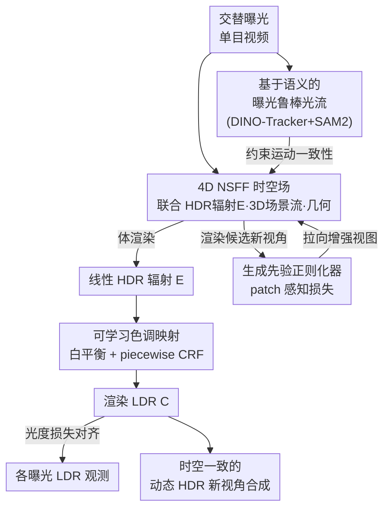

# HDR-NSFF: High Dynamic Range Neural Scene Flow Fields

**会议**: ICLR2026  
**arXiv**: [2603.08313](https://arxiv.org/abs/2603.08313)  
**代码**: [项目主页](https://shin-dong-yeon.github.io/HDR-NSFF/)  
**领域**: 3D视觉  
**关键词**: HDR reconstruction, neural scene flow fields, dynamic scene, tone-mapping, 4D radiance field  

## 一句话总结
提出 HDR-NSFF，将 HDR 视频重建从传统的 2D 像素级融合范式转变为 4D 时空建模，从交替曝光单目视频中联合重建 HDR 辐射场、3D 场景流、几何和色调映射，实现了时空一致的动态 HDR 新视角合成。

## 背景与动机
真实场景的辐射动态范围远超普通相机的捕捉能力，传统 HDR 方法通过融合不同曝光帧来恢复丢失信息，但存在根本性局限：

1. **2D 对齐的固有缺陷**：现有 HDR 视频方法（如 LAN-HDR、HDRFlow、NECHDR）依赖 2D 像素级对齐，仅在 3-7 帧的窄时间窗口内操作，缺乏对 3D 场景的物理理解
2. **颜色漂移与几何闪烁**：由于远距离帧之间没有辐射度和时空一致性约束，2D 方法经常产生明显的伪影
3. **单目输入的信息稀缺**：交替曝光单目视频在任意时刻仅有单一视角观测，且频繁受到过饱和影响，使重建问题高度欠定

这些问题促使作者提出从 2D 像素融合到 4D 时空建模的范式转换。

## 核心问题
如何从交替曝光的单目视频中重建时空一致的动态 HDR 辐射场？具体挑战包括：

- 曝光变化导致帧间颜色严重不一致，常规光流方法失效
- 单目视频仅提供单一视角，且过饱和区域信息完全丢失
- 需要同时建模 HDR 辐射、3D 运动、几何和色调映射的耦合关系

## 方法详解

### 整体框架
HDR-NSFF 要从一段交替曝光的单目视频里重建出时空一致的动态 HDR 辐射场，难点在于曝光忽明忽暗让常规光流失效、单目视角又让过饱和区域信息彻底丢失。它的做法是抛开 2D 像素融合，直接在 Neural Scene Flow Fields (NSFF) 的 4D 表示上联合学习 HDR 辐射、3D 场景流和几何，把整段视频统一进一个连续的时空场。围绕这个 4D 场，论文加了三根支柱让它在 HDR 单目场景下能被监督起来：渲染出的线性 HDR 辐射先经**可学习色调映射**压回 LDR，才能和相机拍下的各曝光帧做光度对齐；运动一致性不再靠 RGB 匹配，而是交给**基于语义的曝光鲁棒光流**去约束 3D 场景流；单目视角与过饱和带来的信息缺口则由**生成先验正则化器**补上。

### 关键设计

**1. 可学习色调映射模块：把渲染的 HDR 辐射可微地映射回 LDR，才能用 LDR 观测做监督**

辐射场渲染出的是线性 HDR 辐射 $E$，而监督信号只有相机拍下的 LDR 帧，二者之间隔着一条相机响应曲线。模块 $\mathcal{T}$ 把这条链路显式参数化为 $C = \mathcal{T}(E; \theta) = g_\theta(w(E))$，其中 $w$ 是逐通道白平衡校正、$g_\theta$ 是相机响应函数 (CRF)。CRF 的具体形式直接决定重建质量：固定 CRF 把曲线写死过于约束，MLP CRF 又太灵活、训练不稳定，作者折中采用 piecewise parametric CRF，在灵活性和正则之间取平衡——消融中它拿到 PSNR 31.01，明显高于 MLP CRF 的 28.76、Fix CRF 的 25.55 和完全不做色调映射的 17.79。

**2. 基于语义的曝光鲁棒光流：用语义不变性替代颜色匹配，绕开曝光变化对运动估计的破坏**

关键洞察是：像素外观随曝光剧烈波动，但目标的语义特征基本不变，所以运动估计应该建在语义嵌入而非 RGB 上。作者以 DINO-Tracker 为运动估计骨干、在 DINOv2 的鲁棒嵌入空间里做匹配，并针对本任务做了两处修改：每个时间步重新初始化跟踪点，避免长序列上的误差累积；再用 SAM2 的运动掩码把跟踪限制在动态区域，滤掉背景噪声。消融显示去掉该模块 (DT) 后 PSNR 从 32.66 掉到 31.04、动态区域从 25.65 掉到 24.93，可见它对运动一致性是关键。

**3. 生成先验作为正则化器：给单目视频里缺失的视角与过饱和信息补一个先验，又不能让幻觉污染物理真实**

单目输入在任意时刻只有单一观测，过饱和处信息为零，重建高度欠定。作者在优化中周期性渲染候选新视角 $\hat{C}$，送进生成先验 $\mathcal{G}$ 得到增强视图 $C^{\text{gen}}$，再用 patch-wise 感知损失把辐射场往增强视图上拉：$\hat{\mathcal{L}}_{\text{gen}} = \sum_{p} \|\phi(\hat{C}_p) - \phi(C_p^{\text{gen}})\|_1$。为了不让生成内容覆盖真实观测，它只在预热期 $T_{\text{warm}} = 200K$ 之后、以概率 $p_{\text{gen}} = 0.1$ 偶尔激活；其作用主要落在感知质量上（去掉后 LPIPS 从 0.0554 升到 0.0557），对 PSNR 影响很小。

### 损失函数 / 训练策略
总目标把色调映射后的光度损失、光流约束、深度先验、CRF 平滑正则和上面的生成先验损失联合优化，让辐射、运动、几何和色调映射在同一个 4D 场里端到端地相互约束。

## 实验关键数据

### 数据集
- **HDR-GoPro**（新提出）：首个真实世界动态 HDR 数据集，9 台同步 GoPro Hero 13 Black 相机，3 种曝光等级，12 个室内外场景
- **合成数据**：用于对比评估

### 新视角合成（GoPro 数据集）

| 方法 | PSNR↑ | SSIM↑ | LPIPS↓ |
|------|-------|-------|--------|
| NSFF | 18.02 | 0.6792 | 0.2061 |
| 4DGS | 20.94 | 0.7905 | 0.1541 |
| NeRF-WT | 29.70 | 0.9333 | 0.0598 |
| HDR-HexPlane | 20.70 | 0.6694 | 0.1917 |
| **HDR-NSFF (完整)** | **32.63** | **0.9444** | **0.0554** |

### 新视角+时间合成（合成数据）

| 方法 | PSNR↑ | SSIM↑ | LPIPS↓ |
|------|-------|-------|--------|
| NSFF | 15.98 | 0.6457 | 0.1388 |
| HDR-HexPlane | 29.95 | 0.9055 | 0.0527 |
| **HDR-NSFF** | **35.07** | **0.9465** | **0.0483** |

### 消融实验
- 去除 DINO-Tracker (DT)：PSNR 从 32.66 降至 31.04（动态区域从 25.65 降至 24.93），说明语义光流对运动一致性至关重要
- 去除生成先验 (GP)：LPIPS 从 0.0554 升至 0.0557，GP 主要提升感知质量
- 色调映射设计对比：piecewise CRF (PSNR 31.01) >> MLP CRF (28.76) >> Fix CRF (25.55) >> 无色调映射 (17.79)

## 亮点
1. **范式创新**：首次将 HDR 视频重建从 2D 像素融合提升到 4D 时空建模，建立全局时间感受野
2. **语义光流**：巧妙利用 DINOv2 语义不变性解决曝光变化导致的光流失效问题，思路优雅
3. **表示无关性**：框架兼容 NeRF 和 4D Gaussian Splatting 等多种动态表示
4. **首个真实 HDR 动态数据集**：9 台同步相机、12 个场景的 HDR-GoPro 数据集填补了评估空白
5. **端到端联合优化**：同时学习辐射、运动、几何和色调映射，保证物理一致性

## 局限与展望
1. **依赖 COLMAP 位姿估计**：在极端曝光变化场景下位姿估计可能失败，限制了实际应用
2. **未处理运动模糊**：长曝光导致的运动模糊未被显式建模
3. **训练效率**：基于 NeRF 的框架训练成本较高，虽兼容 4DGS 但未在主实验中充分验证
4. **生成先验的贡献有限**：从消融实验看，GP 的 PSNR 提升甚至略有下降（32.66→32.63），主要改善 LPIPS
5. **场景规模受限**：当前仅在有限场景下验证，大规模户外场景的泛化能力未知

## 与相关工作的对比
- **vs HDR 视频方法**（LAN-HDR, HDRFlow, NECHDR）：本文从 4D 建模而非 2D 对齐出发，天然解决了时间一致性问题
- **vs 动态场景重建**（NSFF, 4DGS, MotionGS）：这些方法假设光度一致的 LDR 输入，无法处理 HDR 场景
- **vs HDR-HexPlane**：最相关的工作，但其基于分解网格表示缺乏显式运动建模，限制了时间合成能力。HDR-NSFF 通过显式 3D 场景流建模实现了更好的时空插值

## 启发与关联
1. **语义特征替代像素匹配**：当像素级信号不可靠时（曝光变化、天气变化等），利用语义层面的不变性是一个通用思路，可推广到其他 low-level 任务
2. **生成先验正则化**：将生成模型作为正则化器补充缺失信息的策略值得关注，但需要精心设计激活策略防止幻觉
3. **4D 统一建模的思想**：将原本在 2D 平面解决的问题提升到更高维度的连续表示，从根本上提供全局一致性保证

## 评分
- 新颖性: ⭐⭐⭐⭐ (2D→4D 范式转换有创新，各模块组合合理)
- 实验充分度: ⭐⭐⭐⭐ (新数据集+合成数据，消融完整，但实际场景规模偏小)
- 写作质量: ⭐⭐⭐⭐ (框架清晰，动机阐述充分，图表质量高)
- 价值: ⭐⭐⭐⭐ (开辟了动态 HDR 4D 重建的新方向，数据集对社区有价值)

<!-- RELATED:START -->

## 相关论文

- [\[ICLR 2026\] Mono4DGS-HDR: High Dynamic Range 4D Gaussian Splatting from Alternating-exposure Monocular Videos](mono4dgs-hdr_high_dynamic_range_4d_gaussian_splatting_from_alternating-exposure_.md)
- [\[ICLR 2026\] Dynamic Novel View Synthesis in High Dynamic Range](dynamic_novel_view_synthesis_in_high_dynamic_range.md)
- [\[CVPR 2025\] Event Fields: Capturing Light Fields at High Speed, Resolution, and Dynamic Range](../../CVPR2025/3d_vision/event_fields_capturing_light_fields_at_high_speed_resolution_and_dynamic_range.md)
- [\[CVPR 2026\] InstantHDR: Single-forward Gaussian Splatting for High Dynamic Range 3D Reconstruction](../../CVPR2026/3d_vision/instanthdr_singleforward_gaussian_splatting_for_hi.md)
- [\[ICLR 2026\] Einstein Fields: A Neural Perspective To Computational General Relativity](einstein_fields_a_neural_perspective_to_computational_general_relativity.md)

<!-- RELATED:END -->
