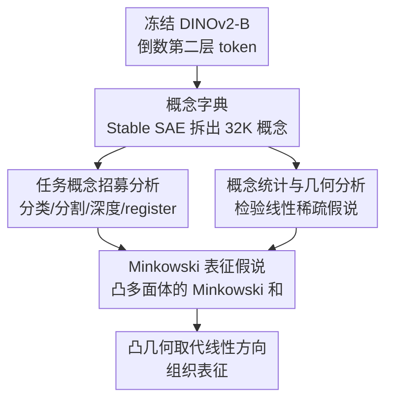

# Into the Rabbit Hull: From Task-Relevant Concepts in DINO to Minkowski Geometry

**会议**: ICLR2026  
**arXiv**: [2510.08638](https://arxiv.org/abs/2510.08638)  
**代码**: [kempnerinstitute.github.io/dinovision](https://kempnerinstitute.github.io/dinovision)  
**领域**: 3D视觉  
**关键词**: DINOv2, Sparse Autoencoder, Linear Representation Hypothesis, Minkowski Representation Hypothesis, interpretability, Vision Transformer

## 一句话总结
通过在 DINOv2 上训练 32,000 单元的 Sparse Autoencoder 字典，系统分析了下游任务如何招募不同概念，发现表征几何偏离线性稀疏假说（LRH），进而提出 Minkowski Representation Hypothesis（MRH），认为 token 表征是多个凸多面体的 Minkowski 和，概念由原型点的邻近性而非线性方向定义。

## 背景与动机
DINOv2 作为自监督视觉基础模型，在分类、分割、深度估计、机器人感知等任务上表现出色，但其内部表征的本质仍不清楚。现有可解释性方法大多基于 Linear Representation Hypothesis（LRH），认为神经网络内部特征可表示为近正交方向的稀疏叠加。然而作者在大规模实验中发现 LRH 无法完全解释观测到的几何现象：

- 字典原子存在高于预期的相干性（coherence），偏离理想的 Grassmannian 帧
- 表征中同时存在稀疏特征和稠密特征（如位置编码）
- 单图像内 token 嵌入呈现光滑低维流形结构，即使去除位置信息后仍然存在
- 不同任务招募的概念形成低维功能子空间

这些观察促使作者超越 LRH，提出基于凸几何的新表征假说。

## 核心问题
1. DINOv2 的哪些内部概念被不同下游任务所使用？是否存在功能特化？
2. 学到的概念字典的统计特性和几何结构是什么样的？是否符合 LRH 的预测？
3. 能否提出比 LRH 更准确的表征几何假说来解释观察到的现象？

## 方法详解

### 整体框架
本文不是提出新模型，而是用一套"探针字典 + 几何分析"流程剖开 DINOv2 的内部表征：先在冻结的 DINOv2-B 上训练一个 32,000 单元的稀疏字典，把每个 token 拆成少量可命名的概念；再依次回答三个问题——下游任务用了哪些概念、这些概念的统计与几何长什么样、用什么数学结构能统一解释它们。其中"任务招募"和"统计与几何"是在同一本字典上并行展开的两路分析，它们的观测共同迫使作者放弃线性方向、把结论凝练成 Minkowski Representation Hypothesis（MRH），用凸几何取代线性方向作为表征的组织语言。

### 关键设计

**1. 概念字典：用 Stable SAE 把 token 拆成可命名的概念**

可解释性分析的第一步是得到一个稳定、可复现的概念字典。作者在 DINOv2-B（带 4 个 register token）倒数第二层上训练一个 Stable SAE，字典大小 $c = 32{,}000$，每个 token 通过 BatchTopK 投影只激活 $k = 8$ 个概念。为避免普通 SAE 的字典漂移，原子被约束在真实激活的凸包内——用 128,000 个 k-means 质心 $\bm{C}$ 参数化字典 $\bm{D} = \bm{S}\bm{C}$（$\bm{S}$ 行随机），保证每个原子都是真实数据点的凸组合。在 1.4M 张 ImageNet-1K 图像上训练 50 个 epoch 后，重建保真度达 $R^2 > 88\%$，为后续分析提供了可靠底座。

**2. 任务概念招募分析：看每个下游任务真正调用了哪些概念**

要知道任务"用了什么"，作者对线性探测 $\bm{Y} = \bm{A}\bm{W}^T$ 借助分解 $\bm{A} \approx \bm{Z}\bm{D}$ 推出概念重要性度量 $\mathbb{E}(\bm{Z})\bm{W}'$，再逐任务排序 top 概念。四类任务呈现出截然不同且可解释的招募模式。**分类**最重要的不只是目标物体本身，还有一类反直觉的"Elsewhere"概念——它们在物体之外的所有 token 上激活、却依赖物体存在，实现"物体在别处，但当前 token 不是物体"的条件否定逻辑，可能通过隐式勾勒边界或编码上下文对比来辅助决策。**分割**的 top-50 概念几乎全沿物体轮廓激活，这些"border concepts"在不同类别间外观各异但空间足迹高度一致，在嵌入空间聚成紧密簇、构成低维子空间。**深度估计**经控制扰动实验分出三族线索：投影几何（消失线、汇聚结构）、阴影（软光照梯度）、局部频率过渡（纹理突变、类散景），与视觉神经科学的经典原理吻合。**Register token** 上则有数百个专属概念，编码运动模糊、光照风格、焦散反射、镜头效果等全局非局部属性。

**3. 概念统计与几何分析：检验字典是否符合线性稀疏假说**

这一步直接拷问 LRH 的预测，结果几乎处处偏离。激活统计上概念呈频率-能量权衡的三角包络，但混进 3 个异常稠密激活、专编码位置（左/右/下）的概念，暴露出稀疏与稠密共存的混合体制；共激活矩阵 $\bm{Z}^T\bm{Z}$ 的特征值平滑衰减、无块结构，说明概念是高维分布而非模块化。字典几何更不像 LRH 设想的近正交帧：成对内积分布尾部明显比随机基线更重、偏离 Grassmannian 帧，奇异值谱急剧衰减暴露各向异性和低有效秩，还存在 $\bm{D}_i \approx -\bm{D}_j$ 的反向配对编码"左 vs 右""白 vs 黑"等语义对立，而 Hoyer 稀疏度远低于 1.0，证实概念是分布式而非神经元对齐的。这些反例共同迫使作者放弃线性方向、转向凸几何。

**4. Minkowski Representation Hypothesis：用凸多面体的 Minkowski 和重新组织表征**

MRH 把激活空间 $\mathcal{X}$ 定义为多个"瓦片多面体"的 Minkowski 和

$$\mathcal{X} = \bigoplus_{i=1}^{m} \mathcal{P}_i, \quad \mathcal{P}_i = \text{conv}(\mathcal{A}_{\mathcal{T}_i})$$

每个 token 则是少数活跃瓦片的凸组合之和 $\bm{x} = \sum_{i \in S} \bm{z}_i \mathcal{A}_{\mathcal{T}_i}$（$\bm{z}_i \in \Delta^{|\mathcal{T}_i|}$，$|S| \ll m$），概念由原型点的邻近性而非线性方向定义。这一假说有三重支撑：认知科学上它对应 Gärdenfors 概念空间——概念是凸区域、原型是极端点；架构上单头注意力输出天然 $\in \text{conv}(\bm{V})$（softmax 给出重心坐标），仿射变换保凸、多头聚合靠加法恰好产生 Minkowski 和；并由三个引理/命题严格证明多头注意力本就实现 MRH 结构。实证上也有多处相容信号：直线插值会迅速离开数据支撑集、而 kNN 图上的分段线性测地线始终贴着流形；作为 MRH 单瓦片特例的 Archetypal Analysis 仅用约 10 个原型即可匹配 SAE 的重建质量；原型系数矩阵还自发呈现块稀疏结构，与瓦片假设一致。

## 实验关键数据
- SAE 字典大小：32,000 个概念原子，重建 $R^2 > 88\%$
- 分类招募的概念数量远多于分割和深度估计
- 任务内 top-100 概念的余弦相似度显著高于随机子集，特征值谱衰减更快
- 位置信息在最终层压缩为 2D 子空间
- Archetypal Analysis 用 10 个原型即可达到 SAE 级别的重建误差
- 共激活与几何相似性仅弱相关（$r = 0.28$, $R^2 = 0.08$）

## 亮点
- **大规模可解释性资源**：发布了视觉基础模型上最大的交互式可解释性展示（32K 概念浏览器）
- **"Elsewhere" 概念的发现**：揭示了一种反直觉的分类机制——通过"非物体区域的条件激活"来支持分类决策
- **MRH 的理论优雅性**：从多头注意力的数学结构出发，自然推导出凸几何组织，并给出完整的引理-命题证明链
- **跨学科视角**：将认知科学（Gärdenfors 概念空间）、离散几何（Minkowski 和）和深度学习可解释性有机结合
- **对 steering 的深刻启示**：MRH 预测概念操控存在天然上界（到达原型后饱和），这解释了当前 SAE probing 中的 plateau 和反转现象

## 局限与展望
- MRH 目前主要是假说层面，实证信号为"相容证据"而非严格证明，多种几何假说可能产生类似现象
- Minkowski 分解本质上不可识别（Proposition 2），仅从单层激活无法唯一恢复原始生成因子
- 分析集中在 DINOv2-B 一个模型上，未验证对其他 ViT 变体或更大模型的泛化性
- Archetypal Analysis 对比实验仅在单图像 token 级别进行，缺少跨图像全局验证
- 深度估计的三族分类不完全——部分概念表现出混合敏感性

## 与相关工作的对比

| 方法/假说 | 核心观点 | 与本文的关系 |
|---|---|---|
| LRH + SAE | 表征 = 近正交方向的稀疏叠加 | 本文出发点，但通过实验发现其局限 |
| Sparse Autoencoder | 过完备字典学习 | 本文用 Stable SAE 作为分析工具 |
| k-Deep Simplex / SpaDE | 表征在凸包内 | 与 MRH 思路一致的先驱工作 |
| Gärdenfors 概念空间 | 概念 = 凸区域 | MRH 的认知科学理论基础 |
| Park et al. 2025 | 语言模型中概念的凸多面体编码 | 在 NLP 领域的平行发现 |

## 启发与关联
- **对 SAE 可解释性的反思**：如果 MRH 成立，当前基于线性方向的概念提取方法可能只是凸结构的近似投影，需要开发感知架构结构（如注意力权重）的概念提取方法
- **概念操控的新范式**：从沿方向无限缩放变为朝原型点移动，操控强度有天然饱和点，可能产生更稳定的 steering 策略
- **与 3D 视觉的关联**：深度估计概念的三族结构表明 DINOv2 自发学习了经典单目深度线索，可为无监督 3D 表征学习提供理论指导
- **多头注意力的几何解读**：每个头对应一个概念瓦片的凸组合，这为理解和设计注意力机制提供了新的几何语言

## 评分
- 新颖性: ⭐⭐⭐⭐⭐ (MRH 是全新的表征假说，跨学科视角独到)
- 实验充分度: ⭐⭐⭐⭐ (大规模分析详尽，但 MRH 实证仍为初步证据)
- 写作质量: ⭐⭐⭐⭐⭐ (结构清晰，理论推导严谨，图表精美)
- 价值: ⭐⭐⭐⭐⭐ (对可解释性领域有深远影响)

<!-- RELATED:START -->

## 相关论文

- [\[CVPR 2026\] DINO Eats CLIP: Adapting Beyond Knowns for Open-set 3D Object Retrieval](../../CVPR2026/3d_vision/dino_eats_clip_adapting_beyond_knowns_for_open-set_3d_object_retrieval.md)
- [\[CVPR 2025\] ASHiTA: Automatic Scene-grounded Hierarchical Task Analysis](../../CVPR2025/3d_vision/ashita_automatic_scene-grounded_hierarchical_task_analysis.md)
- [\[CVPR 2025\] Olympus: A Universal Task Router for Computer Vision Tasks](../../CVPR2025/3d_vision/olympus_a_universal_task_router_for_computer_vision_tasks.md)
- [\[ICLR 2026\] Joint Shadow Generation and Relighting via Light-Geometry Interaction Maps](joint_shadow_generation_and_relighting_via_light-geometry_interaction_maps.md)
- [\[CVPR 2026\] 3D-Aware Multi-Task Learning with Cross-View Correlations for Dense Scene Understanding](../../CVPR2026/3d_vision/3d-aware_multi-task_learning_with_cross-view_correlations_for_dense_scene_unders.md)

<!-- RELATED:END -->
