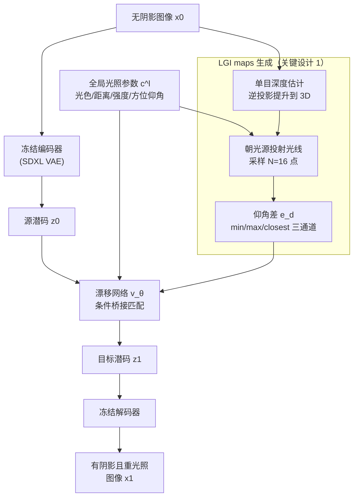

# Joint Shadow Generation and Relighting via Light-Geometry Interaction Maps

**会议**: ICLR2026  
**arXiv**: [2602.21820](https://arxiv.org/abs/2602.21820)  
**代码**: 待确认  
**领域**: 3D视觉  
**关键词**: shadow generation, relighting, light-geometry interaction, bridge matching, monocular depth  

## 一句话总结

提出 Light-Geometry Interaction (LGI) maps，一种从单目深度估计中编码光照-遮挡关系的 2.5D 表示，嵌入 bridge matching 生成框架中实现阴影生成与物体重光照的联合建模，在合成和真实图像上均取得 SOTA 效果。

## 背景与动机

阴影生成（shadow generation）和重光照（relighting）在虚拟产品放置、增强现实、图像编辑等场景中至关重要。传统方法依赖完整 3D 重建和光线追踪，计算成本高且在单视图设定下不可行。近年来基于扩散模型和 bridge matching 的生成式方法可以从 RGB 输入合成阴影，但由于缺乏物理约束，常产生以下问题：

- **浮空阴影**（floating shadows）：阴影与物体几何不一致
- **光照不一致**：重光照方向与阴影方向矛盾
- **不合理的阴影几何**：在复杂遮挡场景下失效

更关键的是，现有方法将阴影生成和重光照视为**独立任务**分别处理，忽视了二者之间的内在耦合——准确的建模需要同时考虑直接光照、二次反射和互反射。

## 核心问题

如何在单视图场景中，仅从单目深度高效地编码光照与几何的交互关系，并将其作为物理先验嵌入生成模型，实现阴影生成与重光照的联合建模？

## 方法详解

### 整体框架

方法要解决的是单视图下阴影生成与重光照缺乏物理约束、二者又被割裂处理的问题。整体建在 Latent Bridge Matching (LBM) 框架上：无阴影图像 $x_0$ 先经冻结的 Stable Diffusion XL 编码器映射成源潜码 $z_0$，再由漂移网络 $v_\theta$ 沿一条布朗桥逐步桥接到有阴影潜码 $z_1$，最后由冻结解码器还原成带阴影且已重光照的图像 $x_1$。编码器、解码器全程冻结，训练只优化漂移网络。真正的关键在于给漂移网络喂入一组光照感知的条件 $c=\{c^l, c^m\}$：$c^l$ 是全局光照参数（光色、半径、距离、强度、方位角、仰角），$c^m$ 则是本文提出的 LGI maps——它从单目深度出发，把光照与几何的遮挡关系压成一张可微的 2.5D 条件图，让生成过程"知道"阴影该落在哪里。这条核心管线之外，论文还把它扩展到隐式光照的 image harmonization（靠 LGI 可微自监督一个光照估计网络），并自造了首个联合阴影-重光照数据集 ShadRel 来支撑训练。

### 关键设计

**1. LGI maps：把光线追踪压缩成仰角差，避免完整 3D 重建**

阴影本质上是几何对光线的遮挡，但完整重建 + 光线追踪在单视图下既不可行又昂贵，LGI maps 用一条单目深度就近似出这套遮挡线索。具体地，先用现成单目深度估计得到深度图 $D$ 并重缩放到与光源坐标一致的尺度；再通过逆相机投影把每个像素提升到 3D，$p = D(u,v)\cdot K^{-1}[u,v,1]^\top$。然后从每个 3D 点 $p$ 朝光源 $l$ 投射一条光线，在光线上均匀采样 $N=16$ 个点并重投影回图像平面取其深度。对每个采样点计算它的表面仰角 $e^s_n$ 与光线仰角 $e^l$ 之差 $e^d_n = e^s_n - e^l$——一旦某方向上表面仰角超过光线仰角，就意味着这点被挡住、处于阴影里。最后把这串仰角差汇成三通道：$c^m_1=\min e^d_n$ 标记遮挡开始，$c^m_2=\max e^d_n$ 标记遮挡结束，$c^m_3 = e^d_{i^*}$（$i^*=\arg\min|e^d_n|$）取绝对值最小的差，对应最可能发生直接遮挡的点。这套 min/max/closest 三通道既编码了遮挡范围、又编码了 2.5D 深度固有的不确定性，且 LGI 值天然落在 $(-\pi,\pi)$ 内，对网络输入很友好。

**2. 自监督的图像协调扩展：靠 LGI 可微把光照估计接进来**

为了把方法推广到 image harmonization，额外引入一个光照估计网络，从合成图像里反推光照条件。由于整条 LGI maps 生成是完全可微的，可以直接用阴影掩码作监督信号、端到端地自监督训练光照估计，无需额外标注光照真值。

**3. ShadRel 数据集：补齐联合阴影-重光照的训练数据空白**

联合建模需要同时含阴影与重光照标注的数据，此前并不存在，于是本文用 Blender Cycles 路径追踪自造了首个大规模数据集：817K 个由专业 3D 艺术家制作的虚拟物体，材质涵盖光泽、金属、透明等（基于 principled BSDF），每个物体采样 4 个随机相机视角 × 5 种光照配置共 20 张目标图，刻意覆盖软阴影、反射、透明度和互反射等难例场景。

### 损失函数

标准像素级损失会被大片不变背景稀释，这里改用聚焦阴影区域的加权 L1：先以亮度变化阈值 $\tau=0.01$ 加膨胀操作圈出真正发生阴影变化的像素，再对其加权，

$$\mathcal{L}_x(\hat{x}_1, x_1) = \frac{1}{M}\sum_{m=1}^M w^{(m)} \cdot |x_1^{(m)} - \hat{x}_1^{(m)}|$$

最终损失把潜空间桥接匹配与该加权像素损失相加，像素项权重 $\lambda=10$。

## 实验关键数据

### 联合阴影生成与重光照（ShadRel 数据集）

| 方法 | Overall RMSE↓ | Overall SSIM↑ | Shadow BER↓ | Shadow IoU↑ | Object RMSE↓ |
|------|:---:|:---:|:---:|:---:|:---:|
| LBM | 0.0417 | 0.7148 | 0.0847 | 0.7166 | 0.0298 |
| **本文** | **0.0334** | **0.7227** | **0.0588** | **0.8096** | **0.0282** |

阴影区域 RMSE 从 0.1543 降至 0.0898（**改进 42%**），BER 从 0.1549 降至 0.1103。

### 干净背景阴影生成（CSG 基准）

三个控制轨道上 IoU 均优于 CSG（0.821 vs 0.818, 0.798 vs 0.780, 0.785 vs 0.776）。

### 图像协调（DESOBAv2）

与最佳方法 SGDGP 整体性能相当，但在阴影区域精度更高（Local RMSE 44.753 vs 46.713）。

### 消融实验关键发现

- LGI maps 是最关键组件，移除后 Shadow BER 从 0.0588 恶化到 0.0940
- 直接用深度图替代 LGI 仅带来边际改进（-LGI+Depth: BER 0.0932 vs baseline 0.1012）
- 三通道 LGI 优于仅用第三通道（BER 0.0588 vs 0.0670）
- 换用 DepthAnythingV2 或 GT 深度结果变化极小，证明对深度估计器的鲁棒性
- 计算开销几乎可忽略：参数仅增加 0.0004%，FLOPs 增加 0.0011%

## 亮点

1. **LGI maps 设计精巧**：将光线追踪的核心思想简化为可微的 2.5D 表示，无需完整 3D 重建即可编码光照-遮挡关系，兼具物理直觉和计算效率
2. **联合建模范式**：首次将阴影生成和重光照统一到同一框架，捕获直接光照、二次反射和互反射的耦合效应
3. **泛化能力突出**：仅在合成数据上训练，在真实图像（含人像）上表现优异，无需任何真实世界数据微调
4. **计算高效**：LGI 模块几乎零额外计算成本，天然可扩展到多物体和多光源场景

## 局限与展望

- 基于 2.5D 深度的固有局限：无法处理遮挡区域的深度信息缺失，导致歧义阴影（论文 Fig. 3d 所示）
- 训练数据为纯合成，虽然泛化尚可但可能在极端真实场景下失效
- 单目深度估计缺乏度量尺度，依赖与光源坐标的一致性假设
- 目前仅支持点光源建模，未扩展到面光源或环境光照
- 图像协调扩展需要额外的光照估计网络，增加了系统复杂度

## 与相关工作的对比

| 维度 | CSG / LBM | SGDGP | SwitchLight | 本文 |
|------|-----------|-------|-------------|------|
| 阴影生成 | ✓ | ✓ | ✗ | ✓ |
| 重光照 | ✗ | ✗ | ✓ | ✓ |
| 联合建模 | ✗ | ✗ | ✗ | ✓ |
| 几何先验 | 无/2D模板 | 旋转框+模板 | 无 | LGI maps (2.5D) |
| 物理约束 | 弱 | 中 | 弱 | 强 |
| 真实图像泛化 | 一般 | 较好 | 人像为主 | 好（含人像） |

## 启发与关联

- LGI maps 的核心思想——将光线追踪过程简化为仰角差的统计量——可迁移到其他需要光照建模的任务（如 intrinsic decomposition、光照估计）
- 三通道设计（min/max/closest）巧妙编码了遮挡的不确定性程度，为处理 2.5D 深度歧义提供了有效策略
- 完全可微的设计使其可以自然嵌入任何端到端框架，不局限于 bridge matching
- ShadRel 数据集填补了联合阴影-重光照训练数据的空白，可作为后续研究的重要基准

## 评分
- 新颖性: ⭐⭐⭐⭐ — LGI maps 表示新颖，联合建模范式有清晰贡献
- 实验充分度: ⭐⭐⭐⭐ — 多基准对比、消融全面，含真实图像定性分析
- 写作质量: ⭐⭐⭐⭐ — 思路清晰，公式推导完整，图示直观
- 价值: ⭐⭐⭐⭐ — 实用性强，计算高效，数据集贡献有价值

<!-- RELATED:START -->

## 相关论文

- [\[ECCV 2024\] JointDreamer: Ensuring Geometry Consistency and Text Congruence in Text-to-3D Generation via Joint Score Distillation](../../ECCV2024/3d_vision/jointdreamer_ensuring_geometry_consistency_and_text_congruence_in_text-to-3d_gen.md)
- [\[ICLR 2026\] LiTo: Surface Light Field Tokenization](lito_surface_light_field_tokenization.md)
- [\[ICLR 2026\] Ctrl&Shift: High-Quality Geometry-Aware Object Manipulation in Visual Generation](ctrlshift_high-quality_geometry-aware_object_manipulation_in_visual_generation.md)
- [\[AAAI 2026\] AnchorHOI: Zero-shot Generation of 4D Human-Object Interaction via Anchor-based Prior Distillation](../../AAAI2026/3d_vision/anchorhoi_zero-shot_generation_of_4d_human-object_interactio.md)
- [\[ICML 2026\] HOI-PAGE: Zero-Shot Human-Object Interaction Generation with Part Affordance Guidance](../../ICML2026/3d_vision/hoi-page_zero-shot_human-object_interaction_generation_with_part_affordance_guid.md)

<!-- RELATED:END -->
