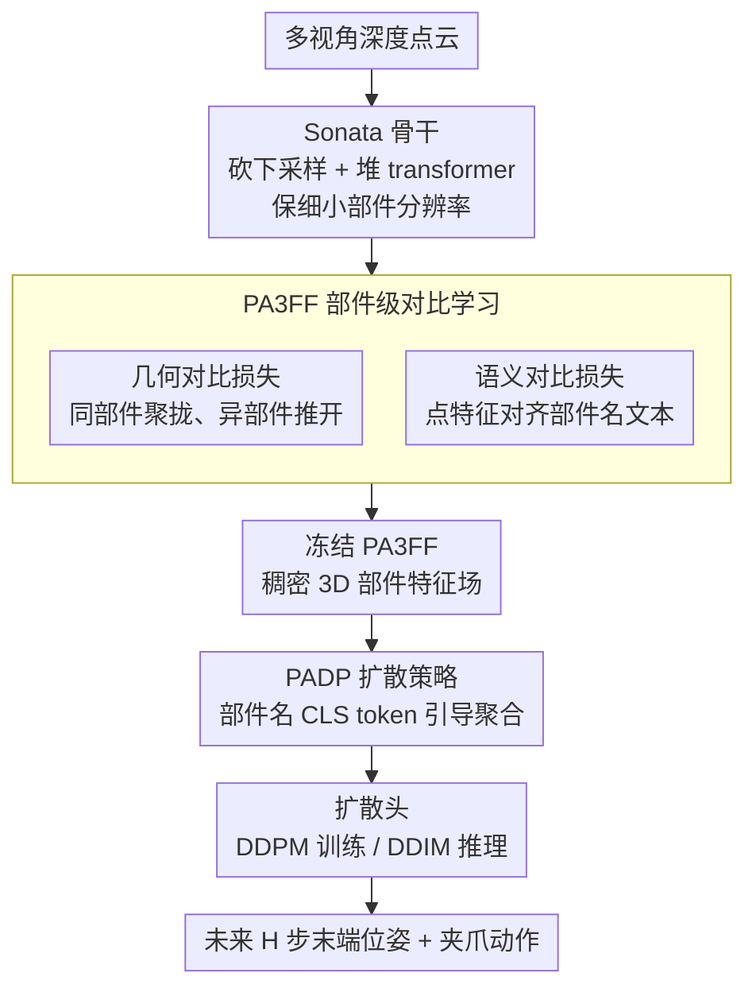

# Learning Part-Aware Dense 3D Feature Field for Generalizable Articulated Object Manipulation

**会议**: ICLR 2026  
**arXiv**: [2602.14193](https://arxiv.org/abs/2602.14193)  
**代码**: [https://pa3ff.github.io/](https://pa3ff.github.io/)  
**领域**: 3D视觉 / 机器人操作  
**关键词**: 3D特征场, 部件感知, 关节物体操作, 对比学习, 扩散策略

## 一句话总结

提出 PA3FF（Part-Aware 3D Feature Field），一种原生 3D 的稠密部件感知特征表示，通过 Sonata 预训练骨干 + 几何/语义对比学习获得零部件级特征，结合 Part-Aware Diffusion Policy (PADP) 实现少样本、高泛化性的关节物体操作，在仿真和真实环境中均大幅超越 CLIP/DINOv2/GenDP 等基线。

## 研究背景与动机

**领域现状**：关节物体（如微波炉门、抽屉、水龙头等）的机器人操作需要理解物体的功能部件（把手、旋钮等）来确定 where 和 how 操作。当前做法主要借助 2D 基础模型（CLIP、DINOv2、SigLIP）从图像提取语义特征来指导策略学习。

**现有痛点**：2D 特征本质上缺乏 3D 几何信息和空间连续性。将 2D 特征提升到 3D 的方法（多视角融合、NeRF 蒸馏等）存在三大问题：(a) 推理时间长（甚至数分钟）；(b) 多视角特征不一致——不同视角的 2D 特征在 3D 中会冲突；(c) ViT 系列的 patch 化使分辨率降低 14 倍，丢失细小部件信息（如冰箱把手）。

**核心矛盾**：如何获得同时具备几何精确性、语义部件感知性、跨物体泛化性的 3D 特征，且支持实时前馈推理？

**本文目标**：(a) 构建 3D 原生、部件级的稠密特征场；(b) 基于该特征实现少样本（30 个 demo）的泛化操作策略。

**切入角度**：不从 2D 蒸馏，而是利用在 14 万点云上自监督预训练的 Sonata/PTv3 模型提供 3D 先验，再通过对比学习注入部件语义——同一部件的点特征相近，不同部件的点特征远离。

**核心 idea**：用 3D 原生预训练模型 + 部件级对比学习构建稠密 3D 特征场，使机器人策略能以极少 demo 泛化到未见物体的操作。

## 方法详解

### 整体框架

这篇论文要解决的是：怎样得到一种生而为 3D、能分辨物体功能部件、又能跨物体泛化的稠密特征，从而支撑少样本的关节物体操作策略。它把整个系统拆成三段串起来：先用一个在 3D 点云上自监督预训练好的骨干拿到通用几何先验，再用对比学习把"部件语义"注进这套特征里得到 PA3FF，最后冻结 PA3FF、在它的特征上接一个扩散策略 PADP 学动作。

具体来说，阶段一拿 Sonata（自监督预训练的 Point Transformer V3）作骨干，它已在 14 万点云上学到通用 3D 几何先验；但 PTv3 原本是为大场景设计、用激进下采样换感受野，对小尺度的物体级输入并不合适，所以这里做了架构适配——砍掉大部分下采样层、改堆更多 transformer block，把冰箱把手这类细小部件的分辨率保住。阶段二在 PartNet-Mobility + 3DCoMPaT + PartObjaverse-Tiny 这些带部件标注的大规模数据上，用**几何对比损失**加**语义对比损失**精炼骨干的输出特征，把部件感知性灌进去，得到 PA3FF。阶段三则冻结 PA3FF 提点云特征，由 **PADP** 扩散策略经 Transformer encoder 聚合后送进扩散动作头，输入是多视角深度相机点云加机器人本体状态，输出未来 H 步的末端执行器位姿与夹爪状态。

### 关键设计

**1. 几何对比损失 $\mathcal{L}_{Geo}$：只靠几何让同部件聚拢、异部件推开**

要让特征真正反映 3D 部件结构、而不沾任何 2D 信息，最直接的办法就是在特征空间里把同一部件的点拉到一起、把不同部件的点推开。这里用的是 Supervised Contrastive Loss：给定 $N$ 个点的特征-标签对 $\{f_k, a_k\}$，对每个点把同标签的点当正样本、异标签的当负样本，算 softmax 相似度损失。因为监督信号纯来自部件标签和点的几何分布，得到的特征是纯几何约束下的部件聚类，不依赖图像，也就避开了 2D 提升那套多视角不一致的麻烦。

**2. 语义对比损失 $\mathcal{L}_{Sem}$：把点特征对齐到部件名的文本含义**

光有几何聚类还不够——特征得知道这个簇是"把手"还是"旋钮"，操作时才好按语义找目标。于是再加一条语义对齐：用 SigLIP 文本编码器把部件名（如 "handle"、"knob"）编成语义向量 $\mathbf{x}_k = \text{SigLIP}(s_k)$，再用 InfoNCE 损失把每个点的特征拉向它对应部件名的文本特征。这样特征里既有阶段一来的空间结构，又叠了功能含义，"把手"和"旋钮"在特征空间中被明确区分开，下游策略才能用一个部件名就把注意力定位过去。

**3. Part-Aware Diffusion Policy (PADP)：用部件名语义引导注意力的扩散策略**

有了 PA3FF，怎么把它用进策略、又不让网络被无关区域分散，是最后一步。PADP 的做法是冻结 PA3FF 提点云 embedding，然后拿当前任务关键部件名的语义 embedding 当 CLS token，引导 Transformer encoder 做特征聚合——比如"开微波炉"时这个 CLS token 把注意力聚到"把手"上；聚合后的特征拼上机器人本体状态、经 MLP 压缩，再交给扩散头，训练用 DDPM、推理用 DDIM 生成连续动作序列。CLS token 这一步等于用一句部件名给策略做了轻量的任务条件化，让它每次只盯着真正该操作的那个部件。

### 损失函数 / 训练策略

- 特征学习总损失：$\mathcal{L}_{total} = \mathcal{L}_{Geo} + \mathcal{L}_{Sem}$
- 策略训练：标准 DDPM MSE 损失 $\mathcal{L}(\phi) = \text{MSE}(\mathbf{a}_t, D_\theta(\mathbf{o}_t, \tilde{\mathbf{a}}_t, k))$
- PA3FF 骨干在策略学习时完全冻结，只训练 Transformer encoder + MLP + 扩散头
- 真实世界实验每个任务仅需 30 个人工遥操作 demo

## 实验关键数据

### 主实验

仿真结果（PartInstruct 5 级泛化测试，成功率 %）：

| 方法 | Test1 (OS) | Test2 (OI) | Test3 (TP) | Test4 (TC) | Test5 (OC) | 平均 |
|------|-----------|-----------|-----------|-----------|-----------|------|
| Act3D | 6.25 | 5.68 | 4.55 | 0.0 | 2.08 | 3.88 |
| DP (Diffusion Policy) | 7.27 | 8.64 | 8.18 | 3.75 | 6.67 | 5.96 |
| DP3 | 23.18 | 23.18 | 18.18 | 7.73 | 6.67 | 15.40 |
| GenDP | 24.34 | 23.36 | 24.53 | 10.00 | 14.61 | 19.36 |
| **PADP (Ours)** | **36.76** | **34.33** | **32.45** | **13.75** | **26.67** | **28.79** |

PADP 平均成功率 28.79%，比最强基线 GenDP 高 **9.4%** 绝对提升。

真实世界结果（8 个任务，train/test 各 10 次试验）：

| 方法 | 开锅盖 | 开抽屉 | 关盒子 | 关笔记本 | 开微波炉 | 开瓶子 | 放壶盖 | 按压器 | 均值(Test) |
|------|--------|--------|--------|----------|----------|--------|--------|--------|-----------|
| DP | 2/10 | 1/10 | 1/10 | 3/10 | 0/10 | 2/10 | 0/10 | 0/10 | 11.25% |
| GenDP | 6/10 | 5/10 | 3/10 | 4/10 | 3/10 | 4/10 | 2/10 | 1/10 | 35.0% |
| **PADP** | **6/10** | **6/10** | **5/10** | **7/10** | **5/10** | **6/10** | **5/10** | **3/10** | **58.75%** |

### 消融实验

Open Bottle 任务泛化性分析（真实世界，10 次试验完成率 %）：

| 方法 | 原始环境 | 空间扰动 | 物体泛化 | 环境泛化 |
|------|----------|----------|----------|----------|
| DP | 50 | 40 | 10 | 0 |
| DP3 | 40 | 20 | 20 | 10 |
| GenDP | 50 | 20 | 30 | 30 |
| **PADP** | **80** | **70** | **60** | **60** |

### 关键发现

- PA3FF 在空间分辨率上远优于 2D 方法：DINOv2 的 ViT patch 导致分辨率降 14 倍，冰箱把手等细小部件完全丢失，PA3FF 逐点特征无此问题
- PA3FF 生成的特征场比 DINOv2/SigLIP 更平滑一致（无多视角拼接伪影），在 faucet 等对称物体上尤其明显
- 仅 30 个 demo 就能泛化到未见物体/环境，说明 PA3FF 提取的部件特征是真正跨物体通用的
- 在最困难的环境泛化场景（加干扰物 + 换背景）下，PADP 仍保持 60% 成功率，而基线全部大幅退化

## 亮点与洞察

- **3D 原生 vs 2D 提升的根本优势**：避免了多视角融合的一致性问题和分辨率损失，是从"投影到 3D"到"生而为 3D"的范式转变。这种思路值得在其他需要精细 3D 理解的任务中推广
- **对比学习同时做几何+语义对齐**：一个 loss 管空间，一个 loss 管功能含义，两者互补。这个双损失设计非常通用，可以迁移到任何需要"结构感知+语义感知"特征的场景
- **CLS token 用部件名引导注意力**：在策略网络中把任务关键部件名作为 CLS token，是一种轻量但有效的任务条件化方式

## 局限与展望

- **依赖部件标注**：训练 PA3FF 需要 PartNet-Mobility 等带部件标签的数据集，对新品类覆盖有限
- **仿真绝对成功率不高**：最好的 PADP 平均也只有 28.79%，说明关节物体操作本身仍是极难问题
- **未处理变形物体**：PA3FF 假设部件是刚体，对布料、绳索等变形物体不适用
- **真实世界相机依赖**：需要 3 台深度相机做点云融合，部署成本较高，可考虑用单目深度估计降低硬件要求

## 相关工作与启发

- **vs GenDP**: GenDP 也做类别级泛化但依赖 DINOv2 做 2D 语义场，存在多视角不一致和分辨率不足问题。PADP 用 3D 原生特征解决了这两个根本问题，真实世界提升 23.75%
- **vs DP3**: DP3 用点云但没有部件级语义特征，泛化能力显著弱于 PADP
- **vs 2D 提升方法 (LERF, F3RM)**: 这类方法需要 per-scene 优化 NeRF，推理慢且无法实时；PA3FF 是前馈推理。迁移启发：任何需要细粒度 3D 语义的任务（如工业质检、手术机器人）都可以考虑 3D 原生特征替代 2D 提升

## 评分

- 新颖性: ⭐⭐⭐⭐ 3D 原生部件特征场 + 双对比学习的组合是新颖的，但各组件（Sonata、对比学习、扩散策略）都不是新的
- 实验充分度: ⭐⭐⭐⭐⭐ 仿真 16 任务 5 级泛化 + 真实 8 任务 + 消融 + 泛化维度分析 + 下游应用（对应、分割），非常充分
- 写作质量: ⭐⭐⭐⭐ 结构清晰，实验展示详细，但方法部分公式较多读起来略重
- 价值: ⭐⭐⭐⭐⭐ 为机器人操作提供了强大的 3D 表征方案，代码和项目页面开源，实用价值高

<!-- RELATED:START -->

## 相关论文

- [\[CVPR 2026\] Part$^{2}$GS: Part-aware Modeling of Articulated Objects using 3D Gaussian Splatting](../../CVPR2026/3d_vision/part2gs_part-aware_modeling_of_articulated_objects_using_3d_gaussian_splatting.md)
- [\[ICLR 2026\] Ctrl&Shift: High-Quality Geometry-Aware Object Manipulation in Visual Generation](ctrlshift_high-quality_geometry-aware_object_manipulation_in_visual_generation.md)
- [\[ICLR 2026\] Generalizable Coarse-to-Fine Robot Manipulation via Language-Aligned 3D Keypoints](generalizable_coarse-to-fine_robot_manipulation_via_language-aligned_3d_keypoint.md)
- [\[ICLR 2026\] PD²GS: Part-Level Decoupling and Continuous Deformation of Articulated Objects via Gaussian Splatting](pd2gs_part-level_decoupling_and_continuous_deformation_of_articulated_objects_vi.md)
- [\[ECCV 2024\] Learning 3D-Aware GANs from Unposed Images with Template Feature Field](../../ECCV2024/3d_vision/learning_3d-aware_gans_from_unposed_images_with_template_feature_field.md)

<!-- RELATED:END -->
