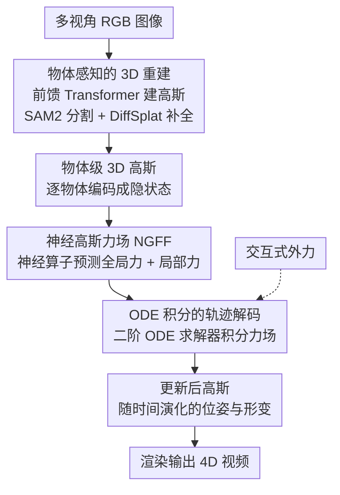

# Learning Physics-Grounded 4D Dynamics with Neural Gaussian Force Fields

**会议**: ICLR 2026  
**arXiv**: [2602.00148](https://arxiv.org/abs/2602.00148)  
**代码**: [项目页面](https://neuralgaussianforcefield.github.io/)  
**领域**: 3D视觉/物理仿真  
**关键词**: 3D高斯溅射, 力场学习, 物理推理, 4D视频预测, 神经算子

## 一句话总结
提出NGFF框架，从多视角RGB图像构建3D高斯表示并学习显式神经力场驱动物理动力学，通过ODE求解实现交互式物理真实4D视频生成，比传统高斯模拟器快两个数量级，超越Veo3和NVIDIA Cosmos。

## 研究背景与动机

**领域现状**：视频生成模型产出视觉效果惊人但缺乏物理理解——频繁违反重力、物体永恒性等基本规律。结合3DGS和传统物理引擎的方法物理一致性好但计算代价高。

**现有痛点**：(1) 粒子/网格方法需要预定义物理模型和结构化输入，泛化差；(2) MPM-based高斯方法物理高保真但计算代价不可接受；(3) 大视频模型过拟合表面视觉特征而非学习物理原理。

**核心矛盾**：需要既有物理一致性（力的建模），又有计算效率（不用MPM），还能从视觉观测直接学习（不依赖结构化输入）。

**切入角度**：不预定义物理模型，而是学习显式力场——用神经算子预测物体间的力，通过ODE积分模拟动力学。3D高斯提供了物体感知的表示接口。

## 方法详解

### 整体框架
NGFF 要解决的是「让视频生成既物理可信又跑得快」的矛盾：传统 MPM 高斯模拟器物理准确但要逐粒子迭代、慢到不可接受，而大视频模型只学到了表面视觉、频繁违反重力和物体永恒性。它的思路是不预定义任何物理模型，而是直接从视觉观测里**学一个显式的力场**，再用 ODE 把力积分成轨迹。整条管线是：多视角 RGB 先经前馈 Transformer 重建成 3D 高斯并按物体分割，每个物体编码成隐特征后送进神经算子预测它受到的力，力场经二阶 ODE 求解器积分出每个物体随时间的位姿与形变轨迹，最后把更新后的高斯渲染成 4D 视频。整个流程全程可微，因此既能端到端训练，也能在推理时施加外力做交互式生成。

### 关键设计

**1. 物体感知的 3D 重建：把场景拆成物理仿真能用的物体级表示**

物理仿真没法在一团未分解的点云上做——力是作用在「物体」上的，所以重建阶段必须先得到物体级别的分解表示。这里用一个前馈 Transformer 从多视角 RGB 直接构建 3D 高斯：先用 DINOv2 抽取图像特征，再经交替注意力的 Transformer 同时预测相机位姿和高斯参数，避免了逐场景优化。重建出的高斯用 SAM2 分割成独立物体，被遮挡的部分则交给 DiffSplat 精化补全，保证每个物体的几何在仿真前是完整的。

**2. 神经高斯力场（NGFF）：用神经算子一次性预测力，而不是逐粒子模拟**

这是全篇核心，也是两个数量级加速的来源——MPM 之所以慢，是因为它逐粒子逐步迭代力学方程，而 NGFF 用一个神经算子直接把物体的隐状态映射成它当下受到的力。力被拆成全局和局部两部分：全局力负责刚体的整体平移与旋转，对查询物体 $q$，它由邻域 $\mathcal{N}(q)$ 内其它物体的特征经两个分支 $f_\eta$、$f_\phi$ 逐元素相乘、再线性变换聚合而成，

$$\mathbf{F}^{\text{global}}(\mathbf{z}^q(t)) = \sum_{i \in \mathcal{N}(q)} \mathbf{W}\big(f_\eta(\mathbf{z}^i) \odot f_\phi(\mathbf{z}^q)\big) + \mathbf{b},$$

其中邻域关系图编码了物体间的接触结构。局部力则负责软体的形变，由隐力特征、接触区域掩码 CAM、以及查询物体的位置与速度共同决定，

$$\mathbf{F}^{\text{local}} = \Phi(\mathbf{F}^{\text{latent}}, \text{CAM}, \mathbf{x}^q, \dot{\mathbf{x}}^q).$$

CAM（contact area mask）标出两个物体真正接触的区域，让应力只施加在该发力的地方。把刚体平移/旋转和软体变形按物理意义解耦成全局与局部两路，比端到端直接回归整体运动更容易泛化。

**3. ODE 积分的轨迹解码：把预测的力变成随时间演化的状态**

有了力还需要一座可微的桥把它连回动力学。NGFF 用二阶 ODE 求解器从初始隐状态出发对力场积分，得到任意时刻 $t$ 的物体状态

$$\mathbf{z}^q(t) = \text{ODESolve}(\mathbf{z}^q(0), \mathbf{F}, 0, t),$$

速度则按牛顿第二定律由力的时间积分累加，$\dot{\mathbf{s}}(t) = \dot{\mathbf{s}}(0) + \int_0^t \mathbf{F}(\mathbf{z}^q(t))\, dt$。因为 ODESolve 全程可微，力场预测和动力学模拟被拼成一条端到端可训练的链路，同时也让推理时插入外力、改变轨迹成为可能。

### 损失函数 / 训练策略
训练分两阶段：先在 WildRGBD 上微调前馈重建模块，再在合成 MPM 数据上训练动力学预测部分。动力学损失是预测与真实的高斯配置及运动轨迹之间的 MSE。

## 实验关键数据

### GSCollision数据集
- 640K渲染的物理视频(~4TB)，10种日常物体（软硬皆有），涵盖下落/碰撞/旋转/滑动/容器交互

### 主实验 (动力学预测)

| 模型 | 空间RMSE↓ | 时间RMSE↓ | 组合RMSE↓ | 推理时间↓ |
|------|----------|----------|----------|----------|
| VLM-MPM | 高 | 高 | 高 | >100s |
| Pointformer | 中 | 中 | 中 | 中 |
| **NGFF** | **最低** | **最低** | **最低** | **~1s** |

### 视频生成对比

| 模型 | 物理一致性 | 视觉质量 |
|------|----------|---------|
| Veo3 | 差(违反物理) | 高 |
| NVIDIA Cosmos | 差 | 高 |
| **NGFF** | **强** | **合理** |

### 关键发现
- NGFF比MPM-based高斯模拟器快两个数量级——因为学到了力场而非逐粒子模拟
- 在组合泛化(4-6物体，训练只有3物体)和时间泛化(超出训练长度)上表现优异
- 显式力场建模使得交互式生成成为可能——可以施加外力改变轨迹
- Sim-to-real迁移通过3D高斯表示的解耦接口实现

## 亮点与洞察
- **学力场而非学动力学**：不直接预测下一帧状态，而是预测力→ODE积分得到状态。这提供了更好的泛化性（力的规律比状态转移更通用）。
- **两个数量级加速**：关键在于用神经算子一次性预测力，而非MPM那样逐粒子逐步迭代。
- **全局+局部力场解耦**：刚体运动用全局力（平移+旋转），软体变形用局部应力。这种物理驱动的分解比端到端学习更好泛化。

## 局限与展望
- 训练数据来自合成MPM仿真——真实世界物理参数（摩擦、弹性）的多样性有限
- SAM2分割在复杂遮挡场景可能失败
- 目前只建模了刚体和简单软体——流体、布料等复杂材料未考虑
- DiffSplat补全质量影响下游动力学预测

## 相关工作与启发
- **vs Veo3/Cosmos**: 大视频模型有视觉质量但无物理理解，NGFF相反——物理好视觉合理
- **vs MPM-Gaussian**: MPM物理准确但慢两个数量级，NGFF用神经力场替代显式模拟
- **vs GNN-based**: GNN用图神经网络学关系，NGFF用神经算子学力场——物理意义更明确

## 评分
- 新颖性: ⭐⭐⭐⭐⭐ 神经力场+3D高斯的组合原创且物理意义清晰
- 实验充分度: ⭐⭐⭐⭐ GSCollision数据集完备，多维度泛化评估
- 写作质量: ⭐⭐⭐⭐ 框架清晰，能力展示直观
- 价值: ⭐⭐⭐⭐⭐ 向物理驱动的世界模型迈出重要一步

<!-- RELATED:START -->

## 相关论文

- [\[ICLR 2026\] DiffWind: Physics-Informed Differentiable Modeling of Wind-Driven Object Dynamics](diffwind_physics-informed_differentiable_modeling_of_wind-driven_object_dynamics.md)
- [\[ICLR 2026\] Einstein Fields: A Neural Perspective To Computational General Relativity](einstein_fields_a_neural_perspective_to_computational_general_relativity.md)
- [\[CVPR 2026\] Dynamic Black-hole Emission Tomography with Physics-informed Neural Fields](../../CVPR2026/3d_vision/dynamic_black-hole_emission_tomography_with_physics-informed_neural_fields.md)
- [\[NeurIPS 2025\] MPMAvatar: Learning 3D Gaussian Avatars with Accurate and Robust Physics-Based Dynamics](../../NeurIPS2025/3d_vision/mpmavatar_learning_3d_gaussian_avatars_with_accurate_and_robust_physics-based_dy.md)
- [\[ICLR 2026\] Learning Unified Representation of 3D Gaussian Splatting](learning_unified_representation_of_3d_gaussian_splatting.md)

<!-- RELATED:END -->
