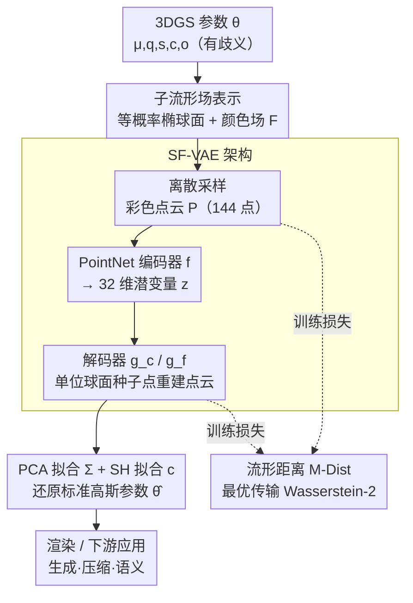

# Learning Unified Representation of 3D Gaussian Splatting

**会议**: ICLR 2026  
**arXiv**: [2509.22917](https://arxiv.org/abs/2509.22917)  
**代码**: [GitHub](https://github.com/cilix-ai/gs-embedding)  
**领域**: 3D视觉/表示学习  
**关键词**: 3D高斯溅射, 子流形场表示, 表示唯一性, VAE, 最优传输

## 一句话总结

3DGS原生参数 $\boldsymbol{\theta}=\{\mu,\mathbf{q},\mathbf{s},\mathbf{c},o\}$ 存在非唯一性与数值异质性，不适合作为神经网络的学习空间。本文提出**子流形场 (Submanifold Field)** 表示：将每个高斯基元映射到其等概率椭球面上的连续颜色场，证明该映射是单射的，从根源上消除参数歧义，并配合基于最优传输的流形距离 (M-Dist) 训练 VAE 嵌入，在重建保真度、跨域泛化与潜空间稳定性上全面优于参数基线。

## 研究背景与动机

3DGS 已成为 3D 重建与渲染的核心方法，越来越多下游任务——压缩 (Shin et al.)、生成 (Yi et al.)、语义理解 (Guo et al.)——直接把高斯参数 $\boldsymbol{\theta}$ 作为网络输入/输出。但这种做法隐含三个根本问题：

1. **非唯一性 (Non-uniqueness)**：四元数符号歧义 ($\mathbf{q}$ 和 $-\mathbf{q}$ 表示同一旋转)、几何对称性、旋转-SH 交互产生等价参数组合——形成多对一映射，在训练时产生矛盾梯度信号。实验中，仅对四元数取反 ($\mathbf{q}\to-\mathbf{q}$) 就能让参数自编码器完全解码失败。
2. **数值异质性 (Numerical Heterogeneity)**：位置 $\mu\in\mathbb{R}^3$ 可达很大范围，四元数保持单位归一化，预激活缩放从 $-15$ 到 $3$，SH 系数指数衰减。强行拼接到同一向量破坏了 BatchNorm 等标准模块对特征同分布的假设。
3. **流形不匹配**：位置在 $\mathbb{R}^3$、旋转在 $\text{SO}(3)$、缩放在 $(\mathbb{R}^+)^3$——不同流形变量被压入欧几里得空间，内在几何结构被破坏。

这些问题在下游生成任务中表现为潜空间插值的几何"抖动"、噪声敏感性高、跨域（室内↔户外）泛化差。本文的切入点：**不学参数本身，而是学一个有证明唯一映射的几何-光度表示**。

## 方法详解

### 整体框架

本文要解决的是「3DGS 参数不适合当网络学习空间」这一根本矛盾：与其学习有歧义的参数 $\boldsymbol{\theta}$，不如把每个高斯基元换算成一个有唯一性证明的几何-光度表示去学。整条流水线自上而下走三步：先把 $\boldsymbol{\theta}$ 映射成**子流形场**（一张等概率椭球面 + 其上的颜色场），离散采样成彩色点云；再用 **SF-VAE** 把点云用 PointNet 编码器压到 32 维潜变量、经解码器从单位球面种子点重建点云，并用 PCA 与 SH 拟合把重建结果还原回标准高斯参数 $\hat{\boldsymbol{\theta}}$ 以便渲染；训练时不在参数空间算误差，而是用基于最优传输的**流形距离 M-Dist** 比较输入点云与重建点云。整个学习与度量过程都发生在这个无歧义的表示空间里。

### 关键设计

**1. 子流形场表示：用等概率椭球面 + 颜色场替换有歧义的原始参数**

参数表示的非唯一性源于四元数符号、几何对称等多对一映射，因此方法不直接学 $\boldsymbol{\theta}$，而是为每个高斯基元取其 Mahalanobis 距离为常数 $r$ 的等概率面作为二维子流形 $\mathcal{M} = \{\mathbf{x}\in\mathbb{R}^3 \mid (\mathbf{x}-\boldsymbol{\mu})^\top \Sigma^{-1}(\mathbf{x}-\boldsymbol{\mu}) = r^2 \}$，并在该椭球面上定义颜色场 $F(\mathbf{x})=\sigma(o)\cdot\text{Color}(\mathbf{d}_\mathbf{x})$，方向 $\mathbf{d}_\mathbf{x}=(\mathbf{x}-\mu)/\|\mathbf{x}-\mu\|$。这样椭球面的形状自然编码了旋转与缩放、颜色场编码外观与不透明度，把原本散落在不同流形上的变量统一到同一几何对象上。其有效性由 **Proposition 2** 保证：不同高斯对应不同的子流形场 $\mathcal{E}$，即映射是单射的——四元数取反等歧义因为不改变等概率面而被从根源上消除。

**2. SF-VAE 架构：把子流形场塞进点云 VAE 并保证能还原回标准参数**

子流形场是连续场，要喂进网络得先离散、再编码。方法把椭球面上均匀采样的 $P=12^2=144$ 个点连同颜色组成彩色点云 $\mathcal{P}$，用 PointNet 编码器 $f$ 压到 32 维潜变量 $\mathbf{z}\sim f(\mathbf{z}\mid\mathcal{P})$；解码端从单位球面采 $P'$ 个种子点 $\mathcal{U}_{P'}$，分别送进坐标变换网络 $g_c$ 和颜色场网络 $g_f$ 生成重建点云 $\hat{\mathcal{P}}$。为了能回到渲染管线，再用 PCA 从重建点云拟合协方差矩阵 $\Sigma$、用 SH 基函数拟合颜色系数 $\mathbf{c}$，把点云还原成标准高斯参数 $\hat{\boldsymbol{\theta}}$，保证整条链路可逆。值得一提的是训练数据是 50 万个随机生成的高斯基元——单个基元脱离场景后没有语义，这让嵌入模型天然域无关，无需任何真实场景数据。

**3. 流形距离 M-Dist：用最优传输给出一个贴近感知质量的训练度量**

有了可逆的编解码链路还缺一个能驱动它的误差信号：在参数空间直接用 $L_1/L_2$ 度量与渲染感知质量脱节，并不可靠。于是方法在子流形场之间基于最优传输定义 Wasserstein-2 距离 $W_2^2(\mathcal{E}, \hat{\mathcal{E}}) = \inf_{\gamma\in\Gamma} \int_{\mathcal{M}\times\hat{\mathcal{M}}} \left(\|\mathbf{x}-\mathbf{y}\|^2 + \lambda\|c_x - c_y\|^2\right) d\gamma$，其中 $\lambda$ 平衡空间项与颜色项；落地时它在输入点云与重建点云之间离散计算。SF-VAE 的训练目标即把它作为重建项与 KL 正则相加：

$$\mathcal{L}_\text{VAE} = \hat{W}_2^2(\mathcal{P}, \hat{\mathcal{P}}) + \beta \cdot D_\text{KL}\!\left(f(\mathbf{z}\mid\mathcal{P}) \,\|\, \mathcal{N}(0,\mathbf{I})\right)$$

实验显示 M-Dist 与 PSNR/LPIPS 的相关性远高于参数 $L_1$ 距离，因此它既被用作重建损失、也被直接拿来当评测指标。

## 实验关键数据

### 零样本重建质量 (训练于随机数据)

| 设置 | 输入表示 | 编码器/解码器 | PSNR↑ | SSIM↑ | LPIPS↓ | M-Dist |
|------|---------|-------------|-------|-------|--------|--------|
| ShapeSplat | 参数 $\boldsymbol{\theta}$ | MLP/MLP | 37.51 | 0.888 | 0.152 | 0.184 |
| ShapeSplat | 参数 $\boldsymbol{\theta}$ | MLP/SF-Dec | 44.73 | 0.896 | 0.136 | 0.051 |
| **ShapeSplat** | **子流形场** | **SF-VAE** | **63.41** | **0.990** | **0.010** | **0.041** |
| Mip-NeRF 360 | 参数 $\boldsymbol{\theta}$ | MLP/MLP | 18.82 | 0.564 | 0.452 | 0.510 |
| Mip-NeRF 360 | 参数 $\boldsymbol{\theta}$ | MLP/SF-Dec | 20.92 | 0.730 | 0.359 | 0.055 |
| **Mip-NeRF 360** | **子流形场** | **SF-VAE** | **29.83** | **0.953** | **0.079** | **0.048** |

子流形场表示在物体级 (ShapeSplat) 和场景级 (Mip-NeRF 360) 上分别比最好参数基线高出 **+18.7 dB** 和 **+8.9 dB** PSNR。三个模型参数量匹配（0.62M/0.66M/0.62M），差异完全来自表示选择。

### 跨域泛化 (训练A→测试B)

| 训练集 | 测试集 | 输入表示 | PSNR↑ | SSIM↑ | LPIPS↓ |
|--------|--------|---------|-------|-------|--------|
| ShapeSplat | Mip-NeRF 360 | 参数 (MLP/MLP) | 9.75 | 0.356 | 0.615 |
| ShapeSplat | Mip-NeRF 360 | **子流形场** | **19.19** | **0.821** | **0.309** |
| Mip-NeRF 360 | ShapeSplat | 参数 (MLP/MLP) | 55.62 | 0.957 | 0.067 |
| Mip-NeRF 360 | ShapeSplat | **子流形场** | **62.58** | **0.990** | **0.014** |

跨域场景中子流形场优势更大（物体→场景跳了近 **+10 dB**）。更有趣的是，用随机数据训练的模型反而优于从真实域迁移的模型，证明子流形场表示天然的域无关性。

### 高斯神经场 (GNF) 下游验证

| 回归目标 | PSNR↑ | SSIM↑ | LPIPS↓ | 参数量 |
|---------|-------|-------|--------|--------|
| 原始参数 $\boldsymbol{\theta}$ (ShapeSplat) | 51.66 | 0.925 | 0.141 | 0.21M |
| **SF 嵌入** (ShapeSplat) | **58.62** | **0.980** | **0.043** | 0.20M |
| 原始参数 $\boldsymbol{\theta}$ (Mip-NeRF 360) | 19.92 | 0.648 | 0.410 | 1.87M |
| **SF 嵌入** (Mip-NeRF 360) | **24.40** | **0.804** | **0.261** | 1.85M |

用轻量 MLP 从空间坐标回归 SF 嵌入比回归原始参数容易得多，验证了该表示对神经网络更友好。

### 敏感性与消融

- **四元数取反鲁棒性**：对 $\mathbf{q}\to-\mathbf{q}$，参数 VAE 解码完全失败；SF-VAE 不受影响（因为子流形场对四元数符号天然不变）
- **噪声鲁棒性**：向嵌入空间注入不同比例噪声，SF 嵌入的 M-Dist 退化速度远慢于参数嵌入
- **插值平滑度**：参数潜空间线性插值出现旋转/缩放抖动，SF 潜空间插值过渡平滑
- **嵌入维度**：32 维为最佳平衡点（低于 32 质量显著下降，高于 32 收益递减）
- **训练数据量**：仅需 2% 数据（1 万样本）即达接近基线性能
- **离散化分辨率**：$P=12^2=144$ 为最佳采样点数，更高几无提升
- **编码效率**：RTX 5090 上 batch=4096 时编码 1M 高斯仅 1.72s，解码 4.20s（含拟合模块 0.48s）

## 亮点与洞察

- **问题诊断的价值超过解法本身**：清晰形式化了参数表示的三个根本缺陷（非唯一/异质/流形不匹配），对所有把 3DGS 参数当网络输入的方法敲响警钟。仅四元数取反就崩溃的实验极具说服力。
- **子流形场的数学优美**：等概率面是 3D 高斯的内在几何——椭球面编码旋转+缩放，颜色场编码外观+不透明度——Proposition 2 保证唯一性。不需要特殊的参数化技巧或归一化。
- **域无关设计的巧妙**：单个高斯基元脱离场景后没有语义，因此可以用随机生成数据训练嵌入模型。结果是用随机数据训练的模型在真实域上比用真实域数据跨域迁移的模型还好。
- **M-Dist 的实用价值**：提供了一个比参数 $L_1/L_2$ 更接近感知指标的度量标准，对未来 3DGS 学习系统的训练损失选择有直接指导意义。

## 局限性与展望

- 当前在**单高斯级别**操作，缺少对高斯间关系的建模；向场景级扩展需要排列不变的注意力机制
- 子流形场离散化引入采样分辨率-效率权衡（$P=144$ 为经验最优）
- M-Dist 基于最优传输，计算开销高于 $L_2$
- 仅展示了重建、嵌入质量与无监督聚类，完整的生成管线（扩散/流匹配）尚未对接
- 动态场景 (4D GS) 的时间扩展未探索

## 相关工作对比

- **vs 直接参数回归 (pixelSplat, MVSplat)**：这些方法让网络直接输出 $\boldsymbol{\theta}$，本文指出这在表示层面就有根本缺陷
- **vs 3DGS 生成 (DiffGS, GaussianDiffusion)**：在参数空间做扩散，换到子流形场空间可获得更平滑的潜空间
- **vs 3DGS 压缩 (HAC, CompGS)**：压缩方法减少参数数量，子流形场改善参数质量——二者正交可组合

## 评分

- 新颖性: ⭐⭐⭐⭐⭐ 首次系统诊断 3DGS 参数表示缺陷并提出有理论保证的唯一替代表示
- 实验充分度: ⭐⭐⭐⭐ 控制变量严格，四元数取反/跨域/GNF 多角度验证说服力强
- 写作质量: ⭐⭐⭐⭐⭐ 定义→命题→证明→实验逻辑链完整，问题动机阐述极为清晰
- 价值: ⭐⭐⭐⭐⭐ 对所有基于 3DGS 参数的学习系统有根本性指导意义

<!-- RELATED:START -->

## 相关论文

- [\[ACL 2026\] CodeBind: Decoupled Representation Learning for Multimodal Alignment with Unified Compositional Codebook](../../ACL2026/3d_vision/codebind_decoupled_representation_learning_for_multimodal_alignment_with_unified.md)
- [\[ICLR 2026\] MEGS2: Memory-Efficient Gaussian Splatting via Spherical Gaussians and Unified Pruning](megs2_memory-efficient_gaussian_splatting_via_spherical_gaussians_and_unified_pr.md)
- [\[ICLR 2026\] Weight Space Representation Learning on Diverse NeRF Architectures](weight_space_representation_learning_on_diverse_nerf_architectures.md)
- [\[CVPR 2026\] Learning Explicit Continuous Motion Representation for Dynamic Gaussian Splatting from Monocular Videos](../../CVPR2026/3d_vision/learning_explicit_continuous_motion_representation_for_dynamic_gaussian_splattin.md)
- [\[AAAI 2026\] Point-SRA: Self-Representation Alignment for 3D Representation Learning](../../AAAI2026/3d_vision/point-sra_self-representation_alignment_for_3d_representation_learning.md)

<!-- RELATED:END -->
