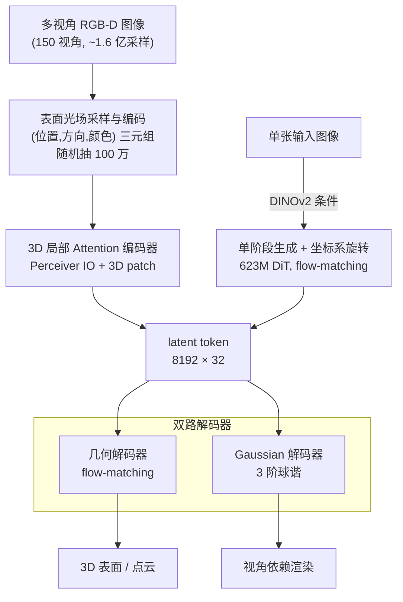

# LiTo: Surface Light Field Tokenization

**会议**: ICLR 2026  
**arXiv**: [2603.11047](https://arxiv.org/abs/2603.11047)  
**代码**: 无(Apple内部)  
**领域**: 3D视觉/生成  
**关键词**: 表面光场, 3D latent表示, 视角依赖外观, Gaussian Splatting, flow matching

## 一句话总结
提出LiTo——通过将表面光场(surface light field)编码为紧凑latent向量集合来同时建模3D几何和视角依赖外观：输入RGB-D多视角图像的光场随机子采样 -> Perceiver IO编码器(支持100万token输入的3D局部attention) + flow-matching几何解码器 + 高阶球谐Gaussian解码器 -> 实现重建和单图到3D生成都超越TRELLIS，首次在latent 3D表示中建模高光/菲涅尔反射等视角依赖效果。

## 研究背景与动机

**领域现状**：3D latent表示领域分为两类——几何only表示(3DShape2VecSet/TripoSG/ShapeTokens)只建模形状不含外观；几何+外观表示(TRELLIS/3DTopia-XL)加入外观但只支持视角无关的漫反射颜色(view-independent diffuse color)。

**现有痛点**：(1) 几何only方法无法渲染逼真的3D内容——缺少颜色/材质/光照效果；(2) TRELLIS虽然包含外观但用DINOv2特征的mean pooling，丢弃了视角方向信息——无法建模高光、菲涅尔反射等view-dependent效果；(3) 3DTopia-XL虽建模PBR材质但需要从mesh优化primitive表示的预处理步骤。

**核心矛盾**：真实物体外观强烈依赖观察角度(金属反射、菲涅尔效应等)，但现有3D latent表示丢弃了方向信息。要建模视角依赖效果，需要编码表面光场(surface light field)——不仅是表面位置和颜色，还要包含观察方向。

**切入角度**：RGB-D多视角图像就是表面光场的离散采样——每个像素提供一个(表面点位置, 观察方向, 颜色)元组。通过随机子采样这些光场样本作为输入，用编码器插值、用3阶球谐Gaussian解码器输出。

**核心 idea**：将表面光场的随机子采样编码为紧凑latent tokens，用双路解码器(flow-matching几何 + 球谐Gaussian外观)实现几何和视角依赖外观的统一3D表示。

## 方法详解

### 整体框架
LiTo 想把一个物体的**表面光场**（surface light field，即"表面上某点、从某方向看过去是什么颜色"）压成一组紧凑的 latent token，让这组 token 同时承载几何和视角依赖的外观。整条流水线是这样转的：先对物体渲染 150 张多视角 RGB-D 图，从中提取约 1.6 亿个表面光场采样；随机抽出 100 万个喂给编码器，编码成 $k=8192$ 个 $d=32$ 维的 latent token。拿到这组 token 后，再用两个解码器分头还原——一个 flow-matching 几何解码器恢复 3D 表面，一个球谐 Gaussian 解码器恢复视角依赖渲染。除了从多视角图像编码，这组 token 还能被一个 DiT 模型从单张图像直接生成，实现单图到 3D。

### 关键设计

**1. 表面光场采样与编码：把"位置+方向+颜色"打包成可学习的 latent**

要建模视角依赖效果，输入里就必须带方向信息，这正是 TRELLIS 用 mean pooling 丢掉的东西。LiTo 把每张 RGB-D 图拆成一堆采样三元组 $\{(\mathbf{x}_i, \hat{\mathbf{d}}_i, \mathbf{c}_i)\}$：表面点 $\mathbf{x}$ 由深度反投影得到，观察方向 $\hat{\mathbf{d}}$ 由针孔相机模型算出，颜色 $\mathbf{c}$ 就是像素值。完整光场有 1.6 亿采样、信息量巨大却高度冗余，所以编码时只随机抽 $N=2^{20}$（约 100 万）个送进 Perceiver IO，输出 8192 个 32 维 latent token。随机子采样不是图省事——它逼着编码器学会**插值**，从一个稀疏子集 generalize 回完整光场，而每个采样里保留的 $\hat{\mathbf{d}}$ 正是后面能渲出高光、菲涅尔反射的源头。

**2. 3D 局部 Attention：让 Perceiver IO 吃得下百万级 token**

标准 Perceiver IO 的 cross attention 在 100 万 token 上算不动，LiTo 用一套 3D patchification 把它压下来。做法是把所有输入采样按 K-NN 分配到 8192 个 query 各自对应的空间 patch，每个 query 只 attend 自己 patch 内的采样——本质上就是把 ViT 的 16×16 图像 patch 推广到 3D 表面。query 之间的 self-attention 则用 voxel-based windowed attention，每层 shift 半个 voxel 来打通窗口边界。这里用 L2 距离（而非沿表面的 geodesic 距离）来近似"表面局部性"，虽然偶尔会跨表面，但换来的速度收益让百万级输入变得可行，是精度和效率之间一个划算的折中。

**3. 双路解码器：几何和视角依赖外观各走各的头**

同一组 latent 要还原两样东西，于是分成两个解码器。**几何解码器**用 flow-matching 直接建模 3D 表面的分布 $p(\mathbf{x}|\mathcal{S}) \approx \delta(\mathbf{x} \in \partial\Omega)$，训练目标是

$$\mathcal{L}_{geo} = \mathbb{E}_{t,\mathbf{x}} \|V(\mathbf{x}_t; t) - (\mathbf{x} - \epsilon)\|^2$$

推理时从中采样就能得到点云；关键是它**不需要 mesh / occupancy / SDF 这类预处理**，直接从点云学。**Gaussian 解码器**则负责外观：以 sparse occupancy grid 当 query，cross attend 到 latent token，再用 MLP 给每个 occupied voxel 输出 64 个带 3 阶球谐（SH degree 3）的 3D Gaussian，渲染 loss 为 $\mathcal{L}_{radiance} = \|I_{est} - I_{gt}\|^2 + 0.2 \cdot \text{LPIPS}$。比起 TRELLIS 只有一个 view-independent color，3 阶球谐能多吃下高频的视角依赖变化，这是它在近距离观察上 PSNR 大涨的直接原因。

**4. 单阶段生成 + 坐标系旋转：比 TRELLIS 两阶段更简洁，还顺手解决了对齐**

因为 latent 已经把完整物体信息打包好了，生成时不必像 TRELLIS 那样先生成粗糙 occupancy 再生成 SLAT。LiTo 直接训一个 623M 参数的 DiT flow-matching 模型，用 DINOv2 编码输入图像作为条件，一步生成 latent。一个巧妙的细节是：训练时把世界坐标系旋转到让输入视角的相机正好是 identity，这样生成出来的物体**自动和输入视角对齐**——TRELLIS 在 canonical 坐标里生成、还得后处理才能对上，LiTo 省掉了这一步。

### 训练策略
- 编码器+解码器：256 batch，64 GPU，90K iterations，9天
- 生成模型(DiT)：256 batch，128 H100 GPU，600K iterations，20天
- 数据：Objaverse-XL 500K物体子集(TRELLIS同源)，每个物体3种光照x150视角

## 实验关键数据

### 主实验：重建质量 (Toys4k)

| 方法 | PSNR↑ (simple) | SSIM↑ | LPIPS↓ | PSNR↑ (hard) | SSIM↑ | LPIPS↓ |
|------|---------------|-------|--------|-------------|-------|--------|
| TRELLIS | 31.12 | 0.974 | 0.034 | 27.57 | 0.941 | 0.090 |
| **LiTo** | **34.16** | **0.985** | **0.023** | **32.36** | **0.967** | **0.055** |

### 消融：生成质量 (Toys4k)

| 方法 | CLIP↑ | Conditioning View FID↓ | KID↓ | Novel View FID↓ |
|------|-------|----------------------|------|----------------|
| TRELLIS | 0.899 | 12.84 | 0.088 | 7.600 |
| **LiTo** | **0.905** | **6.219** | **0.009** | **6.216** |

### 关键发现
- **重建PSNR提升3dB**: 在hard设置(近距离相机)上从27.57提升到32.36，说明视角依赖建模在近距离观察时尤为重要
- **几何质量不降反升**: 额外建模外观不损害几何精度——在不使用GT粗糙几何的方法中，LiTo几何最优(Chamfer distance最低)
- **生成输入忠实度大幅提升**: Conditioning view FID从12.84降到6.219(坐标系旋转策略起作用)
- **球谐不同阶捕获不同特征**: degree 0=漫反射，degree 1=大致方向性，degree 2-3=高光/菲涅尔
- **Latent空间紧凑**: 8192x32 = 262K参数，比TRELLIS的20Kx11=220K和TripoSG的2048x64=131K大，但无需GT粗糙几何

## 亮点与洞察
- **表面光场作为3D表示的统一框架**：表面光场理论上可以重建任意相机位姿的图像——是最完整的3D外观表示。将其latent化是自然但之前未被充分探索的方向
- **随机子采样+编码器插值**的训练策略非常优雅：不需要完整的表面光场(不可能获得)，只需随机子集让编码器学会generalize
- **3D patchification**巧妙解决了百万级token输入的效率问题，且方法概念上与ViT的patch一致，易于理解
- **单阶段生成 + 坐标系旋转**比TRELLIS的两阶段更简洁，且自然解决了输出对齐问题

## 局限与展望
- 训练数据需要RGB-D多视角渲染(150视角)，获取成本较高
- 3D patchification用L2距离近似表面局部性，当多个表面靠近时会跨表面attend
- 未建模透明/半透明物体(深度图假设第一个交点)
- 计算开销大：编码器+解码器训练需64 GPU 9天，DiT需128 H100 20天

## 相关工作与启发
- **vs TRELLIS**: TRELLIS用DINOv2 mean pooling丢弃方向信息只有diffuse color。LiTo编码方向信息实现view-dependent。且TRELLIS需两阶段生成+canonical坐标，LiTo单阶段+输入对齐
- **vs TripoSG**: 几何only方法无外观。LiTo额外建模视角依赖外观但在无GT粗糙几何条件下几何质量也更好
- **vs 3DTopia-XL**: PrimX需要mesh到primitive的优化预处理。LiTo直接从RGB-D渲染构建输入更scalable

## 评分
- 新颖性: ⭐⭐⭐⭐⭐ 首次在3D latent表示中实现视角依赖外观建模，表面光场tokenization概念新
- 实验充分度: ⭐⭐⭐⭐ 重建和生成都有详细对比，多数据集验证
- 写作质量: ⭐⭐⭐⭐ 方法描述清晰，与TRELLIS等对比明确
- 价值: ⭐⭐⭐⭐⭐ 对3D生成表示方法有重要推进，解决了视角依赖的关键盲点

<!-- RELATED:START -->

## 相关论文

- [\[CVPR 2025\] ProbeSDF: Light Field Probes for Neural Surface Reconstruction](../../CVPR2025/3d_vision/probesdf_light_field_probes_for_neural_surface_reconstruction.md)
- [\[ICLR 2026\] Station2Radar: Query-Conditioned Gaussian Splatting for Precipitation Field](station2radar_query_conditioned_gaussian_splatting_for_precipitation_field.md)
- [\[ICLR 2026\] Augmented Radiance Field: A General Framework for Enhanced Gaussian Splatting](augmented_radiance_field_a_general_framework_for_enhanced_gaussian_splatting.md)
- [\[ICLR 2026\] SurfSplat: Conquering Feedforward 2D Gaussian Splatting with Surface Continuity Priors](surfsplat_conquering_feedforward_2d_gaussian_splatting_with_surface_continuity_p.md)
- [\[ICLR 2026\] Learning Part-Aware Dense 3D Feature Field for Generalizable Articulated Object Manipulation](learning_part-aware_dense_3d_feature_field_for_generalizable_articulated_object_.md)

<!-- RELATED:END -->
