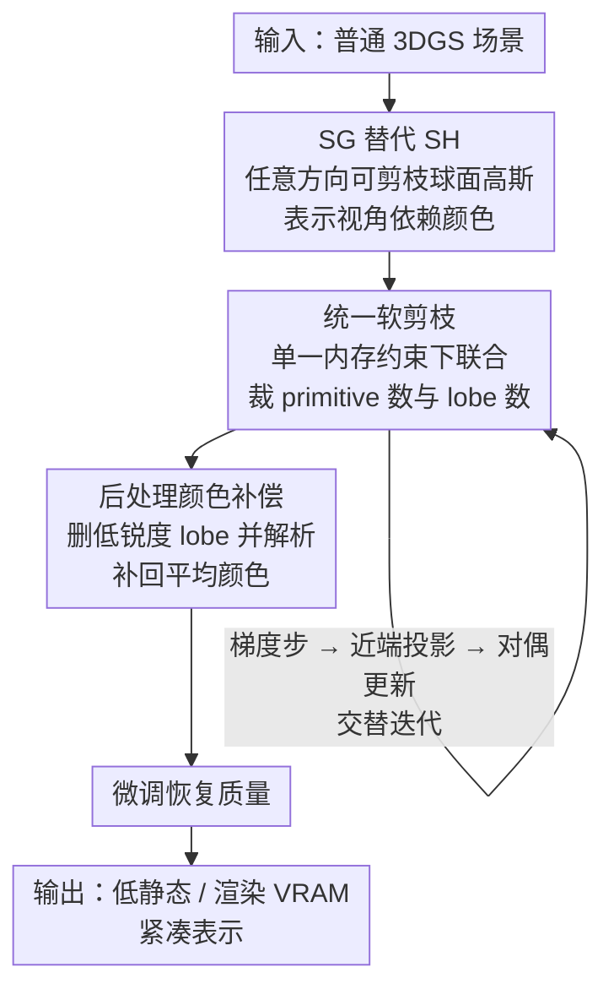

# MEGS2: Memory-Efficient Gaussian Splatting via Spherical Gaussians and Unified Pruning

**会议**: ICLR 2026  
**arXiv**: [2509.07021](https://arxiv.org/abs/2509.07021)  
**代码**: 待发布  
**领域**: 3D视觉/渲染压缩  
**关键词**: 3D Gaussian Splatting, 内存压缩, 球谐函数替代, Spherical Gaussians, 统一剪枝

## 一句话总结
提出MEGS2——从渲染VRAM角度出发压缩3DGS：用可裁剪的任意方向球面高斯(SG)完全替代球谐函数(SH)降低每个primitive的参数量 + 统一软剪枝框架将primitive数量和lobe数量的裁剪建模为单一内存约束优化问题 -> 实现8x静态VRAM压缩和6x渲染VRAM压缩，同时保持渲染质量，首次让3DGS在移动端实时运行。

## 研究背景与动机

**领域现状**：3DGS已成为主流新视角合成技术，但高内存消耗严重限制了其在边缘设备上的部署。大量压缩方法被提出，但绝大多数只关注存储压缩(文件大小)而忽视了渲染内存压缩(VRAM)。

**现有痛点**：(1) 基于神经压缩/VQ/hash grid的方法(CompactGaussian/EAGLES/HAC++)虽然存储压缩率高，但渲染前必须解压全部参数，VRAM甚至超过原始3DGS；(2) primitive剪枝方法(GaussianSpa/Mini-Splatting)能减少VRAM但压缩率有限——过度剪枝会严重损害质量；(3) 球谐函数(SH)作为颜色表示参数效率低，高阶系数多但利用率差。

**核心矛盾**：渲染VRAM = primitive数量 x 每个primitive的参数量。现有方法只优化其中一个因素。需要同时减少两个因素才能突破VRAM瓶颈。

**切入角度**：SH是全局基函数，需要大量高阶系数才能表示局部高频细节(锐利高光)。球面高斯(SG)是局部基函数，用少量lobe就能高效建模视角依赖效果，且lobe数量可灵活调整——天然适合剪枝。

**核心 idea**：用可剪枝的SG替代SH降低每个primitive的参数成本，再通过统一约束优化同时裁剪primitive数量和lobe数量，实现VRAM最优分配。

## 方法详解

### 整体框架
MEGS2要解决的是3DGS的渲染VRAM瓶颈，而渲染VRAM约等于"primitive数量 × 每个primitive的参数量"，所以必须同时压两个因子。它的做法是先把昂贵的球谐函数(SH)换成参数更省、且lobe数量可裁的球面高斯(SG)来表示视角依赖颜色，从而压低单个primitive的参数成本；再用一个统一的软剪枝框架，在同一个内存预算约束下同时决定"删哪些primitive"和"每个primitive留几个lobe"；最后做一轮后处理——移除冗余primitive和lobe、对被删lobe做颜色补偿、再短暂微调把质量找回来。整条链路输入一个普通3DGS场景，输出静态VRAM和渲染VRAM都大幅降低的紧凑表示。

### 关键设计

**1. 任意方向可剪枝球面高斯(SG)替代SH：把全局基函数换成参数更省、可逐lobe裁剪的局部基函数**

SH的问题是它是全局基函数，要表示锐利高光这类局部高频信号就得堆很多高阶系数，参数效率低。MEGS2改用SG来表示每个primitive的视角依赖颜色：$c(\mathbf{v}) = c_0 + \sum_{i=1}^n G(\mathbf{v}; \mu_i, s_i, a_i)$，其中 $c_0$ 是漫反射分量，每个SG lobe由方向轴 $\mu_i$、锐度 $s_i$、RGB幅度 $a_i$ 三组参数定义。关键在于lobe方向不被约束为正交——任意方向带来更高的拟合自由度。这样做的收益是双重的：参数量上，3阶SH要48个参数(16系数×3通道)，而3-lobe SG只需约一半，还能更好地捕捉局部高频；表达力上，固定正交轴的SG变体(SG-Splatting)会掉约0.6dB PSNR，任意方向SG避开了这个损失。更重要的是，SG的lobe数量是可变的，天然适合后面的剪枝。

**2. 统一软剪枝框架(ADMM-inspired)：在单一内存约束下同时裁primitive数量和lobe数量**

如果先把primitive剪到位、再去剪lobe，会陷入次优，因为这两种裁剪的最优分配是耦合的——同样的内存预算，多留primitive还是多留lobe，要一起权衡。MEGS2把它建成一个统一的约束优化：$\min \mathcal{L}(\mathbf{o}, \mathbf{s}, \Theta)$，约束为 $\rho_o \|\mathbf{o}\|_0 + \rho_s \|\mathbf{s}\|_0 \leq \kappa$，其中 $\rho_o=11$ 是每个primitive的基础参数量、$\rho_s=7$ 是每个SG lobe的参数量、$\kappa$ 是总参数预算。由于L0范数不可微，框架借鉴ADMM引入代理变量，把这个难题拆成几个可解的子问题交替迭代：梯度步、近端投影步、对偶更新。这样总预算约束下primitive数量和lobe数量的最优权衡是被自动找到的，而非人为分两步指定，实验也证明统一优于顺序裁剪。

**3. 后处理颜色补偿：删低锐度lobe时把它对平均颜色的贡献解析地补回来**

剪枝阶段会移除锐度很低的lobe，但这些lobe虽然不贡献高频细节，仍对primitive的平均颜色有贡献，直接删掉会造成整体色偏。MEGS2对此给出一个解析补偿：移除lobe $i$ 后，计算补偿项 $\Delta c_0 = a_i \cdot \frac{1 - e^{-2s_i}}{2s_i}$，并更新漫反射颜色 $c_0' = c_0 + \Delta c_0$。这个表达式是通过最小化球面上颜色差异的积分推导出的闭式解，所以几乎不增加额外计算，就能把被删lobe的能量补回漫反射项，避免色偏。

### 损失函数 / 训练策略
- 基于3DGS标准训练流程(Kerbl et al., 2023)。
- ADMM优化交替执行三步：梯度步(更新渲染loss) → 近端投影步(强制稀疏) → 对偶变量更新。
- 后处理流程：移除near-zero opacity的primitive和near-zero sharpness的lobe → 对被删lobe做颜色补偿 → 少量微调恢复质量。

## 实验关键数据

### 主实验 (Mip-NeRF360)

| 方法 | PSNR | SSIM | LPIPS | 静态VRAM(MB) | 渲染VRAM(MB) |
|------|------|------|-------|-------------|-------------|
| 3DGS | 27.48 | 0.813 | 0.217 | 648 | 1717 |
| GaussianSpa | 27.56 | 0.824 | 0.215 | 115 | 448 |
| **MEGS2 (HQ)** | **27.54** | **0.824** | **0.209** | **55** | **265** |
| MEGS2 (LM) | 27.21 | 0.814 | 0.227 | 40 | 224 |

### 消融实验 (Mip-NeRF360)

| 配置 | PSNR | LPIPS | VRAM(MB) | 说明 |
|------|------|-------|---------|------|
| GaussianSpa + Reduced3DGS | 26.05 | 0.280 | 402 | naive组合严重掉质量 |
| GaussianSpa(SH->SG) | 27.01 | 0.230 | 339 | 简单替换不够 |
| soft->hard pruning | 27.23 | 0.228 | 288 | 硬剪枝不如软剪枝 |
| unified->sequential | 27.33 | 0.222 | 328 | 顺序不如统一 |
| w/o color comp. | 27.46 | 0.213 | 265 | 颜色补偿有帮助 |
| **Full model** | **27.54** | **0.209** | **265** | 所有组件协同最优 |

### 关键发现
- **VRAM压缩**: 相比3DGS 8x静态VRAM压缩(648->55MB)和6x渲染VRAM(1717->265MB)。相比SOTA的GaussianSpa还有2x静态和40%渲染VRAM降低
- **质量保持**: PSNR几乎无损(27.54 vs 27.56)，LPIPS甚至更好(0.209 vs 0.215)
- **SG优于SH**: SG能更好拟合局部高频信号(锐利反射/高光)，在Bicycle/Truck场景的镜面反射上明显优于SH
- **Lobe分布**: 多数primitive只需0-1个lobe(强漫反射)，少数需2-3个(镜面高光)，平均1.3-1.7个lobe/primitive

## 亮点与洞察
- **问题定义的精准性**：区分存储压缩和内存压缩是关键洞察。现有work大量关注前者但忽视后者，而后者才是边缘部署的真正瓶颈
- **SG替代SH的合理性**：场景中绝大多数表面是漫反射的(不需要lobe)，只有少量镜面/高光需要lobe -> SG的可变lobe数量完美匹配这个长尾分布
- **统一剪枝的ADMM求解**：把两个离散优化统一为一个连续优化通过ADMM分解，优雅且有理论支撑。这个框架可泛化到任何需要同时优化"实体数量"和"每实体复杂度"的场景
- **颜色补偿的解析解**：通过球面积分推导出closed-form解，无额外计算开销，简单有效

## 局限与展望
- 聚焦于静态VRAM压缩，动态VRAM(渲染器实现相关)的优化留给未来
- 在高度复杂的高光场景(如全镜面物体)上性能有待进一步验证
- 可以与神经压缩方法(如HAC++)组合，同时优化存储和VRAM
- SG lobe的最优初始化策略值得探索

## 相关工作与启发
- **vs GaussianSpa**: 只做primitive剪枝，每个primitive仍用全SH -> VRAM下限较高。MEGS2通过额外压缩每个primitive的参数突破了这个瓶颈
- **vs Reduced3DGS**: 也尝试剪SH系数，但SH的全局性使其不适合稀疏裁剪(去掉高阶会全局损失细节)。SG的局部性使lobe剪枝更安全
- **vs CompactGaussian/EAGLES**: 存储压缩率高但VRAM反而可能增加(需解压)。根本不解决渲染内存问题

## 评分
- 新颖性: ⭐⭐⭐⭐ SG完全替代SH + 统一剪枝框架，概念清晰创新
- 实验充分度: ⭐⭐⭐⭐⭐ 三个数据集完整对比，消融详尽，WebGL实机验证
- 写作质量: ⭐⭐⭐⭐ VRAM分析清晰，问题分解明确
- 价值: ⭐⭐⭐⭐⭐ 首次系统解决3DGS的渲染内存瓶颈，直接推动边缘端部署

<!-- RELATED:START -->

## 相关论文

- [\[ICLR 2026\] Learning Unified Representation of 3D Gaussian Splatting](learning_unified_representation_of_3d_gaussian_splatting.md)
- [\[CVPR 2025\] SGCR: Spherical Gaussians for Efficient 3D Curve Reconstruction](../../CVPR2025/3d_vision/sgcr_spherical_gaussians_for_efficient_3d_curve_reconstruction.md)
- [\[ICLR 2026\] 3DGEER: 3D Gaussian Rendering Made Exact and Efficient for Generic Cameras](3dgeer_3d_gaussian_rendering_made_exact_and_efficient_for_generic_cameras.md)
- [\[ICCV 2025\] MEGA: Memory-Efficient 4D Gaussian Splatting for Dynamic Scenes](../../ICCV2025/3d_vision/mega_memory-efficient_4d_gaussian_splatting_for_dynamic_scenes.md)
- [\[CVPR 2026\] DropAnSH-GS: Dropping Anchor and Spherical Harmonics for Sparse-view Gaussian Splatting](../../CVPR2026/3d_vision/dropping_anchor_and_spherical_harmonics_for_sparse-view_gaussian_splatting.md)

<!-- RELATED:END -->
