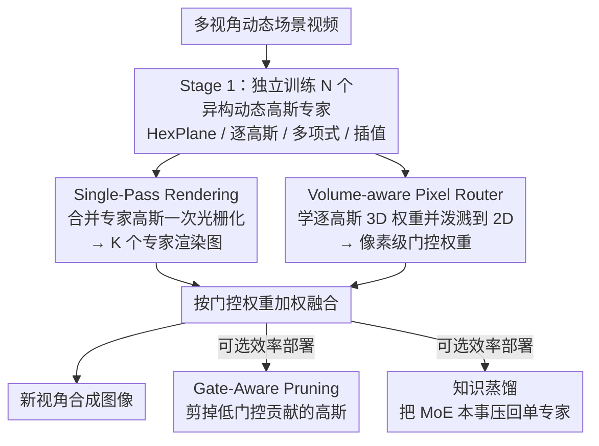

# MoE-GS: Mixture of Experts for Dynamic Gaussian Splatting

**会议**: ICLR 2026  
**arXiv**: [2510.19210](https://arxiv.org/abs/2510.19210)  
**代码**: [https://cvsp-lab.github.io/MoE-GS](https://cvsp-lab.github.io/MoE-GS)  
**领域**: 3D视觉 / 动态场景重建  
**关键词**: 3D Gaussian Splatting, dynamic scene, mixture of experts, novel view synthesis, knowledge distillation

## 一句话总结
提出 MoE-GS，首个将混合专家架构引入动态高斯泼溅的框架，通过 Volume-aware Pixel Router 自适应融合多种异构变形先验（HexPlane/逐高斯/多项式/插值），在 N3V 和 Technicolor 数据集上一致超越 SOTA，并通过单次渲染、门控剪枝和知识蒸馏保持效率。

## 研究背景与动机

**领域现状**：动态场景的新视角合成已从 NeRF 扩展到 3DGS，出现了多种动态高斯方法：MLP 变形网络（4DGaussians, E-D3DGS）、多项式运动模型（STG）、插值方法（Ex4DGS）等。

**现有痛点**：作者通过实证分析发现三个层面的不一致性：(a) **场景级**——不同方法在不同场景上表现差异大，没有通用最优方法；(b) **空间级**——同一场景中不同区域由不同方法重建最佳；(c) **时间级**——同一视频中最优方法随帧动态变化。

**核心矛盾**：每种变形模型有特定的归纳偏置——HexPlane 适合低运动区域、逐高斯嵌入适合快速一致流、多项式适合全局平滑运动、插值适合局部多样运动。真实场景通常包含混合运动模式，单一方法无法全面覆盖。

**本文目标** 自适应地融合多种异构动态高斯专家，使模型在不同空间/时间区域自动选择最合适的变形先验。

**切入角度**：借鉴 MoE 架构，将每种动态 GS 方法作为一个 expert，设计路由器在像素级别自适应融合。但关键挑战是路由器需要同时感知 3D 体积信息和 2D 像素信息。

**核心 idea**：通过可微权重泼溅将逐高斯 3D 路由权重投射到像素空间，实现体积感知的自适应专家融合。

## 方法详解

### 整体框架
MoE-GS 要解决的是：没有任何单一动态高斯方法能在所有场景、所有空间区域、所有时刻都最优，那就把多种异构变形模型当作专家、让一个路由器在像素级别自动挑选并融合。整个流程分两阶段：先各自独立训练 N 个动态高斯专家（HexPlane 嵌入、逐高斯嵌入、多项式、插值等），再冻结所有专家参数、单独训练一个 Volume-aware Pixel Router。推理时把所有专家高斯合并后只做一次光栅化（Single-Pass Rendering）得到 K 个专家通道，路由器为每个像素生成一组门控权重把它们加权融合成最终图像；部署时还能选择性地做门控剪枝（Gate-Aware Pruning）或知识蒸馏来换取效率。

### 关键设计

**1. Volume-aware Pixel Router：在像素级融合专家，但用 3D 特征做决策**

路由器是整套方法的核心，它要决定每个像素该信任哪个专家。两种朴素做法都有缺陷：纯 2D 的 Pixel Router 用一个 MLP 直接在像素上预测权重，缺乏体积感知、结果过度平滑（PSNR 仅 31.12）；Volume Router 直接在 3D 空间调整高斯透明度，虽有体积上下文却优化困难、不稳定（32.05）。本文的折中是「学 3D 权重、但在 2D 优化」：为每个高斯学一组 per-Gaussian 权重 $\bm{w}_i^{per} = [w_i, w_i^{dir}, (t \cdot w_i^{time})]^T$，分别编码基础、视角依赖、时间依赖三部分；再通过高斯泼溅把这些 3D 权重投射到 2D 像素得到 $w_{2D}(u)$，经一个轻量 MLP 精修后用 softmax 归一化成门控权重 $G'_k(u)$。这样优化发生在稳定的 2D 空间，决策却携带了 3D 体积上下文，PSNR 提升到 33.23，明显超过两种朴素路由。

**2. Single-Pass Rendering：N 个专家只渲染一次**

如果每个专家各渲一遍再融合，开销随专家数线性增长。本文把所有专家的高斯合并成一批，只做一次投影和光栅化。做法是给每个高斯附加一个 one-hot 的专家身份向量 $e_j \in \mathbb{R}^K$，在 alpha blending 阶段按身份把颜色分流到对应专家通道：

$$C_k(u) = \sum_j T_j(u) \alpha_j(u) c_j \cdot (e_j)_k$$

一次混合就同时得到全部 K 个专家的渲染结果，再交给路由器加权。这一改动把 FPS 从 40 提到 68（Table 5）。

**3. Gate-Aware Pruning：剪掉对融合输出没贡献的高斯**

专家合并后高斯总量很大，但很多高斯所在区域门控权重很低、几乎不影响最终图像。本文用门控权重对逐高斯权重的梯度来度量每个高斯的重要性，累积成消除分数 $\mathcal{E}_i = \frac{1}{|\mathcal{D}|} \sum_v \|\frac{\partial G'_k(v)}{\partial \bm{w}_i^{per}(v)}\|$，分数低于阈值的高斯被剪掉。这个判据直接对齐 MoE 的融合目标（梯度小说明改动它几乎不动门控输出），因此剪得很狠也几乎无损：剪掉 55% 后 PSNR 仅降 0.02 dB，FPS 从 44 升到 83，内存从 878 MB 降到 351 MB。

**4. 知识蒸馏：把 MoE 的本事压回单个专家**

当 N≥4 时，多专家推理开销变大，部署不划算。蒸馏的目标是让单个专家 $E_k$ 逼近整个 MoE 的质量，损失按门控权重把图像分区监督：

$$\mathcal{L}_k^{KD} = \lambda \cdot \mathcal{L}(G'_k \cdot I_{E_k}, G'_k \cdot I_{GT}) + (1-\lambda) \cdot \mathcal{L}((1-G'_k) \cdot I_{E_k}, (1-G'_k) \cdot I_{MoE})$$

路由器认为该专家擅长的高权重区域直接用 GT 监督，其余低权重区域则用 MoE 的融合输出作伪标签。这样单专家既学到了自己强项的真值，又从 MoE 那里"借"到了别的专家在弱项区域的能力，从而在单专家的推理成本下保持接近 MoE 的性能。

### 损失函数 / 训练策略
重建用标准 3DGS 损失（L1 + SSIM）。训练分两阶段：Stage 1 各专家独立训练，Stage 2 冻结专家、只训路由器。一个值得注意的现象是专家本身不必训到收敛——即使每个专家只用 20% 的训练预算，融合后的 MoE 仍优于用 100% 预算训出的任何单专家。

## 实验关键数据

### 主实验

| 方法 | N3V 平均 PSNR↑ | Technicolor 平均 PSNR↑ |
|------|---------------|---------------------|
| 4DGaussians | 31.43 | 30.79 |
| E-D3DGS | 32.33 | 33.06 |
| STG | 31.92 | 33.69 |
| Ex4DGS | 32.10 | 33.45 |
| **MoE-GS (N=3)** | **33.23** | **34.55** |
| **MoE-GS (N=4)** | **33.27** | - |

MoE-GS (N=3) 比最强单专家 E-D3DGS 提升 0.9 dB PSNR。

### 消融实验

| Router 变体 | PSNR↑ | SSIM↑ |
|------------|------|------|
| Pixel Router | 31.12 | 0.952 |
| Volume Router | 32.05 | 0.951 |
| **Volume-aware Pixel Router** | **33.23** | **0.954** |

| 效率策略 | PSNR | FPS | Memory (MB) |
|---------|------|-----|-------------|
| w/o 两者 | 32.54 | 36 | 747 |
| Full MoE-GS (N=3) | 33.23 | 68 | 270 |

### 关键发现
- **专家多样性很重要**：N=2→3 提升显著（+0.69 dB），N=3→4 提升较小（+0.04 dB）
- **低训练预算仍有效**：20% 训练预算的 MoE-GS（32.60）仍优于 100% 的任何单专家
- **路由器可视化**表明路由权重与运动模式语义对应——高运动区域倾向选择逐高斯变形专家
- 蒸馏后的单专家可达到接近 MoE 的性能（具体数值在附录中）

## 亮点与洞察
- **泼溅即路由**：巧妙复用 3DGS 的泼溅机制进行路由权重传播——学习 3D 权重但在 2D 空间优化和融合，兼得体积感知和优化稳定性
- **异构专家互补**：不同变形先验（嵌入/多项式/插值）在不同运动区域各有优势，MoE 架构天然适合这种互补关系
- **效率工具箱完整**：从单次渲染、门控剪枝到完整蒸馏，提供了从高质量到高效率的完整部署路径

## 局限与展望
- MoE 框架本身增加了参数量和训练成本（N 个专家 = N 倍训练时间，虽然可降低到 20%）
- 两阶段训练（先训专家后训 router）不是联合端到端优化，可能未达到最优
- 专家组合是手动选择的固定集合，未探索自动化的专家选择/构造
- 仅在视频级别多视角数据集上验证，未扩展到单目动态场景

## 相关工作与启发
- **vs 4DGaussians**: 4DGaussians 使用 HexPlane 嵌入做变形，在低运动场景好但高运动场景差；MoE-GS 可自动选择合适专家
- **vs STG**: STG 用多项式模型描述轨迹，全局平滑但局部细节不足；作为 MoE 专家之一可以贡献其全局先验
- **vs E-D3DGS**: E-D3DGS 单独是最强 baseline（32.33），但 MoE-GS 融合多专家后达到 33.23

## 评分
- 新颖性: ⭐⭐⭐⭐ 首个将 MoE 引入动态 GS，Volume-aware Pixel Router 设计精巧
- 实验充分度: ⭐⭐⭐⭐⭐ 两个标准 benchmark、多种 N 配置、全面消融、效率分析、蒸馏评估
- 写作质量: ⭐⭐⭐⭐ 动机深入（三层面分析），方法描述清晰
- 价值: ⭐⭐⭐⭐ MoE+GS 是有前景的方向，但通用性待进一步验证

<!-- RELATED:START -->

## 相关论文

- [\[CVPR 2026\] MoRE: 3D Visual Geometry Reconstruction Meets Mixture-of-Experts](../../CVPR2026/3d_vision/more_3d_visual_geometry_reconstruction_meets_mixture-of-experts.md)
- [\[ICLR 2026\] PD²GS: Part-Level Decoupling and Continuous Deformation of Articulated Objects via Gaussian Splatting](pd2gs_part-level_decoupling_and_continuous_deformation_of_articulated_objects_vi.md)
- [\[ICLR 2026\] Mono4DGS-HDR: High Dynamic Range 4D Gaussian Splatting from Alternating-exposure Monocular Videos](mono4dgs-hdr_high_dynamic_range_4d_gaussian_splatting_from_alternating-exposure_.md)
- [\[ICCV 2025\] Learning Robust Stereo Matching in the Wild with Selective Mixture-of-Experts](../../ICCV2025/3d_vision/learning_robust_stereo_matching_in_the_wild_with_selective_mixture-of-experts.md)
- [\[ICLR 2026\] Uncertainty Matters in Dynamic Gaussian Splatting for Monocular 4D Reconstruction](uncertainty_matters_in_dynamic_gaussian_splatting_for_monocular_4d_reconstructio.md)

<!-- RELATED:END -->
