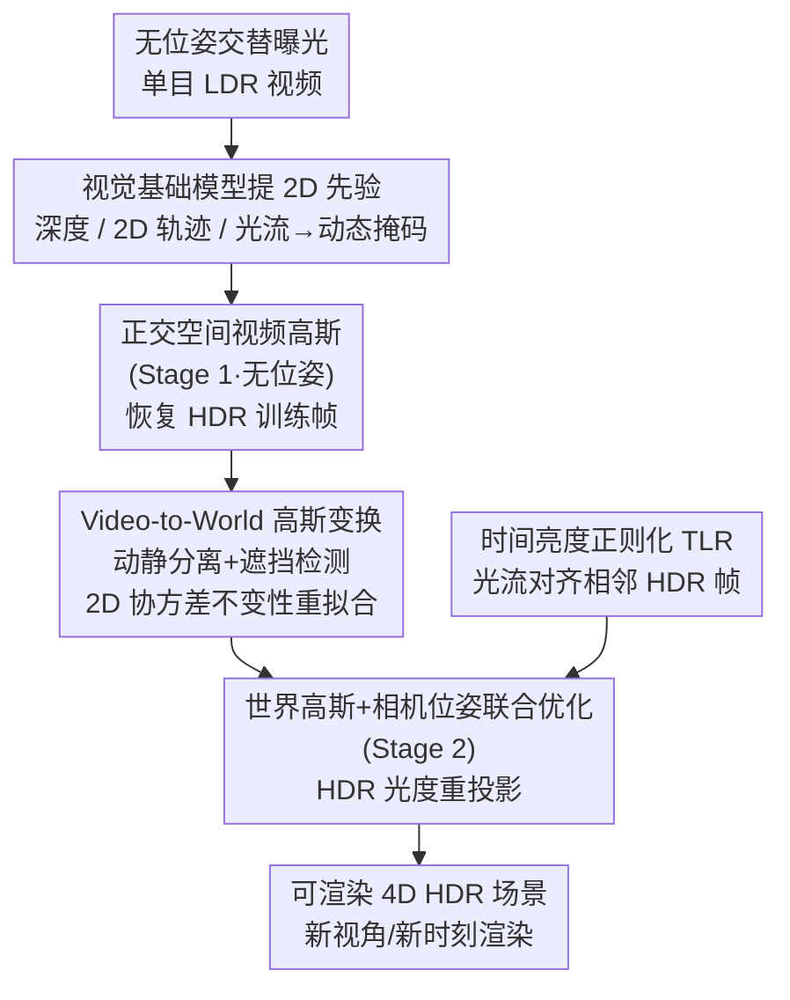

# Mono4DGS-HDR: High Dynamic Range 4D Gaussian Splatting from Alternating-exposure Monocular Videos

**会议**: ICLR 2026  
**arXiv**: [2510.18489](https://arxiv.org/abs/2510.18489)  
**代码**: [https://liujf1226.github.io/Mono4DGS-HDR](https://liujf1226.github.io/Mono4DGS-HDR)  
**领域**: 3D视觉 / HDR重建  
**关键词**: 4D Gaussian Splatting, HDR, monocular video, alternating exposure, dynamic scene

## 一句话总结
首次解决从无位姿交替曝光单目视频重建可渲染 4D HDR 场景的问题，通过两阶段优化（正交视频空间 → 世界空间）、Video-to-World 高斯变换策略和时间亮度正则化，在合成数据上达到 37.64 dB HDR PSNR、161 FPS，全面超越现有方法。

## 研究背景与动机

**领域现状**：4D 动态场景重建（尤其基于 3DGS）取得进展，HDR 重建也有方法（GaussHDR, HDR-HexPlane），但两者结合——从单目交替曝光视频做 4D HDR 重建——尚无方法。

**现有痛点**：(a) 交替曝光导致相邻帧亮度不同，标准光度重投影失败→无法估计相机位姿；(b) 2D 先验（跟踪、深度、光流）在亮度变化帧间噪声大；(c) 现有动态方法（SplineGS, MoSca）设计用于恒定亮度视频，直接加 HDR 头效果差；(d) HDR 方法（GaussHDR）需要已知位姿和多视角。

**核心矛盾**：亮度交替→位姿估计难→几何不稳定→HDR 外观不一致。一个恶性循环。

**切入角度**：先在正交相机坐标空间训练"视频高斯"（回避位姿估计），恢复 HDR 训练帧→用恢复的 HDR 帧做光度重投影估计位姿→变换到世界空间联合优化。

**核心 idea**：两阶段解耦——先解 HDR（正交空间），再解位姿和 3D（世界空间），通过 Video-to-World变换桥接两个阶段。

## 方法详解

### 整体框架
这篇论文要从一段没有相机位姿、且帧与帧之间曝光交替变化的单目视频里，重建出可以自由渲染的 4D HDR 动态场景。难点在于交替曝光打断了"靠亮度一致来估位姿"的常规路径，所以作者把问题拆成两段来解：第一阶段先回避位姿，在一个不需要相机内外参的正交相机空间里训练"视频高斯"，把每一帧的 HDR 外观先恢复出来；第二阶段再用恢复好的 HDR 帧去做光度重投影、估出位姿，并把高斯搬到世界空间和位姿一起联合优化。

整条流水线是：输入视频先经预处理（DepthCrafter 出深度、SpatialTracker 出 2D 轨迹、RAFT 出光流并算出动态掩码）；Stage 1 在正交空间训练视频高斯 4K iter，产出每帧的 HDR 训练图；中间通过一个 Video-to-World 变换把视频空间的高斯搬进世界空间（含动静分离与形状重拟合）；Stage 2 在世界空间把高斯和相机位姿联合优化 11K iter，并用时间亮度正则化约束 HDR 外观，最终得到可渲染的 4D HDR 场景。

### 关键设计

**1. 正交空间视频高斯（Stage 1）：在"无位姿"空间先把 HDR 恢复出来**

交替曝光下位姿估计本就不可靠，如果一上来就用需要相机内外参的透视投影建模，几何会被错误的位姿带歪。作者改用正交投影：把高斯直接定义在视频坐标系里，$(x^v, y^v) \in [-1,1]^2$ 是归一化像素坐标、$z^v$ 是深度，这样投影过程不再依赖任何相机外参。于是第一阶段可以完全绕开位姿估计，专心把每帧的动态几何和 HDR 外观先训出来，为后面的位姿估计提供一份亮度一致的"干净底片"。

**2. Video-to-World 高斯变换：把视频空间的高斯无失真地搬进世界空间**

视频高斯只活在正交的视频坐标系里，要进入世界空间联合优化，必须先做坐标变换，并用动态掩码加遮挡检测把动态物体和静态背景分开处理。这里的关键麻烦是：如果直接把视频空间的高斯缩放 $S^v$ 照搬到世界空间，投影回图像后高斯的 2D 形状会失真。作者提出 **2D 协方差不变性缩放重拟合**——不直接继承缩放，而是反过来求一个世界空间缩放 $S^w$，让它投影后的 2D 协方差在各帧都尽量贴合视频空间原本的 2D 形状：

$$\min_{S^w} \sum_t \|\Sigma'^v_t - \Sigma'^w_t\|_2$$

这样换了坐标系，但每个高斯在画面上"长什么样"保持不变，避免了搬家过程中的形变。

**3. HDR 光度重投影损失（Stage 2）：用 Stage 1 的成果反哺位姿与世界高斯**

到了 Stage 2，作者拿 Stage 1 恢复出的 HDR 帧来做光度重投影，联合优化相机位姿和世界空间高斯。标准光度重投影在交替曝光的 LDR 帧上会因亮度不一致而失败，而恢复后的 HDR 帧在亮度上是一致的，正好让这条经典约束重新可用——这也是两阶段设计闭环的地方：第一阶段解出的 HDR 反过来支撑了第二阶段的位姿估计。加上视频高斯提供的良好初始化，Stage 2 的收敛被显著加速、最终重建质量也更好。

**4. 时间亮度正则化（TLR）：让恢复出的 HDR 外观在时间上连贯**

交替曝光帧的亮度天生不同，直接逐帧监督 RGB 没法保证 HDR 辐照度域在时间上一致，渲染序列容易闪烁。TLR 的做法是把相邻帧的 HDR 图像通过渲染得到的光流 warp 对齐，再惩罚对齐后的不一致：

$$\mathcal{L}_{tlr} = \left|V \odot \frac{\tilde{H}_{t-1 \to t} - \tilde{H}_t}{\tilde{H}_{t-1 \to t} + \tilde{H}_t}\right|_1$$

其中 $V$ 是有效区域掩码。分母里的归一化是点睛之笔：HDR 辐照度的绝对尺度可以很大，用差除以和能消掉这个绝对尺度、只惩罚相对变化，因此对任意动态范围都成立。消融也印证它专管时间一致性而非清晰度——去掉 TLR 后 PSNR 几乎不变（-0.06），但 TAE 从 0.057 恶化到 0.071。

### 损失函数 / 训练策略
$\mathcal{L} = \lambda_{rgb}\mathcal{L}_{rgb} + \lambda_{ue}\mathcal{L}_{ue} + \lambda_{dep}\mathcal{L}_{dep} + \lambda_{track}\mathcal{L}_{track} + \lambda_{arap}\mathcal{L}_{arap} + \lambda_{vel}\mathcal{L}_{vel} + \lambda_{acc}\mathcal{L}_{acc} + \lambda_{tlr}\mathcal{L}_{tlr} + \lambda_{pr}\mathcal{L}_{pr}$

动态表示：立方 Hermite 样条（位置）+ 立方多项式（旋转）。总训练约 1.5 小时。

## 实验关键数据

### 主实验

| 方法 | Syn-Exp-3 HDR PSNR↑ | Syn-Exp-3 TAE↓ | FPS↑ |
|------|-------------------|---------------|------|
| GaussHDR† | 31.25 | 0.089 | 51 |
| HDR-HexPlane† | 29.60 | 0.155 | 1 |
| MoSca-HDR‡ | 36.89 | 0.059 | 82 |
| **Mono4DGS-HDR** | **37.64** | **0.057** | **161** |

| 方法 | Real-Exp-2 PSNR↑ | Real-Exp-2 TAE↓ | Real-Exp-3 PSNR↑ | Real-Exp-3 TAE↓ |
|------|-----------------|----------------|-----------------|----------------|
| MoSca-HDR‡ | 30.28 | 0.054 | 27.23 | 0.076 |
| **Mono4DGS-HDR** | **31.82** | **0.046** | **27.65** | **0.067** |

### 消融实验

| 配置 | Syn-Exp-3 HDR PSNR | Syn-Exp-3 TAE |
|------|-------------------|---------------|
| w/o Video Gaussian Init | 36.07 (-1.57) | 0.057 |
| w/o 遮挡处理 | 37.22 (-0.42) | 0.059 |
| w/o 2D协方差不变性 | 37.25 (-0.39) | 0.057 |
| w/o TLR | 37.58 (-0.06) | **0.071** (+0.014) |
| **Full Model** | **37.64** | **0.057** |

### 关键发现
- **Video Gaussian Init 最关键**：去掉后 HDR PSNR 降 1.57 dB——两阶段策略是方法的基石
- **TLR 对时间一致性至关重要**：PSNR 影响小（-0.06）但 TAE 恶化 24.6%
- **FPS 领先**：161 FPS，比 MoSca-HDR（82）快约 2 倍
- SplineGS/GFlow 等恒定曝光方法直接加 HDR 头效果极差（PSNR 17.59/失败）

## 亮点与洞察
- **两阶段解耦的智慧**：将 HDR 恢复和 3D 重建解耦——先在简单空间（正交/无位姿）解决 HDR，再用 HDR 的好处（一致亮度）反过来帮助 3D 重建（位姿估计）。这种互助策略打破了交替曝光的恶性循环
- **2D 协方差不变性**：从视频空间到世界空间的高斯变换中，保持投影后 2D 形状不变——这个约束简洁但对避免形变至关重要
- **归一化差异做时间正则化**：$\frac{H_1 - H_2}{H_1 + H_2}$ 消除 HDR 绝对尺度的影响，仅关注相对变化——适用于任何动态范围

## 局限与展望
- 依赖多个预处理模型（DepthCrafter + SpatialTracker + RAFT），预处理管线复杂且可能引入误差
- 仅支持 2-3 种交替曝光模式，更复杂的曝光策略（如随机曝光）未探索
- 训练 1.5 小时仍然较长，不适合实时应用场景
- 合成数据上 HDR GT 可评估，但真实场景无 HDR GT，只能看 LDR 指标

## 相关工作与启发
- **vs GaussHDR**: GaussHDR 需要已知位姿+多视角，仅做静态 HDR；Mono4DGS-HDR 做动态+无位姿+单目
- **vs MoSca-HDR**: MoSca 基于恒定曝光设计加 HDR 头，效果不如本文专门设计的两阶段策略
- **vs HDR-HexPlane**: 基于 NeRF 做动态 HDR 但渲染仅 1FPS；本文 161FPS

## 评分
- 新颖性: ⭐⭐⭐⭐⭐ 开创性地解决了从交替曝光单目视频做 4D HDR 重建的新问题
- 实验充分度: ⭐⭐⭐⭐⭐ 25 个场景（合成+真实）、多种曝光模式、详尽消融
- 写作质量: ⭐⭐⭐⭐ 方法复杂但描述清晰，图表丰富
- 价值: ⭐⭐⭐⭐⭐ 解决了实际HDR视频重建的核心问题，161FPS实时渲染

<!-- RELATED:START -->

## 相关论文

- [\[ICLR 2026\] HDR-NSFF: High Dynamic Range Neural Scene Flow Fields](hdr-nsff_high_dynamic_range_neural_scene_flow_fields.md)
- [\[ICLR 2026\] Dynamic Novel View Synthesis in High Dynamic Range](dynamic_novel_view_synthesis_in_high_dynamic_range.md)
- [\[ICLR 2026\] Uncertainty Matters in Dynamic Gaussian Splatting for Monocular 4D Reconstruction](uncertainty_matters_in_dynamic_gaussian_splatting_for_monocular_4d_reconstructio.md)
- [\[ICLR 2026\] MoE-GS: Mixture of Experts for Dynamic Gaussian Splatting](moe-gs_mixture_of_experts_for_dynamic_gaussian_splatting.md)
- [\[ICML 2025\] High Dynamic Range Novel View Synthesis with Single Exposure](../../ICML2025/3d_vision/high_dynamic_range_novel_view_synthesis_with_single_exposure.md)

<!-- RELATED:END -->
