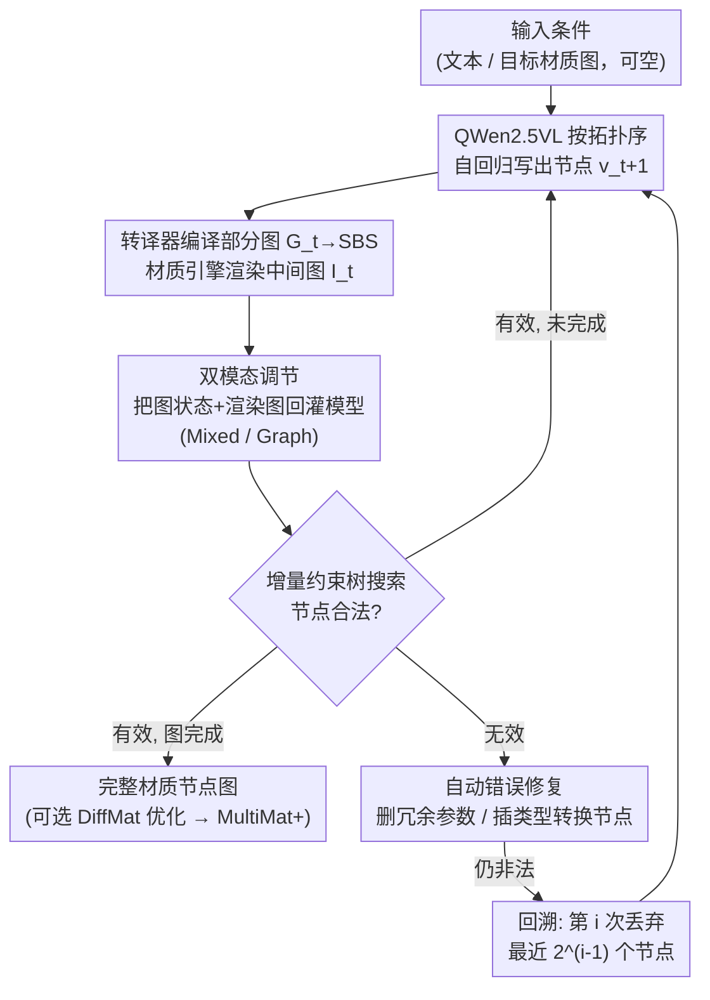

# MultiMat: Multimodal Program Synthesis for Procedural Materials using Large Multimodal Models

**会议**: ICLR 2026  
**arXiv**: [2509.22151](https://arxiv.org/abs/2509.22151)  
**代码**: 无  
**领域**: 3D视觉/程序合成  
**关键词**: 程序化材质, 节点图, 多模态生成, 约束树搜索, Substance Designer

## 一句话总结

提出 MultiMat，首个将大型多模态模型（LMM）用于程序化材质节点图合成的框架，通过在自回归生成过程中融合中间节点的视觉渲染反馈（混合调节/图调节两种模式），并配合增量式约束树搜索推理实现即时校验与回溯纠错，在 6878 个产级 Substance Designer 材质上训练后，无条件生成与条件生成均大幅超越纯文本基线。

## 研究背景与动机

程序化材质（如 Adobe Substance Designer）通过有向无环图（DAG）定义 PBR 材质，具有分辨率无关、参数可控、非破坏性编辑等优势，广泛应用于游戏、影视和 VR/AR 制作。然而手动构建节点图需要专业训练，对非专业用户门槛极高。近年来神经程序合成方法（MatFormer、VLMaterial）尝试自动化这一过程，但存在三个关键问题：

1. **纯文本建模忽略视觉本质**：现有方法将节点图序列化为纯文本程序，完全丢失了节点图本身视觉-空间的直觉性
2. **缺乏视觉反馈的推理困难**：模型需要仅凭文本推理复杂空间关系和视觉效果，随着材质复杂度增长，推理难度急剧上升
3. **结构正确性无法保证**：生成完整程序后才能验证，大量无效输出（无效连接、类型不匹配）导致推理效率低下

MultiMat 的核心思路是**模拟人类材质艺术家的工作流**——在生成每个节点后立即渲染中间状态并反馈给模型，形成视觉-文本多模态反馈循环，同时利用拓扑排序实现逐节点增量验证。

## 方法详解

### 整体框架

MultiMat 要解决的是"节点图本质上是视觉-空间程序，却被现有方法硬塞进纯文本"这一矛盾。它以 QWen2.5VL（7B）为底座，把材质图生成拆成逐节点的自回归过程：每当模型按拓扑序写出一个新节点 $v_{t+1}$，转译器就立刻把当前部分图 $G_t = \{v_1,\ldots,v_t\}$ 编译成 SBS、交给材质引擎渲染出中间图像 $I_t$，再通过**双模态调节**把图状态和这张渲染图一起回灌给模型作为下一步的多模态上下文；同时**增量约束树搜索**逐节点校验合法性，节点有效就更新 $G_{t+1}/I_{t+1}$ 继续生成，非法则先走**自动错误修复**、修不好再指数回溯。这样模型在每一步都"看得到"自己刚画出来的效果，等于把人类材质艺术家"改一笔看一眼"的工作流搬进了生成循环。

### 关键设计

**1. 双模态调节策略：把渲染反馈用两种方式喂给模型**

中间渲染图怎么和文本节点定义一起进模型，存在精度与开销的权衡，论文给出两种互补表征。Mixed Conditioning 保留完整的文本节点定义，并在每个节点处交错嵌入一张 140×140 的渲染图（切成 25 个 patch），参数则省略不写、由图像隐式编码，因此结构信息最全；Graph Conditioning 走得更激进，直接把整张图可视化成一张图像送入（最多 6144 token），不再显式给出文本节点定义，更贴近人类纯靠眼睛编辑的体验。两者的取舍在实验里泾渭分明——Graph 视觉质量最优（KID 最低），Mixed 结构错误率最低（NER 最低）。

| 调节方式 | 输入形式 | 每节点图像开销 | 特点 |
|:--|:--|:--|:--|
| Mixed Conditioning | 文本节点定义 + 每节点交错嵌入 140×140 渲染图（25 patch） | 25 patch/节点 | 保留完整文本结构信息，省略参数（由图像隐式编码） |
| Graph Conditioning | 整张图可视化（嵌入中间视觉输出），最多 6144 token | 全局一张图 | 更贴近人类视觉编辑体验，不显式提供文本节点定义 |

**2. 增量式约束树搜索：把"事后验证"变成"即时验证 + 回溯"**

纯文本方法只能等整段程序写完才知道有没有非法连接或类型不匹配，无效输出一多推理就极其低效。MultiMat 利用拓扑排序让每写出一个节点就能马上经转译器与材质引擎校验其有效性，从而把整个生成过程组织成一棵显式搜索树 $\mathcal{T}$，节点分有效（✓）与无效（✗）。一旦检测到错误，就执行自适应回溯：第 $i$ 次回溯丢弃最近 $2^{(i-1)}$ 个节点，指数级退避在探索效率和回溯深度间取得平衡。这种即时校验的价值很直接——VLMaterial 一旦禁用树搜索，NER 就从 14.8% 恶化到 34.0%。

**3. 自动错误修复：兜住两类高频的可机械修正错误**

即便有树搜索，模型仍会犯一些结构性小错，论文为两类常见模式配了自动修正。一类是参数删除，即移除某节点类型并不支持的多余参数（多模态反馈下 MultiMat 仅约 1% 节点需要此修复，远低于纯文本方法）；另一类是类型转换插入，当颜色输出接到灰度输入时自动补一个灰度转换节点、灰度接到颜色输入时补一个梯度映射节点，避免因色彩通道不匹配而整图失效。

### 损失函数 / 训练策略

训练采用标准的逐 token 交叉熵，但条件项里同时含图状态与中间渲染：

$$\mathcal{L} = -\sum_{t=1}^{T}\sum_{s=1}^{S}\log p(v_{t,s} \mid v_{t,<s}, G_t, I_t, x; \theta)$$

其中 $v_{t,s}$ 是节点 $v_t$ 在中间文本格式中第 $s$ 个 token，$x$ 为输入条件（无条件生成时为空）。多模态模型以 QWen2.5VL 7B 为底座（纯文本基线用 QWen3 8B），最大序列长度 8192，训 5 个 epoch，用 AdamW、学习率 $5\times10^{-5}$、批大小 128，推理温度 0.8、Top-p 0.95，跑在 8×A100 80GB 上。数据上从 Adobe Substance 3D Assets 收集了 **6878** 个产级材质（此前最大的 MatFormer 仅 2820、VLMaterial 3663），并开发双向转译器把冗长的 SBS 压成紧凑 YAML 格式 CompactSBS（平均缩短 80%+），支持含像素处理器和函数图在内的完整功能集、最大 128 节点。条件生成时还可接一个后处理：用 DiffMat 可微渲染器对生成图做梯度优化、令输出更贴近输入图像，优化后的模型记作 MultiMat+。

## 实验结果

### 无条件生成

| 模型 | KID ↓ | ROUGE-L ↓ | NER ↓ |
|:--|:--|:--|:--|
| VLMaterial (SBS) | 14.155 | 3.641 | 14.846 |
| MultiMat (Mixed) | 6.752 | 2.195 | **8.923** |
| MultiMat (Graph) | **2.365** | **1.915** | 15.024 |

- MultiMat (Graph) 的 KID 比 VLMaterial 低 **11.8 个百分点**，视觉质量远超纯文本方法
- ROUGE-L 均不超过 4%，表明无显著记忆化问题，MultiMat 变体复制率更低
- MultiMat (Mixed) 错误率最低（NER 8.9%），Graph 变体的错误主要来自 OCR 类节点名读取错误

### 条件生成（逆向材质合成）

| 模型 | DSim ↑ | CLIP ↑ | Style ↓ | KID ↓ |
|:--|:--|:--|:--|:--|
| VLMaterial (SBS) | 31.344 | 65.678 | 3.211 | 14.976 |
| MultiMat (Mixed) | 34.922 | 66.737 | 3.199 | 3.675 |
| MultiMat (Graph) | **36.609** | **67.907** | **3.178** | **2.801** |
| VLMaterial+ (SBS) | 31.348 | 65.867 | 3.126 | 27.862 |
| MultiMat+ (Mixed) | 40.258 | 69.687 | 3.093 | 17.792 |
| MultiMat+ (Graph) | **40.367** | **70.114** | **3.046** | **14.886** |

- 感知相似度指标始终排序为 Graph > Mixed > VLMaterial，与无条件生成趋势一致
- 参数优化（+）为 MultiMat 带来约 6-8% 的感知提升，而 VLMaterial+ 仅提升 1%（生成结果偏差太大，优化空间有限）
- 人类评估（8 名专家，33 个困难测试样本）进一步验证 MultiMat+ (Graph) 最受偏好，VLMaterial+ 最不受偏好

### 自动修复分析

| 模型 | 参数删除 ↓ | 类型转换 ↓ |
|:--|:--|:--|
| VLMaterial (SBS) | 2.71% | 12.26% |
| MultiMat (Mixed) | **1.18%** | 3.51% |
| MultiMat (Graph) | 1.10% | 6.49% |

MultiMat 变体所需修复量远低于 VLMaterial，说明多模态反馈确实帮助模型更好地理解图结构。

## 论文亮点与创新

- ⭐⭐⭐ **多模态程序合成范式**：首次将视觉中间渲染反馈引入程序化材质生成，模拟人类艺术家的视觉编辑工作流
- ⭐⭐⭐ **增量式约束树搜索**：利用拓扑排序实现逐节点验证与自适应回溯，将推理过程转化为高效树搜索
- ⭐⭐ **完整功能集支持**：开发双向 SBS↔CompactSBS 转译器，首次支持 Substance Designer 完整特性（含像素处理器和函数图），程序长度缩短 80%+
- ⭐⭐ **最大产级数据集**：收集 6878 个正版授权的产级材质，规模比此前最大数据集多 88%

## 不足与展望

1. **训练效率低**：MultiMat 需为每个节点分别适配视觉上下文，训练时间远超文本方法（数天 vs 数小时），尽管绝对值因数据量小而尚可接受
2. **Graph Conditioning 的 OCR 错误**：从图可视化中读取节点名和函数类型时易出现 OCR 类错误，导致 NER 较高（约 15%）
3. **数据规模受限**：仅 6878 个材质，限制了模型的泛化能力；未来可通过自学习技术用无条件模型生成合成训练数据
4. **单一工具绑定**：目前仅支持 Substance Designer，未来计划开发跨多个节点图系统的统一模型
5. **条件生成仍有差距**：即使经过参数优化，对复杂材质的重建质量仍有明显差距（参见论文失败案例）

## 个人思考

MultiMat 的核心贡献在于揭示了一个重要洞察：**程序化材质本质上是视觉-空间程序，应以视觉方式处理而非强行文本化**。这一思路具有普遍意义：任何具有视觉中间表示的程序合成任务（如矢量图形、UI 布局、数据可视化）都可能受益于类似的多模态反馈机制。

增量树搜索是另一个精巧设计——通过拓扑排序将"事后验证"变为"即时验证"，这种思路可推广到任何具有可验证中间状态的序列生成任务。指数级回溯策略 $2^{(i-1)}$ 也值得借鉴，它在探索效率和回溯深度间取得了平衡。

局限性方面，训练效率问题是多模态程序合成的固有代价——每步渲染中间状态的开销不可避免。实际部署中可能需要考虑轻量级的中间表示（如低分辨率缩略图或特征摘要）来降低计算成本。此外，6878 个材质虽是目前最大，但相比通用视觉数据集仍极其稀少，可能需要探索预训练-微调范式或跨领域迁移学习。

<!-- RELATED:START -->

## 相关论文

- [\[CVPR 2026\] Towards Generalized Multimodal Homography Estimation](../../CVPR2026/3d_vision/towards_generalized_multimodal_homography_estimation.md)
- [\[CVPR 2025\] Perception Tokens Enhance Visual Reasoning in Multimodal Language Models](../../CVPR2025/3d_vision/perception_tokens_enhance_visual_reasoning_in_multimodal_language_models.md)
- [\[ICCV 2025\] RoboTron-Mani: All-in-One Multimodal Large Model for Robotic Manipulation](../../ICCV2025/3d_vision/robotron-mani_all-in-one_multimodal_large_model_for_robotic_manipulation.md)
- [\[AAAI 2026\] Point Cloud Quantization through Multimodal Prompting for 3D Understanding](../../AAAI2026/3d_vision/point_cloud_quantization_through_multimodal_prompting_for_3d_understanding.md)
- [\[CVPR 2026\] Multimodal Semantic Bias Mitigation for Diverse Text-To-3D Generation](../../CVPR2026/3d_vision/multimodal_semantic_bias_mitigation_for_diverse_text-to-3d_generation.md)

<!-- RELATED:END -->
