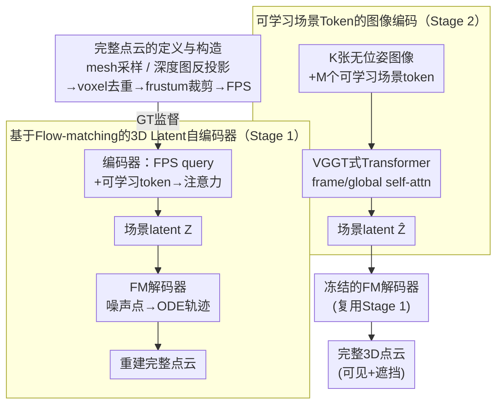

# NOVA3R: Non-pixel-aligned Visual Transformer for Amodal 3D Reconstruction

**会议**: ICLR 2026  
**arXiv**: [2603.04179](https://arxiv.org/abs/2603.04179)  
**代码**: [项目页面](https://wrchen530.github.io/nova3r)  
**领域**: 3D视觉/重建  
**关键词**: 非像素对齐, amodal 3D重建, 场景token, flow-matching, 完整点云

## 一句话总结
提出NOVA3R——从无位姿图像进行非像素对齐的完整3D重建：用可学习场景token跨视角聚合全局信息 + 基于flow-matching的扩散3D解码器生成完整(含遮挡区域)的点云，解决像素对齐方法只能重建可见面且重叠区域有冗余几何的两大根本限制，在SCRREAM/GSO等数据集上场景级和物体级重建均超越SOTA。

## 研究背景与动机

**领域现状**：DUSt3R开创了像素对齐(pixel-aligned)的前馈3D重建范式——每个像素沿光线预测一个3D点。后续方法(MASt3R、CUT3R、VGGT)扩展到多视角但仍是像素对齐的。另一条路线是latent 3D生成(TripoSG/TRELLIS)，但主要限于物体级且需高质量网格监督。

**现有痛点**：像素对齐方法的两个根本缺陷：(1) 只能重建可见表面，遮挡区域完全没有几何，留下空洞；(2) 多视角重叠区域，同一物理3D点被多条光线分别预测，产生冗余重叠点层，物理上不合理。

**核心矛盾**：现实世界中一个场景由固定数量的物理点组成，与观测视角数量无关。如果一个3D点被多张图像观测到，正确的表示应该只包含一个点而不是每个观测各产生一个。像素对齐范式从根本上违背了这一物理事实。

**本文目标**：(a) 如何从无位姿图像中学习全局的、与视角无关的场景表示？(b) 如何解码为完整的(visible + occluded)非像素对齐点云？(c) 如何处理无序点集的监督问题(L2 loss无法直接用于无序点)？

**切入角度**：将问题分解为两阶段——先训练一个3D点云自编码器学习把完整点云压缩到latent tokens并用flow-matching解码回来，再训练一个图像编码器把图像映射到同一个latent空间。两阶段解耦避免了端到端训练的不稳定性。

**核心 idea**：用可学习场景token替代像素对齐的逐光线预测，结合flow-matching解码器实现从无位姿图像到完整非像素对齐3D点云的前馈重建。

## 方法详解

### 整体框架
输入是 $K$ 张无位姿图像，输出是定义在第一视角坐标系下、包含可见与遮挡区域的完整 3D 点云 $P \in \mathbb{R}^{N \times 3}$。要把"全局、视角无关的场景表示"学出来，本文不走端到端，而是把训练拆成两个解耦的阶段，让目标各自清晰、互不干扰。

第一阶段先抛开图像，单独训一个 3D 点云自编码器：把一团完整点云压成 $M$ 个 latent 场景 token $Z$，再用 flow-matching 解码器从噪声把点云生成回来，目的是先把一个"能压缩、能还原完整点云"的 latent 空间建好。第二阶段冻结这个解码器，只训一个图像编码器，让它把 $K$ 张图像映射到同一个 latent 空间得到 $\hat{Z}$，再交给冻结解码器出点云。推理时只跑第二阶段。而这两个阶段的训练目标，都依赖一套专门构造的"完整点云"作监督信号。

### 关键设计

**1. 完整点云的定义与构造：给非像素对齐方法找到可用的监督信号**

非像素对齐重建要预测包含遮挡区域的"完整点云"，但训练时上哪去找这种包含不可见点的 GT？本文给出一套构造方案：有 GT mesh 时直接均匀采样最干净；没有 mesh 时，退而聚合密集视角的深度图反投影点云，用 voxel-grid 滤波去掉重叠重复的点，再裁剪到输入视角的 frustum 内，最后 FPS 采样出 $N$ 个点作训练目标。关键好处是它绕开了"必须水密网格"这个硬约束——场景级数据几乎没有水密网格，但深度图随处可得，于是只靠深度图就能近似出完整点云。所有点统一定义在第一个视角的坐标系下，从源头上保证了表示的视角无关性。

**2. 基于 Flow-matching 的 3D Latent 自编码器（Stage 1）：用确定性 ODE 轨迹绕开无序点云的匹配难题**

这是整篇方法的地基：先建立一个能压缩、再解码完整点云的 latent 空间。编码器用 FPS 从点云 $P$ 中采样 $M$ 个 query 点，与可学习 token 拼接后经 cross-attention + self-attention，得到 latent $Z \in \mathbb{R}^{M \times C}$。解码器则是一个扩散模型：给它 $N$ 个噪声点 $x_t$、latent $Z$ 和时间步 $t$，让它预测速度场，训练目标为

$$\mathcal{L}_{flow}^{AE} = \mathbb{E}\big[\|\Phi_{dec}(x_t, Z, t) - (\epsilon - x_0)\|_2^2\big]$$

之所以走 flow-matching 而不是传统 3D VAE，是因为后者用 occupancy/SDF 解码需要 canonical 空间和水密网格，场景级数据满足不了；而如果直接回归点坐标，点云本身无序，又没法用 L2 loss 建立一一对应。Flow-matching 巧妙地把解码建模成"从噪声到目标点云的确定性 ODE 轨迹"，学的是分布而非配对，无序匹配的问题就自然消解了。解码器内部采用 joint decoder 结构——在 cross-attention 之间插入 self-attention，让点与点之间能交换空间关联信息，比各点独立解码的 independent decoder 更精确（Table 5 验证）。

**3. 可学习场景 Token 的图像编码（Stage 2）：把固定数量的全局 token 摆脱像素绑定**

有了 Stage 1 的 latent 空间后，Stage 2 只需训练一个图像编码器，把 $K$ 张无位姿图像映射到同一个空间里的 $\hat{Z} \in \mathbb{R}^{M \times C}$，再交给冻结的解码器出点云。具体做法是在 VGGT 的图像 token 之外，额外引入 $M$ 个可学习场景 token $t_S$，所有 token 一起送进 Transformer，交替经过 frame-level 和 global-level 的 self-attention；这些场景 token 被当成第一视角坐标系下的一个全局帧，共享第一视角的相机 token。这样设计直击像素对齐的痛点：像素对齐方法的 token 数是 $K\times H\times W$，既随视角数线性膨胀又死死绑在像素上，重叠区域必然冗余；而场景 token 的数量固定为 $M$、与输入视角数完全无关，天然避免了重叠冗余，也支持喂入任意数量的视角。

### 损失函数 / 训练策略
- Stage 1: flow-matching loss端到端训练自编码器，50 epochs
- Stage 2: 冻结解码器只训练图像Transformer和场景token，同样flow-matching loss，50 epochs
- 不使用KL loss或其他正则化。AdamW, lr=3e-4。4xA40, batch=32
- 图像编码器从VGGT预训练权重初始化(用16层而非24层)

## 实验关键数据

### 主实验：场景补全 (SCRREAM数据集)

| 方法 | 类型 | Complete K=1 CD | FS@0.1 | FS@0.05 | Complete K=2 CD | FS@0.1 |
|------|------|-----------------|--------|---------|-----------------|--------|
| DUSt3R | 多视角 | 0.086 | 0.757 | 0.565 | 0.061 | 0.833 |
| CUT3R | 多视角 | 0.091 | 0.753 | 0.543 | 0.092 | 0.739 |
| VGGT | 多视角 | 0.070 | 0.810 | 0.657 | 0.065 | 0.821 |
| LaRI | 单视角 | 0.059 | 0.825 | 0.590 | - | - |
| **NOVA3R** | **多视角** | **0.048** | **0.882** | **0.687** | **0.053** | **0.862** |

### 消融实验 (SCRREAM Complete K=1)

| 配置 | CD | FS@0.05 | FS@0.02 | 说明 |
|------|-----|---------|---------|------|
| Point query only | 0.011 | 0.991 | 0.894 | FPS点作为query |
| Learnable only | 0.013 | 0.981 | 0.841 | 可学习token作为query |
| **Hybrid (默认)** | **0.011** | **0.993** | **0.904** | 点+可学习拼接最优 |
| 256 tokens | 0.014 | 0.975 | 0.811 | token数不足 |
| **768 tokens (默认)** | **0.011** | **0.993** | **0.904** | 更多token更好 |
| FM loss | 0.011 | 0.993 | 0.904 | 重建质量高 |
| CD loss | 0.024 | 0.907 | 0.575 | Chamfer做loss效果差很多 |

### 关键发现
- **FM vs CD loss**: FM在FS@0.02上从0.575提升到0.904，证明FM对无序点集匹配能力远优于CD
- **空洞率(Hole Ratio)**: NOVA3R 0.088 vs VGGT 0.307 vs DUSt3R 0.317，非像素对齐方法显著减少空洞
- **密度方差**: NOVA3R 5.127 vs 最低baseline 7.105，点云分布更均匀
- **物体级泛化**: GSO数据集上CD 0.020 vs TripoSG 0.025，方法不限于场景级

## 亮点与洞察
- **范式转换：像素对齐到非像素对齐**。从"每条光线预测一个点"到"学习全局场景表示再解码"——这是3D重建方向的概念性突破
- **两阶段解耦训练**非常巧妙：先用点云自编码器建立3D latent空间(不需要图像)，再让图像编码器学习映射到这个空间。解耦后各阶段目标清晰，训练稳定
- **Flow-matching解决无序点集匹配**：FM将解码过程建模为连续ODE，自然处理无序性，可迁移到其他需要生成无序集合的任务
- **可变分辨率推理**：由于建模的是点分布而非per-pixel map，推理时可以调整query数量来控制输出点云密度

## 局限与展望
- 受算力限制只训练了K<=2视角，大规模场景(多视角)的泛化能力待验证
- M=768个场景token可能不足以表示复杂大场景——需自适应token数量选择策略
- 只处理静态场景，不支持动态物体——作者讨论了扩展到4D的可能性
- FM解码器需多步去噪(0.04步长)，解码耗时2.985s vs CD loss的0.557s

## 相关工作与启发
- **vs DUSt3R/VGGT**: 它们是像素对齐代表，优势是简单高效但无法补全遮挡且有重叠冗余。NOVA3R通过场景token脱离像素约束实现完整重建
- **vs TripoSG/TRELLIS**: latent空间做3D生成但限于物体级且需canonical空间。NOVA3R不需canonical空间可处理场景级
- **vs LaRI**: LaRI也做amodal重建但仍是ray-conditional需显式区分可见/不可见点。NOVA3R不区分所有点统一生成

## 评分
- 新颖性: ⭐⭐⭐⭐⭐ 非像素对齐前馈3D重建是概念性新范式，场景token + FM解码器设计创新
- 实验充分度: ⭐⭐⭐⭐ 场景级(SCRREAM/7-Scenes/NRGBD) + 物体级(GSO)验证全面，消融丰富
- 写作质量: ⭐⭐⭐⭐ 问题定义清晰，pixel-aligned vs non-pixel-aligned对比直观
- 价值: ⭐⭐⭐⭐⭐ 开创非像素对齐重建新范式，对3D视觉方向有重要推动

<!-- RELATED:START -->

## 相关论文

- [\[ICLR 2026\] Quantized Visual Geometry Grounded Transformer](quantized_visual_geometry_grounded_transformer.md)
- [\[CVPR 2025\] Pixel-Aligned RGB-NIR Stereo Imaging and Dataset for Robot Vision](../../CVPR2025/3d_vision/pixel-aligned_rgb-nir_stereo_imaging_and_dataset_for_robot_vision.md)
- [\[ICLR 2026\] Generalizable Coarse-to-Fine Robot Manipulation via Language-Aligned 3D Keypoints](generalizable_coarse-to-fine_robot_manipulation_via_language-aligned_3d_keypoint.md)
- [\[CVPR 2026\] Fast Spatial Tracking with Visual Geometry Transformer](../../CVPR2026/3d_vision/fast_spatial_tracking_with_visual_geometry_transformer.md)
- [\[ICLR 2026\] AssetFormer: Modular 3D Assets Generation with Autoregressive Transformer](assetformer_modular_3d_assets_generation_with_autoregressive_transformer.md)

<!-- RELATED:END -->
