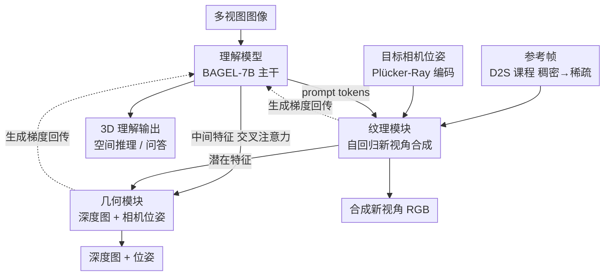

# Omni-View: Unlocking How Generation Facilitates Understanding in Unified 3D Model based on Multiview images

**会议**: ICLR 2026  
**arXiv**: [2511.07222](https://arxiv.org/abs/2511.07222)  
**代码**: [https://github.com/AIDC-AI/Omni-View](https://github.com/AIDC-AI/Omni-View)  
**领域**: 3D视觉 / 多视图理解  
**关键词**: 统一理解与生成, 3D场景理解, 新视角合成, 空间推理, 多视图

## 一句话总结
构建统一的3D场景理解与生成模型 Omni-View，通过纹理模块（新视角合成）和几何模块（深度/位姿估计）的生成能力增强理解性能，在 VSI-Bench 上达到 55.4 分超越所有现有专用3D理解模型。

## 研究背景与动机

**领域现状**：统一多模态理解与生成（UMM）在2D领域已取得显著进展（BAGEL、Janus等），但3D场景的统一模型尚属空白。现有3D理解方法（LLaVA-3D、GPT4Scene等）依赖显式3D输入（体素、BEV），限制了实际应用。

**现有痛点**：(a) 2D UMM 仅探索了"理解促进生成"，反向的"生成促进理解"未被充分验证；(b) 3D理解任务需要几何测量和时空建模能力，但现有模型缺乏获取这些能力的机制；(c) 依赖3D输入的方法在真实场景中难以部署。

**核心矛盾**：3D场景理解（距离判断、方向推理、外观顺序）本质上需要几何和时空建模能力，但纯理解模型只从语义角度学习，无法获得这些能力。

**本文目标** 通过3D生成任务（几何估计+新视角合成）赋予理解模型几何和时空建模能力，构建首个通用3D场景的统一理解与生成模型。

**切入角度**：借鉴神经科学证据——人类对3D环境的理解依赖于对未来感觉和几何数据的"生成和想象"能力。这直接论证了"生成促进理解"范式在3D场景中的适用性。

**核心 idea**：用新视角合成学时空建模，用深度/位姿估计学几何测量，两种生成能力协同提升3D理解。

## 方法详解

### 整体框架
Omni-View 想回答一个反向的问题：在3D场景里，让模型学会"生成"（合成新视角、估计深度和位姿）能不能反过来把"理解"做得更好。整个系统在 BAGEL-7B 上搭起来，拆成一个理解模型和一个生成模型；生成模型又分成负责外观的纹理模块（用 flow matching 做新视角合成）和负责几何的几何模块（估计深度图与相机位姿）。数据流是：理解模型读多视图图像、产出 prompt tokens 与中间特征喂给生成侧；纹理模块据此自回归合成目标视角，再把潜在特征连同理解模型的中间特征交给几何模块去估计深度与位姿；两个生成任务的梯度都回传到理解模型，把时空建模和几何度量能力内化进去。训练分两阶段：第一阶段把理解、纹理、几何三个组件联合训练，让生成梯度回流强化理解，期间用 Dense-to-Sparse 课程逐步抽走参考帧；第二阶段冻住理解模型，单独微调生成模块把生成质量补齐。

### 关键设计

**1. 纹理模块：用自回归新视角合成把"时空建模"灌进理解模型**

3D 理解里像"外观顺序"这类任务，本质要求模型理解多帧之间的时间关系，而纯理解训练学不到这个。纹理模块的做法是：给定参考图像和目标相机位姿，合成出该视角下的图像。具体上用 FLUX-VAE 编码参考图像，用 Plucker-Ray 把相机位姿编码成位置编码，再以 flow matching 去噪生成目标帧。关键在于它是自回归的——生成第 $n$ 帧时模型能看到前 $n-1$ 帧，于是被迫去建模帧与帧之间的时序依赖。这部分梯度回传后，理解模型也就顺带获得了时空建模能力。

**2. 几何模块：用深度/位姿估计把"几何测量"能力回灌给理解模型**

相对距离、方向这类任务需要模型有几何度量的概念，光从语义角度学不出来。几何模块接住纹理模块最后一层输出的潜在特征，拼上深度噪声和一组可学习的位姿 query，再通过交叉注意力去融合理解模型的中间特征；深度估计走 flow matching，相机位姿用 VGGT decoder 配 Huber loss。因为它显式预测了深度，模型就被引导去理解物体之间的相对位置关系，而且这条估计任务的梯度能一路回传到理解模型，把几何先验内化进去。

**3. Dense-to-Sparse（D2S）训练策略：靠逐步抽走参考帧做课程式从易到难**

如果参考图像一直很充足，生成任务太简单，模型不需要真正理解场景结构。D2S 让参考图像从稠密逐渐变稀疏：训练初期参考集包含全部输入帧，随训练推进逐步删减，直到只剩第一帧。信息越来越少、生成越来越难，模型只能去建立对场景结构更深的理解才能完成生成，从而把这种结构理解力沉淀下来。

### 损失函数 / 训练策略

第一阶段的总损失是 $L_{s1} = \lambda_{und} L_{und} + \lambda_{tex} L_{tex} + \lambda_{geo} L_{geo}$，默认权重取 1:1:0.1。其中理解损失 $L_{und}$ 用 next-token prediction，纹理损失 $L_{tex}$ 用 MSE（预测噪声与实际噪声之差），几何损失 $L_{geo}$ 是深度 MSE 加位姿 Huber；训练中引入 diffusion forcing 来优化多视角间的3D一致性。第二阶段冻结理解模型，对 RGBDP 做联合学习，专门把生成质量再拉高一截。

## 实验关键数据

### 主实验

VSI-Bench 空间推理（不使用3D输入）：

| 方法 | 物体计数 | 绝对距离 | 相对距离 | 外观顺序 | 平均 |
|------|---------|---------|---------|---------|------|
| SpatialMLLM-4B | 65.3 | 34.8 | 41.3 | 46.3 | 48.4 |
| VG-LLM-4B | 66.4 | 36.6 | 40.8 | 39.5 | 46.1 |
| BAGEL-7B-FT | 62.8 | 36.3 | 46.1 | 43.1 | 46.3 |
| **Omni-View-7B** | **70.3** | **46.4** | **65.9** | **49.0** | **55.4** |

新视角合成（Re10k）：PSNR=23.22（超越 Voyager-13B 的 23.12），LPIPS=0.114（大幅领先）。

### 消融实验

| 配置 | VSI-Bench 平均 | 说明 |
|------|--------------|------|
| 仅理解模型（BAGEL-FT） | 46.3 | 基线 |
| +纹理模块 | ~50 | 时空建模→外观顺序+4.1 |
| +几何模块 | ~49 | 几何→相对距离显著提升 |
| +纹理+几何（统一架构） | ~52 | 分开不如分离 |
| **+纹理+几何（分离架构）** | **55.4** | 分离设计最优 |
| 去掉 D2S 策略 | 下降 | 课程学习有效 |
| 去掉自回归生成 | 下降 | 强制时序理解有效 |

### 关键发现
- 生成确实促进理解：相对距离从 46.1→65.9（+19.8），绝对距离 36.3→46.4（+10.1），外观顺序 43.1→49.0（+5.9）
- 纹理和几何模块分别贡献不同能力：纹理→时空建模，几何→空间度量
- 分离式双模块优于统一架构——避免两种生成目标之间的梯度冲突
- 不使用3D输入即超越大部分需要3D输入的方法
- 理解训练数据和生成训练数据完全不重叠——排除了数据记忆效应

## 亮点与洞察
- **"生成促进理解"的系统验证**：在3D场景中首次大规模验证了这一直觉，且用消融实验解毫了纹理模块（时空）和几何模块（度量）各自的贡献
- **分离式双模块设计**：纹理和几何分开处理比统一架构好，回避了多任务梯度冲突——这一经验在其他统一模型设计中也适用
- **D2S 课程学习**：渐进减少参考图像是简单但有效的课程策略，核心逻辑是"信息越少越难→迫使更深理解"
- **相对距离的巨大提升（+19.8）**：这是消融中最dramatic的结果，清晰说明几何估计能力对空间推理的关键作用

## 局限与展望
- 相机位姿控制精度不足——新视角合成在像素级保真度上仅略优于专用模型
- 绝对度量（如房间大小、绝对距离）的提升有限——合成深度图缺乏绝对尺度
- 7B 模型规模，未在更大规模上验证
- 数据条件受限：ScanNet/Re10k 覆盖的场景类型有限，缺乏户外大场景验证
- Stage 2 中几何模块不再依赖理解模型特征——两阶段间的生成能力可能不一致

## 相关工作与启发
- **vs LLaVA-3D / GPT4Scene**: 它们需要3D输入（体素/BEV），但 Omni-View 仅用多视图图像就能接近或超越其性能（ScanQA CIDEr: 103.0 vs 102.1）
- **vs SpatialMLLM / VG-LLM**: 它们用 VGGT 特征嵌入3D先验，Omni-View 通过生成任务内化这种先验，效果更好
- **vs BAGEL**: 直接微调 BAGEL baseline 只有 46.3，加入生成模块后达到 55.4（+9.1），证明增益来自生成而非数据
- **对统一模型的启发**：生成和理解不只是两个独立任务——生成过程中获得的能力（时空建模、几何测量）可以直接增强理解

## 评分
- 新颖性: ⭐⭐⭐⭐⭐ 首个通用3D场景的统一理解与生成模型，"生成促进理解"的系统验证
- 实验充分度: ⭐⭐⭐⭐⭐ VSI-Bench/SQA3D/ScanQA/ScanRefer/Re10k 多基准+详细消融
- 写作质量: ⭐⭐⭐⭐ 结构清晰，但部分表述可更凝练
- 价值: ⭐⭐⭐⭐⭐ 对统一3D理解与生成有开创性贡献，SOTA性能

<!-- RELATED:START -->

## 相关论文

- [\[CVPR 2026\] Masking Matters: Unlocking the Spatial Reasoning Capabilities of LLMs for 3D Scene-Language Understanding](../../CVPR2026/3d_vision/masking_matters_unlocking_the_spatial_reasoning_capabilities_of_llms_for_3d_scen.md)
- [\[CVPR 2026\] Uni3R: Unified 3D Reconstruction and Semantic Understanding via Generalizable Gaussian Splatting from Unposed Multi-View Images](../../CVPR2026/3d_vision/uni3r_unified_3d_reconstruction_and_semantic_understanding_via_generalizable_gau.md)
- [\[ICLR 2026\] EgoNight: Towards Egocentric Vision Understanding at Night with a Challenging Benchmark](egonight_towards_egocentric_vision_understanding_at_night_with_a_challenging_ben.md)
- [\[ICLR 2026\] Learning Unified Representation of 3D Gaussian Splatting](learning_unified_representation_of_3d_gaussian_splatting.md)
- [\[ICLR 2026\] One2Scene: Geometric Consistent Explorable 3D Scene Generation from a Single Image](one2scene_geometric_consistent_explorable_3d_scene_generation_from_a_single_imag.md)

<!-- RELATED:END -->
