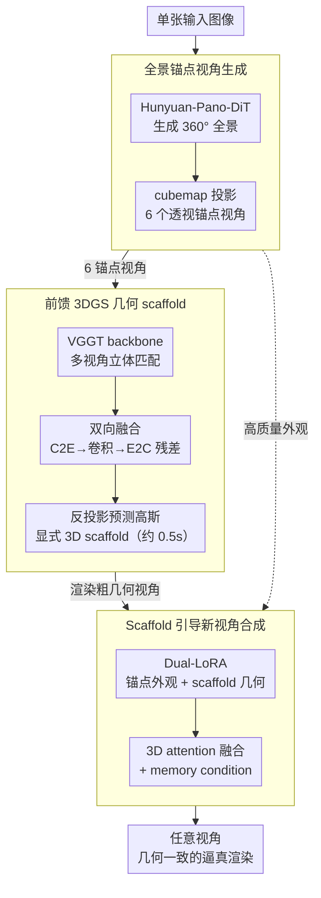

# One2Scene: Geometric Consistent Explorable 3D Scene Generation from a Single Image

**会议**: ICLR 2026  
**arXiv**: [2602.19766](https://arxiv.org/abs/2602.19766)  
**代码**: [项目页面](https://one2scene5406.github.io/)  
**领域**: 3D视觉/场景生成  
**关键词**: 单图3D场景生成, 全景深度估计, 3D Gaussian Splatting, 几何scaffold, 新视角合成

## 一句话总结
提出One2Scene——将单图到可探索3D场景的病态问题分解为三个子任务：(1)全景图生成扩展视觉覆盖 (2)前馈3DGS网络从稀疏锚点视角构建显式3D几何scaffold (3)scaffold引导的新视角合成，通过Dual-LoRA融合高质量锚点视角和几何先验，在大视角变化下实现几何一致且逼真的场景生成，显著超越SOTA。

## 研究背景与动机

**领域现状**：从单张图像生成可探索3D场景是3D视觉的核心挑战。重建方法(NeRF/3DGS)需要大量图像，稀疏视角方法无法外推。生成式方法包括：视频扩散模型(ReconX/ViewCrafter)、全景管线(DreamScene360/DreamCube)、导航+修复(WonderJourney/Pano2Room)。

**现有痛点**：(1) 视频扩散方法缺乏持久3D表示，长序列几何累积误差导致崩溃；(2) 全景方法只从单点观测，缺乏显式3D信息，大视角变化时严重畸变；(3) 迭代导航方法累积误差导致全局语义漂移和拉伸几何。

**核心矛盾**：单图信息极度匮乏 vs 需要全局一致的3D场景。现有方法要么缺乏全局覆盖(单视角方法)，要么缺乏几何约束(生成式方法)，要么累积误差(迭代方法)。

**本文目标**：(a) 如何从单图获得全局视觉覆盖？(b) 如何建立显式3D几何约束？(c) 如何在大视角变化下保持几何一致性和视觉质量？

**切入角度**：将问题分解为三个更容易的子问题——先用全景生成扩展2D覆盖，再用多视角立体匹配建立3D scaffold，最后用scaffold先验约束新视角合成。关键洞察是把单目全景深度估计重新formulate为多视角立体匹配问题，从而利用大规模多视角数据集学到的强几何先验。

**核心 idea**：通过显式3D几何scaffold为单图场景生成提供稳定的全局几何和外观先验，从根本上避免了累积误差和尺度歧义。

## 方法详解

### 整体框架
单图到可探索3D场景是个严重欠定的问题：一张图只覆盖场景的极小一角，既缺全局视觉信息，又缺3D几何约束，直接生成就会出现累积漂移、尺度穿墙等崩溃。One2Scene 的思路是把这个不可解的问题拆成三步逐级补约束：先用全景生成把单图的视觉覆盖从一个视锥扩展到 360 度，再从这圈全景里前馈构建一个显式的 3D 几何 scaffold（高斯点云），最后让扩散模型在 scaffold 提供的几何先验和高质量锚点外观的双重约束下渲染任意视角。三步走下来，每一阶段的产物都为下一阶段提供越来越强的约束，从根上避免了"无中生有"导致的漂移。

### 关键设计

**1. 全景锚点视角生成：把单视锥的覆盖扩展成 360 度的多视角输入**

单图只看得见场景的一面，要做全局一致的探索必须先补全视觉覆盖。这一步用 Hunyuan-Pano-DiT 把单图扩展成 360 度全景，再把全景按 cubemap 方式投影成 6 个透视锚点视角（FoV=95 度，相邻视角留 2.5 度重叠）。之所以不直接拿等距全景去做后续几何估计，是因为等距投影本身带强烈畸变，而 cubemap 投影出的 6 张是标准透视图，可以直接喂给在海量多视角透视数据上训练的立体匹配模型——这一步既补齐了全局语义，又把数据形态对齐到了下游能用的先验。

**2. 前馈 3DGS 几何 scaffold：把全景深度估计重新表述成多视角立体匹配**

有了 6 个锚点视角，作者把单目全景深度估计这个数据稀缺的难题，重新表述成多视角立体匹配——6 张 cubemap 视角天然就是"多视角"，于是可以复用 VGGT 这类在大规模多视角数据上学到强几何先验的 backbone 来前馈预测高斯参数。但直接套 VGGT 会失败：6 张 cubemap 之间的重叠只有 2.5 度，overlap 极稀疏，现成的多视角模型在这种条件下性能严重退化。

为此引入**双向融合模块（Bidirectional Fusion）**：先把 6 个视角的特征 $F_i$ 通过 Cube-to-Equirectangular（C2E）投影拼到一个统一的等距空间里，在这个全局空间用卷积融合强制跨视角一致，再用 E2C 变换投回各自的 cubemap 空间，并以残差方式加回原特征：

$$F_i' = F_i + E2C\big(H_c(C2E(\{F_i\}))\big)$$

等距空间的中间表示让稀疏重叠的视角之间也能交换全局上下文、对齐尺度，而残差连接又保留了每个视角自己的高频细节，二者兼得。最终每个高斯的中心由预测深度反投影得到：$\mu = K^{-1}ud + \Delta$，其中 $d$ 为深度、$\Delta$ 为残差偏移。整个 scaffold 前馈一次只需约 0.5 秒。

**3. Scaffold 引导新视角合成：用 Dual-LoRA 分别消化"几何好但有伪影"和"外观好但缺几何"两路异质条件**

到了渲染阶段，模型手上有两类性质完全不同的条件信号：scaffold 渲染出的视角几何信息丰富、但因为是稀疏点云会带空洞和伪影；锚点视角图像质量高、但本身不含目标视角的几何。如果像常规做法那样把两路条件在通道维直接拼接，模型很难分辨哪部分该信几何、哪部分该信外观。

作者在 SEVA 架构上改用 **Dual-LoRA** 策略：两个独立的 LoRA 模块分别编码锚点视角和 scaffold 渲染视角，让模型各自学会"从高质量外观里取纹理"和"从粗糙几何里取结构"，再通过 3D attention 把两路融进 noisy latent。此外加入 memory condition——从 memory bank 里取最近生成的帧作为额外条件，保证长序列探索时的时序一致性。正是这个显式几何约束，让 One2Scene 避免了 SEVA 那种因缺 3D 约束而出现的尺度歧义（相机穿墙）。

### 损失函数 / 训练策略
- **Stage 2（3DGS scaffold）**：复合损失 = MSE 渲染 loss + LPIPS 感知 loss + SILog 深度 loss，在 Structured3D / Deep360 / Matterport3D / Stanford2D3D 上训练 80K iterations。
- **Stage 3（合成）**：基于 SEVA，Adam 优化器，lr=1.25e-5，batch=16，训练 40K iterations。训练数据从 DL3DV 和 RealEstate10K 用 MVSplat 做稀疏重建获得，刻意制造稀疏输入下的伪影，让模型在训练时就见过推理阶段会遇到的退化条件。

## 实验关键数据

### 主实验：可探索3D场景生成 (WorldScore benchmark变体)

| 方法 | NIQE↓ | Q-Align↑ | CLIP-I↑ | CamMC↓ | RotErr↓ |
|------|-------|---------|---------|--------|---------|
| DreamScene360 | 8.40 | 1.91 | 74.24 | - | - |
| WonderJourney | 4.97 | 3.02 | 77.92 | - | - |
| SEVA | 4.53 | 3.20 | 87.82 | 0.558 | 0.165 |
| VMem | 6.86 | 2.95 | 75.80 | 0.998 | 0.569 |
| **One2Scene** | **4.43** | **4.13** | **89.95** | **0.389** | **0.107** |

### 消融实验：Scaffold质量对最终生成的影响

| 配置 | NIQE↓ | Q-Align↑ | CLIP-I↑ | CamMC↓ |
|------|-------|---------|---------|--------|
| 替换为AnySplat | 4.96 | 3.61 | 81.96 | 0.616 |
| **Ours (完整)** | **4.43** | **4.13** | **89.95** | **0.389** |

### 关键发现
- **Scaffold质量决定性**：用AnySplat替换本文scaffold后，CLIP-I从89.95降到81.96，CamMC从0.389升到0.616，证明高质量scaffold是核心
- **深度估计领先**：Matterport3D上finetuned AbsRel 0.0391 vs 之前SOTA 0.0850，提升>50%；Stanford2D3D上zero-shot AbsRel 0.0675已超越所有先前方法
- **效率优势**：6个稀疏视角仅0.5秒(H20)重建scaffold，比AnySplat(20视角2.8秒)快5.6倍
- **解决尺度歧义**：SEVA因缺乏3D约束存在严重尺度歧义(相机穿墙)，One2Scene的scaffold提供了稳定的全局尺度约束

## 亮点与洞察
- **全景深度估计 -> 多视角立体匹配的reformulation**非常巧妙：将全景图投影为cubemap后就能利用大量多视角数据训练的模型，避免了全景深度数据稀缺的问题。这个思路可以迁移到任何全景理解任务
- **双向融合模块(C2E-E2C)**：在等距空间做全局融合再投射回透视空间，优雅解决了极稀疏overlap下的跨视角一致性，是全景处理的通用方案
- **Dual-LoRA处理异质条件**：面对质量好但缺几何vs几何好但有伪影的两种条件，用独立LoRA分别编码后融合，比直接拼接效果好得多。可迁移到任何需要融合不同质量/类型条件的生成任务
- **三阶段分解的系统思维**：把一个不可解的问题拆成三个可解的子问题，每个阶段的输出为下一阶段提供越来越强的约束

## 局限与展望
- 生成视角间仍可能存在微妙不一致(可用post-reconstruction进一步优化)
- 全景生成模型的质量直接影响后续所有阶段——如果全景生成失败则无法恢复
- 训练数据构造依赖MVSplat的稀疏重建质量来模拟伪影，可能无法涵盖所有实际情况
- 目前仅处理静态场景，动态场景支持是未来方向

## 相关工作与启发
- **vs SEVA**: SEVA直接从单图做相机控制的新视角合成，缺乏持久3D表示导致尺度歧义和几何不一致。One2Scene通过显式scaffold提供全局约束
- **vs VMem**: VMem用CUT3R做在线重建维持一致性，但低质量生成帧反过来破坏重建——恶性循环。One2Scene的scaffold预先建立避免了这个问题
- **vs Pano2Room**: Pano2Room通过迭代导航+修复建场景，有强室内先验限制泛化。One2Scene是前馈式无场景类型限制

## 评分
- 新颖性: ⭐⭐⭐⭐ 三阶段分解和多视角reformulation有创新，但各组件是已有方法的组合
- 实验充分度: ⭐⭐⭐⭐ 多维度评估全面，消融充分，深度估计benchmark结果强
- 写作质量: ⭐⭐⭐⭐⭐ 问题分解清晰，motivation链条逻辑流畅
- 价值: ⭐⭐⭐⭐ 对单图3D场景生成有重要推进，三阶段范式可能成为标准流程

<!-- RELATED:START -->

## 相关论文

- [\[ICLR 2026\] SceneTransporter: Optimal Transport-Guided Compositional Latent Diffusion for Single-Image Structured 3D Scene Generation](scenetransporter_optimal_transport-guided_compositional_latent_diffusion_for_sin.md)
- [\[CVPR 2025\] WonderWorld: Interactive 3D Scene Generation from a Single Image](../../CVPR2025/3d_vision/wonderworld_interactive_3d_scene_generation_from_a_single_image.md)
- [\[CVPR 2026\] MatE: Material Extraction from Single-Image via Geometric Prior](../../CVPR2026/3d_vision/mate_material_extraction_from_single-image_via_geometric_prior.md)
- [\[CVPR 2026\] Pano3DComposer: Feed-Forward Compositional 3D Scene Generation from Single Panoramic Image](../../CVPR2026/3d_vision/pano3dcomposer_feed-forward_compositional_3d_scene_generation_from_single_panora.md)
- [\[ICCV 2025\] WonderPlay: Dynamic 3D Scene Generation from a Single Image and Actions](../../ICCV2025/3d_vision/wonderplay_dynamic_3d_scene_generation_from_a_single_image_and_actions.md)

<!-- RELATED:END -->
