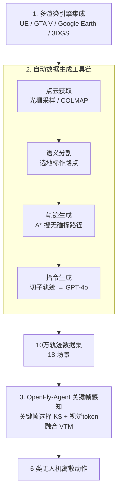

# OpenFly: A Comprehensive Platform for Aerial Vision-Language Navigation

**会议**: ICLR 2026  
**arXiv**: [2502.18041](https://arxiv.org/abs/2502.18041)  
**代码**: 有(开源)  
**领域**: 3D视觉  
**关键词**: 空中VLN, 无人机导航, 多渲染引擎, 自动数据生成, 关键帧感知, 3D高斯溅射

## 一句话总结

构建OpenFly——航空视觉-语言导航(VLN)综合平台：集成4种渲染引擎(UE/GTA V/Google Earth/3DGS)+开发全自动数据生成工具链(点云获取→语义分割→轨迹生成→GPT-4o指令)+构建10万轨迹大规模数据集(18场景)+提出关键帧感知VLN模型OpenFly-Agent(关键帧选择+视觉token融合)，在已见/未见场景分别以14.0%/7.9%的成功率优势超越现有方法。

## 研究背景与动机

**VLN领域发展**：VLN是具身AI核心任务，让agent根据语言指令和视觉观察导航到目标。已有大量室内/地面数据集(R2R、RxR、TouchDown、VLN-CE等)推动了方法发展，但无人机(UAV)作为航拍/救援/货运的关键平台，其VLN研究仍然不足。

**先驱工作的局限**：AerialVLN和OpenUAV利用AirSim+UE模拟器初步建立了空中VLN数据集，但面临三大挑战：数据多样性受限、收集成本高、数据规模小。

**数据多样性瓶颈**：现有方法依赖AirSim和Unreal Engine控制无人机，仅能使用与这些平台兼容的数字资产，限制了环境的多样性和真实感，无法引入更多高保真数据源。

**人工标注成本高**：轨迹生成依赖飞行员在模拟器中操作无人机，再由标注员手动编写语言指令。整个流程劳动密集、耗时长、难以规模化。

**数据规模严重不足**：当前航空VLN数据集仅约1万条轨迹，远远落后于机器人操作领域——Open X-Embodiment和EO-1已收集超过100万操作episode，数据匮乏严重制约模型能力。

**核心思路**：(1)多渲染引擎集成→解决多样性; (2)全自动化工具链→解决成本; (3)10万规模数据集→解决规模; (4)关键帧感知模型→解决长序列视觉冗余。

## 方法详解

### 整体框架

OpenFly不是一个单点模型，而是一套从场景采集到模型部署的完整闭环：先用4种渲染引擎搭起多样化的虚拟与真实场景库，再以一条全自动工具链把每个场景批量"翻译"成带语言指令的导航轨迹，最终在10万条轨迹上训练出关键帧感知的OpenFly-Agent。其中数据生成工具链是核心枢纽——它通过3个统一接口控制agent运动并读取传感器，串起"点云获取→语义分割→轨迹生成→指令生成"四步，把以往依赖飞行员操作+人工标注的环节全部自动化。平台与数据为模型提供养料，模型反过来验证数据的可用性，三者共同把空中VLN从小作坊式人工标注推进到工业化生产。

### 关键设计

**1. 多渲染引擎集成：用异构数据源打破单引擎的多样性天花板**

以往空中VLN只能依赖AirSim+UE，可用资产和真实感都被绑死在一个平台上。OpenFly并行接入4类来源，让场景在尺度、风格和真实度上互补：Unreal Engine 提供8个城市场景、覆盖超过 $100 \text{km}^2$ 的建筑车辆行人资产；GTA V 以洛杉矶为原型贡献高度逼真的城市景观；Google Earth 覆盖 Berkeley、大阪、华盛顿D.C.、圣路易斯4个城市区域共 $53.60 \text{km}^2$；3D Gaussian Splatting 则用层级3DGS从无人机实拍图像重建出5个校园场景、覆盖超过 $7 \text{km}^2$，把真实影像直接搬进可渲染的仿真世界（real-to-sim）。正是这种"游戏引擎+卫星影像+实拍重建"的混搭，让训练数据天然带上跨域多样性，为后续弥合sim-to-real gap埋下伏笔。

**2. 自动数据生成工具链：把人工飞行+手写指令换成可规模化的流水线**

工具链通过3个统一接口控制agent运动并读取传感器，再串起4个自动模块，使一个新场景无需飞行员介入即可批量产出轨迹。点云获取依场景类型分两路：UE/GTA V用光栅化采样在合适分辨率取局部点云再拼接，3DGS则用COLMAP从输入图像做稀疏重建。语义分割提供三种可选路径——捕获俯视图序列后用Octree-Graph提取语义3D实例、把体素化点云投影到地面分割轮廓后交GPT-4o标注语义、或在点云质量过低时退回手动标注。轨迹生成先从场景点云构建全局体素地图 $M_{global}$，随机选地标为目标、在一定距离选起点、靠近地标选终点，基于 $M_{global}$ 和自定义动作空间用A\*搜索无碰撞路径，并把终点迭代当作新起点以拼出复杂轨迹。指令生成是其中最巧的一环：不把整段轨迹图像一股脑喂给模型，而是按动作转换点切成子轨迹，每段只取关键动作和最后3帧交GPT-4o生成子指令，再由LLM整合成完整导航指令——随机抽3K样本人工核查，合格率达91%，且支持高并发快速量产。

**3. OpenFly-Agent的关键帧感知：用关键帧选择+视觉token融合压掉长序列里的视觉冗余**

空中VLN轨迹长、帧数多，若沿用均匀采样很可能漏掉真正含关键地标的那几帧，而把所有帧的视觉token都塞进VLM又会让海量背景token稀释对语言线索的注意力。OpenFly-Agent在OpenVLA基础上用两步解决：关键帧选择（KS）先启发式识别无人机运动的变化点，取变化点及其前后两帧构成候选集，再用一个3层交叉注意力的地标定位模块融合LLM隐状态中的文本与图像特征，预测指令相关地标的边界框 $\mathbf{b} \in \mathcal{R}^4$，只保留框面积大于阈值 $\theta$ 的候选帧。随后的视觉token融合（VTM）挑出候选里边界框最大、即地标观测最关键的一帧作参考帧，密集计算它与其余帧各视觉token对的余弦相似度，对高相似token做平均融合、丢弃未融合的对比帧token，如此迭代直到遍历整个关键帧集；融合结果存进容量为 $K$ 的FIFO记忆库以保留最新关键帧，关键帧内部再用grid pooling压缩，而当前帧保持不压缩以维持最新观测。动作端则把词表最后256个token复用为动作特殊token，定义 $\{$Forward, Turn Left, Turn Right, Move Up, Move Down, Stop$\}$ 共6种无人机动作。消融实验也印证了这一设计的协同性——KS与VTM单独用都只是小幅提升，合在一起才把成功率从个位数推到34.3%。

## 实验结果

### 表1：VLN数据集对比

| 数据集 | 轨迹数 | 词表大小 | 路径长度(m) | 指令长度 | 动作空间 | 环境 |
|--------|--------|---------|------------|---------|---------|------|
| R2R | 7189 | 3.1K | 10.0 | 29 | graph | Matterport3D |
| RxR | 13992 | 7.0K | 14.9 | 129 | graph | Matterport3D |
| AerialVLN | 8446 | 4.5K | 661.8 | 83 | 4 DoF | AirSim+UE |
| CityNav | 32637 | 6.6K | 545 | 26 | 4 DoF | SensatUrban |
| OpenUAV | 12149 | 10.8K | 255 | 104 | 6 DoF | AirSim+UE |
| **OpenFly** | **100K** | **15.6K** | **99.1** | **59** | **4 DoF** | **多引擎** |

### 表2：测试集导航性能对比

| 方法 | NE↓(seen) | SR↑(seen) | OSR↑(seen) | SPL↑(seen) | NE↓(unseen) | SR↑(unseen) | OSR↑(unseen) | SPL↑(unseen) |
|------|----------|----------|-----------|-----------|------------|------------|-------------|-------------|
| Random | 242m | 0.7% | 0.8% | 0% | 301m | 0.1% | 0.1% | 0% |
| Seq2Seq | 205m | 2.9% | 24.3% | 2.6% | 229m | 2.1% | 20.6% | 1.1% |
| CMA | 161m | 5.4% | 28.1% | 4.8% | 217m | 4.6% | 24.4% | 2.1% |
| AerialVLN | 139m | 7.5% | 30.0% | 6.8% | 214m | 7.3% | 28.1% | 4.4% |
| Navid | 153m | 13.0% | 38.2% | 11.6% | 210m | 10.8% | 27.2% | 5.0% |
| NaVila | 132m | 20.3% | 53.5% | 17.8% | 202m | 14.7% | 42.1% | 9.6% |
| **OpenFly-Agent** | **93m** | **34.3%** | **64.3%** | **24.9%** | **154m** | **22.6%** | **56.2%** | **19.1%** |

### 表3：消融实验(test-seen)

| 方法 | NE↓ | SR↑ | OSR↑ | SPL↑ |
|------|-----|-----|------|------|
| OpenVLA (baseline) | 231m | 2.3% | 10.8% | 2.2% |
| History (均匀采样) | 223m | 6.9% | 23.3% | 5.6% |
| Random KS | 264m | 8.7% | 26.6% | 5.8% |
| KS (关键帧选择) | 275m | 9.2% | 28.1% | 6.1% |
| History + VTM | 215m | 16.6% | 40.5% | 9.1% |
| **KS + VTM** | **93m** | **34.3%** | **64.3%** | **24.9%** |

## 关键发现

1. **关键帧选择+视觉token融合的协同效应极为显著**：单独使用KS(SR 9.2%)或History+VTM(SR 16.6%)效果有限，组合使用(SR 34.3%)产生超线性提升。原因是VTM解决了文本-图像token数量不平衡问题，避免背景噪声稀释对关键线索的注意力。

2. **多引擎训练数据的泛化优势**：在真实世界23个场景实验中，用OpenFly数据训练的模型(SR 26.09%, OSR 34.78%)大幅优于AerialVLN数据训练的模型，证明多引擎数据有效弥合sim-to-real gap。

3. **VLM在空中VLN中的巨大潜力**：基于VLM的Navid/NaVila显著优于传统Seq2Seq/CMA方法，尤其在Oracle SR上差距明显(38-53% vs 24-28%)，说明VLM的推理能力对导航至关重要。

4. **短-中程指令更贴近实际使用**：OpenFly平均轨迹长度99.1m、指令长度59词，远低于AerialVLN(661.8m/83词)。作者论证这更符合自然人类使用习惯，且对推动空中VLN更有益。

5. **自动指令生成质量可靠**：基于GPT-4o的子轨迹分割策略+LLM整合，随机抽样3K样本人工检查合格率91%，且支持高并发快速生成大量指令。

## 亮点与洞察

- **系统级创新而非单点突破**：OpenFly的贡献不在于某个模型组件的创新性，而在于整合4引擎+自动工具链+10万数据集+关键帧模型的完整platform，形成闭环。
- **3DGS的real-to-sim应用**：无人机采集真实图像→3DGS重建→在重建场景中自动生成训练数据→部署到真实无人机，闭环验证了新范式。
- **工程价值极高**：用户可利用OpenFly工具链在自己的场景快速生成定制数据，具有基础设施级贡献。
- **数据规模的量变到质变**：10万轨迹（vs 现有~1万）首次让空中VLN数据规模与地面VLN可比，OpenVLA的迁移效果也依赖这一规模。

## 局限性

1. **绝对成功率仍然不高**：即使是最优的OpenFly-Agent，test-seen SR也仅34.3%、test-unseen仅22.6%，说明空中VLN仍极具挑战性，距离实用部署差距明显。
2. **泛化能力有限**：所有方法在unseen场景上性能显著下降（SR从34.3%→22.6%），跨场景泛化仍是核心瓶颈。
3. **依赖GPT-4o**：指令生成和语义标注依赖商业闭源VLM，成本和可复现性受限。
4. **动作空间简化**：使用固定步长(3/6/9m)的离散动作，与真实无人机的连续控制有差距。虽然提供了连续轨迹支持，但主要实验仍基于离散动作。
5. **Google Earth数据仅限高空视角**：为保证视觉质量，Google Earth仅采集高空数据(4.46%)，限制了低空真实场景覆盖。

## 相关工作对比

### vs AerialVLN (ICCV 2023)
AerialVLN是首个空中VLN数据集(8446轨迹)，但仅使用AirSim+UE单一引擎，轨迹和指令依赖人工飞行+标注。OpenFly在多引擎多样性(4种 vs 1种)、数据规模(100K vs 8.4K)、自动化程度(全自动 vs 人工)三方面全面超越。在NE指标上OpenFly-Agent(93m) vs AerialVLN方法(139m)提升33%。

### vs OpenUAV (2024)
OpenUAV同样使用AirSim+UE构建12149条轨迹的VLN数据集，引入人类反馈(RLHF)引导导航。但其仍依赖飞行员操作和人工标注，数据多样性受限。OpenFly的工具链实现了数据生成的全自动化，且通过3DGS引入了real-to-sim能力，在真实世界部署中展现更强的迁移性。

### vs CityNav (2024)
CityNav基于SensatUrban点云数据+CityRefer语言标注构建32637条轨迹，但依赖预有的2D地图辅助定位地标。OpenFly不需要外部地图，通过端到端的视觉-语言方法直接从一人称视角导航，更接近实际无人机应用场景。

## 评分

- **新颖性**: ⭐⭐⭐⭐ 多引擎集成+全自动pipeline+关键帧感知的系统级创新，单点技术创新有限
- **实验充分度**: ⭐⭐⭐⭐⭐ 多方法对比+消融+真实无人机部署+跨数据集对比+规模分析，非常全面
- **写作质量**: ⭐⭐⭐⭐ 系统描述清晰完整，图表丰富
- **价值与影响**: ⭐⭐⭐⭐⭐ 对空中VLN研究有基础设施级贡献，工具链+数据集+benchmark三位一体

<!-- RELATED:START -->

## 相关论文

- [\[ICCV 2025\] 3D Gaussian Map with Open-Set Semantic Grouping for Vision-Language Navigation](../../ICCV2025/3d_vision/3d_gaussian_map_with_openset_semantic_grouping_for_visionlan.md)
- [\[ICLR 2026\] EgoNight: Towards Egocentric Vision Understanding at Night with a Challenging Benchmark](egonight_towards_egocentric_vision_understanding_at_night_with_a_challenging_ben.md)
- [\[CVPR 2026\] Zero-Shot Depth Completion with Vision-Language Model](../../CVPR2026/3d_vision/zero-shot_depth_completion_with_vision-language_model.md)
- [\[CVPR 2026\] Multi-Scale Gaussian-Language Map for Zero-shot Embodied Navigation and Reasoning](../../CVPR2026/3d_vision/multi-scale_gaussian-language_map_for_zero-shot_embodied_navigation_and_reasonin.md)
- [\[CVPR 2026\] MonoVLM: Monocular 3D Visual Grounding with Vision Language Models](../../CVPR2026/3d_vision/monovlm_monocular_3d_visual_grounding_with_vision_language_models.md)

<!-- RELATED:END -->
