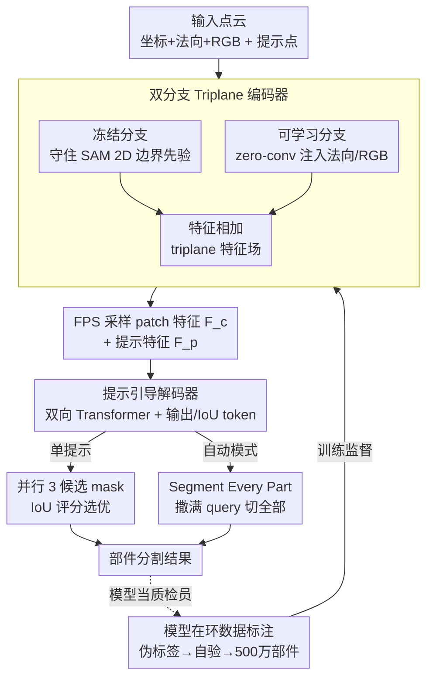

# PartSAM: A Scalable Promptable Part Segmentation Model Trained on Native 3D Data

**会议**: ICLR 2026  
**arXiv**: [2509.21965](https://arxiv.org/abs/2509.21965)  
**代码**: [https://czvvd.github.io/PartSAMPage/](https://czvvd.github.io/PartSAMPage/)  
**领域**: 3D 视觉  
**关键词**: 3D part segmentation, SAM, prompt-based, native 3D data, open-world

## 一句话总结
提出首个在大规模原生 3D 数据上训练的可提示部件分割模型 PartSAM，采用 triplane 双分支编码器（冻结 SAM 先验 + 可学习 3D 分支）和 SAM 风格解码器，通过模型在环标注流程构建 500 万+形状-部件对，在开放世界设置下单次点击即超越 Point-SAM 90%+。

## 研究背景与动机

**领域现状**：3D 部件分割是 CV 经典问题。早期方法在 ShapeNet-Part/PartNet 等闭集数据上训练，无法泛化到开放世界。近期方法（SAMPart3D、PartField）利用 SAM 的 2D 先验做多视图 lift。

**现有痛点**：(1) 2D→3D lift 丢失内部结构信息，只能理解表面；(2) 聚类方法（PartField）缺乏交互可控性；(3) 训练数据瓶颈——缺乏大规模 3D 部件标注；(4) 对网格连接高度依赖，AI 生成形状上性能崩溃。

**核心矛盾**：如何在缺乏大规模 3D 部件标注的情况下，训练既能灵活交互、又能理解 3D 内部结构的模型？

**本文目标** 构建大规模原生 3D 部件数据（500万+对），设计同时利用 2D 先验和 3D 知识的新架构，实现 SAM 风格的交互+自动分割。

**切入角度**：双通道设计——冻结的 SAM 通道保留 2D 知识，可学习通道适应原生 3D 标注。

**核心 idea**：用双分支 triplane 编码器 + SAM 解码器在百万级原生 3D 部件数据上训练，首次实现真正理解 3D 内部结构的可提示部件分割。

## 方法详解

### 整体框架
PartSAM 想把 SAM 那套"点一下就分割"的交互范式直接搬到原生 3D 上，而不是像以往方法那样先在多视图 2D 上分割再 lift 回 3D。整条 pipeline 是：输入点云 $P_{in} \in \mathbb{R}^{N \times 9}$（坐标+法向+RGB）和提示点 $P_{prompt}$，先经一个双分支 triplane 编码器把点云编成稠密的三平面特征场，再在提示点位置采样得到 patch embedding $F_c$；解码器把 $F_c$ 和提示 embedding $F_p$ 一起喂进双向 Transformer，生成分割 mask。整个模型既支持交互模式（用户逐点点击、逐轮补正），也支持自动模式（Segment Every Part，一次撒满 query 把所有部件切出来）。背后能跑通的前提，是一套模型在环的标注流程先攒出了 500 万+形状-部件对，给整个架构提供训练监督。

### 关键设计

**1. 双分支 Triplane 编码器：既不丢 SAM 的 2D 先验，又能吃下原生 3D 监督**

直接在 3D 部件数据上从头训一个编码器，会丢掉 SAM/PartField 在海量 2D 数据上学到的边界先验；但只用冻结的 2D 先验又没法适应原生 3D 标注里的内部结构信号。PartSAM 用两个并行分支化解这个两难：两支都以 PVCNN+Transformer 构建 triplane 特征场，冻结分支原封不动地保留 PartField 预训练得到的 SAM 对比学习特征，负责守住 2D 边界知识不被遗忘；可学习分支则通过零卷积（zero-conv）额外接入法向和 RGB 输入，在原生 3D 标注上训练。零卷积初始为零保证训练初期可学习分支不会扰动已有先验，随训练逐步注入 3D 信息，最后两支特征相加融合。这样冻结支提供"哪里像部件边界"的通用直觉，可学习支补上"3D 内部怎么切"的具体知识，相比 Point-SAM 这类单分支编码器，对内部结构和粗糙网格的理解都更强。

**2. SAM 启发的提示引导解码器：用并行候选 + IoU 评分处理部件边界歧义**

单点点击天然有歧义——点在车门上，用户可能想要门、想要整侧车身、也可能想要门把手。PartSAM 照搬 SAM 的解法：在解码器里引入输出 token $T_{out}$ 和 IoU token $T_{iou}$，让它们和提示、特征一起做双向交叉注意力，

$$F_c' = \text{CrossAttn}\big(F_c \leftrightarrow [F_p; T_{out}; T_{iou}]\big)$$

特征 token 和 prompt/输出 token 互相更新。单提示时并行解码出 3 个不同粒度的候选 mask，再由 IoU token 预测每个候选的质量分数，自动挑出最优的那个。这样不必让用户反复点很多次才收敛到想要的粒度，把歧义交给模型一次性枚举、用预测 IoU 排序，这也是后面 IoU@1 大幅领先的直接来源。

**3. 模型在环数据标注：用伪标签 + 模型自验的双层筛选，把碎片资产攒成 500 万部件**

3D 部件分割最大的瓶颈是没有大规模标注，而 Objaverse 这类资产虽多却高度碎片化、质量参差。PartSAM 设计了两阶段、模型在环的流程来"自举"训练数据：第一阶段从资产的场景图 / 连通分量里直接提取天然部件，得到约 18 万形状、2200 万部件作为种子；第二阶段引入 PartSAM 自己来当质检员——先用 PartField 在 $K=10/20/30$ 三档聚类生成候选伪标签，再让当前的 PartSAM 对每个候选做 10 轮交互验证，按两条规则接受：$\text{IoU@1}>60\%$（一次点击就能切准，说明这是内在明确、边界清晰的部件），或 $\text{IoU@10}>90\%$（一次点不准但十轮内能补完善，说明是可交互细化的部件）。这两条规则正好覆盖"显式部件"和"可交互部件"两类有用样本，过滤掉噪声聚类，最终扩到 50 万形状、5500 万部件。模型越训越强、筛出的数据越干净，形成正反馈，这是绕过"没数据就训不出模型、没模型就标不出数据"鸡生蛋困局的关键。

### 损失函数
$$\mathcal{L} = \mathcal{L}_{focal} + \alpha \mathcal{L}_{dice} + \mathcal{L}_{IoU} + \lambda \mathcal{L}_{triplet}$$

其中 focal + dice 监督 mask 质量，$\mathcal{L}_{IoU}$ 训练 IoU token 准确预测候选质量（驱动并行候选的选优），$\mathcal{L}_{triplet}$ 约束 triplane 特征的对比结构以对齐 SAM 先验。

## 实验关键数据

### 主实验（交互分割）

| 数据集 | 方法 | IoU@1 | IoU@5 | IoU@10 |
|--------|------|-------|-------|--------|
| PartObjaverse-Tiny | Point-SAM | 29.4 | 68.7 | 73.9 |
| | **PartSAM** | **56.1** | **84.1** | **87.6** |
| PartNetE | Point-SAM | 35.9 | 75.1 | 79.2 |
| | **PartSAM** | **59.5** | **86.5** | **89.9** |

### 自动分割

| 方法 | PartObjaverse-Tiny | PartNetE |
|------|-------------------|----------|
| PartField | 51.5 | 59.1 |
| **PartSAM** | **69.5** | **72.4** |

### 关键发现
- **IoU@1 提升 91%**：单次点击即准确分割，Point-SAM 高度依赖迭代补正
- **内部结构理解**：能分割被遮挡的手袋内物品、汽车内座椅等，SAMesh 无法做到
- **AI 生成形状泛化**：在 Hunyuan3D 生成的不规则网格上保持良好性能

## 亮点与洞察
- **范式转变**：从"2D lift → 聚类"到"原生 3D + 交互解码"，首次真正理解 3D 内部结构
- **模型在环标注解决了鸡生蛋问题**：通过 PartField 伪标签 + PartSAM 交互验证的双层筛选
- **双分支设计精妙**：冻结保留 2D 边界先验，可学习适应粗糙 3D 信号，相加融合简洁有效

## 局限与展望
- 交互推理成本较聚类方法更高
- 500k 形状相比 2D 基础模型的十亿级数据仍有差距
- 极小部件（按钮级别）因点采样分辨率限制性能下降

## 相关工作与启发
- **vs PartField**: 聚类后处理是 bottleneck，prompted 解码绕过了这个问题，且不依赖网格连接
- **vs Point-SAM**: 数据和架构都更大（5x 数据、双分支编码），性能跃升
- 启示：3D foundation model 需要真正大规模的原生 3D 数据

## 评分
- 新颖性: ⭐⭐⭐⭐⭐ 首个原生 3D 训练的可提示部件分割模型
- 实验充分度: ⭐⭐⭐⭐ 多基准全面评估，但消融细节在附录
- 写作质量: ⭐⭐⭐⭐⭐ 方法描述系统，可视化出色
- 价值: ⭐⭐⭐⭐⭐ 开启 3D 版 SAM 的新方向

<!-- RELATED:START -->

## 相关论文

- [\[ECCV 2024\] 3×2: 3D Object Part Segmentation by 2D Semantic Correspondences](../../ECCV2024/3d_vision/3x2_3d_object_part_segmentation_by_2d_semantic_correspondenc.md)
- [\[CVPR 2026\] GeoSAM2: Unleashing the Power of SAM2 for 3D Part Segmentation](../../CVPR2026/3d_vision/geosam2_unleashing_the_power_of_sam2_for_3d_part_segmentation.md)
- [\[ICLR 2026\] GeoPurify: A Data-Efficient Geometric Distillation Framework for Open-Vocabulary 3D Segmentation](geopurify_a_data-efficient_geometric_distillation_framework_for_open-vocabulary_.md)
- [\[ICLR 2026\] PD²GS: Part-Level Decoupling and Continuous Deformation of Articulated Objects via Gaussian Splatting](pd2gs_part-level_decoupling_and_continuous_deformation_of_articulated_objects_vi.md)
- [\[CVPR 2026\] S2AM3D: Scale-controllable Part Segmentation of 3D Point Clouds](../../CVPR2026/3d_vision/s2am3d_scale-controllable_part_segmentation_of_3d_point_cloud.md)

<!-- RELATED:END -->
