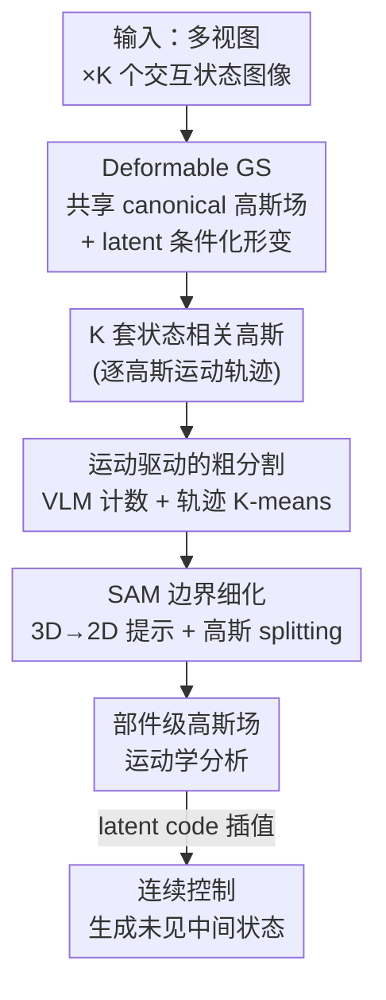

# PD²GS: Part-Level Decoupling and Continuous Deformation of Articulated Objects via Gaussian Splatting

**会议**: ICLR 2026  
**arXiv**: [2506.09663](https://arxiv.org/abs/2506.09663)  
**代码**: 有  
**领域**: 3D 视觉 / 铰接物体建模  
**关键词**: articulated objects, 3D Gaussian Splatting, part segmentation, continuous deformation, SAM

## 一句话总结
提出 PD²GS 框架，通过学习共享的 canonical 高斯场并将每个交互状态建模为其连续形变，实现铰接物体的部件级解耦、重建和连续控制，采用粗到细的运动轨迹聚类 + SAM 引导的边界细化，无需手动监督。

## 研究背景与动机

**领域现状**：铰接物体（门、抽屉、笔记本）的 3D 建模对机器人、AR/VR、数字孪生至关重要。近期 PARIS、GAPartNet 等用 NeRF/3DGS 做自监督建模，但多限于单关节两状态。

**现有痛点**：(1) 两状态方法只能做离散配对比较，无法建模连续运动；(2) 需要已知部件数或严格的几何约束；(3) 多部件解耦依赖 Marching Cubes 显式网格，误差累积严重。

**核心矛盾**：如何在有限的离散交互状态观测下，学习连续的部件级运动模型？

**本文目标** 从多视图多状态图像自监督学习：(1) 部件感知重建；(2) 部件级连续控制；(3) 精确运动学建模。

**切入角度**：关键洞察——每个交互状态可以建模为共享 canonical 高斯场的连续形变，部件内运动一致、部件间运动不同。

**核心 idea**：用 latent code 条件化的形变网络驱动 canonical 高斯场的连续变形，通过运动轨迹聚类 + SAM 边界细化实现自动部件解耦。

## 方法详解

### 整体框架
PD²GS 要从铰接物体在 K 个离散交互状态下的多视图图像中，学出一个能连续运动、且自动按部件解耦的模型。它的核心思路是把"K 个状态"统一成一个共享的 canonical 高斯场加上 K 次形变：先用 latent code 条件化的形变网络把规范高斯场分别变形到每个观测状态（Deformable GS），得到 K 套状态相关的高斯。部件结构再从这些形变里"反推"出来，走的是一条粗到细的路线——先按高斯的运动轨迹做粗粒度聚类得到部件雏形（运动驱动的粗分割），再用 SAM 把部件边界细化到像素级（SAM 边界细化）。拿到部件级高斯场后做运动学分析，就能在 latent code 空间里连续插值，生成训练时没见过的中间配置。

### 关键设计

**1. Deformable Gaussian Splatting：把离散状态统一成共享场的连续形变**

两状态方法只能在离散观测之间做配对比较，无法刻画"门开到一半"这样的中间状态。PD²GS 的做法是维护一个状态无关的 canonical 高斯场，给每个交互状态 $k$ 分配一个 latent code $\alpha_k \in \mathbb{R}^D$，再用一个形变 MLP $f_{def}$ 预测每个高斯在该状态下的位移：$(\Delta\mu_i, \Delta q_i, \Delta s_i) = f_{def}(\mu_i, q_i, s_i \mid \alpha_k)$。形变以加法作用在位置上、以四元数乘法作用在旋转上，从而把规范高斯搬到对应状态。关键在于状态是被 latent code 连续参数化的，所以训练结束后只要在 $\alpha$ 空间里插值，就能渲染出训练时没见过的连续中间状态，而不再受限于离散的几个观测。

**2. 粗粒度运动驱动的部件分割：让运动差异本身充当分割信号**

没有任何人工部件标注时，分割信号从哪来？PD²GS 注意到同一刚体部件内的高斯运动方向一致（即使位移幅度因到关节的距离不同而不同），部件之间的运动方向则各异。于是它先计算每个高斯在 K 个状态间的最大位移，用阈值 $\tau_{mot}$ 把静态背景和动态部件分开；再用 VLM（BLIP/Gemini）从图像对里估计运动部件的数目，多次询问取众数投票以稳住计数；最后为每个动态高斯构建运动描述子（归一化方向 + 位移幅度），在单位球上做 K-means 聚类。归一化方向让同一部件内幅度不一的高斯在角距离上聚到一起，从而把部件雏形分出来。

**3. SAM 引导的边界细化：用视觉先验把粗聚类边界拉到像素级**

运动聚类给出的边界比较粗糙，部件交界处的高斯容易被分错。PD²GS 借 SAM 的像素级分割来修边界：在部件边界区域的高斯上，按 3D→2D 投影自动生成提示点，喂给 SAM 得到 2D mask，再把 mask 反投影回 3D 去修正这些高斯的部件标签。对横跨边界的高斯还会做 splitting——把一个高斯拆成几个更小的高斯并各自重新分配标签，让边界能贴合真实部件轮廓。这样运动聚类负责给出语义上正确的部件归属，SAM 负责把几何边界做精，两者互补。

### 损失函数
训练目标为 $\mathcal{L}_{total} = \mathcal{L}_{photo} + \mathcal{L}_{D_{SIMM}}$，即光度重建损失加上密度相似性正则化，前者保证各状态渲染对齐输入图像，后者约束形变前后的高斯密度分布。

## 实验关键数据

### 主实验（PartNet-Mobility）

| 方法 | PSNR↑ | SSIM↑ | 部件 IoU↑ | 关节误差↓ |
|------|-------|-------|----------|---------|
| PARIS | 低 | 低 | ~50% | 高 |
| CAGE | 中 | 中 | ~55% | 中 |
| **PD²GS** | **最高** | **最高** | **~70%** | **最低** |

### 消融实验

| 配置 | 重建质量 | 分割精度 | 说明 |
|------|---------|---------|------|
| Full PD²GS | 最优 | 最优 | 完整模型 |
| w/o SAM 细化 | 略低 | 下降 ~10% | 粗聚类边界不精确 |
| w/o VLM 计数 | 相当 | 下降 ~5% | 手动指定 K 效果接近 |
| 2 状态 vs 4 状态 | 较低 | 较低 | 更多状态提供更好的运动约束 |

### 关键发现
- **连续控制能力**：通过插值 latent code 可以生成平滑的中间状态，而之前的方法只能在离散状态间跳跃
- **多部件支持**：成功处理了抽屉柜（多个独立运动的抽屉）等复杂多部件物体
- **RS-Art 真实数据**：在自建的真实→仿真数据集上也表现良好，验证了 sim-to-real 泛化

## 亮点与洞察
- **latent code 驱动的连续形变很优雅**：将离散状态的观测编码为连续运动空间，支持未见配置的生成
- **运动即分割的自监督思路**：不需要任何人工标注，从运动差异自动发现部件结构
- **3D-to-2D SAM 提示的创新**：自动从 3D 部件边界生成 2D 提示点，避免了人工标注的 SAM 提示

## 局限与展望
- VLM 计数可能不准确，需要众数投票稳定性
- 运动阈值 $\tau_{mot}$ 需要调参
- 仅处理刚体铰接运动，柔性形变（如布料）不支持
- RS-Art 数据集规模较小

## 相关工作与启发
- **vs PARIS**: 仅支持单关节两状态，PD²GS 支持多部件多状态连续控制
- **vs 动态 3DGS（4D-GS 等）**: 动态方法不区分部件运动语义，PD²GS 显式解耦
- 对机器人的物体操作有直接应用价值——预测出部件和运动学参数后可以规划操作策略

## 评分
- 新颖性: ⭐⭐⭐⭐⭐ canonical 场 + latent 形变 + 自动部件发现的组合很新
- 实验充分度: ⭐⭐⭐⭐ PartNet-Mobility + RS-Art 真实数据，消融完整
- 写作质量: ⭐⭐⭐⭐ 方法描述清晰，公式规范
- 价值: ⭐⭐⭐⭐⭐ 铰接物体连续建模的重要进展

<!-- RELATED:START -->

## 相关论文

- [\[CVPR 2026\] Part$^{2}$GS: Part-aware Modeling of Articulated Objects using 3D Gaussian Splatting](../../CVPR2026/3d_vision/part2gs_part-aware_modeling_of_articulated_objects_using_3d_gaussian_splatting.md)
- [\[ICLR 2026\] PartSAM: A Scalable Promptable Part Segmentation Model Trained on Native 3D Data](partsam_a_scalable_promptable_part_segmentation_model_trained_on_native_3d_data.md)
- [\[ICLR 2026\] MoE-GS: Mixture of Experts for Dynamic Gaussian Splatting](moe-gs_mixture_of_experts_for_dynamic_gaussian_splatting.md)
- [\[ICLR 2026\] Learning Part-Aware Dense 3D Feature Field for Generalizable Articulated Object Manipulation](learning_part-aware_dense_3d_feature_field_for_generalizable_articulated_object_.md)
- [\[CVPR 2026\] NG-GS: NeRF-Guided 3D Gaussian Splatting Segmentation](../../CVPR2026/3d_vision/ng_gs_nerf_guided_3d_gaussian_splatting_segmentation.md)

<!-- RELATED:END -->
