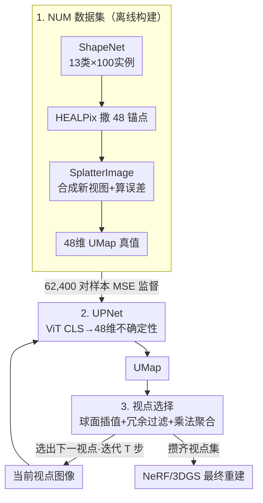

# Peering into the Unknown: Active View Selection with Neural Uncertainty Maps for 3D Reconstruction

**会议**: ICLR 2026  
**arXiv**: [2506.14856](https://arxiv.org/abs/2506.14856)  
**代码**: [https://github.com/ZhangLab-DeepNeuroCogLab/PUN](https://github.com/ZhangLab-DeepNeuroCogLab/PUN)  
**领域**: 3D 视觉  
**关键词**: active view selection, neural uncertainty map, 3D reconstruction, NeRF, 3DGS

## 一句话总结

提出 PUN（Peering into the UnkNowN），用轻量前馈网络 UPNet 从单张图像直接预测球面上所有候选视点的不确定性分布（neural uncertainty map），替代了需要迭代重训 NeRF/3DGS 的传统主动视点选择流程。仅用上界一半的视点就达到可比的重建质量，选点阶段实现 400 倍加速和 50%+ 的计算资源节省。

## 研究背景与动机

主动视点选择（Active View Selection, AVS）的目标是找到最少但信息量最大的一组视点来训练 3D 渲染模型。这在机器人探索、文化遗产数字化、搜救等场景中具有重要实用价值。

现有 AVS 方法几乎都遵循"训练→评估→选择→重训"的迭代范式：先在当前视点集上训练 NeRF 或 3DGS 模型，然后利用训练好的模型对每个候选视点估算不确定性（如射线权重分布的熵、颜色方差、遮挡可见性等），选出信息量最高的下一个视点后，又需要把新视点加入训练集重新训练模型。这个循环导致了严重的计算瓶颈——NVF 方法选 20 个视点需要约 175 分钟。

另一类基于强化学习或监督学习的方法虽然避免了重训，但依赖固定离散候选集，泛化能力有限。基于 3DGS 的方法（ActiveSplat、ActiveGS）则侧重几何信息，忽略了像素级的颜色线索。

**核心洞察**：大量自然物体的重建不确定性模式存在规律性——几何复杂、纹理丰富的视角通常不确定性更高，且物体对称性会降低对称视角的不确定性。如果能从数据中学到这种"外观→不确定性"的映射，就不再需要每次都从头训练渲染模型来评估不确定性。

## 方法详解

### 整体框架

PUN 把主动视点选择从"每步重训渲染模型"的迭代优化彻底改成一次前馈预测。离线阶段在大规模 NUM（Neural Uncertainty Map）数据集上训练轻量网络 UPNet，让它学会从单张图像直接吐出整个球面的不确定性分布；在线阶段每给定一个视点，UPNet 推理出一张 UMap，把历史若干张 UMap 聚合后挑出信息量最大的下一视点，迭代 T 步收集到的视点集再交给目标 NeRF/3DGS 训练。选点过程不再碰任何 3D 渲染训练，这正是 400 倍加速的来源。

### 关键设计

**1. NUM 数据集：把"外观→不确定性"的映射变成可监督的回归目标**

要让网络学会预测不确定性，先得有大规模的（图像, 不确定性）配对。作者从 ShapeNet 取 13 个类别、每类 100 个实例，对每个实例用 HEALPix（nside=2）在球面均匀撒 48 个锚点视点；对每个锚点，用预训练的 SplatterImage（单视图前馈 3DGS）从它出发合成其余 47 个锚点的新视图，再和 Blender 渲染真值算重建误差（PSNR/SSIM/LPIPS/MSE），凑成一个 48 维的 UMap 向量。这样一个视点图像就对应一张全球面不确定性图，总计 $13 \times 100 \times 48 = 62{,}400$ 对样本。选 SplatterImage 而非 NeRF 做合成骨干，是因为它端到端前馈、每个视点无需单独训练，否则光造数据就会被拖垮。数据按 8:1:1 划分训练/验证/测试，并完整留出 2 个类别专门检验跨类别泛化。

**2. UPNet：用极简结构把单图直接映射成 48 维不确定性**

有了监督信号，预测端反而做得很轻——ImageNet 预训练的 ViT 当视觉编码器，取 CLS token 后接一个全连接层，直接输出对应 48 个锚点的 48 维不确定性向量，训练时用 MSE 监督预测 UMap 与真值 UMap 的差异，默认以 PSNR 作为构造目标的不确定性度量。结构之所以敢这么简单，是因为不确定性模式本身具有跨物体的领域无关规律（几何复杂、纹理丰富处不确定性高、对称面不确定性低），ViT 的预训练特征足以捕获，无需为每个物体重新拟合一个渲染场。

**3. 球面插值 + 时序聚合的视点选择：把 48 个离散锚点扩展到任意候选并消除冗余**

UMap 只覆盖 48 个锚点，但候选视点可落在球面任意位置，所以要先插值。对每个候选点 $C_i$，取角距 30° 以内的锚点邻域 $\tilde{P}$，按 softmax 角距加权求和得到它的不确定性 $U^{C_i} = \sum_{\tilde{P_j} \in \tilde{P}} \omega_j U^{\tilde{P_j}}$，其中 $\omega_j = \frac{e^{-\theta_{ij}}}{\sum e^{-\theta_{ij}}}$，越近的锚点权重越大。选点时再叠两层逻辑：一是冗余过滤，凡某候选在任一历史时间步的不确定性低于阈值 0.1 就直接剔除，因为它贴近已选过的视点、增量信息几乎为零；二是乘法聚合，对剩下的候选把各时间步的不确定性连乘后取最大，$v_{t+1} = \arg\max_{C_i} \prod_{t} U_t^{C_i}$。连乘的语义相当于求联合不确定性——只有在所有观测下都持续高不确定的方向才值得探索，从而自然避开重复观察的视角。

### 一个完整示例

以选第 $t+1$ 个视点为例：把当前视点图像喂进 UPNet 得到一张 48 维 UMap，连同前 $t$ 步的历史 UMap 一起，先对球面上每个候选 $C_i$ 用 30° 邻域 softmax 插值得到各时间步的 $U_t^{C_i}$；接着把任一步不确定性低于 0.1 的候选过滤掉，对幸存候选沿时间维做连乘 $\prod_t U_t^{C_i}$ 并取最大者作为 $v_{t+1}$。如此迭代 T 步攒齐视点集后，再统一交给 NeRF/3DGS 做最终重建——整个选点环节没有任何渲染模型的训练，只有若干次 ViT 前向。

## 实验关键数据

### 主实验结果

论文在 6 个数据集上与 4 个 AVS 基线比较。所有方法选 20 个视点，用相同的 NeRF 骨干训练 2,000 步。

| 数据集 | 方法 | PSNR↑ | SSIM↑ | LPIPS↓ | MSE↓ |
|--------|------|-------|-------|--------|------|
| NUM-inst（同类别新实例）| A-NeRF | 32.71 | 0.982 | 0.031 | 8.19 |
| | NVF | 33.08 | 0.984 | 0.028 | 6.98 |
| | **PUN** | **33.19** | **0.984** | **0.025** | **6.96** |
| | Upper-bnd | 36.47 | 0.989 | 0.017 | 4.11 |
| NUM-cat（未见类别）| A-NeRF | 33.16 | 0.984 | 0.024 | 7.04 |
| | NVF | 33.15 | 0.985 | 0.021 | 6.65 |
| | **PUN** | **34.74** | **0.985** | **0.019** | **5.03** |
| | Upper-bnd | 36.91 | 0.990 | 0.013 | 3.33 |
| NUM-3DGS（3DGS 骨干）| NVF | 30.67 | 0.977 | 0.07 | 2.28 |
| | **PUN** | **36.71** | **0.990** | **0.03** | **0.40** |
| NeRFAssets（真实场景）| NVF | 26.31 | 0.928 | 0.115 | 0.005 |
| | **PUN** | **26.73** | **0.944** | **0.093** | **0.003** |
| MIP360（真实场景）| NVF | 15.41 | 0.203 | 0.653 | 32.03 |
| | **PUN** | **17.49** | **0.294** | **0.545** | **19.98** |

在 NUM-cat 上 PUN 领先 NVF 达 1.59 dB PSNR，说明前馈预测的不确定性在未见类别上泛化能力远超迭代式方法。在现实场景 MIP360 上，PUN 领先 NVF 超过 2 dB PSNR。

### 消融实验

| 消融维度 | 配置 | PSNR |
|----------|------|------|
| 不确定性度量 | PSNR（默认） | 37.4 |
| | SSIM | 36.4 |
| | LPIPS | 36.1 |
| | MSE | 35.0 |
| 冗余过滤策略 | small+all（默认） | 37.4 |
| | 禁用冗余过滤 | 36.9 |
| | top-32 排除 | 36.8 |
| | single（5° 邻域排除） | 36.9 |
| 聚合策略 | 乘法聚合所有步（默认） | 37.4 |
| | 仅用最新 UMap | 36.9 |
| | 差分策略 | 36.8 |
| | 加法聚合 | 36.9 |
| 数据多样性 | 80 实例 / 12 视点 | 36.9 |
| | 40 实例 / 24 视点 | 36.3 |
| | 20 实例 / 48 视点 | 35.7 |
| 锚点数量 | 12 | 37.0 |
| | 48（默认） | 36.8 |
| | 108 | 36.8 |

关键发现：

- **PSNR 是最优训练度量**，比 SSIM/LPIPS/MSE 好 1-2.4 dB
- **冗余过滤和时序聚合都有贡献**，禁用任一都导致 0.5 dB 下降
- **实例多样性远重要于视点密度**：固定总样本量时，用更多物体实例（80×12）明显优于更少实例但更多视点（20×48），因为对称物体的冗余视点提供的增量信息有限
- 锚点数从 12 增到 48 有提升，但 108 几乎无增益——48 是性价比最优的配置

### 计算效率对比

PUN 的核心优势在于计算效率：

- 单次视点选择全流程耗时 **5.5 分钟** vs NVF 的 **175 分钟**（400 倍加速）
- GPU 内存从 **8,098 MB** 降至 **655 MB**
- CPU 占用从 **903%** 降至 **74%**
- RAM 从 **4,292 MB** 降至 **1,870 MB**
- GPU 利用率从 **30.6%** 降至 **0.3%**

这是因为 PUN 在选点阶段完全避免了 NeRF/3DGS 的训练，只需要一次 ViT 前向传播。

## 亮点与洞察

**范式转换的关键前提**：作者发现不确定性模式具有跨物体的可学习性——UPNet 预测值与真实 UMap 的 Pearson 相关系数达 0.82。进一步分析表明，UPNet 隐式捕获了视点的几何复杂度（深度梯度方差、边缘密度）和纹理复杂度（颜色熵、拉普拉斯能量），这些底层特征具有领域无关性，解释了跨类别泛化能力。

**乘法聚合的合理性**：将每一步的 UMap 看作独立信息源的不确定性估计，乘法等价于求联合概率——只有在所有观测下都持续高不确定的区域才会被选中。相比加法聚合或仅看最新一步，时序信息的完整利用带来了稳定的性能提升。

**对称性的有趣现象**：UPNet 在预测类似柜子等高度对称物体的 UMap 时，会正确地给对称面赋低不确定性——说明网络学到了利用物体对称性来减少探索冗余，且这一能力能泛化到未见类别。

## 局限性与改进方向

- 假设相机分布在固定半径的球面上，不支持自由轨迹的视点分布
- 仅面向单物体重建，场景级的多物体 AVS 需要更复杂的不确定性建模
- UMap 训练目标基于图像重建误差（PSNR 等），未直接优化几何质量（网格精度、补全率），可能在需要精确几何的下游任务中次优
- SplatterImage 作为合成骨干存在自身的偏差，虽然消融证明对其他骨干也有效，但更强的合成模型可能带来更准确的 UMap 监督信号

## 相关工作对比

- **vs NVF**：NVF 引入可见性建模是重要贡献，但需要每步重训 NeRF；PUN 用前馈预测替代迭代训练，在效率和泛化上全面胜出
- **vs ActiveSplat / ActiveGS**：这些方法从 3D 高斯属性（方差、密度）估计不确定性，侧重空间覆盖忽略像素级颜色线索；PUN 的 UMap 同时捕获几何和纹理复杂度
- **vs 监督/RL 方法**：固定候选集限制泛化；PUN 通过连续球面插值支持任意视点选择

## 评分

- 新颖性: ⭐⭐⭐⭐⭐ — 将 AVS 从迭代优化范式转为前馈预测范式，是真正的 paradigm shift
- 实验充分度: ⭐⭐⭐⭐⭐ — 6 个数据集覆盖合成/真实/跨类别/跨骨干/跨光照/跨距离，消融涵盖所有关键设计
- 写作质量: ⭐⭐⭐⭐ — 结构清晰、图表制作精良，但部分段落重复论述稍多
- 实用价值: ⭐⭐⭐⭐⭐ — 400× 加速和极低显存需求使得 AVS 在资源受限场景（机器人、移动端）中真正可用

<!-- RELATED:START -->

## 相关论文

- [\[AAAI 2026\] Surface-Based Visibility-Guided Uncertainty for Continuous Active 3D Neural Reconstruction](../../AAAI2026/3d_vision/surface-based_visibility-guided_uncertainty_for_continuous_active_3d_neural_reco.md)
- [\[ICLR 2026\] COOPERTRIM: Adaptive Data Selection for Uncertainty-Aware Cooperative Perception](coopertrim_adaptive_data_selection_for_uncertainty-aware_cooperative_perception.md)
- [\[ICLR 2026\] Text-to-3D by Stitching a Multi-view Reconstruction Network to a Video Generator](text-to-3d_by_stitching_a_multi-view_reconstruction_network_to_a_video_generator.md)
- [\[ICLR 2026\] CloDS: Visual-Only Unsupervised Cloth Dynamics Learning in Unknown Conditions](clods_visual-only_unsupervised_cloth_dynamics_learning_in_unknown_conditions.md)
- [\[ICML 2026\] Trust3R: Evidential Uncertainty for Feed-Forward 3D Reconstruction](../../ICML2026/3d_vision/trust_it_or_not_evidential_uncertainty_for_feed-forward_3d_reconstruction_with_t.md)

<!-- RELATED:END -->
