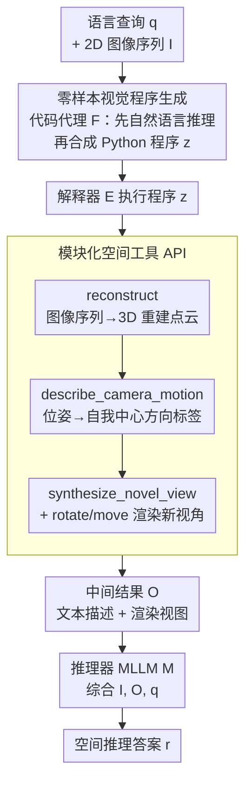

# pySpatial: Generating 3D Visual Programs for Zero-Shot Spatial Reasoning

**会议**: ICLR 2026  
**arXiv**: [2603.00905](https://arxiv.org/abs/2603.00905)  
**代码**: [项目页面](https://pySpatial.github.io)  
**领域**: 3D视觉  
**关键词**: 视觉编程, 3D重建, 空间推理, 零样本, 机器人导航

## 一句话总结

pySpatial 是一个视觉编程框架，让 MLLM 通过生成 Python 代码自动调用 3D 空间工具（3D 重建、相机位姿恢复、新视角渲染等），将有限的 2D 图像输入转化为可交互探索的 3D 场景，实现零样本、即插即用的显式 3D 空间推理，在 MindCube 基准上以 58.56% 的整体准确率超越 GPT-4.1-mini 12.94%、超越 VLM-3R 16.5%，并成功驱动真实四足机器人完成室内导航。

## 研究背景与动机

**领域现状**：MLLM（GPT-4o、Claude 等）在图像描述、视频理解等任务上表现卓越，但在 3D 空间推理方面仍然非常薄弱。最新研究显示，MLLM 在多视角空间推理任务（如"从视角 1 到视角 2 需要怎么移动？"）上的表现仅略高于随机猜测。

**现有痛点**：

1. **训练数据瓶颈**：MLLM 在海量图文对上预训练，但显式 3D 空间监督数据极度稀缺且标注成本高，导致模型难以建立语言与 3D 空间结构的可靠对应
2. **隐式推理不可靠**：现有方法（如认知地图、思维链）依赖 MLLM 的"隐式想象"来构建空间模型，效果有限且不可控
3. **单视角局限**：SpatialVLM、SpatialRGPT 等方法仅处理单视角空间理解，无法应对多视角推理
4. **需要微调**：特化空间模型（如 VLM-3R）需要在合成数据上微调，不具备即插即用的灵活性

**核心矛盾**：MLLM 缺乏对 3D 世界的显式几何理解，仅靠隐式推理无法可靠解决空间问题。

**本文方案**：不让 MLLM 隐式想象 3D ，而是通过视觉编程范式让 MLLM 生成 Python 代码调用 3D 工具，显式构建、探索和推理 3D 场景——将"想象"转化为"计算"。

## 方法详解

### 整体框架

pySpatial 不让 MLLM 在脑中隐式想象 3D，而是把空间推理外包成一段可执行的 Python 程序。给定语言查询 $q$ 和一组 2D 图像 $\mathcal{I}$，代码代理 $\mathcal{F}$ 先把查询翻译成调用 pySpatial API 的程序 $z = \mathcal{F}(q)$；解释器 $\mathcal{E}$ 执行这段程序、调用底层 3D 工具（重建、位姿描述、新视角渲染）产出文本与渲染视图等中间结果 $O = \mathcal{E}(z, \mathcal{I})$；最后推理器 MLLM $\mathcal{M}$ 综合原始图像、程序输出与查询给出答案 $r = \mathcal{M}(\mathcal{I}, O, q)$。整个链路把"想象"替换成"计算"，且不更新任何权重——代码代理、3D 工具和推理器都是可替换的现成模块。

### 关键设计

**1. 零样本视觉程序生成：用 in-context learning 绕过稀缺的 3D 监督数据**

3D 空间监督数据稀缺且标注昂贵，是 MLLM 空间推理薄弱的根因，pySpatial 的应对是彻底不训练。代码代理 $\mathcal{F}$ 只靠接口文档和少量查询-代码示例（in-context learning）即可把查询 $q$ 写成程序 $z$，全程不接触模型权重、文件 I/O 或渲染后端等内部实现。生成时采用结构化输出——先用自然语言推理一遍再合成 Python 代码，这样产出的程序本身就是一份可读、可检查、可调试甚至可手动修改的显式推理记录，相比隐式想象既可控又可审计。

**2. 模块化空间工具 API：把复杂 3D 操作封装成 MLLM 能写的高层语义函数**

MLLM 不擅长直接操作几何，但擅长写代码，所以 pySpatial 把底层重建、位姿运算和渲染统统封装成一套简洁的高层 API，代理只需像调函数一样组合它们，由解释器 $\mathcal{E}$ 实际执行。这套 API 涵盖三类核心能力：`reconstruct(scene)` 从图像序列做 3D 重建，`describe_camera_motion(recon)` 把相机位姿翻成自然语言，`synthesize_novel_view(recon, pose)` 从任意视角渲染新图；此外还有一组以自我中心控制相机的便捷指令——`rotate_right/left(ext, angle)`（默认旋转 45°）、`move_forward/backward(ext, dist)`（默认平移 0.3）、`turn_around(ext)`（180° 转向）。重建工具按任务切换：真实导航用度量尺度的 CUT3R，基准评测用归一化空间的 VGGT，二者都通过反投影把像素抬升到世界坐标 $\mathbf{X}_i = \mathbf{G}_n^{-1} \pi^{-1}(\mathbf{p}_i, D_n(\mathbf{p}_i), K^{-1})$。相机运动描述把位姿矩阵离散成八个自我中心方向标签（前进、后退、左转等），其依据是世界位移在首帧相机系下的偏航角 $\theta = \text{atan2}(d_x, d_z) \cdot 180/\pi$。新视角合成则基于重建点云 $\mathcal{P}$ 与目标位姿做光栅化渲染，当代理发出 `rotate_left`、`turn_around` 这类高层指令时，框架自动把它转成偏航旋转再渲染，使代理无需触碰任何渲染细节。

**3. 即插即用的框架设计：组件全部可替换，不绑定特定模型或重建器**

为了真正做到零成本接入，pySpatial 的每一层都被设计成可替换。代码代理和最终推理器都能换成任意开源或闭源 MLLM（GPT-4o、GPT-4.1-mini、Claude 等皆可），3D 重建模块也可在 CUT3R / VGGT / DUSt3R 间自由切换，整个系统在单张 NVIDIA A6000 Ada GPU 上即可跑完所有实验，无需特化硬件或微调流程。

## 实验结果

### 主实验：MindCube 全集（21K+ 问题）

| 方法 | 类型 | 整体 | Rotation | Among | Around |
|------|------|:---:|:---:|:---:|:---:|
| Random (chance) | - | 32.35 | 36.36 | 32.29 | 30.66 |
| LLaVA-OneVision-7B | 开源 MLLM | 47.43 | 36.45 | 48.42 | 44.09 |
| DeepSeek-VL2-Small | 开源 MLLM | 47.62 | 37.00 | 50.38 | 26.91 |
| GPT-4o | 商用 MLLM | 38.81 | 32.65 | 40.17 | 29.16 |
| GPT-4.1-mini | 商用 MLLM | 45.62 | 37.84 | 47.22 | 34.56 |
| Claude-4-Sonnet | 商用 MLLM | 44.75 | 48.42 | 44.21 | 47.62 |
| VLM-3R | 特化空间模型 | 42.09 | 36.73 | 44.22 | 24.45 |
| **pySpatial (Ours)** | 视觉编程 | **58.56** | **43.20** | **60.54** | **48.10** |

pySpatial 以 58.56% 的整体准确率全面碾压所有基线：比最强开源 MLLM（DeepSeek-VL2-Small）高 10.94%，比 GPT-4.1-mini 高 12.94%，比微调过的 VLM-3R 高 16.47%。在最具挑战性的 Among 类别（推理中心物体与所有周围物体的关系）上达到 60.54%，其他方法均未超过 50%。

### MindCube-1k 子集对比

| 方法 | 整体 | Rotation | Among | Around |
|------|:---:|:---:|:---:|:---:|
| GPT-4o | 42.29 | 35.00 | 43.00 | 46.40 |
| Chain-of-Thought | 40.48 | 32.00 | 36.00 | 58.00 |
| Cognitive Map | 41.43 | 37.00 | 41.67 | 44.40 |
| ViperGPT | 36.95 | 20.50 | 41.00 | 40.40 |
| VADAR | 40.76 | 33.50 | 40.67 | 46.80 |
| VADAR + 3D重建 | 35.62 | 31.00 | 36.83 | 36.40 |
| **pySpatial** | **62.35±1.18** | **41.83±2.34** | **64.89±2.60** | **72.67±3.30** |

pySpatial 以约 20% 的优势超越所有心理模型方法和视觉编程基线。值得注意的是，给 VADAR 加上 3D 重建模块后性能反而下降（40.76→35.62），说明不是有了 3D 信息就能推理——需要合理的 API 设计才能有效利用 3D 几何。

### Omni3D-Bench 单视角泛化

| 方法 | numeric(ct) | numeric(other) | y/n | multi-choice | Total |
|------|:---:|:---:|:---:|:---:|:---:|
| GPT-4o | 28.1 | 35.5 | 66.7 | 57.2 | 42.9 |
| VADAR | - | - | - | - | 41.5 |
| ViperGPT | - | - | - | - | 27.8 |
| **pySpatial** | - | - | - | - | **45.3** |

即使在单视角设置下，pySpatial 仍然超越 GPT-4o 和所有视觉编程方法，验证了框架跨设置的泛化能力。

## 论文评价

### 优点

1. **范式创新**：将"隐式想象"转化为"显式计算"的思路极为清晰，通过视觉编程桥接 MLLM 与 3D 世界
2. **零样本即 SOTA**：无需任何训练即在多个基准上大幅超越微调过的特化模型，展现了强大的泛化能力
3. **可解释性强**：生成的 Python 程序本身就是推理过程的精确记录，便于调试和审计
4. **实际应用验证**：四足机器人室内导航实验展示了从学术benchmark到真实世界的可行性

### 不足

1. 依赖 GPT-4o 作为代码代理，API 调用成本高且受限于商用模型的可用性
2. 3D 重建质量直接影响下游推理，在纹理贫乏或重复纹理场景下可能失效
3. 渲染新视角基于点云光栅化，遮挡区域会出现空洞，影响 MLLM 的后续推理

### 评分

⭐⭐⭐⭐ — 视觉编程范式在 3D 空间推理中的优雅应用，方法简洁有效，零样本性能令人印象深刻，为 MLLM 的具身智能落地提供了实用路径。

<!-- RELATED:START -->

## 相关论文

- [\[CVPR 2026\] LaS-Comp: Zero-shot 3D Completion with Latent-Spatial Consistency](../../CVPR2026/3d_vision/las-comp_zero-shot_3d_completion_with_latent-spatial_consistency.md)
- [\[CVPR 2026\] Context-Nav: Context-Driven Exploration and Viewpoint-Aware 3D Spatial Reasoning for Instance Navigation](../../CVPR2026/3d_vision/context-nav_context-driven_exploration_and_viewpoint-aware_3d_spatial_reasoning_.md)
- [\[CVPR 2025\] SeeGround: See and Ground for Zero-Shot Open-Vocabulary 3D Visual Grounding](../../CVPR2025/3d_vision/seeground_see_and_ground_for_zero-shot_open-vocabulary_3d_visual_grounding.md)
- [\[CVPR 2026\] Masking Matters: Unlocking the Spatial Reasoning Capabilities of LLMs for 3D Scene-Language Understanding](../../CVPR2026/3d_vision/masking_matters_unlocking_the_spatial_reasoning_capabilities_of_llms_for_3d_scen.md)
- [\[ICLR 2026\] Quantized Visual Geometry Grounded Transformer](quantized_visual_geometry_grounded_transformer.md)

<!-- RELATED:END -->
