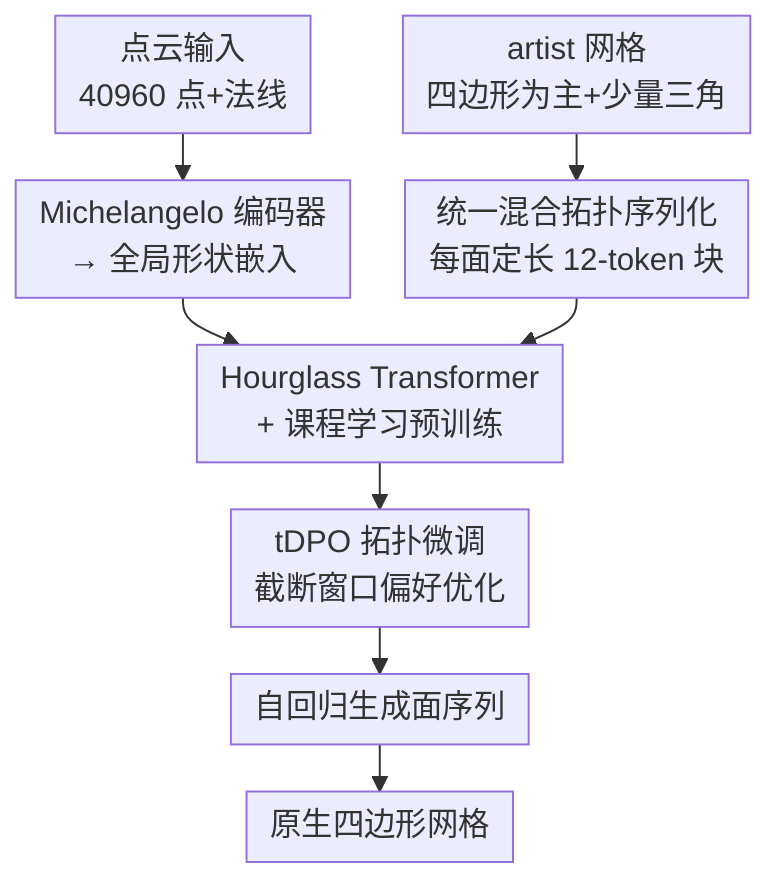

# QuadGPT: Native Quadrilateral Mesh Generation with Autoregressive Models

**会议**: ICLR 2026  
**arXiv**: [2509.21420](https://arxiv.org/abs/2509.21420)  
**代码**: 无（计划公开 API）  
**领域**: 3D生成 / 网格生成  
**关键词**: quad mesh generation, autoregressive model, mixed topology, tDPO, Hourglass Transformer

## 一句话总结

提出 QuadGPT——首个端到端自回归生成原生四边形网格的框架，通过统一的混合拓扑tokenization（三角形面 padding 为4顶点块）、Hourglass Transformer 架构、以及基于拓扑奖励的截断 DPO (tDPO) 微调，在 Chamfer Distance、Hausdorff Distance、四边形比例和用户偏好上全面超越现有的三角形→四边形转换流水线和十字场引导方法。

## 研究背景与动机

**领域现状**：四边形 (quad) 网格是游戏和影视行业的标准——确保建模效率、细分曲面平滑、变形稳定和 UV 展开便捷。现有 3D 生成方法要么通过隐式表达 + 等值面提取（如 Marching Cubes）得到密集无结构三角形网格，要么通过十字场引导 (cross-field) 方法对已有网格做四边形化，但后者需要干净输入且不够鲁棒。

**现有痛点**：自回归网格生成方法（MeshAnything、BPT、DeepMesh、Mesh-RFT）已展示出生成具有 artist-like 拓扑的三角形网格的能力，但它们只能生成三角形。将三角形输出转换为四边形仍需依赖启发式合并算法（如三角形对合并），这种后处理往往破坏自然边流 (edge flow) 并引入拓扑伪影。即使高质量的三角形网格也很难翻译成生产可用的四边形布局。

**核心矛盾**：生成式方法能学会 artist-like 拓扑但被限制在三角形上，后处理方法能产出四边形但无法保证全局拓扑质量——问题在于四边形网格的生成与后处理被人为解耦。

**切入角度**：如果自回归模型能直接预测四边形面序列，就可以端到端地学习四边形拓扑的全局结构（边环、边密度分布），而不需要通过三角形中间步骤。关键挑战是：(1) 如何表示混合拓扑（真实 artist 网格通常是 quad-dominant + 少量三角形）；(2) 如何优化全局拓扑质量（cross-entropy loss 只优化局部 token 预测）。

**核心 idea**：用统一的面块表示 + 拓扑感知的 RL 微调实现首个原生四边形网格自回归生成。

## 方法详解

### 整体框架

QuadGPT 想解决的是"生成式方法只会出三角形、四边形得靠后处理"这个割裂：让自回归模型**直接**吐出四边形主导的面序列，端到端学到边环、边密度这些全局拓扑结构。整条 pipeline 围绕三个核心支柱（serialization / pretraining / tDPO）展开。训练侧，先把 artist 网格（四边形为主、夹少量三角形）用统一序列化压成定长 token 序列，喂给 Hourglass Transformer 做条件预训练（点云经 Michelangelo 编码器转成全局形状嵌入、用 cross-attention 注入），再用截断 DPO（tDPO）做 RL 微调把全局拓扑质量逼上去。推理侧，输入点云 ($N_p = 40960$ 点 + 法线) 条件下自回归逐 token 生成面序列，再解码回原生四边形网格；上下文窗口 36,864 token，用 top-k=10、top-p=0.95、$T=0.5$ 采样，单 A100 约 230 tokens/s。

### 关键设计

**1. 统一混合拓扑序列化：用固定长度面块吃下 quad 和三角形的混搭**

真实 artist 网格几乎都是 quad-dominant 加少量三角形，自回归模型必须能同时表示两种面，否则只能退回纯三角形。QuadGPT 的做法是把每个面——不管三角形还是四边形——都序列化成长度恒为 12 的 token 块。四边形面直接展平 4 个顶点的 3D 坐标（$4 \times 3 = 12$ tokens）；三角形面则在块首补 3 个 padding token $\tau_{\text{pad}}$（整数值 1024），再接 3 个顶点坐标（$3 + 3 \times 3 = 12$ tokens），凑齐同样的 12 长度。顶点坐标先归一化到 $[-0.95, 0.95]^3$、以 1024 级（10 bit）精度量化，所有顶点再按 $(z, x, y)$ 字典序排列，保证序列表示的确定性。

这样面类型完全由 padding token 是否出现来隐式编码，既不需要显式的类型 token、也不需要为两种面拉两条编码路径，模型直接从 padding 模式里学会"这是个三角形还是四边形"。固定长度块还让 tokenization 高度可并行、模型架构更规整，比分支编码简洁得多。

**2. Hourglass Transformer + 课程学习预训练：先压长序列，再从三角形退火到四边形**

高精度网格的 token 数可达数万，普通 Transformer 直接吃全长序列代价过高，因此架构采用多层级沙漏（Hourglass）结构。初始 token 嵌入 $\mathbf{E}^{(0)} \in \mathbb{R}^{L \times D_0}$ 先过一组 Transformer Block，然后经因果保持的缩短层按因子 3 压到 $\mathbb{R}^{(L/3) \times D_1}$、再按因子 4 压到 $\mathbb{R}^{(L/12) \times D_2}$，在瓶颈层用很低的代价捕获全局上下文，最后上采样回原始长度。整个模型为 1.1B 参数、24 层 Transformer，点云经预训练的 Michelangelo 编码器转成全局形状嵌入，通过 cross-attention 注入解码器。

训练上不直接硬学四边形——预测一个四边形面其实相当于同时预测两个相关的三角形，从零训练很不稳定。于是先用纯三角形网格预训练的权重初始化，再用一个 quad-dominance 参数 $r \in [0, 1]$ 逐步退火训练数据分布：从纯三角形（$r=0$）平滑过渡到 quad-dominant（$r \to 1$）。模型因此先掌握基础几何语法，再学更复杂的四边形拓扑规则，沙漏的分层压缩则保证这一切在长序列上仍算得动。预训练数据来自大规模策划的 130 万高质量四边形模型（ShapeNetV2、3D-FUTURE、Objaverse、Objaverse-XL 加专业授权资产，经自动三角→四边形转换和多阶段质量筛选），为退火课程提供了从简单到复杂的充足语料。

**3. 截断 DPO（tDPO）拓扑微调：在局部窗口上做偏好优化，逼出全局边流**

边环是否连贯、是否出现断裂这类拓扑质量，是整张网格涌现出来的全局属性，而 cross-entropy loss 只优化逐 token 的局部预测，管不到它。tDPO 为此设计了一个拓扑评分标准，主要奖励长连续边环的形成（$L_{\text{avg}}$）、惩罚生成断裂（$R_{\text{frac}}$）：从当前策略 $\pi_\theta$ 采样候选网格，按拓扑奖励排序构建偏好对 $(y_w, y_l)$，要求 $L_{\text{avg}}(y_w) > L_{\text{avg}}(y_l)$ 且 $R_{\text{frac}}(y_w) < R_{\text{frac}}(y_l)$。

关键在"截断"二字：完整网格序列太长，没法整条做 DPO，于是在随机起始位置 $m$ 上截一段长度 $\tau = 36864$ 的窗口做优化，损失为

$$\mathcal{L}_{\text{tDPO}}(\theta) = -\mathbb{E}_{\mathcal{D}}\mathbb{E}_m\left[\log\sigma\left(\beta\left[\log\frac{\pi_\theta(y_{w,m:m+\tau}|x)}{\pi_{\text{ref}}(y_{w,m:m+\tau}|x)} - \log\frac{\pi_\theta(y_{l,m:m+\tau}|x)}{\pi_{\text{ref}}(y_{l,m:m+\tau}|x)}\right]\right)\right]$$

在局部窗口上做最优决策，换来的是全局更连贯的拓扑——这也让 DPO 第一次能扩展到高面数网格。偏好数据基于 500 个来自 Hunyuan3D 2.5 的高质量密集网格构建出约 2000 个偏好对，RL 微调在 64 张 A100 上仅需 4 小时。

## 实验关键数据

### 主实验

| 方法 | Dense CD ↓ | Dense HD ↓ | Dense QR ↑ | Dense US ↑ | Artist CD ↓ | Artist HD ↓ | Artist QR ↑ | Artist US ↑ |
|------|-----------|-----------|-----------|-----------|------------|------------|------------|------------|
| QuadriFlow | 0.045 | 0.099 | 100% | 1.6 | 0.281 | 0.531 | 100% | 0.3 |
| MeshAnythingV2 | 0.153 | 0.394 | 53% | 1.4 | 0.096 | 0.251 | 60% | 2.1 |
| BPT | 0.115 | 0.283 | 43% | 2.7 | 0.051 | 0.125 | 49% | 3.1 |
| DeepMesh | 0.246 | 0.435 | 64% | 3.3 | 0.236 | 0.417 | 66% | 2.8 |
| FastMesh | 0.105 | 0.257 | 3% | 1.1 | 0.052 | 0.141 | 17% | 1.9 |
| **QuadGPT** | **0.057** | **0.147** | **80%** | **4.9** | **0.043** | **0.095** | **78%** | **4.8** |

QuadGPT 在所有指标上全面领先：CD 在 Dense 网格上比最佳基线低 46%+，用户研究评分 (US) 压倒性领先（4.9 vs 3.3），QR 达到 80%（仅 QuadriFlow 的 100% 更高但其几何质量差得多且经常失败）。

### 消融实验

| 训练策略 | CD ↓ | HD ↓ | QR ↑ | US ↑ |
|---------|------|------|------|------|
| From Scratch | 0.081 | 0.203 | 75% | 0.6 |
| Finetune (课程学习) | 0.065 | 0.167 | 72% | 1.3 |
| DPO (全序列) | 0.073 | 0.188 | 74% | 1.1 |
| tDPO (截断) | 0.061 | 0.156 | 78% | 3.3 |
| **tDPO-Pro (完整奖励)** | **0.057** | **0.147** | **80%** | **3.7** |

| 对比设置 | CD ↓ | HD ↓ | QR ↑ | US ↑ |
|---------|------|------|------|------|
| TriGPT (三角形→四边形转换) | 0.062 | 0.160 | 70% | 0.2 |
| TriGPT+RL (同上+RL微调) | 0.051 | 0.138 | 72% | 0.5 |
| **QuadGPT (原生四边形)** | **0.057** | **0.147** | **80%** | **1.3** |

### 关键发现

- **课程学习是稳定训练的关键**：直接从零训练四边形生成 (From Scratch) 收敛困难，CD 高达 0.081，课程学习初始化 (Finetune) 将其降至 0.065。预测四边形面相当于预测两个相关三角形，需要先在简单任务上建立基础。
- **标准 DPO 无法泛化到复杂网格**：全序列 DPO 在低面数网格上微调，但无法泛化到复杂高面数网格（CD 反而从 0.065 上升到 0.073）。tDPO 通过截断训练解决了这一问题。
- **原生生成 vs 转换的决定性差距**：在完全控制变量的对比中（TriGPT 与 QuadGPT 共享架构、数据和 RL 策略），TriGPT+RL 虽然 CD/HD 略好，但 QR (72% vs 80%) 和用户偏好 (0.5 vs 1.3) 差距巨大——后处理转换无法恢复自然边流。

## 亮点与洞察

- **Padding 策略的极简优雅**：用3个 padding token 将三角形统一为四边形的12-token块——无需类型 token、无需分支编码路径，模型从 padding 模式隐式学习面类型。这种设计最大化了序列的规整性和并行性。
- **课程学习的合理性**：四边形面在拓扑上等价于两个相关的三角形，所以先学三角形再学四边形是符合认知梯度的自然课程——简单到复杂的训练策略在网格生成中首次被系统验证。
- **tDPO 的可扩展性设计**：将 DPO 扩展到长序列生成的截断策略值得其他长序列 RL 任务参考（如长文本生成、音乐生成等）。

## 局限与展望

- **QR 未达 100%**：80% 的四边形比例意味着仍有 20% 的三角形混入，距离纯四边形网格有差距。
- **数据依赖性强**：130 万高质量四边形网格的策划成本高，且论文承认数据质量对性能至关重要——这使得复现困难。
- **仅支持点云输入**：未展示从文本/图像到四边形网格的完整管线，需依赖外部模型（如 Hunyuan3D）先生成点云。
- **推理速度有限**：230 tokens/s 对于 36864 token 的上下文意味着约 2.7 分钟/个网格，生产环境可能需要进一步加速。

## 相关工作与启发

- **vs MeshAnything/BPT/DeepMesh**: 这些方法生成高质量三角形网格但需后处理转换为四边形，转换过程破坏边流结构。QuadGPT 的端到端方法从根本上避免了这一问题。
- **vs QuadriFlow**: 十字场引导方法在理想输入上能生成完美四边形网格 (QR=100%)，但对复杂拓扑或尖锐特征极不鲁棒——经常生成失败。QuadGPT 大幅胜出鲁棒性和用户偏好。
- **vs Mesh-RFT (RL for meshes)**: Mesh-RFT 将 RL 应用于三角形网格生成，QuadGPT 的 tDPO 将类似思路扩展到四边形的拓扑质量优化，截断策略是关键贡献。

## 评分

- 新颖性: ⭐⭐⭐⭐⭐ 首个原生四边形网格自回归生成框架，统一序列化和 tDPO 均为创新性贡献
- 实验充分度: ⭐⭐⭐⭐⭐ 消融全面（课程学习/DPO变体/原生vs转换），基线丰富，含用户研究
- 写作质量: ⭐⭐⭐⭐ 结构清晰，方法描述详尽，图示直观
- 价值: ⭐⭐⭐⭐⭐ 填补了原生四边形网格生成的空白，对游戏/影视工业有直接应用价值

<!-- RELATED:START -->

## 相关论文

- [\[CVPR 2026\] PixARMesh: Autoregressive Mesh-Native Single-View Scene Reconstruction](../../CVPR2026/3d_vision/pixarmesh_autoregressive_mesh-native_single-view_scene_reconstruction.md)
- [\[ICLR 2026\] AssetFormer: Modular 3D Assets Generation with Autoregressive Transformer](assetformer_modular_3d_assets_generation_with_autoregressive_transformer.md)
- [\[AAAI 2026\] Learning Conjugate Direction Fields for Planar Quadrilateral Mesh Generation](../../AAAI2026/3d_vision/learning_conjugate_direction_fields_for_planar_quadrilateral_mesh_generation.md)
- [\[CVPR 2025\] TreeMeshGPT: Artistic Mesh Generation with Autoregressive Tree Sequencing](../../CVPR2025/3d_vision/treemeshgpt_artistic_mesh_generation_with_autoregressive_tree_sequencing.md)
- [\[CVPR 2026\] Mesh-Pro: Asynchronous Advantage-guided Ranking Preference Optimization for Artist-style Quadrilateral Mesh Generation](../../CVPR2026/3d_vision/mesh-pro_asynchronous_advantage-guided_ranking_preference_optimization_for_artis.md)

<!-- RELATED:END -->
