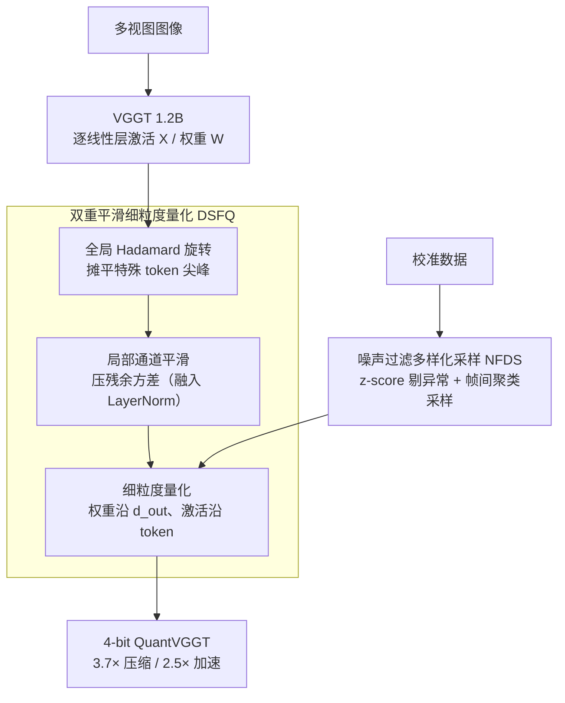

# Quantized Visual Geometry Grounded Transformer

**会议**: ICLR 2026  
**arXiv**: [2509.21302](https://arxiv.org/abs/2509.21302)  
**代码**: [https://github.com/wlfeng0509/QuantVGGT](https://github.com/wlfeng0509/QuantVGGT)  
**领域**: 3D 视觉 / 模型压缩  
**关键词**: VGGT, post-training quantization, 3D reconstruction, Hadamard rotation, calibration

## 一句话总结
针对十亿级 3D 重建模型 VGGT 的部署需求，提出首个专用 PTQ 框架 QuantVGGT，通过双重平滑细粒度量化（Hadamard 旋转 + 通道平滑）解决特殊 token 导致的重尾分布，以及噪声过滤多样化采样解决校准不稳定问题，4-bit 量化实现 3.7× 内存压缩和 2.5× 加速，保持 98%+ 精度。

## 研究背景与动机

**领域现状**：VGGT 是 1.2B 参数的统一 3D 重建模型，单次前向即完成深度估计、点图回归、相机位姿预测和点跟踪。性能卓越但计算/内存开销巨大，限制了实际部署。

**现有痛点**：PTQ 在 LLM 和 2D 视觉模型上成熟，但对 VGGT 存在两个独特挑战：(1) 数据无关的特殊 token（camera/register token）导致极端重尾激活分布；(2) 3D 多视图数据的语义复杂性使校准样本选择高度不稳定。

**核心矛盾**：特殊 token 是 VGGT 多任务推理的关键设计，但其与常规图像 token 的分布差异导致量化时大量 bit 被浪费在极端值上。

**本文目标**：设计 VGGT 专用的 PTQ 方案，在低 bit 量化下保持重建精度。

**切入角度**：从分布分析入手，发现特殊 token 是重尾根源，多视图帧间关系是校准的关键结构。

**核心 idea**：全局 Hadamard 旋转分散特殊 token 的尖峰 + 局部通道平滑降低旋转后残余方差，配合帧感知多样化采样构建稳健校准集。

## 方法详解

### 整体框架
QuantVGGT 要解决的是：把 1.2B 参数的 VGGT 量化到 4-bit 而几乎不掉精度，难点在于 camera/register 这些特殊 token 制造的重尾激活，以及多视图校准样本难选。它用两个组件分头处理这两件事。前一个是 **DSFQ**（Dual-Smoothed Fine-Grained Quantization）：激活进来先做一次全局 Hadamard 旋转把尖峰摊平，再在旋转后的空间里做一次局部通道缩放压掉残余方差，最后配上细粒度的量化粒度，三步串成一条平滑链路。后一个是 **NFDS**（Noise-Filtered Diverse Sampling）：在喂校准数据之前，先用深层激活统计把异常样本过滤掉，再按 VGGT 的帧间相关性聚类、均匀采样，凑出一个既干净又多样的校准集。NFDS 选出的校准集喂给 DSFQ，用来估计每层的量化参数，两者协同完成 4-bit 量化。

### 关键设计

**1. Pre-Global Rotation（全局 Hadamard 旋转）：把少数 channel 的极端值摊到所有 channel**

特殊 token 的激活幅度比普通 patch token 大一个数量级，少数 channel 顶着尖峰，量化时大量 bit 被这些极端值占走。这里对激活 $\mathbf{X}$ 和权重 $\mathbf{W}$ 同时左乘一个随机 Hadamard 矩阵 $\mathbf{H}$，借矩阵乘法的等价性 $\mathbf{XW}^\top = (\mathbf{XH})(\mathbf{WH})^\top$ 保持输出不变，而旋转把集中在少数维度的能量均匀打散到所有 channel——本质是借中心极限效应，把重尾分布拉回近似高斯，量化范围不再被孤立尖峰绑架。

**2. Post-Local Smooth（局部通道平滑）：旋转之后再压掉残余的通道间方差**

旋转只摊平了全局尖峰，通道之间的局部幅度差异还在。于是在旋转后的空间里逐通道算一个缩放因子 $\hat{c}_i = \frac{\max(|\mathbf{X}_i\mathbf{H}|)^\alpha}{\max(|\mathbf{W}_i\mathbf{H}|)^{1-\alpha}}$（取 $\alpha=0.5$），把激活和权重的难度对半分摊。顺序很关键：先旋转再缩放比先缩放再旋转稳定得多，因为后者的缩放收益会在随后的旋转里被打乱。而且这个缩放因子可以融进前面的 LayerNorm，运行时零额外开销。

**3. Fine-Grained Quantization Granularity：把量化粒度切细，从源头降低量化难度**

权重沿 $d_{out}$ 维度量化、激活沿 token 维度量化——之所以能这样切，是因为矩阵乘法的内积求和只发生在 $d_{in}$ 上，沿这两个维度分组不会破坏求和结构。μ-coherent 理论说明，量化粒度越细，每组内部的动态范围越小、量化越容易，配合前两步的平滑能进一步压低误差。

**4. Noise-Filtered Diverse Sampling（NFDS）：在干净与多样之间凑出稳健校准集**

3D 多视图数据语义复杂，随机选的校准样本会让低 bit 量化的精度大幅抖动。NFDS 分两步：先做噪声过滤——从深层激活统计给每个样本算一个 noise score（激活均值和方差的标准分 z-score 取 L2 范数），分数高的当异常样本剔除；再做多样化采样——利用 VGGT 的帧间归纳偏置，用「第一帧 vs 后续帧」的归一化相似度向量 $c_t^i$ 做 K-means 聚类，从各簇均匀取样。这样既滤掉了拖累校准的离群点，又覆盖了数据空间的各个子域。理论上由 Theorem 3.2 撑腰：校准集应在数据空间的各子域按尺度比例采样，而帧间关系恰好是刻画 VGGT 子域结构最对路的轴，比直接用语义标签聚类更管用。

## 实验关键数据

### 主实验（Camera Pose Estimation on CO3Dv2）

| 配置 | W/A bit | 精度保持 | 内存压缩 | 加速 |
|------|---------|---------|---------|------|
| Full FP16 | 16/16 | 100% | 1× | 1× |
| W8A8 QuantVGGT | 8/8 | ~99% | 2× | 1.5× |
| W4A4 QuantVGGT | 4/4 | ~98% | 3.7× | 2.5× |
| W4A4 SmoothQuant | 4/4 | ~85% | 3.7× | 2.5× |
| W4A4 QuaRot | 4/4 | ~90% | 3.7× | 2.5× |

### 消融实验

| 组件 | 精度变化 | 说明 |
|------|---------|------|
| 仅 Hadamard 旋转 | +5% vs naive | 分散尖峰 |
| + 通道平滑 | +3% | 降低残余方差 |
| + 细粒度量化 | +2% | 更精细的量化粒度 |
| + NFDS | +2% | 稳健校准 |
| Full QuantVGGT | 98% FP | 所有组件协同 |

### 关键发现
- **特殊 token 是量化的最大障碍**：前 5 个 token（camera+register）的激活幅度比普通 patch token 大 10 倍以上
- **旋转→平滑的顺序很重要**：先平滑再旋转会破坏平滑的收益；先旋转使分布更均匀后再平滑更稳定
- **帧感知聚类优于标签聚类**：t-SNE 可视化显示 3D 场景的语义标签无法有效区分校准子域，但帧间关系可以
- **4-bit 量化在硬件上可行**：实测 RTX 4090 上 2.5× 推理加速

## 亮点与洞察
- **首个十亿级 3D 模型量化工作**：填补了量化在 3D 重建领域的空白
- **双重平滑的"先全局后局部"设计**：简洁优雅地分两步解决重尾问题，且无额外运行时开销（缩放因子可融入 LayerNorm）
- **NFDS 的帧感知校准**：利用了 VGGT "第一帧 vs 后续帧"的独特归纳偏置，体现了"理解模型才能更好压缩"的理念
- **Theorem 3.2 的理论贡献**：给出了校准集构建的形式化指导原则

## 局限与展望
- 仅针对 VGGT 一个模型，未验证对 DUSt3R/MASt3R 等其他 3D 模型的适用性
- 4-bit 下精度仍有 2% 损失，对高精度需求场景可能不够
- NFDS 的噪声阈值和聚类数需要调参
- 未探索 INT2/INT3 等极低比特量化

## 相关工作与启发
- **vs SmoothQuant**: 仅做全局平滑，没有考虑 VGGT 特殊 token 的影响
- **vs QuaRot**: 仅做 Hadamard 旋转，没有后续的局部通道平滑
- 对其他包含特殊 token 的大模型（如 VLM 中的 [CLS]）的量化也有启发

## 评分
- 新颖性: ⭐⭐⭐⭐ 组件不算全新（Hadamard、SmoothQuant），但针对 VGGT 的组合和分析有新意
- 实验充分度: ⭐⭐⭐⭐ 多基准多 bit-width 评估，消融完整
- 写作质量: ⭐⭐⭐⭐ 动机分析深入，可视化清晰
- 价值: ⭐⭐⭐⭐ 首个 3D 大模型量化工作，实用意义强

<!-- RELATED:START -->

## 相关论文

- [\[CVPR 2025\] VGGT: Visual Geometry Grounded Transformer](../../CVPR2025/3d_vision/vggt_visual_geometry_grounded_transformer.md)
- [\[CVPR 2026\] OmniVGGT: Omni-Modality Driven Visual Geometry Grounded Transformer](../../CVPR2026/3d_vision/omnivggt_omni-modality_driven_visual_geometry_grounded_transformer.md)
- [\[CVPR 2026\] GGPT: Geometry-Grounded Point Transformer](../../CVPR2026/3d_vision/ggpt_geometry_grounded_point_transformer.md)
- [\[CVPR 2026\] MVGGT: Multimodal Visual Geometry Grounded Transformer for Multiview 3D Referring Expression Segmentation](../../CVPR2026/3d_vision/mvggt_multimodal_visual_geometry_grounded_transformer_for_multiview_3d_referring.md)
- [\[ICLR 2026\] NOVA3R: Non-pixel-aligned Visual Transformer for Amodal 3D Reconstruction](nova3r_non-pixel-aligned_visual_transformer_for_amodal_3d_reconstruction.md)

<!-- RELATED:END -->
