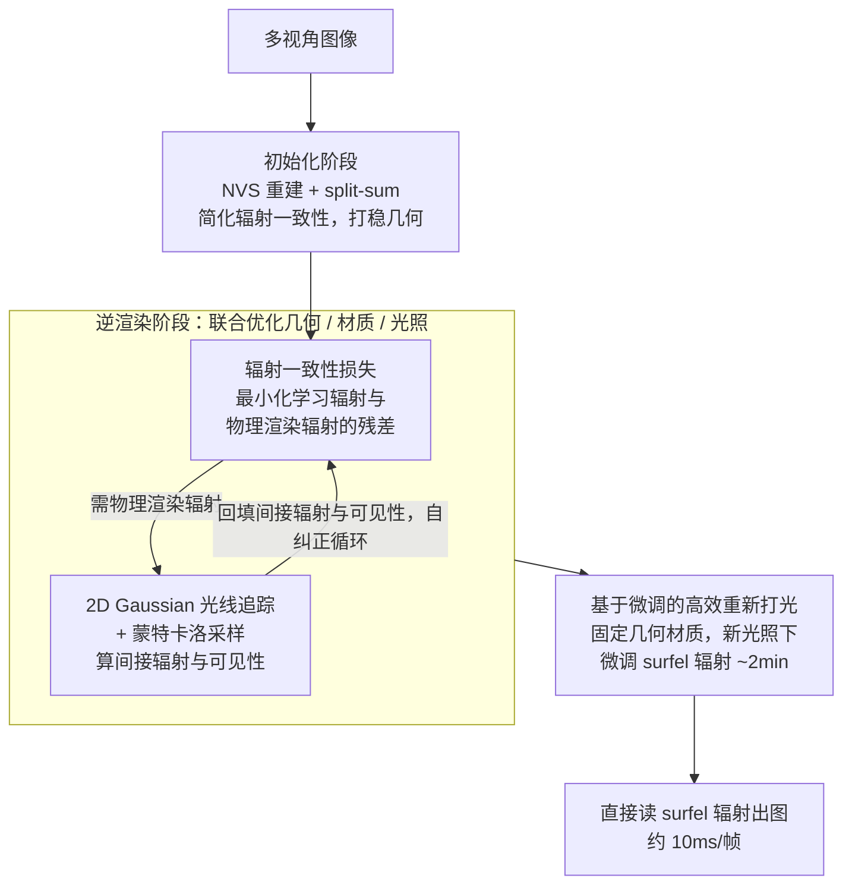

# RadioGS: Radiometrically Consistent Gaussian Surfels for Inverse Rendering

**会议**: ICLR 2026 Oral  
**arXiv**: [2603.01491](https://arxiv.org/abs/2603.01491)  
**代码**: [https://qbhan.github.io/radiogs-page/](https://qbhan.github.io/radiogs-page/)  
**领域**: 3D视觉  
**关键词**: 逆渲染, Gaussian Splatting, 间接照明, 辐射一致性, 光线追踪

## 一句话总结

RadioGS 提出辐射一致性损失——通过最小化每个 Gaussian surfel 的学习辐射与其物理渲染辐射之间的残差，为未观测方向提供基于物理的监督信号，构建自纠正反馈循环，实现了准确的间接照明和材质分解，并支持分钟级重新打光。

## 研究背景与动机

**领域现状**：基于 Gaussian Splatting 的逆渲染发展迅速，能高效地从多视角图像中恢复几何、材质和光照。然而，准确分解全局光照效应（尤其是间接照明和表面间反射）仍是核心挑战。

**现有痛点**：现有方法处理间接照明的方式主要有两种：(1) 将间接辐射作为可学习残差（如 R3DG、GS-IR），无约束优化会导致光照和材质的模糊分解；(2) 从预训练 NVS 的 Gaussian 原语查询间接辐射（如 IRGS、SVG-IR），但预训练只针对训练视角有监督，从未观测方向查询的辐射可能完全错误。

**核心矛盾**：NVS 训练只约束了相机可见方向的 Gaussian 辐射，而间接照明需要查询任意方向（包括表面间反射方向）的辐射。缺乏对未观测方向的监督导致间接辐射不准确，进而导致光照被错误地烘焙到表面材质中。

**本文目标**：提供一种基于物理的约束，使 Gaussian surfel 在未观测方向上也能获得正确的辐射值，从而准确建模间接照明和表面间反射。

**切入角度**：借鉴自训练辐射缓存（self-training radiance cache）的思想——通过迭代最小化渲染方程残差，让 Gaussian 原语的辐射值逐步收敛到物理正确的解。

**核心 idea**：辐射一致性 = 让每个 Gaussian surfel 的学习辐射 $L_\mathbf{G}$ 与其基于渲染方程的物理渲染辐射 $L_\mathbf{G}^{PBR}$ 一致，形成自纠正循环——相机视角的重建监督传播到间接照明项，物理渲染又反过来约束未观测方向的辐射。

## 方法详解

### 整体框架

RadioGS 要解决的是 GS 逆渲染中一个被长期忽视的漏洞：NVS 重建只约束了相机可见方向的 Gaussian 辐射，可间接照明却要查询任意方向（包括表面间反射方向）的辐射，那些未观测方向的辐射没人管，于是光照被错误地烘焙进材质。它的整体思路是给每个 Gaussian surfel 的辐射加一个**物理自洽**约束，让"学到的辐射"和"按渲染方程重新算出来的辐射"对齐，从而把相机视角的准确信号顺着光路传播到未观测方向。

整个流程分两阶段加一次轻量微调。初始化阶段先用 split-sum 近似的简化辐射一致性损失配合 NVS 重建损失预训练 surfels，把几何基础打稳；逆渲染阶段再换上完整的蒙特卡洛辐射一致性损失，叠加材质平滑与光照先验，联合优化几何、材质和光照——其中**辐射一致性损失**和支撑它的 **2D Gaussian 光线追踪 + 蒙特卡洛采样**互相咬合成一个自纠正循环。需要重新打光时，固定几何和材质，只在新光照下微调 surfel 辐射约 2 分钟，之后直接读 surfel 辐射出图（<10ms/帧），不再跑运行时光线追踪。

### 关键设计

**1. 辐射一致性损失：给未观测方向的辐射补上一条物理监督**

问题的根源在于 NVS 只监督了相机能看到的那些方向，间接照明却要查任意方向的辐射，缺监督就会乱。RadioGS 的做法是要求每个 surfel 在位置 $x$、出射方向 $\omega_o$ 上学到的辐射 $L_\mathbf{G}$，必须等于按渲染方程重新积出来的物理辐射

$$L_\mathbf{G}^{PBR}(x,\omega_o) = \int f_r \cdot (V \cdot L_{dir} + L_{ind}) \cdot (\omega_i \cdot n_x)\, d\omega_i,$$

其中可见性 $V$ 和间接辐射 $L_{ind}$ 都通过 2D Gaussian 光线追踪获得。两者之差即残差 $\mathcal{R}_\mathbf{G} = L_\mathbf{G} - L_\mathbf{G}^{PBR}$，损失就是最小化它的 L1 期望 $\mathcal{L}_{rad} = \mathbb{E}_{j,\omega_o}[\|\mathcal{R}_\mathbf{G}\|_1]$。

这条损失之所以能形成自纠正循环，关键在于辐射是顺着光路互相传染的：相机视角的重建损失保证了一部分方向的辐射是准的，这些准确辐射经过光线追踪又会成为其他 surfel 的间接照明 $L_{ind}$，反过来约束那些 surfel 的辐射值。于是物理渲染引导未观测方向、相机约束的辐射经间接项扩散，二者双向反馈，最终收敛到物理一致的解——这正是把自训练辐射缓存的思想搬进逆渲染的结果。

**2. 2D Gaussian 光线追踪与蒙特卡洛采样：让间接辐射既可查又可微**

上面的物理辐射要算积分，就得知道 surfel 之间互相能不能看见、彼此投来多少间接光，而且整条链路必须可微才能反传。RadioGS 直接复用 2D Gaussian ray tracer：发射光线 $\text{Trace}(x, \omega_i; \mathbf{G}) = (L_{trace}, T_{trace})$，把累积辐射 $L_{trace}$ 当作间接辐射 $L_{ind}$，把 $1-T_{trace}$ 当作可见性 $V$。由于它和 Gaussian surfel 共享同一套 ray-splat 交叉计算，集成无缝且天然可微。

积分用蒙特卡洛估计：每步随机抽 $N_g = 4096$ 个 surfel，每个 surfel 在其法线定义的半球上均匀采 $N_s = 64$ 条入射光线，合计 $2^{18}$ 条光线；出射方向上则同时采样随机方向（未观测）和相机方向（已约束）。特意把相机方向也采进来很重要——这保证了那些已被 NVS 约束好的辐射信号，能确实地沿光线追踪传播到被追踪到的 surfel 上，让第一条损失的"传染"链路真正闭合。

**3. 基于微调的高效重新打光：把运行时光追的代价换成一次离线微调**

传统方法换光照时要在渲染的每一帧里实时查询间接辐射，很贵。RadioGS 利用辐射一致性损失把这笔代价前置：给定新光照，只需对 surfel 辐射参数最小化 $\mathcal{L}_{rad}$ 微调几轮（约 2 分钟），让每个 surfel 在新光照下重新"记住"自己正确的辐射。微调一旦完成，任意视角都能直接读 surfel 辐射出图（<10ms/帧），既不必再跑运行时光线追踪，也不用存每个 surfel 的多方向入射辐射，特别适合需要渲染多帧的重新打光场景。

### 损失函数 / 训练策略

初始化阶段：$\mathcal{L}_{init} = \mathcal{L}_{recon} + \mathcal{L}_{recon}^{PBR} + \lambda_{rad}\mathcal{L}_{rad} + \lambda_{dist}\mathcal{L}_{dist} + \lambda_n\mathcal{L}_n + \lambda_{ns}\mathcal{L}_{ns} + \lambda_m\mathcal{L}_m$（split-sum 近似版辐射一致性）。逆渲染阶段：$\mathcal{L}_{inv} = \mathcal{L}_{init} + \lambda_{as}\mathcal{L}_{as} + \lambda_{rs}\mathcal{L}_{rs} + \lambda_{light}\mathcal{L}_{light}$（完整蒙特卡洛辐射一致性 + 材质平滑 + 光照先验）。辐射一致性权重 $\lambda_{rad} = 0.2$（逆渲染），$1.0$（重新打光微调）。总训练时间约 60 分钟（RTX 4090）。

## 实验关键数据

### 主实验

| 方法 | NVS PSNR↑ | Normal MAE↓ | Albedo PSNR↑ | Relight PSNR↑ | 训练时间 |
|------|-----------|-------------|-------------|--------------|---------|
| TensoIR (NeRF) | 35.09 | 4.10 | 29.27 | 28.58 | 4h |
| GS-IR | 35.33 | 4.95 | 29.94 | 24.37 | - |
| IRGS | - | - | - | - | - |
| SVG-IR | - | - | - | - | - |
| **RadioGS** | **最优** | **最优** | **最优** | **最优** | **1h** |

RadioGS 在 TensoIR 数据集上几乎所有指标上超越现有 GS 方法和 NeRF 方法，同时保持计算效率。

### 消融实验

| 配置 | Relight PSNR | 说明 |
|------|-------------|------|
| 完整 RadioGS | 最优 | 全蒙特卡洛辐射一致性 |
| 去除辐射一致性损失 | 显著下降 | 间接照明不准确 |
| 仅 split-sum（无 MC） | 下降 | 近似不足以捕捉复杂反射 |
| 去除初始化阶段辐射一致性 | 下降 | 几何基础不稳定 |
| 微调重新打光 vs RT重新打光 | 略低但渲染极快 | <10ms vs ~100ms |

### 关键发现

- 辐射一致性损失是 RadioGS 优势的核心来源——去除后重新打光质量大幅下降，证明了物理约束对间接照明建模的必要性
- 红色灯泡在黄色乐高表面的反射效果（TensoIR 数据集）展示了 RadioGS 对表面间反射的精准建模能力——其他方法往往将这种间接照明烘焙到 albedo 中
- 微调重新打光策略只需 2 分钟训练就能达到接近光线追踪重新打光的质量，但渲染速度快一个数量级

## 亮点与洞察

- **自纠正反馈循环**的设计理念极具洞察力——NVS 监督和物理约束不是对立的，而是互补的：NVS 约束已观测方向，物理渲染约束未观测方向，两者通过间接照明项连接形成闭环
- **初始化阶段的简化辐射一致性**是一个重要的工程洞见——直接在不稳定几何上用蒙特卡洛采样会导致训练震荡，split-sum 近似提供了平滑的过渡
- **微调重新打光**将运行时光线追踪的成本转化为离线微调成本，非常适合需要渲染多帧的应用场景

## 局限与展望

- 假设材质为电介质（Dielectric），对金属等强镜面材质的效果未验证
- 每步 $2^{18}$ 条光线追踪仍有计算开销，训练时间约 1 小时
- 蒙特卡洛采样在低 surfel 密度区域可能估计不准
- 微调重新打光在光照变化极大时（如从室内到室外）可能需要更多迭代

## 相关工作与启发

- **vs IRGS (Gu et al., 2024)**: IRGS 也用 Gaussian 光线追踪优化间接辐射，但训练信号仍只来自已观测视角图像；RadioGS 通过物理约束为未观测方向提供额外监督
- **vs SVG-IR (Sun et al., 2025)**: SVG-IR 从 NVS 预训练的 Gaussian 点追踪查询间接辐射，但预训练的 Gaussian 在未观测方向无约束；RadioGS 的辐射一致性解决了这一根本问题
- **vs Neural Radiance Cache (Müller et al., 2021)**: 辐射缓存用于前向渲染的全局光照；RadioGS 将这一思想拓展到逆渲染中的 Gaussian 原语

## 评分

- 新颖性: ⭐⭐⭐⭐⭐ 辐射一致性损失的自纠正反馈循环思想新颖且有物理动机
- 实验充分度: ⭐⭐⭐⭐ 合成和真实数据集评测，消融充分
- 写作质量: ⭐⭐⭐⭐⭐ 问题动机、方法推导、实验分析都非常清晰
- 价值: ⭐⭐⭐⭐⭐ 对 GS 逆渲染中间接照明的准确建模有重要推动

<!-- RELATED:START -->

## 相关论文

- [\[CVPR 2026\] SGS-Intrinsic: Semantic-Invariant Gaussian Splatting for Sparse-View Indoor Inverse Rendering](../../CVPR2026/3d_vision/sgs-intrinsic_semantic-invariant_gaussian_splatting_for_sparse-view_indoor_invers.md)
- [\[CVPR 2025\] SVG-IR: Spatially-Varying Gaussian Splatting for Inverse Rendering](../../CVPR2025/3d_vision/svg-ir_spatially-varying_gaussian_splatting_for_inverse_rendering.md)
- [\[ICCV 2025\] GeoSplatting: Towards Geometry Guided Gaussian Splatting for Physically-based Inverse Rendering](../../ICCV2025/3d_vision/geosplatting_towards_geometry_guided_gaussian_splatting_for_physically-based_inv.md)
- [\[CVPR 2026\] MVInverse: Feed-forward Multiview Inverse Rendering in Seconds](../../CVPR2026/3d_vision/mvinverse_feed-forward_multiview_inverse_rendering_in_seconds.md)
- [\[CVPR 2025\] PBR-NeRF: Inverse Rendering with Physics-Based Neural Fields](../../CVPR2025/3d_vision/pbr-nerf_inverse_rendering_with_physics-based_neural_fields.md)

<!-- RELATED:END -->
