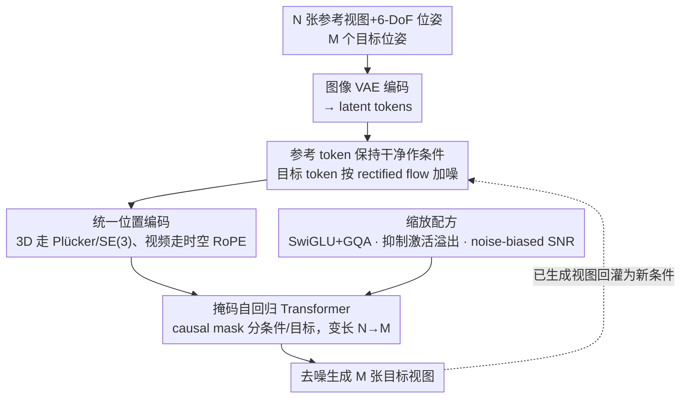

# Scaling Sequence-to-Sequence Generative Neural Rendering

**会议**: ICLR 2026  
**arXiv**: [2510.04236](https://arxiv.org/abs/2510.04236)  
**代码**: [Project Page](https://shikun.io/projects/kaleido)  
**领域**: 3D Vision  
**关键词**: Neural Rendering, Novel View Synthesis, Rectified Flow Transformer, Masked Autoregression, Unified Positional Encoding, Video-3D Unification

## 一句话总结

提出 Kaleido，一系列将 3D 视为视频特殊子域的 decoder-only rectified flow transformer 生成模型，通过统一位置编码（Unified Positional Encoding）、掩码自回归框架和视频预训练策略，实现无需任何显式 3D 表示的 "any-to-any" 6-DoF 新视角合成，**首次在多视角设置下匹配逐场景优化方法（InstantNGP）的渲染质量**，并将分辨率从 512/576px 提升至 1024px。

## 研究背景与动机

新视角合成（Novel View Synthesis, NVS）是 3D 视觉的核心任务，给定若干参考视图生成任意目标视角图像。现有方法存在明确的技术瓶颈：

| 方法范式 | 代表工作 | 核心局限 |
|---------|---------|---------|
| 逐场景优化 | 3DGS, NeRF, InstantNGP | 需要大量视图 + 逐场景数分钟级优化，无法零样本泛化 |
| 前馈重建 | PixelNeRF, LRM | 依赖显式 3D 表示（点云/三平面），泛化受限 |
| 扩散生成 | Zero123++, SV3D, SEVA | 基于 U-Net 架构，分辨率限于 512/576px，难以扩展；多数需要 SDS 二阶段精修 |
| 视频控制生成 | MotionCtrl, CameraCtrl, GEN3C | 本质是 4D 时序预测，受限于单参考帧/固定轨迹，无法处理 "any-to-any" 空间查询 |

**核心洞察**：3D 可以被看作视频的一个特殊子域——两者本质上都是图像序列，区别只在于帧间的相机变换是否已知。但直接微调视频模型行不通：视频模型依赖时序 VAE，假设帧间高时序相关性，该假设在稀疏视图 3D 任务中不成立。

**关键动机**：
- 带相机标签的 3D 数据极为稀缺，而视频数据规模大数个量级
- 前代最强通用 NVS 模型 SEVA 基于 U-Net 架构，扩展性差，限于 576px
- 需要一个可扩展的纯 Transformer 架构，能从视频中学习空间先验（"visual commonsense"），然后迁移到 3D

## 方法详解

### 整体框架

Kaleido 把新视角合成彻底改写成一个纯粹的序列到序列图像合成问题：给定 $N$ 张参考视图及其 6-DoF 位姿 $\{(I_i, P_i)\}_{i=1}^{N}$ 和 $M$ 个目标位姿 $\{P_j\}_{j=1}^{M}$，由单一的 decoder-only rectified flow transformer 直接吐出 $M$ 张目标视图，全程不依赖任何显式 3D 表示（无点云、无 NeRF、无 3DGS、无深度估计）。每张图像先经 VAE 编成 latent tokens，相机位姿通过位置编码注入序列，参考视图保持干净作为条件、目标视图被加噪后由 rectified flow 去噪生成——视频与 3D 在这套框架里只是同一序列任务的两种位置编码方式。

### 关键设计

**1. 统一位置编码：让一个 Transformer 零修改吃下视频和 3D 两种数据**

3D 数据极度稀缺、视频数据却海量，要把视频里学到的空间常识迁到 3D，前提是两者能共用一套架构。Kaleido 的做法是用同一套 RoPE 编码统一表达两种位置信息：处理视频时编码帧的时序位置 $t$ 与空间位置 $(h, w)$；处理 3D 时则编码由相机内外参算出的 Plücker 射线坐标 $(\mathbf{o}, \mathbf{d})$，其中 $\mathbf{o}$ 为射线原点、$\mathbf{d}$ 为射线方向。这个设计不引入任何额外可训练参数，却让架构在视频训练和 3D 训练之间零修改切换，视频的时序一致性先验也得以自然延续为 3D 的空间一致性。

**2. 掩码自回归框架：支撑任意参考数到任意目标数的 "any-to-any" 推理**

新视角合成的难点之一是参考视图和目标视图的数量在实际使用中千变万化，固定输入输出长度的模型无法应对。Kaleido 用 causal masking 区分条件视图（clean tokens）和目标视图（noisy tokens），使 $N$ 和 $M$ 在训练与推理时都可变。更关键的是它能自回归迭代：已经生成的高质量视图可以反过来作为新条件加入，逐步扩展覆盖范围，从而把 12 视图的训练长度外推到 480 帧（40× 训练长度）的极端生成。

**3. 缩放配方：解决阻碍纯 seq2seq 模型放大的两个隐蔽瓶颈**

简单的纯 Transformer 设计要在生成式 NVS 上跑通，必须先扫清两个并不显然的工程障碍，这也是论文通过大量消融才定位到的核心贡献。其一是大模型训练时出现的激活值溢出（massive activation overflow，Sec 2.2.2），通过特定激活函数的选择得以消除；其二是标准扩散模型的信噪比采样策略对 3D 渲染任务并非最优（Sec 2.2.3），论文改用 noise-biased sampling 重新调整 SNR 分布来改善训练。正是这套缩放配方，让最朴素的纯 Transformer 第一次在生成式渲染中真正可行。

### 损失函数 / 训练策略

训练分两阶段。先在大规模视频数据上预训练 rectified flow 匹配损失 $\mathcal{L} = \mathbb{E}_{t}\left[\|v_\theta(x_t, t) - (x_1 - x_0)\|^2\right]$，学习时空一致性先验；再在带相机标签的 3D 数据集上微调，此时统一位置编码自动切到 Plücker 射线模式以学习精确的几何对应关系。整个迁移不需要任何架构改动。相比标准 DDPM，rectified flow 带来更稳定的训练和更高的采样效率，推理时还可叠加 Classifier-Free Guidance 进一步增强生成质量。

## 实验关键数据

### 主实验：NVS 基准对比

| 设置 | 对比方法 | Kaleido 表现 | 关键指标 |
|------|---------|-------------|---------|
| 少视图 (1-3 views) | Zero123++, SV3D, SEVA, EscherNet | 零样本大幅超越所有生成方法 | PSNR 显著领先 |
| 多视图 (>10 views) | InstantNGP (逐场景优化) | **首次匹配**优化方法质量 | PSNR 可比 |
| 单视图 3D 重建 | 前代所有方法 | SOTA | CD=1.83, VIoU=70% |
| 分辨率 | SEVA (576px), CAT3D (512px) | **首个 1024px** 生成式渲染模型 | 分辨率翻倍 |

### 对比视频控制生成模型（附录 H，rebuttal 新增）

| 方法 | 类型 | 相机精度 ($R_{err}$↓ / $T_{err}$↓) | 视觉质量 (LPIPS↓) |
|------|------|------|------|
| Wonderland (CVPR 2025) | 视频→3DGS 管线 | 较差 | 可比 |
| ViewCrafter | 视频生成 | 较差 | 较差 |
| VD3D | 视频扩散 | 较差 | 较差 |
| MotionCtrl (SIGGRAPH 2024) | 视频控制 | 较差 | 较差 |
| **Kaleido** | Seq2Seq NVS | **最优** | **最优或可比** |

在 DL3DV 和 Tanks & Temples 上，Kaleido 在相机精度上显著优于所有视频基线模型。

### 消融实验

| 消融配置 | 影响 | 说明 |
|---------|------|------|
| 去除视频预训练 | 空间一致性显著恶化 | 验证 "3D ≈ 视频子域" 假设 |
| 标准位置编码 vs 统一位置编码 | 性能下降 | Unified PE 是视频→3D 迁移的关键 |
| Encoder-decoder vs Decoder-only | 性能下降 | Decoder-only 更适合变长序列任务 |
| 标准 SNR 采样 vs Noise-biased 采样 | 性能下降 | SNR 分布优化对 3D 渲染至关重要 |
| 未修复激活值溢出 | 训练不稳定 | 大模型缩放的关键瓶颈 |
| 减小模型规模 | 持续下降 | 3D 几何理解需要足够模型容量 |

### 关键发现

1. **3D ≈ 视频的特殊子域**：视频预训练显著提升 3D 渲染质量，时序一致性有效迁移为空间一致性
2. **缩放规律明确**：模型规模增大持续改善渲染质量，纯 Transformer 在 NVS 上存在明确 scaling law
3. **隐式几何理解**：无显式 3D 表示的模型仍学到了有意义的几何（CD=1.83 的 3D 重建质量证明）
4. **视频模型不可简单替代**：对比实验表明，视频模型的时序 VAE 假设在稀疏 3D 任务中失效，GEN3C 等方法在大视角变化时因 "空缓存" 问题崩溃

## 亮点与洞察

- **范式突破**：首次证明纯 2D 序列模型可以在渲染质量上匹配 per-scene optimization（如 InstantNGP），且无需任何 SDS 二阶段精修
- **架构创新**：统一位置编码使得单一架构零修改处理视频和 3D，是一个优雅且实用的设计
- **数据规模杠杆**：通过视频预训练巧妙弥补 3D 数据稀缺性，且迁移效果显著——这为其他数据稀缺的 3D 任务提供了范式参考
- **Scaling Recipe**：系统性发现并解决了 seq2seq 3D 渲染的缩放瓶颈（激活溢出、SNR 采样），这些经验具有广泛参考价值
- **从 512px 到 1024px**：首个超越 U-Net 限制、达到 1024px 分辨率的生成式渲染模型

## 局限性与改进方向

1. **推理效率**：大模型 + 长序列的推理成本显著，零样本推理虽快于 per-scene 优化，但仍远非实时
2. **几何精度上限**：隐式 3D 理解在需要亚像素级精确几何的应用（如 AR/VR）中可能不足
3. **相机参数依赖**：仍需已知的目标视角 6-DoF 相机参数作为条件
4. **长序列退化**：480 帧极端自回归生成仍有 artifact，超长轨迹的一致性有待提升
5. **训练成本高昂**：视频预训练 + 3D 微调的整体训练开销巨大
6. **无 4D 能力**：当前设计针对静态场景，不处理动态场景重建

## 相关工作与启发

- **NeRF / 3DGS**：逐场景优化方法，提供质量上界参考；Kaleido 首次在多视角设置下匹配 InstantNGP
- **SEVA (ICCV 2025)**：基于 U-Net 的通用 NVS 模型，Kaleido 在可扩展性和分辨率上全面超越
- **CAT3D / ReconFusion / ZeroNVS**：需要 SDS 二阶段精修的生成方法；Kaleido 单阶段即达更高质量
- **GEN3C (NVIDIA)**：基于显式深度重投影的视频模型，大视角变化时因空缓存崩溃；Kaleido 的隐式先验更鲁棒
- **Wonderland (CVPR 2025)**：视频→3DGS 管线，Kaleido 在相机精度上显著胜出
- **启发**：将专业领域任务统一为序列到序列并利用大规模邻域数据预训练的思路，可推广到 3D 编辑、动态场景重建、机器人操作等数据稀缺场景

## 评分

- 新颖性: ⭐⭐⭐⭐⭐ （"3D-as-Video" 统一范式 + 统一位置编码 + scaling recipe 三重创新）
- 实验充分度: ⭐⭐⭐⭐ （多基准全面评估，消融充分；但初版缺少与视频模型对比，rebuttal 后补充）
- 写作质量: ⭐⭐⭐⭐ （概念清晰，系统性强；rebuttal 中的区分论述比正文更到位）
- 价值: ⭐⭐⭐⭐⭐ （开辟生成式神经渲染新方向，首次匹配优化方法质量，scaling 经验具有广泛指导意义）

<!-- RELATED:START -->

## 相关论文

- [\[CVPR 2026\] LongStream: Long-Sequence Streaming Autoregressive Visual Geometry](../../CVPR2026/3d_vision/longstream_long-sequence_streaming_autoregressive_visual_geometry.md)
- [\[ICCV 2025\] LONG3R: Long Sequence Streaming 3D Reconstruction](../../ICCV2025/3d_vision/long3r_long_sequence_streaming_3d_reconstruction.md)
- [\[CVPR 2026\] AeroDGS: Physically Consistent Dynamic Gaussian Splatting for Single-Sequence Aerial 4D Reconstruction](../../CVPR2026/3d_vision/aerodgs_physically_consistent_dynamic_gaussian_splatting_for_single-sequence_aer.md)
- [\[CVPR 2026\] NeuROK: Generative 4D Neural Object Kinematics](../../CVPR2026/3d_vision/neurok_generative_4d_neural_object_kinematics.md)
- [\[CVPR 2026\] Scaling View Synthesis Transformers (SVSM)](../../CVPR2026/3d_vision/scaling_view_synthesis_transformers.md)

<!-- RELATED:END -->
