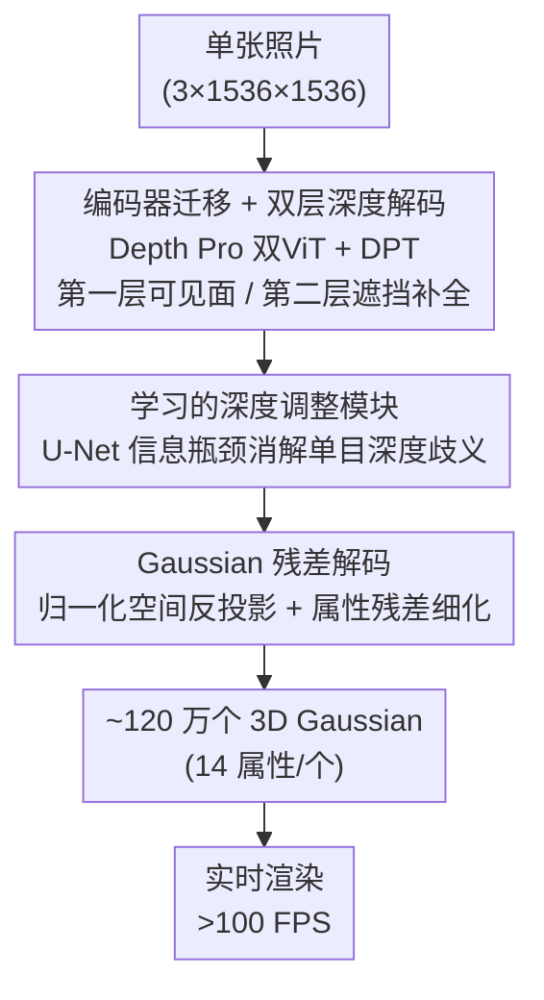

# Sharp Monocular View Synthesis in Less Than a Second

**会议**: ICLR 2026  
**arXiv**: [2512.10685](https://arxiv.org/abs/2512.10685)  
**代码**: [github.com/apple/ml-sharp](https://github.com/apple/ml-sharp)  
**领域**: 3D 视觉  
**关键词**: view synthesis, 3D Gaussian splatting, monocular depth, real-time rendering, feedforward

## 一句话总结

SHARP 通过单次前馈神经网络从单张照片生成约 120 万个 3D Gaussian，在 A100 GPU 上不到 1 秒完成推理，渲染速度超 100 FPS，在 6 个数据集上零样本泛化均达 SOTA，相比最强先前方法 LPIPS 降低 25–34%、合成时间缩短三个数量级。

## 研究背景与动机

**领域现状**：新视角合成已从多图优化（NeRF、3DGS）发展出单图前馈方法（Splatter Image、Flash3D）和基于扩散的方法（Gen3C、ViewCrafter、SVC）。前者速度快但质量有限，后者质量高但耗时可达数分钟。

**现有痛点**：(1) 前馈方法（如 Flash3D）的视觉保真度显著低于扩散方法；(2) 扩散方法（如 Gen3C 需 ~15 分钟）处理速度无法支持交互式浏览；(3) 近距离视角下扩散方法的输出往往不如输入照片清晰锐利；(4) 大多数方法缺少度量尺度（metric scale），无法与物理设备耦合。

**核心矛盾**：如何在保持亚秒级交互速度的同时，实现近视角下的高保真光致真实渲染？

**本文方案**：基于 Depth Pro 编码器端到端训练一个回归网络，预测双层深度图和所有 Gaussian 属性的精细化残差。引入学习的深度调整模块解决单目深度歧义、精心设计的损失配置抑制伪影、自监督微调适配真实图像。

## 方法详解

### 整体框架

SHARP 要解决的是「单张照片 → 高保真近视角渲染」这件事，做法是把它整体压成一次前馈回归：输入一张 $\mathbf{I} \in \mathbb{R}^{3 \times 1536 \times 1536}$ 的照片，直接吐出 $\mathbf{G} \in \mathbb{R}^{14 \times 2 \times 768 \times 768}$ 的 Gaussian 张量——约 120 万个 3D Gaussian，每个携带 14 个属性（3 位置 + 3 缩放 + 4 旋转 + 3 颜色 + 1 不透明度）。整个网络由预训练编码器、双层深度解码器、深度调整模块和 Gaussian 解码器四个可学习部分串成，可以顺着数据流分成三段：先用编码器和双层深度解码估出可见与被遮挡两层深度，再用深度调整模块把单目深度的歧义校正掉，最后把校正后的深度反投影成 Gaussian 初值、由解码器回归残差细化属性，渲染出新视角。总参数量 702M（可训练 340M），A100 上一次推理不到 1 秒。

### 关键设计

**1. 编码器迁移 + 双层深度解码：把成熟的单目测深能力搬到视图合成上，并补出被遮挡的背景**

前馈视图合成方法保真度一直拼不过扩散方法，一个根因是它们没能充分利用现成的几何先验；而单图本身又缺被前景挡住的背景信息。SHARP 直接复用 Depth Pro 的双 ViT 骨干作为编码器，其中低分辨率编码器（326M 参数）在训练中解冻以适配视图合成，patch 编码器保持冻结——这样既继承了度量级深度估计的先验，又允许特征向渲染任务偏移。深度解码器基于 DPT（~20M 参数），关键改动是把最后一层卷积复制一份、输出两个深度通道：第一层负责可见表面，第二层负责遮挡区域和视角依赖效果，于是单张图也能补出被前景挡住的背景，为后续视角移动留出可见内容。

**2. 学习的深度调整模块：用一个信息瓶颈消解单目深度的根本歧义**

单目深度估计天生有尺度与表面歧义，在透明、反射表面尤其严重，直接反投影会产生视图合成伪影。受 Conditional VAE 启发，作者插入一个小型 U-Net（2M 参数），训练时同时吃进预测逆深度 $\hat{D}^{-1}$ 和真实逆深度 $D^{-1}$，输出一张逐像素缩放图 $\mathbf{S}$ 去校正深度：

$$\bar{D} = \mathbf{S}(\hat{D}, D) \odot \hat{D}$$

为避免它简单地把真值深度抄过去，作者用 MAE 正则 $\mathcal{L}_{\text{scale}} = \mathbb{E}[|\mathbf{S}(p) - 1|]$ 加多尺度 TV 正则把这条通路压成信息瓶颈，逼网络只学最紧凑的歧义消解表示；推理时真值不可得，直接用恒等函数替代该模块即可，模型本身已学会在易错区域保持谨慎。消融显示它把 ScanNet++ 的 DISTS 从 0.077 降到 0.064，在反射/透明处的细节清晰度提升最明显。

**3. Gaussian 残差解码：在归一化空间里以残差方式回归属性，换来稳定训练和跨相机泛化**

拿到校正后的深度后，几何的大头已经定了，但 Gaussian 的颜色、缩放、旋转、不透明度还需细化；如果让解码器直接预测这些属性的绝对值，会很难训、也容易过拟合到训练相机。SHARP 先用一个 Gaussian 初始化器把每个像素反投影成初始 3D 坐标 $\mu(i,j) = [i \cdot \bar{D}'(i,j),\, j \cdot \bar{D}'(i,j),\, \bar{D}'(i,j)]^T$，颜色直接取输入像素值，缩放与深度成正比 $s = s_0 \cdot \bar{D}'$；这里一个刻意的取舍是**不使用源视图的内参矩阵**，让网络在归一化空间里推理，从而对不同相机零样本泛化。随后 Gaussian 解码器（同样 DPT 架构，~7.8M 参数从头训练）不预测绝对属性，而是预测残差，并经属性特定激活函数叠加回初值：

$$\mathbf{G}_{\text{attr}} = \gamma_{\text{attr}}\Big(\gamma_{\text{attr}}^{-1}(\mathbf{G}_{0,\text{attr}}) + \eta_{\text{attr}} \Delta\mathbf{G}_{\text{attr}}\Big)$$

以残差而非绝对值回归，意味着深度反投影给出的几何初值已经把大头解决，解码器只需做局部修正，训练更稳、收敛更快。

### 损失函数 / 训练策略

训练分两阶段。Stage 1 在 ~70 万个程序化生成场景（~800 万张图像）上训练，这些合成数据带完美的图像与深度真值，让网络先学到干净的几何与外观映射。Stage 2 做自监督微调（SSFT）：用已训练模型对真实图像生成伪新视角，再把伪新视角当输入、真实图像当监督目标做视角交换，从而在没有立体对的情况下把模型适配到真实图像分布——指标变化不大，但定性结果明显更锐利。

监督信号由三类损失组成。渲染端用 L1 颜色损失 $\mathcal{L}_{\text{color}}$、感知损失 $\mathcal{L}_{\text{percep}}$（含 Gram 矩阵项专门提升锐度）和 BCE alpha 损失 $\mathcal{L}_{\text{alpha}}$；几何端只对第一层用逆深度 L1 损失 $\mathcal{L}_{\text{depth}}$，把第二层留给自由补全；其余为一组正则化器，包括第二层深度 TV $\mathcal{L}_{\text{tv}}$、视差梯度浮体抑制 $\mathcal{L}_{\text{grad}}$、偏移量约束 $\mathcal{L}_{\text{delta}}$ 和 Gaussian 屏幕投影方差 $\mathcal{L}_{\text{splat}}$。其中感知损失是锐度的关键来源（消融里它把 ScanNet++ DISTS 从 0.162 拉到 0.063），但它会在 40GB GPU 上引爆显存，为此作者提出计算图手术（Computation Graph Surgery）：预计算梯度后立即释放 ResNet 的计算图，从而在不降批量的前提下绕开 OOM。

## 实验关键数据

### 主实验

6 个从未训练过的数据集上的零样本评估（越低越好）：

| 方法 | Middlebury DISTS | Middlebury LPIPS | ScanNet++ DISTS | ScanNet++ LPIPS | WildRGBD DISTS | WildRGBD LPIPS |
|------|-----------------|-----------------|-----------------|-----------------|---------------|---------------|
| Flash3D | 0.359 | 0.581 | 0.374 | 0.572 | 0.159 | 0.345 |
| TMPI | 0.158 | 0.436 | 0.128 | 0.309 | 0.114 | 0.327 |
| LVSM | 0.274 | 0.555 | 0.145 | 0.302 | 0.095 | 0.257 |
| Gen3C | 0.164 | 0.545 | 0.090 | 0.227 | 0.106 | 0.285 |
| **SHARP** | **0.097** | **0.358** | **0.071** | **0.154** | **0.069** | **0.190** |

推理时间对比：SHARP 0.91 秒（+ 渲染 ~5ms/帧）；Gen3C ~830 秒；ViewCrafter ~120 秒。

### 消融实验

**损失组件消融**（ScanNet++/Tanks and Temples DISTS）：

| 配置 | ScanNet++ DISTS | T&T DISTS |
|------|-----------------|-----------|
| color + alpha only | 0.229 | 0.301 |
| + depth | 0.162 | 0.239 |
| + perceptual | 0.063 | 0.126 |
| + regularizers | 0.064 | 0.126 |

**深度调整消融**：

| 深度调整 | ScanNet++ DISTS | ScanNet++ LPIPS |
|----------|-----------------|-----------------|
| 无 | 0.077 | 0.154 |
| 有 | 0.064 | 0.147 |

**Gaussian 数量消融**：

| 数量 | ScanNet++ DISTS | ScanNet++ LPIPS |
|------|-----------------|-----------------|
| 2×192² (~74K) | 0.110 | 0.199 |
| 2×384² (~295K) | 0.077 | 0.160 |
| 2×768² (~1.2M) | 0.064 | 0.147 |

### 关键发现

1. **相比 Gen3C 降低 LPIPS 25–34%**：在所有 6 个数据集上 SHARP 均为最优，且 Gen3C 推理时间是 SHARP 的约 900 倍
2. **感知损失贡献最大**：DISTS 从 0.162 降至 0.063（ScanNet++），Gram 矩阵项是锐度提升的关键
3. **深度调整提升细节清晰度**：尤其在透明/反射表面，消除了深度歧义导致的模糊
4. **1.2M Gaussians 显著优于 74K**：性能随 Gaussian 数量持续提升
5. **SSFT 定性改善明显**：虽然指标变化不大，但视觉上显著更锐利

## 亮点与洞察

- **纯回归框架的胜利**：证明了在近视角合成下，精心设计的前馈回归方法可以超越计算量高 3 个数量级的扩散方法
- **关键工程洞察**：归一化空间预测（不用源视图内参）、计算图手术解决感知损失 OOM、视角交换策略实现无需立体对的自监督
- **度量尺度支持**：输出的 3D 表示具有绝对尺度，可直接与 AR/VR 头显的物理运动耦合
- **深度调整的信息瓶颈角色**：正则化迫使网络仅学习最小必要信息来消解深度歧义，推理时可完全移除

## 局限与展望

- 专为近视角设计（~0.5m 位移），远视角（大位移）下质量下降——可能需要与扩散模型互补
- 不使用球谐函数（SH），因此无法建模视角依赖效果（反射、高光）
- 深度模型在微距摄影、夜景星空、复杂水面反射等极端场景下可能失败
- 合成训练数据直接用于 Flash3D 并未带来提升，说明架构设计而非数据是主因
- 未探索视频或多图输入的统一框架

## 相关工作与启发

- **3D Gaussian Splatting (Kerbl et al., 2023)**：提供了 SHARP 采用的 3D 表示，但原始方法需要多图优化
- **Depth Pro (Bochkovskii et al., 2025)**：作为 SHARP 的骨干网络，提供了度量级单目深度估计能力
- **Flash3D (Szymanowicz et al., 2025)**：同一范式下的前辈方法，引入了预训练深度网络用于场景级泛化，但保真度不足
- **Gen3C (Ren et al., 2025)**：最强扩散 baseline，近视角下不如 SHARP 锐利，但远视角合成能力强

## 评分

⭐⭐⭐⭐⭐

本文在单图新视角合成上实现了质量-速度的帕累托最优，6 个数据集零样本全面 SOTA，同时推理速度为亚秒级。端到端架构设计的每个模块（双层深度、深度调整、Gaussian 精细化）都有清晰的动机和消融支持。工程细节（计算图手术、SSFT）展示了深厚的系统能力。Apple 出品，代码已开源。

<!-- RELATED:START -->

## 相关论文

- [\[CVPR 2026\] MoVieS: Motion-Aware 4D Dynamic View Synthesis in One Second](../../CVPR2026/3d_vision/movies_motion-aware_4d_dynamic_view_synthesis_in_one_second.md)
- [\[CVPR 2025\] Sharp-It: A Multi-view to Multi-view Diffusion Model for 3D Synthesis and Manipulation](../../CVPR2025/3d_vision/sharp-it_a_multi-view_to_multi-view_diffusion_model_for_3d_synthesis_and_manipul.md)
- [\[ICLR 2026\] Dynamic Novel View Synthesis in High Dynamic Range](dynamic_novel_view_synthesis_in_high_dynamic_range.md)
- [\[CVPR 2026\] Scaling4D: Pushing the Frontier of Video Novel View Synthesis through Large-Scale Monocular Videos](../../CVPR2026/3d_vision/scaling4d_pushing_the_frontier_of_video_novel_view_synthesis_through_large-scale.md)
- [\[CVPR 2026\] DMAligner: Enhancing Image Alignment via Diffusion Model Based View Synthesis](../../CVPR2026/3d_vision/dmaligner_enhancing_image_alignment_via_diffusion_model_based_view_synthesis.md)

<!-- RELATED:END -->
