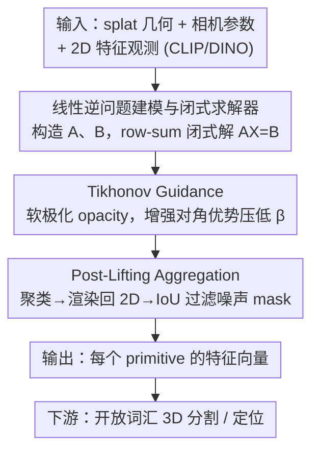

# Splat Feature Solver

**会议**: ICLR 2026  
**arXiv**: [2508.12216](https://arxiv.org/abs/2508.12216)  
**代码**: 有 (GitHub)  
**领域**: 3D视觉 / 3D场景理解  
**关键词**: Feature Lifting, 3D Gaussian Splatting, 线性逆问题, 开放词汇3D分割, Tikhonov正则化

## 一句话总结

将3D splat表示的特征提升(feature lifting)问题统一建模为稀疏线性逆问题 $AX=B$，提出闭式求解器并证明其在凸损失下的 $(1+\beta)$-近似误差上界，配合 Tikhonov 引导和后聚合过滤两种正则化策略，在开放词汇3D分割任务上达到SOTA。

## 研究背景与动机

**领域现状**：基于 splat 的3D表示（3DGS、2DGS 等）已实现实时高保真渲染，但将丰富的2D语义特征（CLIP、DINO 等）提升到3D primitives仍是挑战。现有方法分为三类：训练式优化、分组式关联、启发式前向投影。

**现有痛点**：(1) 缺乏统一的数学框架来定义 feature lifting 问题；(2) 现有方法没有理论保证解的质量与最优解的距离；(3) 所有方法仅聚焦 SAM+CLIP 特征和 3DGS kernel，泛化能力受限；(4) 未显式处理多视角不一致和噪声 mask 问题。

**核心矛盾**：feature lifting 本质上是一个稀疏的、行随机的线性逆问题，会因噪声 mask 和不完备性变得病态(ill-conditioned)，但现有方法要么需要昂贵训练，要么缺乏理论保障。

**本文目标** 建立 feature lifting 的形式化数学框架，提供闭式解和误差上界，并处理多视角噪声。

**切入角度**：利用 alpha blending 渲染的行随机性质，将 feature lifting 转化为标准线性逆问题，通过 Jensen 不等式推导代理损失的最优解。

**核心 idea**：feature lifting 可表述为 $AX=B$，其中 $A$ 是渲染权重矩阵，row-sum preconditioner 给出的闭式解 $x_j = \frac{\sum_i A_{ij} B_i}{\sum_i A_{ij}}$ 在凸损失下有可证明的 $(1+\beta)$-近似保证。

## 方法详解

### 整体框架

本文把"将2D密集特征提升到3D splat primitive"这件事整体看成解一个稀疏线性逆问题：以预计算的 splat 几何、相机参数和2D特征观测（CLIP、DINO 等）为输入，构造出渲染权重矩阵 $A$ 和观测向量 $B$，问题就归约为求解 $AX=B$。求解时不做任何训练，而是用 row-sum preconditioner 给出闭式解，再用两个正则化模块从两端兜底：Tikhonov Guidance 在求解时软极化 opacity、增强系统的对角优势以稳定病态系统；Post-Lifting Aggregation 在提升完特征后聚类过滤掉噪声 mask。最终输出每个 primitive 的特征向量，供开放词汇 3D 分割等下游任务使用。

### 关键设计

**1. 线性逆问题建模与闭式求解器：把启发式的 row-sum 加权升格为有误差保证的最优解**

现有 feature lifting 方法各自为政、缺乏统一框架，更没有"解离最优有多远"的理论保障。本文将问题形式化为 $AX=B$，其中 $A \in \mathbb{R}^{R \times P}$（$R$ 为射线数、$P$ 为 primitive 数）是 alpha blending 的渲染权重矩阵。关键观察是 alpha blending 天然具有行随机性 $\sum_j A_{ij} \approx 1$，据此用 Jensen 不等式构造一个可解析最小化的代理损失 $\mathcal{J}(x) = \sum_i \sum_j A_{ij} \|x_j - B_i\| \geq \mathcal{L}(x)$，对它求最优即得 row-sum preconditioner 闭式解 $x_j = \frac{\sum_i A_{ij} B_i}{\sum_i A_{ij}}$。这样不仅避免了 SGD 从头训练的高昂代价，还能证明 $\mathcal{L}(x') \leq (1+\beta)\mathcal{L}(\hat{x})$——其中 $\beta$ 衡量最优解沿视线方向的特征离散度。这一上界把 CosegGaussians、Occam's LGS、DrSplat 等工作各自独立发现的 row-sum 规则统一为同一闭式解的特例，并首次给出了它们的近似最优性。

**2. Tikhonov Guidance：用非线性软极化压低误差上界 $\beta$**

线性系统 $A$ 可能秩亏或近奇异，导致问题病态、$\beta$ 偏大。传统 Tikhonov 正则 $\|Ax-b\|^2 + \|\lambda I\|^2$ 只是对系统做线性调整，本文则改从 $A$ 的构造入手：根据"$\beta$ 与 $A^T A$ 的对角优势度负相关"这一性质（Property 4），在 feature lifting 阶段对 opacity 激活函数做非线性软极化，把 opacity 值往 0 或 1 推，使每条射线上的贡献尽量集中到单个 primitive。极端情形下 $\tilde{A}$ 每行只剩一个值为 1 的非零项，即给出全局最优解。这样直接增强了 $A^T A$ 的对角优势、压低 $\beta$，而且因为只作用于 feature lifting 阶段、不改动几何，不会损害 RGB 渲染质量。

**3. Post-Lifting Aggregation：从数据端过滤掉不一致的 SAM mask**

多视角不一致往往不是真实的语义差异，而是 mask 噪声造成的——比如一个视角只分割出面条，另一个视角却把碗和面条圈在一起。本文不在求解中硬扛这种噪声，而是在提升完特征后做一次清洗：直接复用 Tikhonov-Guided 解 $\tilde{x}$ 作为聚类特征把每个 splat 分到一个 cluster，再用 one-hot 编码把 cluster ID 渲染回2D 并取 argmax 得到 cluster mask，最后计算每个 SAM mask 与 cluster mask 的 IoU，把 IoU 低于阈值的 mask 整个丢弃。和 LAGA 需要单独学 affinity 特征、做 view-dependent 聚类不同，这里复用已有解、实现更简单，也印证了"大多数看似视角相关的差异其实来自 mask 噪声"这一判断。

### 损失函数 / 训练策略

整套方法无需任何训练，全程闭式求解，这也是它能在数分钟内完成而非耗时数小时的根本原因。

## 实验关键数据

### 主实验

| 数据集(LeRF-OVS) | 指标(mIoU) | 本文 | LAGA (SOTA) | 提升 |
|------------------|-----------|------|-------------|------|
| Figurines | mIoU | 67.6 | 64.1 | +3.5 |
| Ramen | mIoU | 62.3 | 56.6 (N2F2) | +5.7 |
| Mean (4场景) | mIoU | 65.1 | 64.0 (LAGA) | +1.1 |

### 消融实验

| 配置 | 指标 | 说明 |
|------|------|------|
| 无 Tikhonov + 无 Post-Agg | Cosine Sim ~90% | 基础 solver 已有较好提升能力 |
| + Tikhonov Guidance | mIoU 提升 | 增强对角优势降低 $\beta$ |
| + Post-Lifting Aggregation | mIoU 最优 | 过滤噪声 mask 进一步提升 |
| 多特征(DINO/ViT/ResNet) | Cosine >80% | 验证 feature-agnostic 能力 |

### 关键发现

- Row-sum preconditioner 在数分钟内完成特征提升，远快于训练式方法的数小时
- Tikhonov Guidance 通过增强对角优势有效降低 $\beta$，理论与实验吻合
- 大多数多视角不一致来自 mask 噪声而非真实语义变化，Post-Lifting Aggregation 有效过滤

## 亮点与洞察

- 将 feature lifting 建模为线性逆问题是关键洞察，统一了三类方法（CosegGaussians、Occam's LGS、DrSplat 独立发现的 row-sum 规则都是其特例）
- $(1+\beta)$-近似误差上界是首个用于 feature lifting 的理论保证
- 完全 kernel-agnostic 和 feature-agnostic：同一框架可处理 3DGS/2DGS/Beta Splatting 和 CLIP/DINO/ViT/ResNet 等任意特征

## 局限与展望

- $\beta$ 上界依赖最优解的特征离散度，实际值难以先验估计
- Post-Lifting Aggregation 的 IoU 阈值虽有自动选择，但仍有场景敏感性
- 闭式解假设 $\sum \omega_p \approx 1$（行随机性），极端稀疏场景可能退化

## 相关工作与启发

- **vs DrSplat**: DrSplat 用 top-K 截断简化 row-sum，无理论保证；本文证明完整 row-sum 是 $(1+\beta)$-最优
- **vs LAGA**: LAGA 需要训练 affinity 模型和 view-dependent 聚类，本文完全无训练且在 LeRF-OVS 上超越
- **vs LangSplat**: LangSplat 需端到端训练+PCA压缩，本文闭式求解且在 mIoU 上大幅领先

## 评分

- 新颖性: ⭐⭐⭐⭐ 线性逆问题建模是优雅的统一框架，理论贡献突出
- 实验充分度: ⭐⭐⭐ LeRF-OVS 覆盖较全，但评估基准较少
- 写作质量: ⭐⭐⭐⭐ 理论推导清晰，但符号偶有混用
- 价值: ⭐⭐⭐⭐ 为3D feature lifting 建立了理论基础，有望成为后续工作的标准参考

<!-- RELATED:START -->

## 相关论文

- [\[ICLR 2026\] Splat and Distill: Augmenting Teachers with Feed-Forward 3D Reconstruction for 3D-Aware Distillation](splat_and_distill_augmenting_teachers_with_feed-forward_3d_reconstruction_for_3d.md)
- [\[CVPR 2026\] ST4R-Splat: Spatio-Temporal Referring Segmentation in 4D Gaussian Splatting](../../CVPR2026/3d_vision/st4r-splat_spatio-temporal_referring_segmentation_in_4d_gaussian_splatting.md)
- [\[ICLR 2026\] Learning Part-Aware Dense 3D Feature Field for Generalizable Articulated Object Manipulation](learning_part-aware_dense_3d_feature_field_for_generalizable_articulated_object_.md)
- [\[CVPR 2026\] Revisiting Pose Sensitivity in Splat-based Computed Tomography under Sparse-view Reconstruction](../../CVPR2026/3d_vision/revisiting_pose_sensitivity_in_splat-based_computed_tomography_under_sparse-view.md)
- [\[CVPR 2026\] PhysIR-Splat: Physically Consistent Thermal Infrared Radiative Transfer in 3D Gaussian Splatting](../../CVPR2026/3d_vision/physir-splat_physically_consistent_thermal_infrared_radiative_transfer_in_3d_gau.md)

<!-- RELATED:END -->
